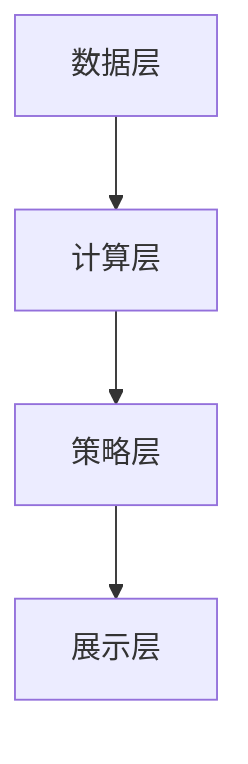
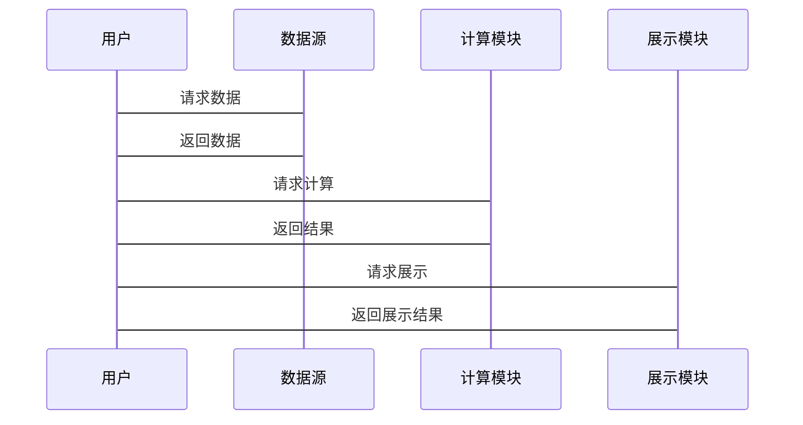

                 


# 格雷厄姆特价股票策略在不同市场周期中的动态调整

## 关键词：格雷厄姆，特价股票，市场周期，动态调整，价值投资，投资策略

## 摘要：
本文系统地探讨了格雷厄姆的特价股票策略在不同市场周期中的应用与调整。通过对市场周期的深入分析，结合格雷厄姆的价值投资理念，提出了一种动态调整策略的方法，帮助投资者在不同市场环境中优化投资组合，降低风险，实现长期稳定的收益。

---

## 第一章：格雷厄姆投资理念的背景与核心概念

### 1.1 格雷厄姆投资理念的起源与发展
格雷厄姆是价值投资的鼻祖，他的投资理念强调以低于内在价值的价格买入优质股票，从而实现长期的资本增值。他的投资哲学不仅影响了巴菲特等著名投资者，也为现代投资理论奠定了基础。

#### 1.1.1 价值投资的起源
价值投资的起源可以追溯到20世纪初，格雷厄姆与多德共同提出的“价值投资”理论，强调从基本面分析入手，寻找被市场低估的股票。

#### 1.1.2 格雷厄姆的学术贡献
格雷厄姆在《证券分析》一书中详细阐述了价值投资的方法，提出了“内在价值”这一概念，并为投资者提供了一套系统的分析框架。

#### 1.1.3 格雷厄姆策略的现代发展
随着市场环境的变化，格雷厄姆的策略也在不断发展和改进，尤其是在技术分析和量化投资领域的应用。

### 1.2 特价股票的定义与特征
特价股票是指那些市场价格低于其内在价值的股票，通常具有较高的安全边际，适合长期投资。

#### 1.2.1 特价股票的定义
特价股票的核心特征是市场价格低于其内在价值，且具备较高的股息率和盈利能力。

#### 1.2.2 特价股票的核心特征
- 低市盈率（P/E）：市盈率低于行业平均水平。
- 低市净率（P/B）：市净率低于行业平均水平。
- 高股息率：股息率高于行业平均水平。

#### 1.2.3 特价股票与市场周期的关系
特价股票的数量和比例在不同市场周期中呈现周期性变化，尤其是在熊市中，特价股票的比例会显著增加。

### 1.3 格雷厄姆策略的核心要素
格雷厄姆策略的核心要素包括：估值方法、风险控制和投资组合管理。

#### 1.3.1 估值方法
格雷厄姆强调使用基本面分析方法，包括市盈率、市净率、股息率等指标，评估股票的内在价值。

#### 1.3.2 风险控制
格雷厄姆策略注重风险控制，强调分散投资，避免过度集中在某一行业或股票。

#### 1.3.3 投资组合管理
格雷厄姆建议投资者构建一个包含多种资产的投资组合，并定期进行再平衡，以应对市场变化。

---

## 第二章：市场周期对格雷厄姆策略的影响

### 2.1 市场周期的基本类型
市场周期分为牛市、熊市和震荡市三种类型，不同周期中格雷厄姆策略的表现和调整方法有所不同。

#### 2.1.1 牛市
牛市中市场情绪乐观，股票价格通常被高估，特价股票的比例较低，投资者应适当调整策略，注重风险控制。

#### 2.1.2 熊市
熊市中市场情绪悲观，股票价格通常被低估，特价股票的比例较高，投资者可以利用市场低估的机会，增加投资。

#### 2.1.3 震荡市
震荡市中市场波动较大，投资者应根据市场趋势动态调整策略，注重短期风险控制。

### 2.2 不同市场周期中的策略调整
在不同市场周期中，格雷厄姆策略需要进行动态调整，以应对市场变化。

#### 2.2.1 牛市中的策略调整
在牛市中，投资者应降低仓位，避免过度暴露在高估的市场中，同时注重选择具有防御性的股票。

#### 2.2.2 熊市中的策略调整
在熊市中，投资者应增加仓位，利用市场低估的机会，选择具有强劲基本面的特价股票进行投资。

#### 2.2.3 震荡市中的策略调整
在震荡市中，投资者应保持灵活，根据市场趋势动态调整仓位，注重短期风险管理。

### 2.3 市场周期分析方法
格雷厄姆策略的动态调整需要结合市场周期分析方法，包括指标分析、情绪分析和趋势分析。

#### 2.3.1 市场周期的指标分析
- 市场估值指标：如市盈率、市净率等。
- 市场情绪指标：如投资者情绪指数、市场波动率等。

#### 2.3.2 市场情绪分析
市场情绪分析是动态调整策略的重要依据，投资者可以通过分析市场情绪的变化，调整投资策略。

#### 2.3.3 市场趋势分析
市场趋势分析是动态调整策略的核心，投资者需要根据市场趋势的变化，调整投资组合。

---

## 第三章：格雷厄姆策略的数学模型与算法原理

### 3.1 格雷厄姆筛选模型
格雷厄姆筛选模型是一种基于基本面分析的股票筛选方法，旨在识别被市场低估的股票。

#### 3.1.1 模型的输入变量
- 市盈率（P/E）
- 市净率（P/B）
- 股息率
- 净利润增长率
- 营业利润率

#### 3.1.2 模型的输出结果
- 格雷厄姆指数（Graham Index）
- 投资建议（买入、卖出、持有）

#### 3.1.3 模型的评价指标
- 准确率
- 召回率
- F1分数

### 3.2 格雷厄姆筛选算法的实现
格雷厄姆筛选算法的实现步骤如下：

1. 收集目标股票的基本面数据。
2. 计算各项指标，包括市盈率、市净率、股息率等。
3. 计算格雷厄姆指数。
4. 根据格雷厄姆指数生成投资建议。

#### 3.2.1 算法的步骤分解
```python
def graham_screen(stocks):
    selected_stocks = []
    for stock in stocks:
        pe = stock.pe
        pb = stock.pb
        dividend_yield = stock.dividend_yield
        if pe < 15 and pb < 1.5 and dividend_yield > 3%:
            selected_stocks.append(stock)
    return selected_stocks
```

#### 3.2.2 算法的代码实现
```python
class Stock:
    def __init__(self, name, pe, pb, dividend_yield):
        self.name = name
        self.pe = pe
        self.pb = pb
        self.dividend_yield = dividend_yield

def graham_screen(stocks):
    selected_stocks = []
    for stock in stocks:
        if stock.pe < 15 and stock.pb < 1.5 and stock.dividend_yield > 0.03:
            selected_stocks.append(stock)
    return selected_stocks
```

#### 3.2.3 算法的优化与改进
- 引入更多的基本面指标，如净利润增长率和营业利润率。
- 结合技术分析，动态调整筛选条件。

### 3.3 格雷厄姆策略的数学模型
格雷厄姆策略的数学模型可以通过以下公式表示：

$$
\text{格雷厄姆指数} = \frac{\text{内在价值}}{\text{市场价格}}
$$

其中，内在价值可以通过以下公式计算：

$$
\text{内在价值} = \frac{\text{每股净利润} \times (4.32 + 2 \times \text{净利润增长率})}{\text{资本成本}}
$$

---

## 第四章：格雷厄姆策略的系统分析与架构设计

### 4.1 系统设计思路
格雷厄姆策略的系统设计思路包括以下几个方面：

1. **目标**：实现格雷厄姆策略的动态调整。
2. **范围**：涵盖不同市场周期的策略调整。
3. **功能需求**：包括数据采集、模型计算、策略调整、结果输出。

### 4.2 系统架构设计
系统架构设计包括以下几个部分：

#### 4.2.1 分层架构
- 数据层：负责数据的采集和存储。
- 计算层：负责模型的计算和分析。
- 策略层：负责策略的制定和调整。
- 展示层：负责结果的展示和输出。

#### 4.2.2 系统架构图


#### 4.2.3 系统接口设计
系统接口设计包括以下几个方面：

- 数据接口：负责与数据源的交互。
- 计算接口：负责模型的计算和分析。
- 展示接口：负责结果的展示和输出。

#### 4.2.4 系统交互序列图


---

## 第五章：格雷厄姆策略的项目实战

### 5.1 环境安装
需要安装以下环境：

- Python
- 数据分析库（如Pandas、NumPy）
- 可视化工具（如Matplotlib、Seaborn）
- 数据接口库（如Yahoo Finance API）

### 5.2 核心代码实现
以下是核心代码实现：

```python
import pandas as pd
import numpy as np
import requests
import matplotlib.pyplot as plt

def get_stock_data(ticker):
    url = f"https://query1.finance.yahoo.com/v8/finance/chart/{ticker}"
    response = requests.get(url)
    data = response.json()
    df = pd.DataFrame(data['chart']['result'][0]['prices'])
    df['Date'] = pd.to_datetime(df[0])
    df = df.set_index('Date')
    df = df[['open', 'high', 'low', 'close', 'volume']]
    return df

def graham_screen(stocks):
    selected_stocks = []
    for stock in stocks:
        pe = stock.pe
        pb = stock.pb
        dividend_yield = stock.dividend_yield
        if pe < 15 and pb < 1.5 and dividend_yield > 0.03:
            selected_stocks.append(stock)
    return selected_stocks
```

### 5.3 案例分析
以下是一个具体的案例分析：

假设我们有以下几只股票：

- 股票A：市盈率=10，市净率=1.0，股息率=3%
- 股票B：市盈率=15，市净率=1.2，股息率=2.5%
- 股票C：市盈率=20，市净率=1.5，股息率=2%

根据格雷厄姆筛选模型，股票A符合筛选条件，股票B和股票C不符合筛选条件。

### 5.4 项目总结
通过上述实战，我们可以看到格雷厄姆策略在实际应用中的有效性。投资者可以根据市场周期的变化，动态调整策略参数，以实现最优的投资效果。

---

## 第六章：格雷厄姆策略的动态调整与优化

### 6.1 动态调整策略
根据市场周期的变化，投资者可以动态调整格雷厄姆策略的参数。

#### 6.1.1 牛市中的调整
在牛市中，投资者应适当降低筛选标准，避免错过优质股票。

#### 6.1.2 熊市中的调整
在熊市中，投资者应适当提高筛选标准，选择具有更高安全边际的股票。

### 6.2 风险管理策略
投资者应注重风险管理，避免过度集中投资，同时设置止损点，以应对市场波动。

### 6.3 策略优化与改进
通过引入更多的基本面指标和市场情绪指标，可以进一步优化格雷厄姆策略，提高其在不同市场周期中的表现。

---

## 总结

格雷厄姆特价股票策略是一种有效的投资方法，但在实际应用中需要根据市场周期的变化进行动态调整。通过本文的探讨，我们提出了动态调整策略的方法，帮助投资者在不同市场环境中优化投资组合，降低风险，实现长期稳定的收益。

---

## 作者：AI天才研究院/AI Genius Institute & 禅与计算机程序设计艺术 /Zen And The Art of Computer Programming

