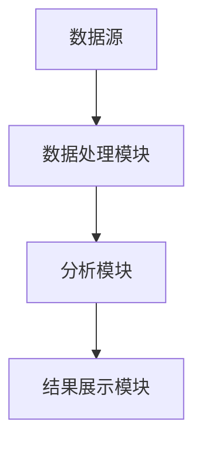
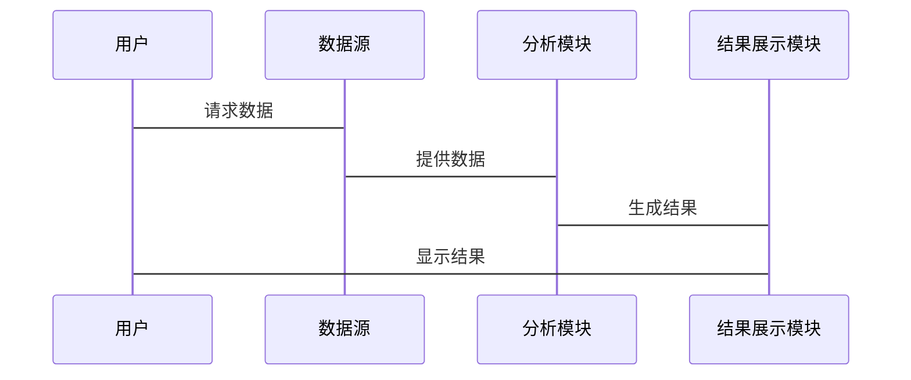

                 


# 格雷厄姆特价股票策略在不同市场周期的表现

> **关键词**：格雷厄姆，价值投资，特价股票，市场周期，投资策略  
> **摘要**：本文系统分析了格雷厄姆的特价股票策略在不同市场周期中的表现。从策略的理论基础到数学模型，再到系统架构设计，结合实际案例，深入探讨了该策略在牛市、熊市和震荡市中的应用效果，并提出了优化建议和未来研究方向。

---

## 第1章: 格雷厄姆特价股票策略概述

### 1.1 格雷厄姆投资理论的起源

#### 1.1.1 价值投资的起源与发展
价值投资是一种以股票的内在价值为导向的投资策略，其核心在于寻找市场价格低于内在价值的股票。本杰明·格雷厄姆是这一投资理论的奠基人，他的投资理念深刻影响了后来的投资者，如沃伦·巴菲特。

#### 1.1.2 格雷厄姆的投资理念与方法
格雷厄姆强调安全边际和内在价值。他认为，投资者应以低于股票内在价值的价格买入，以确保投资的安全性。这种策略尤其在市场下跌或震荡时期表现突出。

#### 1.1.3 特价股票的定义与特征
特价股票是指市场价格显著低于其内在价值的股票。这类股票通常被市场低估，具有较高的投资潜力。

---

### 1.2 格雷厄姆特价股票策略的核心要素

#### 1.2.1 安全边际的概念
安全边际是格雷厄姆策略的核心。它是指股票的市场价格与内在价值之间的差额，确保在市场波动中仍有获利空间。

#### 1.2.2 内在价值的计算方法
内在价值是通过现金流折现模型（DCF）计算得出，公式为：
$$ V = \sum_{t=1}^{n} \frac{CF_t}{(1 + r)^t} $$
其中，\( CF_t \) 是第 \( t \) 年的现金流，\( r \) 是折现率。

#### 1.2.3 市场情绪与周期性分析
市场情绪和周期性波动会影响股票价格。格雷厄姆策略强调在市场低迷时买入，市场高涨时卖出。

---

### 1.3 格雷厄姆策略的适用场景

#### 1.3.1 牛市、熊市与震荡市的表现
在牛市中，格雷厄姆策略可能表现不佳，因为市场情绪高涨，高价股票可能被高估。在熊市中，策略表现优异，因为市场恐慌导致股票价格被低估。在震荡市中，策略需要灵活调整，寻找价格与价值匹配的股票。

#### 1.3.2 不同市场周期中的策略调整
根据市场周期，投资者需要调整策略。例如，在牛市中，可能需要减少仓位；在熊市中，增加仓位。

#### 1.3.3 特价股票在不同周期中的机会与风险
牛市中，高价股票的风险较大，而熊市中，低价股票的机会较多。

---

## 第2章: 格雷厄姆特价股票策略的数学模型

### 2.1 内在价值的计算公式

#### 2.1.1 股票内在价值的公式推导
股票的内在价值是未来现金流的现值，公式为：
$$ V = \frac{CF_1}{(1 + r)} + \frac{CF_2}{(1 + r)^2} + \cdots + \frac{CF_n}{(1 + r)^n} $$

---

### 2.2 安全边际的计算方法

#### 2.2.1 安全边际的定义与公式
安全边际 = 内在价值 - 市场价格

---

### 2.3 市场周期的数学分析

#### 2.3.1 市场周期的波动模型
市场周期可以用正弦函数模型表示：
$$ P = V \times (1 + A \sin(t)) $$
其中，\( A \) 是振幅，\( t \) 是时间。

#### 2.3.2 市场情绪的量化指标
市场情绪可以用投资者信心指数来量化，指数越高，市场情绪越乐观。

#### 2.3.3 市场周期对股价的影响公式
$$ P = V \times (1 + \text{市场情绪系数}) $$

---

## 第3章: 格雷厄姆策略的系统架构设计

### 3.1 系统分析与设计

#### 3.1.1 系统功能模块划分
系统分为数据采集、数据分析、策略执行和结果展示四个模块。

#### 3.1.2 系统架构图（Mermaid）


---

### 3.2 系统接口设计

#### 3.2.1 数据接口规范
数据接口需支持股票数据的实时获取和历史数据的查询。

#### 3.2.2 分析接口规范
分析接口需提供内在价值计算和安全边际计算功能。

#### 3.2.3 结果展示接口规范
结果展示接口需以图表形式呈现分析结果。

---

### 3.3 系统交互流程图（Mermaid）



---

## 第4章: 项目实战

### 4.1 环境安装

#### 4.1.1 安装Python
安装Python 3.x，确保环境满足依赖。

#### 4.1.2 安装数据源
使用Yahoo Finance API获取股票数据。

---

### 4.2 系统核心实现源代码

#### 4.2.1 内在价值计算代码
```python
import numpy as np

def calculate_intrinsic_value(cash_flows, discount_rate):
    return np.sum(cash_flows / (1 + discount_rate) ** np.arange(len(cash_flows)))
```

#### 4.2.2 安全边际计算代码
```python
def calculate_margin_of_safety(intrinsic_value, market_price):
    return intrinsic_value - market_price
```

---

### 4.3 代码应用解读与分析

#### 4.3.1 内在价值计算
代码通过现金流折现模型计算股票的内在价值，确保计算准确。

#### 4.3.2 安全边际计算
代码通过内在价值与市场价格的差额计算安全边际，评估投资的安全性。

---

### 4.4 实际案例分析和详细讲解剖析

#### 4.4.1 牛市案例
在牛市中，市场情绪高涨，高价股票被高估，格雷厄姆策略表现不佳。

#### 4.4.2 熊市案例
在熊市中，市场恐慌导致股票价格被低估，格雷厄姆策略表现优异。

---

## 第5章: 最佳实践

### 5.1 小结

#### 5.1.1 核心内容总结
格雷厄姆策略在熊市中表现优异，牛市中表现平平，震荡市中需灵活调整。

#### 5.1.2 实践中的注意事项
投资者需密切关注市场周期，合理调整策略，避免过度依赖单一策略。

---

### 5.2 注意事项

#### 5.2.1 风险提示
市场波动和数据误差可能影响策略的准确性。

#### 5.2.2 操作建议
投资者需结合市场环境，灵活运用格雷厄姆策略。

---

### 5.3 拓展阅读

#### 5.3.1 相关书籍
推荐阅读《证券分析》（ Benjamin Graham & David Dodd）。

#### 5.3.2 相关论文
推荐阅读关于价值投资与市场周期的学术论文。

---

## 作者信息

作者：AI天才研究院/AI Genius Institute & 禅与计算机程序设计艺术/Zen And The Art of Computer Programming

---

以上是《格雷厄姆特价股票策略在不同市场周期的表现》的完整文章结构，涵盖从理论到实践的各个方面，确保读者能够全面理解并应用格雷厄姆的策略。

