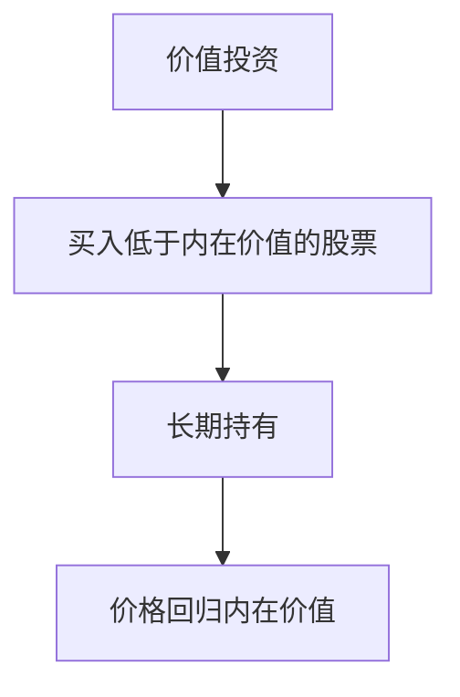
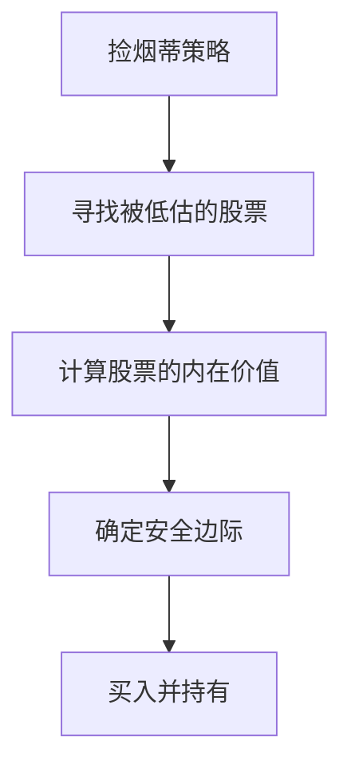

                 

# 格雷厄姆特价股票策略在不同市场周期的适应性研究

> 关键词：格雷厄姆投资理论，价值投资，市场周期，特价股票，投资策略，数学模型

> 摘要：本文系统性地探讨了格雷厄姆特价股票策略在不同市场周期中的适应性。通过分析市场周期的特征，构建数学模型，设计投资决策支持系统，并结合实际案例，深入研究了格雷厄姆策略在牛市、熊市和震荡市中的表现。本文还提出了基于系统架构的投资策略优化方案，为投资者提供了实用的指导。

---

# 第1章: 格雷厄姆特价股票策略的背景与理论基础

## 1.1 格雷厄姆投资理论的核心思想

### 1.1.1 价值投资的基本概念

价值投资是一种以股票内在价值为核心的投资策略，强调以低于内在价值的价格买入股票。格雷厄姆在其经典著作《证券分析》中提出，股票的价值可以通过对公司财务状况的分析来评估。这种投资策略强调安全边际，即买入价格与内在价值之间的差距，以降低投资风险。

图1.1展示了价值投资的核心理念：买入低于内在价值的股票，长期持有，等待价格回归价值。

### 1.1.2 格雷厄姆的"捡烟蒂"策略

格雷厄姆的"捡烟蒂"策略是价值投资的重要组成部分。他比喻股票市场为地上散落的烟蒂，上面的烟灰可能已经掉落，但烟蒂本身仍有价值。投资者需要寻找那些被市场忽视或低估的股票，即"特价股票"。

图1.2展示了"捡烟蒂"策略的流程：

### 1.1.3 价值投资与投机的区分

格雷厄姆强调价值投资与投机的区别。价值投资者关注公司的基本面，而投机者关注市场的短期波动。价值投资注重长期稳健的回报，而投机则追求短期暴利。

表1.1对比了价值投资与投机的关键区别：

| 特性       | 价值投资                  | 投机                  |
|------------|---------------------------|-----------------------|
| 时间跨度   | 长期                     | 短期                  |
| 关注点     | 公司基本面                | 市场情绪和短期波动    |
| 风险承受   | 低风险                   | 高风险                |
| 收益来源   | 内在价值回归              | 价格波动差价          |

---

## 1.2 特价股票的定义与特征

### 1.2.1 特价股票的定义

特价股票是指那些市场价格低于其内在价值的股票。格雷厄姆认为，这类股票通常被市场低估，具有长期增值的潜力。

### 1.2.2 特价股票的特征

1. **低市盈率（P/E）**：市盈率低于行业平均水平。
2. **低市净率（P/B）**：市净率低于行业平均水平。
3. **高股息率**：股息收益率高于行业平均水平。
4. **稳定的财务状况**：低债务负担，高净资产收益率（ROE）。
5. **合理的估值指标**：市盈率/市净率低于行业平均水平。

### 1.2.3 特价股票与市场周期的关系

格雷厄姆策略的有效性与市场周期密切相关。在熊市中，市场恐慌可能导致股票价格低于其内在价值，从而提供更多特价股票的机会。而在牛市中，市场情绪高涨可能导致股票价格被高估，特价股票的机会减少。

---

## 1.3 格雷厄姆策略的核心要素

### 1.3.1 股票内在价值的计算

股票的内在价值是基于公司财务状况和未来现金流的折现值。格雷厄姆提出了以下计算公式：

$$
\text{内在价值} = \sum_{t=1}^{n} \frac{\text{现金流}_t}{(1 + r)^t}
$$

其中，\( r \) 是折现率，\( \text{现金流}_t \) 是第 \( t \) 年的现金流。

### 1.3.2 安全边际的概念

安全边际是指买入价格与股票内在价值之间的差距。格雷厄姆建议以低于内在价值的价格买入股票，并留出一定的安全边际以应对市场波动。

$$
\text{安全边际} = \text{内在价值} - \text{买入价格}
$$`

### 1.3.3 财务指标分析的重要性

格雷厄姆强调对公司财务指标的深入分析，包括：

1. **盈利能力**：净利润率、ROE。
2. **成长能力**：收入增长率、净利润增长率。
3. **偿债能力**：资产负债率、流动比率。
4. **营运能力**：存货周转率、应收账款周转率。

---

## 1.4 格雷厄姆策略的适用性分析

### 1.4.1 格雷厄姆策略的适用场景

1. **市场恐慌时期**：熊市或市场下跌期间，股票价格可能被低估。
2. **低效市场**：市场参与者较少，信息不对称较大。
3. **周期性行业**：在行业低谷期，周期性股票可能被低估。

### 1.4.2 格雷厄姆策略的局限性

1. **市场有效性**：在高效市场中，股票价格可能已反映所有信息，难以找到被低估的股票。
2. **流动性风险**：部分特价股票可能流动性较差，难以快速变现。
3. **宏观经济影响**：宏观经济波动可能影响股票价格，超出个人控制范围。

### 1.4.3 格雷厄姆策略与其他投资策略的对比

表1.2对比了格雷厄姆策略与其他投资策略的关键区别：

| 特性       | 价值投资（格雷厄姆策略） | 技术分析       | 股票筛选策略   |
|------------|---------------------------|----------------|----------------|
| 关注点     | 公司基本面、内在价值     | 价格走势、技术指标 | 股票筛选标准   |
| 时间跨度   | 长期                     | 短期或中期      | 短期或中期      |
| 风险承受   | 低风险                   | 高风险          | 中等风险        |

---

## 1.5 本章小结

本章介绍了格雷厄姆特价股票策略的背景与理论基础，包括价值投资的核心思想、"捡烟蒂"策略的定义与特征，以及格雷厄姆策略的核心要素。同时，分析了该策略在不同市场周期中的适用性，并与其他投资策略进行了对比。下一章将重点分析不同市场周期的特征与影响。

--- 

**下一章：第2章 不同市场周期的特征与分析**

