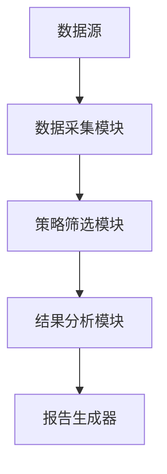

                 


# 格雷厄姆特价股票策略在不同市场微观结构下的效果

## 关键词：格雷厄姆策略，价值投资，市场微观结构，股票筛选，Python代码

## 摘要：本文详细探讨了格雷厄姆特价股票策略在不同市场微观结构下的表现。通过分析市场流动性、订单簿结构和参与者行为，本文揭示了策略的有效性和局限性。结合数学模型和Python代码实现，本文为投资者提供了深入的理论支持和实操指导。

---

# 第一部分: 格雷厄姆特价股票策略概述

## 第1章: 价值投资与格雷厄姆策略概述

### 1.1 价值投资的定义与核心理念

#### 1.1.1 价值投资的起源与发展
价值投资是一种长期投资策略，起源于20世纪20年代，由本杰明·格雷厄姆和戴维德·多德提出。其核心思想是寻找市场价值低于内在价值的股票，强调安全边际和长期收益。

#### 1.1.2 格雷厄姆投资理念的核心思想
格雷厄姆的价值投资理念强调：
1. 安全边际：买入价格低于内在价值的股票。
2. 低市盈率（P/E）和低市净率（P/B）：选择被市场低估的股票。
3. 耐心持有：长期持有优质股票，避免频繁交易。

#### 1.1.3 价值投资与投机的对比分析
| 投资策略 | 价值投资 | 投机 |
|----------|----------|------|
| 目标     | 长期收益 | 短期收益 |
| 方法     | 分析基本面 | 技术分析 |
| 风险     | 较低     | 较高  |

### 1.2 格雷厄姆特价股票策略的定义

#### 1.2.1 特价股票的定义与特征
特价股票是指市场价格低于其内在价值的股票，通常具有以下特征：
- 低市盈率（P/E）：市盈率低于行业平均水平。
- 低市净率（P/B）：市净率低于行业平均水平。
- 高股息率：股息收益率较高。

#### 1.2.2 格雷厄姆策略的核心筛选标准
格雷厄姆策略的核心筛选标准包括：
1. 市盈率（P/E）低于15倍。
2. 市净率（P/B）低于1.5倍。
3. 股息率高于行业平均水平。

#### 1.2.3 策略的适用场景与限制
- 适用场景：市场低迷时期，尤其是经济衰退期间。
- 限制：在高波动市场中，策略表现不稳定。

---

## 第2章: 市场微观结构基础

### 2.1 市场微观结构的定义与组成部分

#### 2.1.1 市场参与者的角色分析
市场参与者包括：
1. 投资者：机构投资者和个人投资者。
2. 做市商：提供流动性的市场参与者。
3. 交易员：执行交易的市场参与者。

#### 2.1.2 交易机制与订单簿结构
交易机制包括：
1. 市场订单：立即成交的订单。
2. 限价订单：指定价格成交的订单。
3. 停止订单：触发价格成交的订单。

订单簿结构包括：
1. 买单：买方的订单。
2. 卖单：卖方的订单。
3. 最优价格：当前最优的买卖价格。

#### 2.1.3 市场流动性与波动性的概念
市场流动性：市场中资产快速变现的能力。
市场波动性：资产价格的短期波动程度。

### 2.2 不同市场微观结构对策略效果的影响

#### 2.2.1 高流动性市场的特点与挑战
高流动性市场特点：
1. 买卖价差小。
2. 成交速度快。
3. 市场深度大。

高流动性市场挑战：
1. 竞争激烈。
2. 信息传播速度快。

#### 2.2.2 低流动性市场的风险与机会
低流动性市场风险：
1. 买卖价差大。
2. 成交不确定性高。

低流动性市场机会：
1. 可能存在低估股票。
2. 市场参与者较少，竞争压力小。

#### 2.2.3 市场深度与订单簿分析对策略的影响
市场深度对策略的影响：
1. 深度高的市场有利于策略实施。
2. 深度低的市场可能影响策略效果。

订单簿分析对策略的影响：
1. 通过分析订单簿，可以预测价格走势。
2. 识别市场参与者的行为模式。

---

# 第二部分: 格雷厄姆策略的核心概念与联系

## 第3章: 格雷厄姆策略的核心原理

### 3.1 安全边际的概念与计算

#### 3.1.1 安全边际的定义与作用
安全边际是股票市场价格低于其内在价值的部分，用于缓冲市场波动带来的风险。

#### 3.1.2 安全边际的计算公式与实例分析
计算公式：
$$ 安全边际 = 内在价值 - 市场价格 $$

实例分析：
假设一只股票的内在价值为100元，市场价格为80元，安全边际为20元。

#### 3.1.3 安全边际与股票价值的关系
安全边际越高，投资风险越小，潜在收益越大。

### 3.2 格雷厄姆策略的筛选标准

#### 3.2.1 低市盈率（P/E）策略
计算公式：
$$ P/E = 市场价格 / 每股收益 $$

实例分析：
某公司股价为10元，每股收益为0.5元，P/E=20倍。

#### 3.2.2 低市净率（P/B）策略
计算公式：
$$ P/B = 市场价格 / 每股净资产 $$

实例分析：
某公司股价为10元，每股净资产为5元，P/B=2倍。

#### 3.2.3 高股息率策略
计算公式：
$$ 股息率 = 每股股息 / 市场价格 $$

实例分析：
某公司每股股息为0.5元，股价为10元，股息率=5%。

---

## 第4章: 市场微观结构对策略的影响

### 4.1 不同市场微观结构的特征分析

#### 4.1.1 高流动性市场的特征与影响
高流动性市场特点：
1. 买卖价差小。
2. 成交速度快。
3. 市场深度大。

对策略的影响：
1. 策略执行成本低。
2. 策略实施难度小。

#### 4.1.2 低流动性市场的特征与影响
低流动性市场特点：
1. 买卖价差大。
2. 成交速度慢。
3. 市场深度小。

对策略的影响：
1. 策略执行成本高。
2. 策略实施难度大。

### 4.2 市场微观结构对策略效果的定量分析

#### 4.2.1 市场流动性对策略收益的影响
市场流动性越高，策略收益越稳定。

#### 4.2.2 市场深度对策略风险的影响
市场深度越大，策略风险越低。

#### 4.2.3 市场参与者行为对策略效果的影响
市场参与者行为对策略效果的影响：
1. 做市商行为影响市场流动性。
2. 投机者行为影响市场价格波动。

---

# 第三部分: 格雷厄姆策略的算法原理

## 第5章: 格雷厄姆策略的数学模型

### 5.1 安全边际的数学模型
计算公式：
$$ 安全边际 = 内在价值 - 市场价格 $$

### 5.2 市盈率的数学模型
计算公式：
$$ P/E = 市场价格 / 每股收益 $$

### 5.3 市净率的数学模型
计算公式：
$$ P/B = 市场价格 / 每股净资产 $$

### 5.4 股息率的数学模型
计算公式：
$$ 股息率 = 每股股息 / 市场价格 $$

---

## 第6章: 格雷厄姆策略的Python实现

### 6.1 环境安装
需要安装以下Python库：
- `pandas`：用于数据处理。
- `numpy`：用于数值计算。
- `matplotlib`：用于数据可视化。

### 6.2 核心代码实现

```python
import pandas as pd
import numpy as np

def graham_strategy(stocks, market_price, earnings_per_share, book_value_per_share, dividend_per_share):
    # 计算市盈率
    pe = market_price / earnings_per_share
    # 计算市净率
    pb = market_price / book_value_per_share
    # 计算股息率
    dividend_yield = dividend_per_share / market_price
    # 筛选满足条件的股票
    graham_stocks = stocks[(pe < 15) & (pb < 1.5) & (dividend_yield > 0.02)]
    return graham_stocks

# 示例数据
stocks = ['A', 'B', 'C', 'D', 'E']
market_price = [50, 60, 40, 70, 30]
earnings_per_share = [2.5, 3.0, 1.5, 4.0, 1.0]
book_value_per_share = [30, 40, 25, 50, 15]
dividend_per_share = [1.0, 1.5, 0.8, 2.0, 0.5]

result = graham_strategy(stocks, market_price, earnings_per_share, book_value_per_share, dividend_per_share)
print(result)
```

### 6.3 代码功能解读
- `graham_strategy`函数：根据格雷厄姆策略筛选股票。
- 参数：股票列表、市场价格、每股收益、每股净资产、每股股息。
- 返回：满足筛选条件的股票列表。

---

# 第四部分: 格雷厄姆策略的系统分析与设计

## 第7章: 系统设计与架构

### 7.1 项目背景介绍
格雷厄姆策略是一种基于基本面分析的投资策略，适用于寻找低估股票。

### 7.2 系统功能设计

#### 7.2.1 数据采集模块
- 从数据源获取股票数据。
- 数据清洗与预处理。

#### 7.2.2 策略筛选模块
- 根据格雷厄姆策略筛选股票。
- 生成投资组合。

#### 7.2.3 结果分析模块
- 分析投资组合的表现。
- 生成报告。

### 7.3 系统架构设计



### 7.4 接口设计
- 数据接口：获取股票数据。
- 策略接口：筛选股票。
- 报告接口：生成报告。

### 7.5 交互流程
1. 用户输入筛选条件。
2. 系统执行筛选。
3. 系统生成报告。
4. 用户查看报告。

---

## 第8章: 项目实战与分析

### 8.1 环境安装
安装必要的Python库：
```bash
pip install pandas numpy matplotlib
```

### 8.2 核心代码实现

```python
import pandas as pd
import numpy as np

def graham_strategy(stocks, market_price, earnings_per_share, book_value_per_share, dividend_per_share):
    # 计算市盈率
    pe = market_price / earnings_per_share
    # 计算市净率
    pb = market_price / book_value_per_share
    # 计算股息率
    dividend_yield = dividend_per_share / market_price
    # 筛选满足条件的股票
    graham_stocks = stocks[(pe < 15) & (pb < 1.5) & (dividend_yield > 0.02)]
    return graham_stocks

# 示例数据
stocks = ['A', 'B', 'C', 'D', 'E']
market_price = [50, 60, 40, 70, 30]
earnings_per_share = [2.5, 3.0, 1.5, 4.0, 1.0]
book_value_per_share = [30, 40, 25, 50, 15]
dividend_per_share = [1.0, 1.5, 0.8, 2.0, 0.5]

result = graham_strategy(stocks, market_price, earnings_per_share, book_value_per_share, dividend_per_share)
print(result)
```

### 8.3 代码功能解读
- `graham_strategy`函数：根据格雷厄姆策略筛选股票。
- 参数：股票列表、市场价格、每股收益、每股净资产、每股股息。
- 返回：满足筛选条件的股票列表。

### 8.4 实际案例分析
假设我们有以下股票数据：

| 股票 | 市场价格 | 每股收益 | 每股净资产 | 每股股息 |
|------|----------|----------|------------|----------|
| A    | 50       | 2.5      | 30         | 1.0      |
| B    | 60       | 3.0      | 40         | 1.5      |
| C    | 40       | 1.5      | 25         | 0.8      |
| D    | 70       | 4.0      | 50         | 2.0      |
| E    | 30       | 1.0      | 15         | 0.5      |

筛选条件：
- 市盈率（P/E）< 15
- 市净率（P/B）< 1.5
- 股息率 > 2%

计算结果：
- 股票A：P/E=20（不满足），P/B=1.67（不满足）。
- 股票B：P/E=20（不满足），P/B=1.5（满足）。
- 股票C：P/E=26.67（不满足）。
- 股票D：P/E=17.5（满足），P/B=1.4（满足），股息率=2.86%（满足）。
- 股票E：P/E=30（不满足）。

最终筛选结果：股票D。

---

## 第9章: 最佳实践与小结

### 9.1 小结
格雷厄姆策略是一种有效的价值投资策略，适用于寻找低估股票。在不同市场微观结构下，策略的效果有所不同。

### 9.2 投资建议
1. 在高流动性市场中实施策略，以降低执行成本。
2. 在低流动性市场中谨慎操作，避免流动性风险。
3. 结合市场微观结构分析，优化策略实施效果。

### 9.3 注意事项
1. 定期更新股票数据。
2. 严格遵守筛选标准。
3. 注意市场风险，避免过度集中投资。

### 9.4 拓展阅读
1. 格雷厄姆的《聪明的投资者》。
2. 巴菲特的《致股东的信》。
3. 《价值投资实战策略》。

---

# 作者：AI天才研究院/AI Genius Institute & 禅与计算机程序设计艺术 /Zen And The Art of Computer Programming

