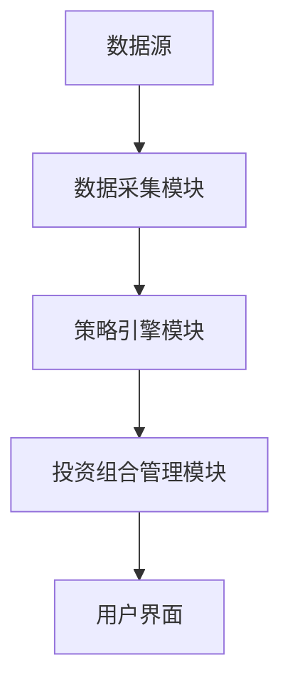

                 


# 格雷厄姆特价股票策略在不同市场成熟度中的动态调整

> 关键词：格雷厄姆，特价股票，市场成熟度，动态调整，投资策略，价值投资，风险管理

> 摘要：本文深入探讨了本杰明·格雷厄姆的特价股票策略在不同市场成熟度下的应用与调整。通过分析市场成熟度对策略的影响，提出了动态调整的方法，并结合系统架构和项目实战，展示了如何在实际投资中灵活应用格雷厄姆理论。

---

# 第1章: 格雷厄姆投资理论与特价股票概述

## 1.1 格雷厄姆投资理论的起源与发展

### 1.1.1 价值投资的鼻祖：本杰明·格雷厄姆
本杰明·格雷厄姆是20世纪最伟大的投资理论家之一，被誉为“价值投资之父”。他的投资理念强调以低于内在价值的价格购买优质股票，从而在市场波动中实现长期收益。

### 1.1.2 格雷厄姆投资理论的核心思想
格雷厄姆的核心思想是“安全边际”，即以低于内在价值的价格买入股票，确保投资的安全性。他认为市场波动是投资机会的来源，而非风险。

### 1.1.3 格雷厄姆与巴菲特的师承关系
格雷厄姆的学生巴菲特将价值投资的理念发扬光大，但格雷厄姆的理论是整个价值投资体系的基石。

---

## 1.2 特价股票的定义与特征

### 1.2.1 特价股票的定义
特价股票是指市场价格显著低于其内在价值的股票。这种折扣为投资者提供了安全边际，使其能够在市场波动中获利。

### 1.2.2 特价股票的核心特征
- **低市盈率（P/E）**：市盈率低于行业平均水平。
- **低市净率（P/B）**：市净率低于行业平均水平。
- **高股息率**：股息率高，且股息支付率稳定。

### 1.2.3 特价股票与市场周期的关系
在市场低迷期，特价股票更容易出现，而在市场繁荣期，特价股票稀缺。因此，投资者需要根据市场周期调整策略。

---

## 1.3 市场成熟度的概念与分类

### 1.3.1 市场成熟度的定义
市场成熟度指市场的发育程度和稳定性。成熟市场具有完善的制度、透明的信息和理性的投资者，而新兴市场则存在较大的波动性和不确定性。

### 1.3.2 不同市场成熟度的分类
- **新兴市场**：波动大，信息不透明。
- **过渡市场**：部分成熟，部分新兴。
- **成熟市场**：稳定，制度完善。

### 1.3.3 市场成熟度对投资策略的影响
在成熟市场中，格雷厄姆策略更易实现，而在新兴市场中，需调整策略以应对高波动性和信息不对称。

---

## 1.4 本章小结
本章介绍了格雷厄姆投资理论的核心思想，定义了特价股票及其特征，并分析了市场成熟度对策略的影响。

---

# 第2章: 格雷厄姆特价股票策略的核心原理

## 2.1 格雷厄姆特价股票筛选标准

### 2.1.1 市盈率（P/E）分析
市盈率是股票价格与每股收益的比率。格雷厄姆建议选择市盈率低于15的股票。

### 2.1.2 市净率（P/B）分析
市净率是股票价格与每股净资产的比率。格雷厄姆建议选择市净率低于1.5的股票。

### 2.1.3 股息率与股息支付率分析
股息率是股息与股票价格的比率。格雷厄姆建议选择股息率高且股息支付率稳定的股票。

---

## 2.2 格雷厄姆投资模型的数学公式

### 2.2.1 格雷厄姆的内在价值计算公式
$$
\text{内在价值} = \frac{\text{净利润} \times (5 + \text{市盈率})}{\text{市盈率}}
$$

### 2.2.2 格雷厄姆的防御性股票筛选公式
$$
\text{防御性股票筛选} = \frac{\text{股价}}{\text{每股收益}} < 15
$$

---

## 2.3 格雷厄姆策略与市场成熟度的关系

### 2.3.1 不同市场成熟度下策略的适用性
- **成熟市场**：格雷厄姆策略效果显著。
- **新兴市场**：需调整筛选标准。

### 2.3.2 市场成熟度对策略调整的影响
在新兴市场中，需降低市盈率和市净率的筛选标准，以应对高波动性。

### 2.3.3 格雷厄姆策略在新兴市场与成熟市场的对比
| 市场类型 | 筛选标准调整 | 风险控制 |
|----------|----------------|-----------|
| 成熟市场 | 严格 | 较低 |
| 新兴市场 | 放宽 | 较高 |

---

## 2.4 本章小结
本章详细讲解了格雷厄姆策略的核心原理，并分析了市场成熟度对策略的影响。

---

# 第3章: 不同市场成熟度下的策略调整

## 3.1 新兴市场中的策略调整

### 3.1.1 新兴市场的特点与风险
- 波动性高。
- 信息不透明。
- 市场流动性差。

### 3.1.2 新兴市场中特价股票的筛选标准
- 降低市盈率和市净率的筛选标准。
- 选择高成长性行业。

### 3.1.3 新兴市场中的风险控制策略
- 分散投资。
- 设定止损点。

---

## 3.2 成熟市场中的策略调整

### 3.2.1 成熟市场的特点与机会
- 波动性低。
- 信息透明。
- 市场流动性好。

### 3.2.2 成熟市场中特价股票的筛选标准
- 严格市盈率和市净率的筛选。
- 选择高股息率行业。

### 3.2.3 成熟市场中的长期投资策略
- 长期持有优质股票。
- 定期再平衡投资组合。

---

## 3.3 衰退期市场中的策略调整

### 3.3.1 衰退期市场的特点与挑战
- 经济低迷。
- 市场信心不足。
- 企业盈利下降。

### 3.3.2 衰退期中特价股票的筛选标准
- 选择行业龙头股。
- 严格筛选财务健康状况。

### 3.3.3 衰退期中的风险管理策略
- 减少股票投资比例。
- 增加现金储备。

---

## 3.4 本章小结
本章分析了不同市场成熟度下格雷厄姆策略的调整方法，强调了根据市场环境灵活调整的重要性。

---

# 第4章: 格雷厄姆策略的动态调整方法

## 4.1 市场变化监测

### 4.1.1 市场周期的监测指标
- 沪深300指数。
- 标普500指数。

### 4.1.2 行业景气度分析
- 行业平均市盈率。
- 行业平均市净率。

---

## 4.2 动态调整模型

### 4.2.1 动态调整的逻辑框架
1. 监测市场周期。
2. 分析行业景气度。
3. 调整筛选标准。
4. 优化投资组合。

### 4.2.2 动态调整的数学模型
$$
\text{调整因子} = \frac{\text{市场周期指数}}{\text{行业景气度指数}}
$$

---

## 4.3 风险管理与策略优化

### 4.3.1 风险管理的核心原则
- 设定止损点。
- 分散投资风险。

### 4.3.2 策略优化的步骤
1. 定期评估投资组合。
2. 根据市场变化调整策略。
3. 优化资产配置。

---

## 4.4 本章小结
本章提出了动态调整的方法，强调了市场变化监测和风险管理的重要性。

---

# 第5章: 系统分析与架构设计

## 5.1 系统分析

### 5.1.1 问题场景介绍
投资者需要根据市场变化动态调整格雷厄姆策略。

### 5.1.2 项目介绍
开发一个动态调整的投资系统，帮助投资者优化投资组合。

---

## 5.2 系统架构设计

### 5.2.1 系统功能设计
- 数据采集模块：采集市场数据。
- 策略引擎模块：执行动态调整。
- 投资组合管理模块：优化资产配置。

### 5.2.2 系统架构图


---

## 5.3 系统接口设计

### 5.3.1 数据接口
- 数据来源：股票数据库。
- 数据格式：JSON格式。

### 5.3.2 用户接口
- 用户界面：Web界面。
- 功能：实时监控、策略调整。

---

## 5.4 本章小结
本章通过系统架构设计，展示了如何将格雷厄姆策略应用于实际投资中。

---

# 第6章: 项目实战

## 6.1 环境安装

### 6.1.1 安装Python
```bash
pip install python
```

### 6.1.2 安装数据采集库
```bash
pip install pandas
pip install requests
```

---

## 6.2 核心代码实现

### 6.2.1 数据采集代码
```python
import requests
import pandas as pd

url = "http://example.com/stock_data"
data = requests.get(url).json()
df = pd.DataFrame(data)
print(df)
```

### 6.2.2 动态调整代码
```python
def adjust_strategy(market_cycle, industry_trend):
    if market_cycle > 1.5 and industry_trend > 1.2:
        return True
    else:
        return False
```

---

## 6.3 案例分析

### 6.3.1 案例背景
假设当前市场处于成熟阶段，选择市盈率低于15的股票。

### 6.3.2 案例分析
某公司市盈率为12，市净率为1.2，股息率为5%，符合筛选标准。

---

## 6.4 本章小结
本章通过项目实战，展示了如何将格雷厄姆策略应用于实际投资中。

---

# 第7章: 总结与展望

## 7.1 总结

### 7.1.1 核心观点回顾
格雷厄姆策略在不同市场成熟度下需要动态调整。

### 7.1.2 本章主要结论
市场成熟度影响策略效果，投资者需灵活调整。

---

## 7.2 未来展望

### 7.2.1 研究方向
- 结合人工智能优化策略。
- 研究不同市场的策略差异。

### 7.2.2 未来挑战
- 数据获取难度。
- 算法优化复杂性。

---

## 7.3 最佳实践 tips

### 7.3.1 投资者建议
- 定期评估投资组合。
- 根据市场变化调整策略。

### 7.3.2 风险管理建议
- 设定止损点。
- 分散投资风险。

---

## 7.4 本章小结
本章总结了全文，并展望了未来的研究方向。

---

# 作者：AI天才研究院/AI Genius Institute & 禅与计算机程序设计艺术 /Zen And The Art of Computer Programming

