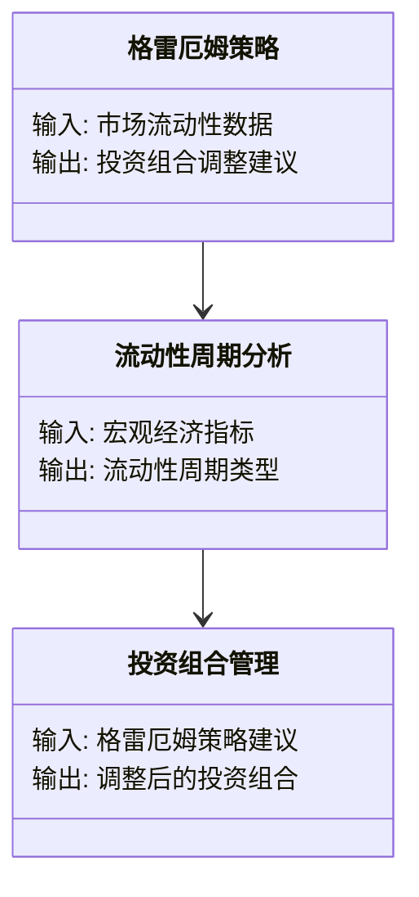
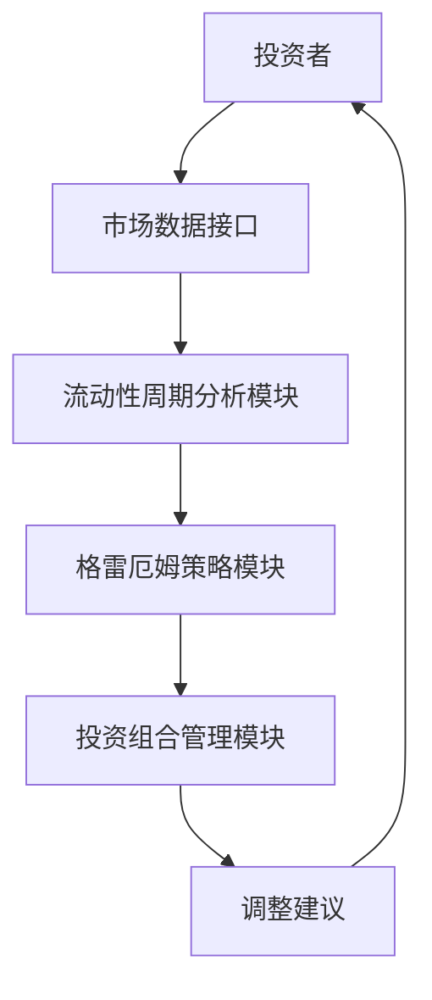
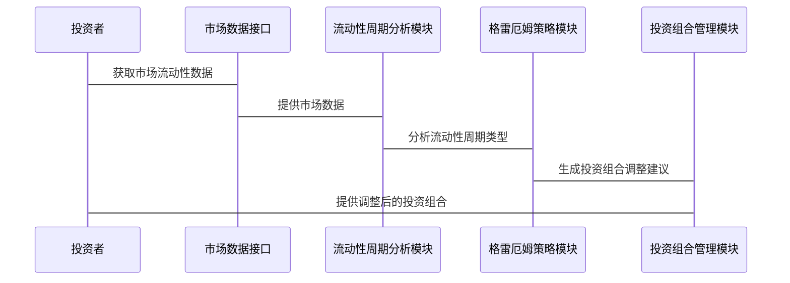

                 


# 格雷厄姆特价股票策略在不同市场流动性周期中的动态调整

## 关键词：格雷厄姆、特价股票、流动性周期、投资策略、市场分析

## 摘要：本文深入探讨了格雷厄姆特价股票策略在不同市场流动性周期中的动态调整方法，分析了流动性周期对股票估值的影响，并结合数学模型和实际案例，提出了在不同流动性环境下优化投资策略的具体步骤和方法。

---

# 第一部分: 引言

## 第1章: 格雷厄姆投资理念与特价股票策略概述

### 1.1 格雷厄姆投资理论的核心思想

#### 1.1.1 价值投资的定义与核心原则

价值投资是一种以内在价值为导向的投资策略，强调以低于内在价值的价格购买优质股票。格雷厄姆的价值投资理论强调安全边际和长期稳健的投资回报。

#### 1.1.2 格雷厄姆的安全边际概念

安全边际是指股票的市场价格与其内在价值之间的差距。通过购买价格低于内在价值的股票，投资者可以在市场波动中降低风险，确保长期收益。

#### 1.1.3 特价股票的定义与筛选标准

特价股票是指市场价格显著低于内在价值的股票。格雷厄姆建议投资者关注市净率（P/B）和市盈率（P/E）等指标，选择具有安全边际的股票。

## 第2章: 市场流动性周期的基本概念

### 2.1 市场流动性周期的定义

市场流动性周期是指市场资金流动性从高到低再到高的循环过程。流动性高时，市场活跃，股票价格波动较大；流动性低时，市场交易量减少，股票价格趋于稳定。

### 2.2 流动性周期的分类与特征

流动性周期可以分为低流动性周期、高流动性周期和过渡性流动性周期。每种周期具有不同的市场特征和投资机会。

### 2.3 流动性对股票价格的影响机制

流动性影响股票的买卖价差和交易成本。在高流动性周期，股票价格波动较大，投资者需要更加谨慎地选择进入和退出时机。

---

# 第二部分: 格雷厄姆策略的核心原理

## 第3章: 格雷厄姆策略的数学模型与公式

### 3.1 市净率（P/B）计算公式

$$ P/B = \frac{Market\ Price}{Book\ Value} $$

市净率是衡量股票价值的重要指标，格雷厄姆建议投资者选择P/B低于1的股票。

### 3.2 市盈率（P/E）计算公式

$$ P/E = \frac{Market\ Price}{Earnings\ Per\ Share} $$

市盈率反映了市场对公司盈利能力的预期，格雷厄姆建议关注P/E低于市场平均水平的股票。

### 3.3 格雷厄姆的内在价值计算方法

$$ Intrinsic\ Value = \sum_{t=1}^{n} \frac{C_t}{(1+r)^t} $$

内在价值是未来现金流的现值，投资者需要根据公司财务状况和市场环境估算内在价值。

## 第4章: 格雷厄姆策略与流动性周期的关联

### 4.1 流动性周期对股票估值的影响

流动性高的市场可能导致股票价格高估，而流动性低的市场可能导致股票价格低估。投资者需要根据市场流动性调整股票估值。

### 4.2 不同流动性周期下的策略适用性

在高流动性周期，投资者可以更快地捕捉市场机会，而在低流动性周期，投资者需要更加注重风险控制。

### 4.3 流动性风险的量化与控制

通过分析市场流动性指标，投资者可以量化流动性风险，并制定相应的风险控制策略。

---

# 第三部分: 流动性周期下的策略动态调整

## 第5章: 流动性周期的分析与分类

### 5.1 宏观经济指标与流动性周期的关系

通过分析GDP增长率、通货膨胀率等宏观经济指标，投资者可以判断市场流动性周期的变化趋势。

### 5.2 市场情绪与流动性周期的互动

市场情绪受流动性周期影响，投资者需要关注市场情绪指标，如恐慌指数、市场波动率等。

### 5.3 历史案例分析：流动性周期的典型阶段

通过分析历史案例，投资者可以更好地理解流动性周期对股票市场的影响。

## 第6章: 格雷厄姆策略在不同流动性周期中的应用

### 6.1 低流动性周期下的策略调整

#### 6.1.1 低流动性周期的特征与风险

低流动性周期可能导致股票价格低估，投资者需要更加谨慎地选择股票，注重安全边际。

#### 6.1.2 特价股票筛选标准的优化

在低流动性周期，投资者可以适当放宽筛选标准，选择具有长期增长潜力的股票。

#### 6.1.3 投资组合的防御性调整

在低流动性周期，投资者需要调整投资组合，增加防御性资产的比例，降低市场波动风险。

### 6.2 高流动性周期下的策略调整

#### 6.2.1 高流动性周期的特征与机会

高流动性周期市场活跃，投资者可以快速捕捉市场机会，选择具有高增长潜力的股票。

#### 6.2.2 特价股票的快速识别与捕捉

在高流动性周期，投资者需要快速识别被市场低估的股票，及时进行投资。

#### 6.2.3 投资组合的进攻性优化

在高流动性周期，投资者可以增加进攻性资产的比例，追求更高的投资回报。

### 6.3 过渡性流动性周期下的策略调整

#### 6.3.1 过渡性周期的特征与挑战

过渡性流动性周期市场波动较大，投资者需要灵活调整策略，平衡风险与收益。

#### 6.3.2 灵活性与风险控制的平衡

在过渡性周期，投资者需要在灵活性和风险控制之间找到平衡点，避免过度冒险。

#### 6.3.3 动态调整的具体实施步骤

投资者可以根据市场流动性变化，逐步调整投资组合，确保策略的有效性。

---

# 第四部分: 系统分析与架构设计

## 第7章: 系统分析与架构设计方案

### 7.1 问题场景介绍

通过分析市场流动性周期的变化，投资者需要动态调整格雷厄姆策略，以适应不同的市场环境。

### 7.2 项目介绍

本项目旨在构建一个基于格雷厄姆策略的动态调整系统，帮助投资者在不同流动性周期中优化投资组合。

### 7.3 系统功能设计（领域模型）



### 7.4 系统架构设计



### 7.5 系统接口设计

投资者通过市场数据接口获取市场流动性数据，系统分析模块对数据进行处理，生成流动性周期类型，格雷厄姆策略模块根据周期类型生成投资组合调整建议，投资组合管理模块根据建议调整投资组合。

### 7.6 系统交互序列图



---

# 第五部分: 项目实战

## 第8章: 项目实战

### 8.1 环境安装

投资者需要安装必要的金融分析工具和编程环境，如Python、Pandas、Matplotlib等。

### 8.2 核心实现源代码

以下是格雷厄姆策略动态调整的Python实现示例：

```python
import pandas as pd
import numpy as np

# 获取市场数据
market_data = pd.read_csv('market_data.csv')

# 计算市净率和市盈率
market_data['P/B'] = market_data['Market Price'] / market_data['Book Value']
market_data['P/E'] = market_data['Market Price'] / market_data['Earnings Per Share']

# 分析流动性周期
liquidity_period = 'low'  # 可选：'low', 'high', 'transition'

# 根据流动性周期调整策略
if liquidity_period == 'low':
    # 低流动性周期，选择P/B < 1且P/E < 市场平均值的股票
    filtered_stocks = market_data[(market_data['P/B'] < 1) & (market_data['P/E'] < market_data['P/E'].mean())]
elif liquidity_period == 'high':
    # 高流动性周期，选择P/B < 0.5且P/E < 市场平均值的股票
    filtered_stocks = market_data[(market_data['P/B'] < 0.5) & (market_data['P/E'] < market_data['P/E'].mean())]
else:
    # 过渡性周期，平衡策略
    filtered_stocks = market_data[(market_data['P/B'] < 0.8) & (market_data['P/E'] < market_data['P/E'].mean())]

# 输出调整后的投资组合
print(filtered_stocks)
```

### 8.3 实际案例分析与详细讲解

通过分析具体市场数据，展示如何在不同流动性周期中应用格雷厄姆策略，选择合适的股票并优化投资组合。

### 8.4 项目小结

总结项目实施过程中的关键点和经验教训，强调动态调整策略的有效性和灵活性。

---

# 第六部分: 总结与展望

## 第9章: 总结与展望

### 9.1 核心内容回顾

本文深入探讨了格雷厄姆特价股票策略在不同市场流动性周期中的动态调整方法，结合数学模型和实际案例，提出了优化投资策略的具体步骤和方法。

### 9.2 未来研究方向

未来研究可以进一步分析流动性周期对不同类型股票的影响，探索更加复杂的动态调整模型，并结合人工智能技术提高策略的智能化水平。

---

# 第七部分: 注意事项与最佳实践 Tips

## 第10章: 注意事项与最佳实践 Tips

### 10.1 投资者注意事项

- **风险管理**：在不同流动性周期中，投资者需要根据市场环境动态调整投资策略，注重风险控制。
- **数据质量**：确保市场数据的准确性和完整性，避免因数据问题导致投资决策失误。
- **持续学习**：市场环境不断变化，投资者需要持续学习和更新知识，以应对新的挑战。

### 10.2 最佳实践 Tips

- **分散投资**：在低流动性周期，投资者可以分散投资，降低市场波动风险。
- **定期回顾**：定期回顾投资组合的表现，根据市场变化及时调整策略。
- **借助工具**：利用金融分析工具和编程环境，提高策略实施的效率和准确性。

---

# 结语

格雷厄姆特价股票策略在不同市场流动性周期中的动态调整是一项复杂而重要的投资策略。通过本文的深入分析和实际案例，投资者可以更好地理解和应用这一策略，优化投资组合，实现长期稳健的投资回报。

---

# 作者

作者：AI天才研究院/AI Genius Institute & 禅与计算机程序设计艺术 /Zen And The Art of Computer Programming

