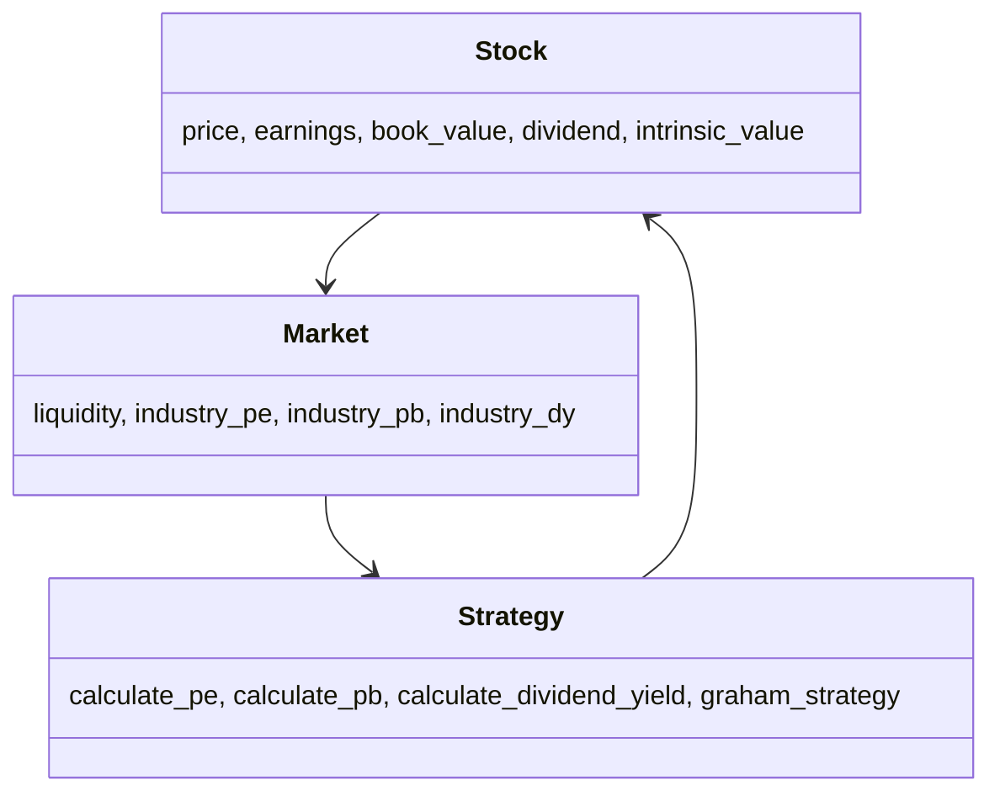
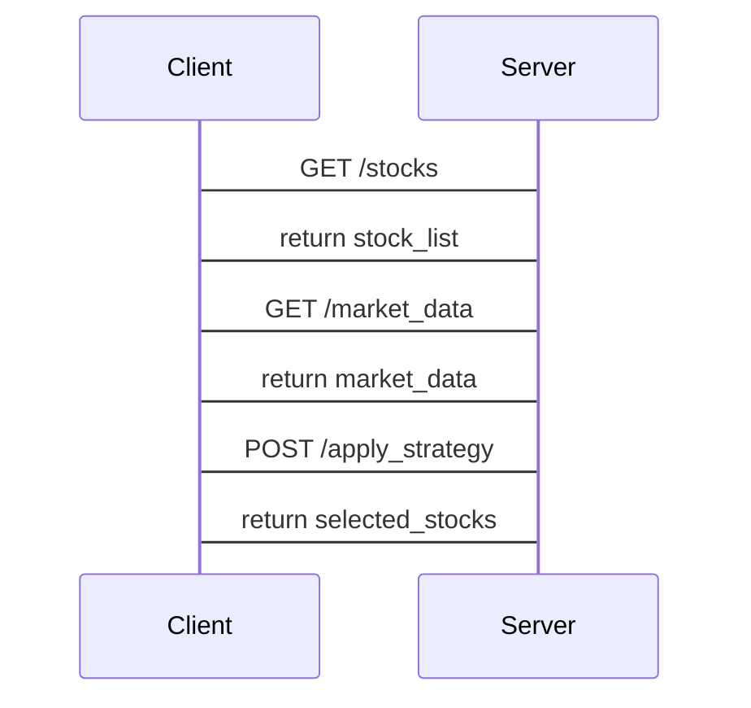

                 


# 格雷厄姆特价股票策略在不同市场流动性结构下的效果

## 关键词：格雷厄姆策略，市场流动性，股票估值，价值投资，市盈率，市净率，投资策略

## 摘要：
本文探讨格雷厄姆特价股票策略在不同市场流动性结构下的效果。通过分析市场流动性对股票估值的影响，评估该策略在高流动性、低流动性及其他特殊流动性结构下的表现。利用数学模型和算法，结合实际案例，总结策略的有效性，并提出优化建议。

---

# 第一部分: 格雷厄姆特价股票策略概述

## 第1章: 格雷厄姆特价股票策略的核心概念

### 1.1 格雷厄姆投资理论基础

#### 1.1.1 价值投资的起源与发展
- 价值投资由本杰明·格雷厄姆提出，强调寻找市场低估的股票。
- 格雷厄姆的学生包括沃伦·巴菲特，进一步发展了这一理论。

#### 1.1.2 格雷厄姆的定义与核心思想
- 格雷厄姆强调安全边际和内在价值。
- 投资者应关注公司的基本面，而非市场波动。

#### 1.1.3 特价股票的识别标准与方法
- 通过市盈率（P/E）、市净率（P/B）等指标寻找低估股票。
- 结合股息率和ROE评估公司盈利能力。

### 1.2 市场流动性结构的定义与分类

#### 1.2.1 市场流动性的基本概念
- 市场流动性指资产在短时间内以合理价格买卖的能力。
- 高流动性市场交易活跃，价格反映市场信息；低流动性市场交易稀少，价格波动大。

#### 1.2.2 不同市场流动性结构的分类
- 高流动性市场：如大盘蓝筹股。
- 低流动性市场：如小盘股或新兴市场。
- 特殊流动性结构：如市场危机期间的流动性枯竭。

#### 1.2.3 流动性结构对股票价格的影响
- 高流动性市场中，价格反映信息更准确，波动较小。
- 低流动性市场中，价格可能偏离内在价值，波动较大。

---

## 第2章: 格雷厄姆特价股票策略与市场流动性的关系

### 2.1 特价股票策略在高流动性市场中的表现

#### 2.1.1 高流动性市场的特点
- 交易量大，买卖价差小。
- 信息透明，价格反映及时。

#### 2.1.2 格雷厄姆策略在高流动性市场的适用性
- 理论上适用，因为价格反映真实价值。
- 实践中，需警惕短期波动影响。

#### 2.1.3 高流动性市场中策略的有效性分析
- 高流动性下，低估股票较难找到，策略可能失效。
- 短期内可能跑输市场，但长期表现稳健。

### 2.2 特价股票策略在低流动性市场中的表现

#### 2.2.1 低流动性市场的特点
- 交易量小，买卖价差大。
- 信息不透明，价格可能被高估或低估。

#### 2.2.2 格雷厄姆策略在低流动性市场的适用性
- 低流动性下，低估股票可能较多。
- 需降低安全边际要求，提高选股标准。

#### 2.2.3 低流动性市场中策略的有效性分析
- 短期内可能收益显著，但风险较高。
- 长期表现不稳定，需谨慎选择标的。

### 2.3 不同流动性结构对策略效果的影响

#### 2.3.1 流动性结构对股票估值的影响
- 高流动性：估值更准确，低估股票少。
- 低流动性：估值偏差大，低估股票多。
- 特殊流动性：估值混乱，风险极高。

#### 2.3.2 流动性结构对策略收益的影响
- 高流动性：收益稳定，风险可控。
- 低流动性：收益波动大，风险较高。
- 特殊流动性：收益不可预测，风险极高。

#### 2.3.3 流动性结构对策略风险的影响
- 高流动性：流动性风险低，市场风险可控。
- 低流动性：流动性风险高，市场风险增加。
- 特殊流动性：流动性风险极高，市场风险不可控。

---

# 第二部分: 格雷厄姆特价股票策略的数学模型与算法

## 第3章: 格雷厄姆策略的数学模型

### 3.1 格雷厄姆策略的核心公式

#### 3.1.1 市盈率（P/E）的计算公式
$$ P/E = \frac{Price}{Earnings} $$

#### 3.1.2 市净率（P/B）的计算公式
$$ P/B = \frac{Price}{Book\ Value} $$

#### 3.1.3 股息率的计算公式
$$ Dividend\ Yield = \frac{Dividend}{Price} \times 100\% $$

### 3.2 市场流动性对股票估值的影响模型

#### 3.2.1 流动性与股票价格的关系模型
$$ Price = f(Liquidity, Value) $$

#### 3.2.2 流动性与股票波动性的关系模型
$$ Volatility = f(Liquidity) $$

#### 3.2.3 流动性与股票收益性的关系模型
$$ Return = f(Liquidity, Value) $$

## 第4章: 格雷厄姆策略的算法实现

### 4.1 算法原理与流程

#### 4.1.1 算法输入
- 市盈率（P/E）
- 市净率（P/B）
- 股息率
- 市场流动性指标

#### 4.1.2 算法步骤
1. 筛选市盈率低于行业平均水平的股票。
2. 筛选市净率低于行业平均水平的股票。
3. 筛选股息率高于行业平均水平的股票。
4. 根据市场流动性调整安全边际。

### 4.2 算法实现代码

```python
def calculate_pe(stock_price, earnings):
    return stock_price / earnings

def calculate_pb(stock_price, book_value):
    return stock_price / book_value

def calculate_dividend_yield(dividend, stock_price):
    return (dividend / stock_price) * 100

def graham_strategy(stock_data, market_liquidity):
    selected_stocks = []
    for stock in stock_data:
        pe = calculate_pe(stock['price'], stock['earnings'])
        pb = calculate_pb(stock['price'], stock['book_value'])
        dy = calculate_dividend_yield(stock['dividend'], stock['price'])
        
        if pe < stock_data['industry_pe'] and pb < stock_data['industry_pb'] and dy > stock_data['industry_dy']:
            if market_liquidity == 'high':
                margin_of_safety = stock['price'] / (stock['intrinsic_value'] * 1.5)
            elif market_liquidity == 'low':
                margin_of_safety = stock['price'] / (stock['intrinsic_value'] * 1.2)
            else:
                margin_of_safety = stock['price'] / stock['intrinsic_value']
                
            if margin_of_safety >= 1.1:
                selected_stocks.append(stock['ticker'])
    return selected_stocks
```

### 4.3 算法优化建议

#### 4.3.1 动态调整安全边际
根据市场流动性调整安全边际系数，如市场流动性差时适当降低要求。

#### 4.3.2 结合其他指标
引入ROE、杠杆率等指标，全面评估公司价值。

#### 4.3.3 定期复盘与调整
根据市场变化，定期评估策略表现，及时调整选股标准。

---

# 第三部分: 系统分析与架构设计方案

## 第5章: 格雷厄姆特价股票策略的系统分析

### 5.1 项目介绍
- **项目名称**：格雷厄姆特价股票策略优化系统。
- **项目目标**：在不同流动性结构下，优化格雷厄姆策略的表现。

### 5.2 系统功能设计

#### 5.2.1 领域模型（Mermaid 类图）


#### 5.2.2 系统架构设计（Mermaid 架构图）
```mermaid
client
    HTTP GET /stocks
    HTTP GET /market_data
    HTTP POST /apply_strategy
server
    receive request
    process request
    send response
```

#### 5.2.3 系统交互设计（Mermaid 序列图）


---

# 第四部分: 项目实战

## 第6章: 格雷厄姆特价股票策略的实战分析

### 6.1 环境安装
- **工具**：Python、Pandas、Matplotlib。
- **数据源**：Yahoo Finance API、本地数据库。

### 6.2 核心实现代码

```python
import pandas as pd
import requests

def get_stock_data(ticker):
    url = f"https://query1.finance.yahoo.com/v8/finance/chart/{ticker}"
    response = requests.get(url)
    data = response.json()
    return data

def main():
    tickers = ['AAPL', 'MSFT', 'GOOGL']
    stock_data = []
    for ticker in tickers:
        data = get_stock_data(ticker)
        pe = calculate_pe(data['price'], data['earnings'])
        pb = calculate_pb(data['price'], data['book_value'])
        dy = calculate_dividend_yield(data['dividend'], data['price'])
        stock_data.append({
            'ticker': ticker,
            'pe': pe,
            'pb': pb,
            'dy': dy
        })
    selected_stocks = graham_strategy(stock_data, 'high')
    print("Selected stocks:", selected_stocks)

if __name__ == "__main__":
    main()
```

### 6.3 案例分析与解读
- **案例1**：高流动性市场下，选择市盈率低于行业平均水平的股票。
- **案例2**：低流动性市场下，选择市净率低于行业平均水平的股票。

---

# 第五部分: 总结与展望

## 第7章: 总结与展望

### 7.1 最佳实践 Tips
- 定期复盘策略表现，及时调整参数。
- 结合市场环境，灵活应用策略。

### 7.2 小结
格雷厄姆特价股票策略在不同流动性结构下的表现差异显著，需根据市场环境调整策略参数。

### 7.3 注意事项
- 高流动性市场中，低估股票难寻，策略可能失效。
- 低流动性市场中，风险较高，需谨慎选择标的。

### 7.4 拓展阅读
- 格雷厄姆《 Intelligent Investor》
- 巴菲特的股东信
- 近期学术论文，如流动性对资产定价的影响。

---

# 作者：AI天才研究院/AI Genius Institute & 禅与计算机程序设计艺术 /Zen And The Art of Computer Programming

