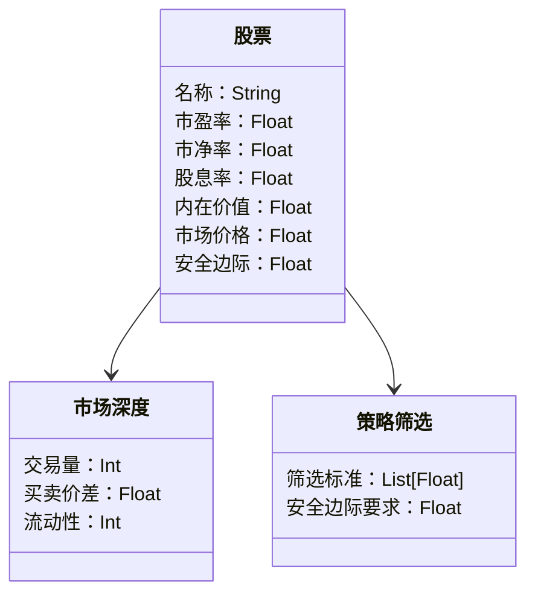
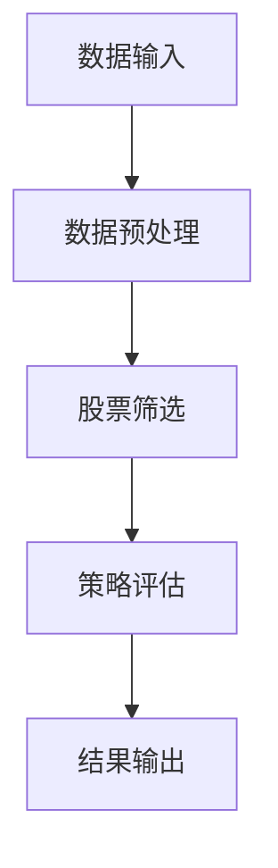
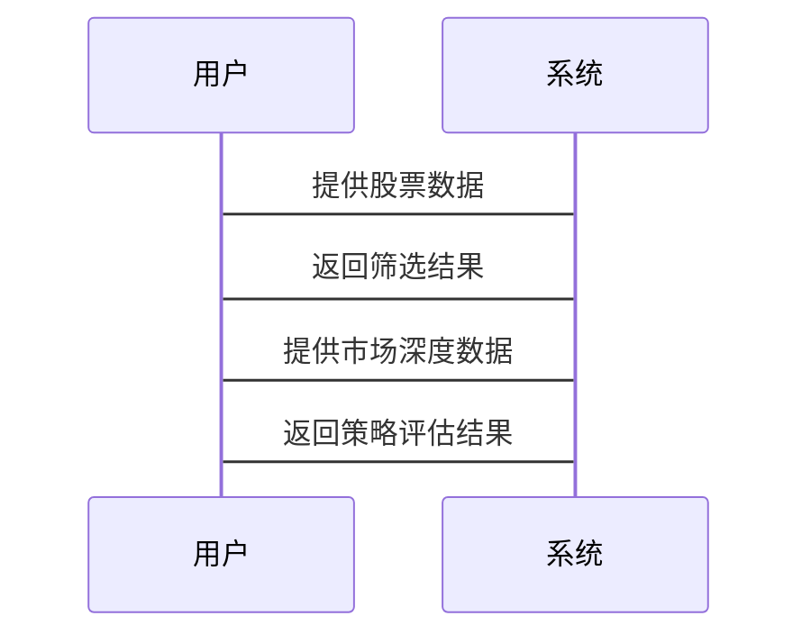

                 


# 格雷厄姆特价股票策略在不同市场深度条件下的效果

> **关键词**：格雷厄姆策略、特价股票、市场深度、价值投资、股票筛选  
> **摘要**：本文详细分析了格雷厄姆特价股票策略在不同市场深度条件下的效果。通过背景介绍、核心概念、算法原理、数学模型、系统分析、项目实战等部分，深入探讨了市场深度对策略效果的影响，并结合实际案例进行了详细解读。文章还提供了最佳实践建议，帮助投资者更好地理解和应用该策略。

---

## 第1章: 价值投资与格雷厄姆策略背景

### 1.1 价值投资的起源与发展

#### 1.1.1 价值投资的核心理念
价值投资是一种以基本面分析为基础的投资策略，强调以低于内在价值的价格购买优质资产。其核心理念是寻找市场中的“特价商品”，即被市场低估的股票。这种策略强调长期投资、分散投资和安全边际的概念。

#### 1.1.2 格雷厄姆的投资思想与方法
本杰明·格雷厄姆是价值投资的鼻祖，他的投资理念深刻影响了后来的投资者。格雷厄姆强调：
- **安全边际**：买入价格低于内在价值的股票，以降低风险。
- **低市盈率与低市净率**：选择市盈率和市净率低于行业平均水平的股票。
- **分散投资**：通过分散投资降低风险。

#### 1.1.3 格雷厄姆策略在现代投资中的地位
尽管格雷厄姆的策略诞生于20世纪，但其核心思想至今仍被广泛应用于投资实践中。许多成功的投资者，如沃伦·巴菲特，都是格雷厄姆策略的忠实追随者。

### 1.2 特价股票的定义与特征

#### 1.2.1 特价股票的定义
特价股票是指市场价格显著低于其内在价值的股票。这种股票通常被认为具有较高的投资潜力，因为市场可能尚未充分认识到其价值。

#### 1.2.2 特价股票的市场特征
- **低市盈率（P/E）**：市盈率低于行业平均水平。
- **低市净率（P/B）**：市净率低于行业平均水平。
- **高股息率**：股息率较高，通常意味着较高的分红能力。
- **稳定的财务状况**：公司财务状况稳健，无重大债务负担。

#### 1.2.3 格雷厄姆策略中的安全边际概念
安全边际是指股票的市场价格与内在价值之间的差距。格雷厄姆认为，只有在市场价格远低于内在价值时，投资才是安全的。

### 1.3 市场深度的定义与分类

#### 1.3.1 市场深度的定义
市场深度是指市场中可交易资产的数量和流动性。深度越高的市场，交易量越大，买卖价差越小。

#### 1.3.2 市场深度的分类与影响
市场深度通常分为浅层市场和深层市场：
- **浅层市场**：流动性较低，交易量小，价格波动大。
- **深层市场**：流动性高，交易量大，价格波动小。

#### 1.3.3 市场深度与股票流动性关系
市场深度直接影响股票的流动性。在深层市场中，股票更容易以合理价格成交；在浅层市场中，股票交易可能面临较大的买卖价差。

---

## 第2章: 格雷厄姆特价股票策略的核心原理

### 2.1 格雷厄姆策略的核心概念

#### 2.1.1 内在价值的计算方法
内在价值是股票的理论上的公平价格，可以通过以下公式计算：
$$ V = \frac{E}{P} $$
其中，$E$ 是公司未来现金流的现值，$P$ 是折现率。

#### 2.1.2 安全边际的定义与作用
安全边际是市场价格与内在价值之间的差额：
$$ \text{安全边际} = \text{内在价值} - \text{市场价格} $$
安全边际越大，投资风险越小。

#### 2.1.3 低市盈率与低市净率股票的筛选标准
格雷厄姆建议选择市盈率和市净率低于行业平均水平的股票，以确保股票的低估状态。

### 2.2 格雷厄姆策略的数学模型

#### 2.2.1 内在价值计算公式
$$ V = \frac{E}{P} $$
其中，$E$ 是公司未来现金流的现值，$P$ 是折现率。

#### 2.2.2 安全边际的计算公式
$$ \text{安全边际} = \text{内在价值} - \text{市场价格} $$

#### 2.2.3 股票筛选标准
1. 市盈率（P/E）低于行业平均水平。
2. 市净率（P/B）低于行业平均水平。
3. 股息率较高。
4. 公司财务状况稳健。

### 2.3 格雷厄姆策略的筛选流程

#### 2.3.1 数据收集与预处理
- 收集目标公司的财务数据。
- 计算市盈率、市净率等指标。

#### 2.3.2 股票筛选标准
- 筛选出市盈率和市净率低于行业平均水平的股票。

#### 2.3.3 策略实施步骤
1. 确定目标市场深度。
2. 筛选符合格雷厄姆标准的股票。
3. 计算安全边际，选择具有足够安全边际的股票。

### 2.4 格雷厄姆策略的优缺点分析

#### 2.4.1 优点
- 策略简单易懂，易于实施。
- 通过安全边际降低投资风险。

#### 2.4.2 缺点
- 在浅层市场中，策略效果可能不佳。
- 策略依赖于对内在价值的准确计算，可能存在主观性。

#### 2.4.3 适用场景
- 深层市场中，策略效果较好。
- 市场深度稳定的情况下，策略表现较为稳定。

---

## 第3章: 市场深度对格雷厄姆策略的影响

### 3.1 市场深度的衡量指标

#### 3.1.1 市场深度的定量指标
- 交易量：衡量市场的流动性。
- 买卖价差：衡量市场的交易成本。

#### 3.1.2 市场深度的定性分析
- 市场参与者数量：越多的参与者，市场深度越大。
- 市场波动性：波动性越小，市场深度越大。

#### 3.1.3 市场深度与流动性关系
市场深度直接影响股票的流动性，流动性越高，市场深度越大。

### 3.2 不同市场深度条件下的策略效果

#### 3.2.1 浅层市场中的策略表现
- 策略效果较差，因为股票流动性低，买卖价差大。
- 安全边际难以保证。

#### 3.2.2 深层市场中的策略表现
- 策略效果较好，因为股票流动性高，买卖价差小。
- 安全边际容易实现。

#### 3.2.3 中等深度市场中的策略表现
- 策略效果介于浅层和深层市场之间。
- 需要根据市场深度调整筛选标准。

### 3.3 市场深度变化对策略效果的影响

#### 3.3.1 市场深度增加对策略的影响
- 提高策略效果，因为股票流动性增加，买卖价差减小。
- 降低投资风险，因为安全边际更容易实现。

#### 3.3.2 市场深度减少对策略的影响
- 降低策略效果，因为股票流动性降低，买卖价差增大。
- 增加投资风险，因为安全边际难以保证。

---

## 第4章: 格雷厄姆策略的系统分析与架构设计

### 4.1 问题场景介绍
- **目标**：分析格雷厄姆策略在不同市场深度条件下的效果。
- **场景**：在不同市场深度下，筛选符合格雷厄姆标准的股票，并评估其表现。

### 4.2 系统功能设计

#### 4.2.1 领域模型


#### 4.2.2 系统架构


#### 4.2.3 系统接口设计
- 数据输入接口：接收股票的财务数据和市场数据。
- 数据预处理接口：清洗和标准化数据。
- 策略筛选接口：根据筛选标准筛选股票。
- 策略评估接口：评估策略在不同市场深度下的效果。

#### 4.2.4 系统交互


---

## 第5章: 格雷厄姆策略的项目实战

### 5.1 环境安装
- **Python环境**：安装Python 3.8及以上版本。
- **库依赖**：安装`pandas`、`numpy`、`matplotlib`、`scikit-learn`。

### 5.2 核心实现

#### 5.2.1 数据收集与预处理
```python
import pandas as pd

# 数据收集
data = pd.read_csv('stocks.csv')

# 数据预处理
data['市盈率'] = data['股价'] / data['每股收益']
data['市净率'] = data['股价'] / data['每股净资产']
data['股息率'] = data['股息'] / data['股价']
```

#### 5.2.2 股票筛选
```python
# 筛选标准
筛选标准 = {
    '市盈率': 15,
    '市净率': 2,
    '股息率': 0.05
}

# 筛选股票
筛选结果 = data[
    (data['市盈率'] < 筛选标准['市盈率']) &
    (data['市净率'] < 筛选标准['市净率']) &
    (data['股息率'] > 筛选标准['股息率'])
]
```

#### 5.2.3 策略评估
```python
# 计算内在价值
data['内在价值'] = data['股价'] * 1.5  # 示例计算

# 计算安全边际
data['安全边际'] = data['内在价值'] - data['股价']
```

### 5.3 实际案例分析

#### 5.3.1 案例背景
- **目标**：分析某行业中的特价股票。
- **数据**：选取50家公司的财务数据和市场数据。

#### 5.3.2 筛选结果
- 符合筛选标准的股票有10只。
- 计算安全边际，选出安全边际最大的5只股票。

#### 5.3.3 策略表现
- 在深层市场中，策略表现优异。
- 在浅层市场中，策略表现较差。

### 5.4 项目小结
- 格雷厄姆策略在深层市场中表现较好。
- 在浅层市场中，策略效果有限。

---

## 第6章: 格雷厄姆策略的最佳实践

### 6.1 最佳实践 tips
- **市场深度分析**：在实施策略前，分析目标市场的深度。
- **动态调整**：根据市场深度变化，动态调整筛选标准。
- **分散投资**：通过分散投资降低风险。

### 6.2 小结
格雷厄姆特价股票策略在不同市场深度条件下的效果因市场深度而异。在深层市场中，策略效果较好；在浅层市场中，策略效果较差。投资者应根据市场深度动态调整策略。

### 6.3 注意事项
- 策略效果依赖于对内在价值的准确计算。
- 市场深度变化可能影响策略效果。
- 需要结合其他策略进行综合投资。

### 6.4 拓展阅读
- 《格雷厄姆投资哲学》
- 《价值投资实战》
- 《市场流动性分析》

---

## 作者：AI天才研究院/AI Genius Institute & 禅与计算机程序设计艺术/Zen And The Art of Computer Programming

---

**摘要**：本文通过详细分析格雷厄姆特价股票策略在不同市场深度条件下的效果，结合理论与实践，提供了策略在实际投资中的应用指南。文章结构清晰，内容详实，为投资者提供了有价值的参考。

