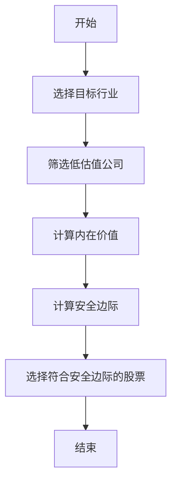
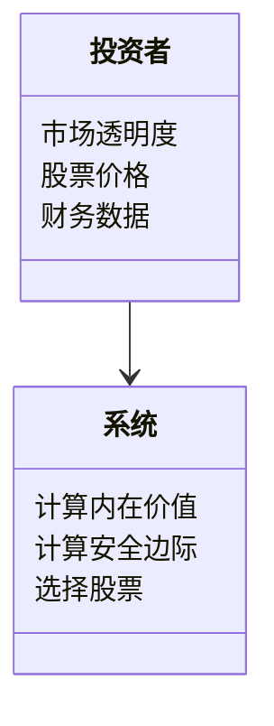
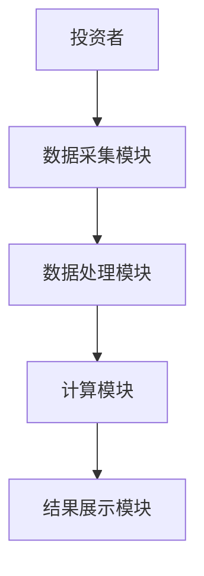
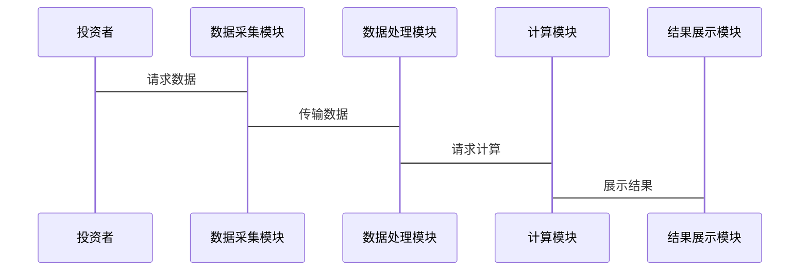

                 


# 格雷厄姆特价股票策略在不同市场透明度下的表现

## 关键词：
- 格雷厄姆策略
- 价值投资
- 市场透明度
- 投资策略
- 股票分析

## 摘要：
本文系统分析了格雷厄姆特价股票策略在不同市场透明度下的表现，探讨了低透明度与高透明度市场对策略执行的影响。通过数学模型、算法解析、系统架构设计及实际案例分析，深入揭示了市场透明度对策略有效性的影响，并提出相应的优化建议。

---

## 第一部分: 格雷厄姆特价股票策略概述

### 第1章: 价值投资与格雷厄姆策略

#### 1.1 价值投资的起源与发展

##### 1.1.1 价值投资的起源
- **定义**: 价值投资是一种基于股票内在价值的投资策略，旨在通过分析公司基本面，寻找市场价格低于内在价值的证券。
- **历史背景**: 20世纪初，本杰明·格雷厄姆与戴维·多德共同提出价值投资理念，奠定了现代价值投资的基础。
- **核心思想**: 股票价格围绕内在价值波动，市场短期是投票机，长期是称重机。

##### 1.1.2 格雷厄姆策略的核心原则
- **内在价值**: 公司未来现金流的现值，计算公式为：
  $$ V = \sum_{t=1}^{n} \frac{C_t}{(1+r)^t} $$
  其中，$C_t$为第$t$年的现金流，$r$为折现率。
- **安全边际**: 买入价格低于内在价值，公式为：
  $$ \text{安全边际} = V - P $$
  其中，$P$为市场价格。

#### 1.1.3 价值投资与其他投资策略的对比

- **技术分析 vs. 基本面分析**:
  - 技术分析关注价格和成交量，无法反映公司基本面。
  - 价值分析关注公司基本面，寻找价格低估的证券。
- **成长型投资 vs. 价值型投资**:
  - 成长型投资关注高增长公司，风险较高。
  - 价值型投资关注低估值公司，风险相对较低。
- **被动投资 vs. 主动投资**:
  - 被动投资如指数基金，无需择时和选股。
  - 主动投资如价值投资，依赖于选股和择时。

### 第2章: 市场透明度的定义与分类

#### 2.1 市场透明度的定义

##### 2.1.1 透明度的定义
- **定义**: 市场透明度指市场信息的公开程度，包括价格、交易量、公司财务信息等。
- **衡量标准**: 包括信息可及性、信息准确性、信息及时性。

##### 2.1.2 透明度的分类
- **低透明度市场**: 信息不透明，投资者难以获取公司真实信息。
- **高透明度市场**: 信息透明，投资者可以轻松获取公司财务数据和市场信息。

#### 2.2 市场透明度对投资策略的影响

##### 2.2.1 低透明度市场中的投资挑战
- **信息不对称**: 大机构掌握更多信息，小投资者处于劣势。
- **不确定性**: 市场价格波动大，难以准确评估内在价值。
- **策略适用性**: 格雷厄姆策略在低透明度市场中难以有效执行。

##### 2.2.2 高透明度市场中的投资机会
- **信息充分性**: 投资者可以准确评估公司内在价值。
- **市场效率**: 高透明度市场中，价格反映信息充分，策略执行难度较低。
- **策略表现**: 格雷厄姆策略在高透明度市场中表现优异。

### 第3章: 格雷厄姆策略在不同市场透明度下的表现分析

#### 3.1 低透明度市场中的策略表现

##### 3.1.1 信息不对称对策略的影响
- **信息不对称**: 投资者难以获取公司真实财务数据，导致内在价值计算不准确。
- **策略执行难度**: 无法准确计算安全边际，导致投资决策失误。
- **解决方案**: 选择行业龙头公司，减少信息不对称的影响。

##### 3.1.2 投资者情绪与策略表现
- **市场恐慌**: 在低透明度市场中，投资者情绪波动大，可能导致股票价格偏离内在价值。
- **策略调整建议**: 在市场恐慌时，增加安全边际，选择更具防御性的股票。

#### 3.2 高透明度市场中的策略表现

##### 3.2.1 信息充分性对策略的影响
- **信息充分性**: 高透明度市场中，投资者可以准确计算内在价值，提高策略执行效果。
- **策略执行优势**: 高透明度市场中，投资者可以轻松获取公司财务数据，计算安全边际，选择低估股票。
- **市场效率**: 高透明度市场中，价格反映信息充分，策略执行难度降低。

##### 3.2.2 市场效率与策略的有效性
- **市场效率**: 高透明度市场中，价格反映信息充分，策略执行效果较好。
- **策略的有效性**: 格雷厄姆策略在高透明度市场中表现优异，能够实现超额收益。

---

## 第二部分: 数学模型与算法解析

### 第4章: 格雷厄姆策略的数学模型

#### 4.1 内在价值计算公式

##### 4.1.1 内在价值公式
$$ V = \frac{E}{(r - g)} $$
其中，$E$为公司未来现金流，$r$为折现率，$g$为增长率。

##### 4.1.2 安全边际计算公式
$$ \text{安全边际} = V - P $$
其中，$P$为市场价格。

#### 4.2 算法流程图



### 第5章: 系统分析与架构设计

#### 5.1 系统功能设计

##### 5.1.1 领域模型


#### 5.2 系统架构设计

##### 5.2.1 系统架构图


#### 5.3 系统交互设计

##### 5.3.1 序列图


---

## 第三部分: 项目实战

### 第6章: 项目实战与案例分析

#### 6.1 环境安装

##### 6.1.1 安装Python
- 下载Python安装包
- 安装并配置环境变量

#### 6.2 核心实现源代码

##### 6.2.1 计算内在价值
```python
def calculate_intrinsic_value(earnings, discount_rate, growth_rate):
    return earnings / (discount_rate - growth_rate)
```

##### 6.2.2 计算安全边际
```python
def calculate_margin_of_safety(intrinsic_value, market_price):
    return intrinsic_value - market_price
```

#### 6.3 实际案例分析

##### 6.3.1 案例分析
- **公司名称**: 苹果公司
- **财务数据**: 净收入、净利润、增长率等
- **计算结果**: 内在价值与市场价格对比

---

## 第四部分: 总结与展望

### 第7章: 总结与展望

#### 7.1 总结
- 格雷厄姆策略在高透明度市场中表现优异，但在低透明度市场中面临挑战。
- 提高市场透明度有助于提升策略的有效性。

#### 7.2 展望
- 进一步研究市场透明度对策略的长期影响。
- 探讨如何利用技术手段提高市场透明度。

---

## 作者信息

作者：AI天才研究院/AI Genius Institute & 禅与计算机程序设计艺术 /Zen And The Art of Computer Programming

---

这篇文章通过详细分析格雷厄姆策略在不同市场透明度下的表现，结合数学模型、系统架构和实际案例，为投资者提供了深入的理论支持和实践指导。

