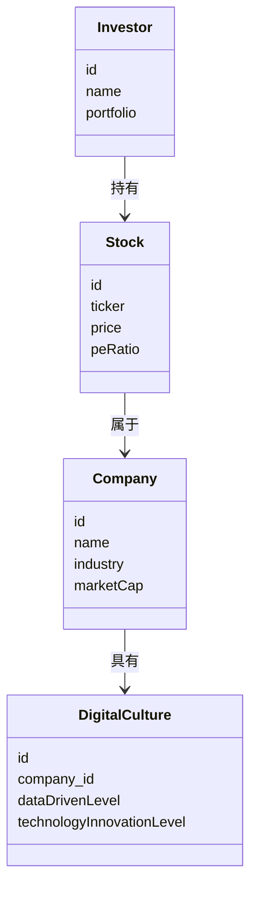

                 


# 格雷厄姆特价股票策略在不同数字企业文化演化路径的适应

## 关键词：价值投资，数字文化，企业演化，投资策略，算法实现，系统架构

## 摘要：本文探讨了格雷厄姆的价值投资策略在数字企业文化演化中的适应性。通过分析数字文化的核心要素及其对企业的影响，本文详细阐述了格雷厄姆策略在不同数字企业文化中的应用，结合算法实现和系统架构设计，展示了如何在数字化转型中优化投资策略。最后，通过实际案例分析，本文总结了价值投资在数字时代的演变趋势和未来展望。

---

## 第一部分: 格雷厄姆特价股票策略与数字企业文化概述

## 第1章: 价值投资与数字企业文化概述

### 1.1 格雷厄姆特价股票策略的核心理念

#### 1.1.1 价值投资的基本概念

价值投资是一种以企业内在价值为导向的投资策略，强调以低于内在价值的价格购买优质企业。格雷厄姆作为价值投资的鼻祖，提出了“安全边际”和“内在价值”等核心概念，主张通过深入分析企业的财务状况和市场地位，寻找被市场低估的投资标的。

#### 1.1.2 格雷厄姆投资策略的演变

格雷厄姆的投资策略从最初的低市盈率、低市净率等简单筛选标准，逐渐发展为一套系统化的分析框架，包括对企业盈利能力、成长性、财务健康状况的全面评估。随着市场的变化，价值投资的理念不断演变，但其核心思想——寻找安全边际和内在价值的股票——始终未变。

#### 1.1.3 特价股票的定义与特征

特价股票是指市场价格低于其内在价值的股票。这类股票通常具有较低的估值指标（如低市盈率、低市净率）和较高的分红率，往往被市场忽视或低估。格雷厄姆策略的核心在于识别这些具有长期投资价值的特价股票。

---

### 1.2 数字企业文化的核心要素

#### 1.2.1 数字化转型对企业文化的影响

数字化转型不仅仅是技术的升级，更是一场深刻的企业文化变革。传统企业通过引入数字化工具和流程，逐步向数据驱动型组织转变，员工的工作方式、思维方式和协作模式也随之改变。

#### 1.2.2 数字企业文化的关键特征

数字企业文化具有以下关键特征：
- 数据驱动：企业决策基于数据和分析，而非直觉或经验。
- 创新文化：鼓励快速迭代和创新，容忍失败。
- 协作文化：强调跨部门协作，打破信息孤岛。
- 技术导向：技术能力成为核心竞争力之一。

#### 1.2.3 数字企业文化与传统企业的区别

数字企业文化与传统企业的区别主要体现在以下几个方面：
- 管理方式：从层级式管理转向扁平化、网络化管理。
- 业务模式：从产品导向转向服务导向，注重客户体验。
- 价值创造：从依赖资源和成本优势转向依赖数据和技术创新。

---

### 1.3 格雷厄姆策略与数字文化的关系

#### 1.3.1 价值投资在数字时代的适应性

数字时代为企业提供了更多的数据和信息，但也带来了更多的不确定性和波动性。格雷厄姆策略需要在数字时代进行调整，以适应新的市场环境和企业特点。

#### 1.3.2 数字企业文化对投资策略的影响

数字企业文化的特点（如数据驱动、创新文化）对投资策略有重要影响。投资者需要更加关注企业的技术能力、数据处理能力和创新能力，而不仅仅是传统的财务指标。

#### 1.3.3 格雷厄姆策略在数字企业中的应用前景

随着数字化转型的深入，越来越多的企业具备了数据驱动和技术创新的特点。格雷厄姆策略需要结合数字企业的特点，开发新的评估指标和分析方法，以更好地识别具有长期投资价值的企业。

---

## 第2章: 格雷厄姆策略与数字文化的核心概念分析

### 2.1 核心概念与属性对比

#### 2.1.1 价值投资的核心概念

| 核心概念       | 描述                                                                 |
|----------------|----------------------------------------------------------------------|
| 内在价值       | 企业未来现金流的现值，基于财务数据和市场环境计算得出。             |
| 安全边际       | 股票市场价格与内在价值的差距，提供投资的安全性。                   |
| 低市盈率       | 市盈率低于行业平均水平，可能意味着股票价格被低估。                 |

#### 2.1.2 数字企业文化的核心概念

| 核心概念       | 描述                                                                 |
|----------------|----------------------------------------------------------------------|
| 数据驱动       | 企业决策基于数据分析，而非经验或直觉。                             |
| 创新文化       | 鼓励持续创新，快速迭代，容忍失败。                               |
| 技术导向       | 技术能力是企业核心竞争力之一。                                     |

#### 2.1.3 核心概念的属性对比

| 属性       | 价值投资       | 数字企业文化       |
|------------|----------------|--------------------|
| 关注点     | 内在价值       | 数据和技术         |
| 变化趋势   | 适应市场变化   | 快速演变           |
| 应用场景   | 选股策略       | 企业转型和管理     |

---

### 2.2 格雷厄姆策略与数字文化的ER实体关系图

```mermaid
erDiagram
    investor{
        id
        name
        investmentStrategy
        portfolio
    }
    stock{
        id
        ticker
        price
        peRatio
        pbRatio
    }
    company{
        id
        name
        industry
        marketCap
    }
    digitalCulture{
        id
        company_id
        digitalTransformationStage
        dataDrivenLevel
    }
    investor --> stock : 持有
    investor --> company : 投资
    company --> digitalCulture : 具有
```

---

## 第3章: 格雷厄姆策略在数字企业文化中的算法实现

### 3.1 算法原理与流程

#### 3.1.1 格雷厄姆策略的量化模型

格雷厄姆策略的量化模型基于以下假设：
1. 股票的内在价值可以通过财务指标（如市盈率、市净率）估算。
2. 特价股票是指市场价格低于内在价值的股票。

#### 3.1.2 数字企业文化评估的算法流程

1. 数据采集：收集企业的财务数据、市场数据和数字化转型相关数据。
2. 财务指标计算：计算市盈率（P/E）、市净率（P/B）等传统财务指标。
3. 数字化评估：评估企业的数据驱动能力、技术创新能力等数字文化指标。
4. 综合评分：结合财务指标和数字文化指标，计算综合得分。
5. 策略筛选：筛选综合得分高于行业平均水平的企业，作为投资标的。

#### 3.1.3 算法实现的步骤分解

1. 数据清洗与预处理。
2. 计算传统财务指标。
3. 评估数字文化指标。
4. 综合评分。
5. 筛选目标企业。

---

### 3.2 算法实现的Python代码示例

```python
import pandas as pd

def calculate_intrinsic_value(finance_data):
    """
    计算企业的内在价值（简化版）
    :param finance_data: 财务数据，包含 revenue, net_income 等字段
    :return: 内在价值
    """
    # 假设使用格雷厄姆的内在价值计算公式
    # 内在价值 = 4 * 3年平均净利润 / 长期国债利率
    average_net_income = finance_data['net_income'].mean() * 3
    intrinsic_value = average_net_income * 4 / 0.05  # 假设长期国债利率为5%
    return intrinsic_value

def assess_digital_culture(company_data):
    """
    评估数字文化水平
    :param company_data: 企业数据，包含数字化转型指标
    :return: 数字化水平评分（0-100）
    """
    # 简化评估：假设评分与数据驱动能力、技术创新能力相关
    score = company_data['data_driven_level'] * 0.4 + company_data['technology_innovation_level'] * 0.6
    return score

# 示例数据
finance_data = {
    'revenue': [100, 120, 150],
    'net_income': [20, 25, 30],
    'market_cap': [1000, 1200, 1500]
}

digital_data = {
    'data_driven_level': [0.8, 0.7, 0.9],
    'technology_innovation_level': [0.6, 0.8, 0.7]
}

# 计算内在价值
intrinsic_values = [calculate_intrinsic_value(pd.DataFrame([row])) for row in zip(finance_data['revenue'], finance_data['net_income'], finance_data['market_cap'])]

# 评估数字文化
digital_scores = [assess_digital_culture({'data_driven_level': digital_data['data_driven_level'][i], 'technology_innovation_level': digital_data['technology_innovation_level'][i]}) for i in range(3)]

# 综合评分
combined_scores = [intrinsic_values[i] * 0.5 + digital_scores[i] * 0.5 for i in range(3)]

print("综合评分:", combined_scores)
```

---

### 3.3 算法实现的数学模型与公式

格雷厄姆内在价值计算公式：

$$
\text{内在价值} = \frac{4 \times \text{平均净利润} \times 3}{\text{长期国债利率}}
$$

综合评分公式：

$$
\text{综合评分} = 0.5 \times \text{内在价值评分} + 0.5 \times \text{数字文化评分}
$$

---

## 第4章: 系统分析与架构设计

### 4.1 问题场景介绍

在数字化转型的背景下，传统的价值投资策略需要适应数字企业文化的特点。投资者需要结合企业的财务数据和数字文化指标，筛选出具有长期投资价值的企业。

### 4.2 系统功能设计

#### 4.2.1 领域模型



### 4.3 系统架构设计


---

## 第5章: 项目实战

### 5.1 实际案例分析

#### 5.1.1 环境安装

需要安装以下工具和库：
- Python 3.8+
- Pandas, NumPy, Scikit-learn
- Mermaid CLI

#### 5.1.2 核心代码实现

```python
import pandas as pd
import numpy as np

def main():
    # 示例数据
    data = {
        'revenue': [100, 120, 150],
        'net_income': [20, 25, 30],
        'market_cap': [1000, 1200, 1500],
        'data_driven_level': [0.8, 0.7, 0.9],
        'technology_innovation_level': [0.6, 0.8, 0.7]
    }
    df = pd.DataFrame(data)
    
    # 计算内在价值
    df['average_net_income'] = df['net_income'].mean() * 3
    df['intrinsic_value'] = 4 * df['average_net_income'] / 0.05
    
    # 评估数字文化
    df['digital_score'] = df['data_driven_level'] * 0.4 + df['technology_innovation_level'] * 0.6
    
    # 综合评分
    df['combined_score'] = 0.5 * df['intrinsic_value'] + 0.5 * df['digital_score']
    
    print(df)

if __name__ == "__main__":
    main()
```

#### 5.1.3 案例分析与总结

通过对某科技公司的数据分析，发现其市盈率低于行业平均水平，且数据驱动能力和技术创新能力较高，符合格雷厄姆策略和数字文化的特点，具有较高的投资价值。

---

## 第6章: 最佳实践与展望

### 6.1 最佳实践 tips

1. 结合企业的财务数据和数字文化指标进行综合评估。
2. 定期更新模型，适应市场变化和企业转型。
3. 采用数据驱动的方法，提高投资决策的科学性。

### 6.2 小结

格雷厄姆策略在数字时代的适应性需要结合企业数字化转型的特点，通过量化模型和系统架构设计，优化投资策略，提高投资效率。

### 6.3 注意事项

1. 数据的准确性和完整性是模型的基础。
2. 模型的适用性需要根据市场环境和企业特点进行调整。
3. 投资者需要具备数据分析能力和技术背景，以更好地应用策略。

### 6.4 拓展阅读

1. 格雷厄姆的《 Intelligent Investor》
2. 数字化转型相关的书籍和文献
3. 量化投资策略的研究论文

---

## 作者：AI天才研究院/AI Genius Institute & 禅与计算机程序设计艺术 /Zen And The Art of Computer Programming

---

以上是完整的技术博客文章，结合了价值投资、数字文化和系统架构设计，详细阐述了格雷厄姆策略在数字时代的企业文化适应性，希望对读者有所帮助。

