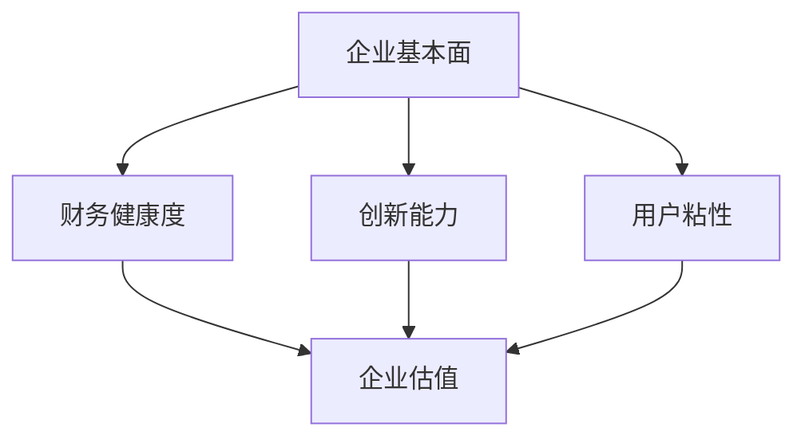
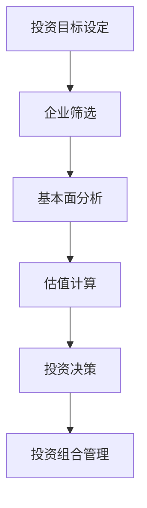
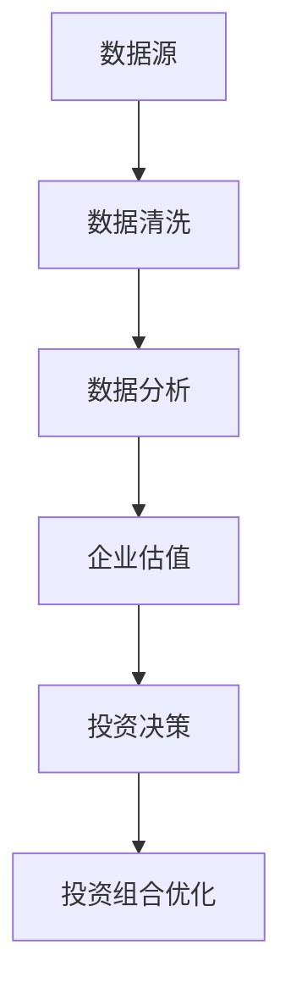

                 


# 格雷厄姆特价股票策略在不同数字企业文化生态中的适应

---

## 关键词：
- 格雷厄姆投资策略
- 数字企业文化
- 股票估值
- 价值投资
- 数字经济

---

## 摘要：
格雷厄姆的投资理论以价值投资为核心，强调通过深入分析企业的基本面来寻找被市场低估的投资机会。然而，随着数字化转型的深入，数字企业文化生态的复杂性和多样性对传统的投资策略提出了新的挑战。本文从格雷厄姆特价股票策略的基本原理出发，结合数字企业文化生态的特点，分析其在不同类型数字企业中的适应性。通过系统化的分析框架和实际案例，本文揭示了如何在数字经济时代优化格雷厄姆策略，以更好地适应不同数字企业文化生态的需求。

---

# 第一部分: 格雷厄姆特价股票策略与数字企业文化生态概述

## 第1章: 格雷厄姆投资理论的核心原理

### 1.1 格雷厄姆价值投资的核心理念
格雷厄姆的价值投资理论强调以低于企业内在价值的价格买入股票，长期持有，等待市场重新发现其真实价值。其核心思想可以总结为：
- **内在价值**：企业未来现金流的现值，而非市场定价。
- **安全边际**：买入价格与内在价值之间的差距，确保投资的安全性。
- **逆向思维**：在市场恐慌时寻找机会，在市场狂热时保持冷静。

#### 格雷厄姆策略与现代投资理论的对比
| 对比维度 | 格雷厄姆价值投资 | 现代投资组合理论 |
|----------|------------------|------------------|
| 核心思想 | 以低于价值的价格买入并长期持有 | 通过分散投资降低风险 |
| 重点 | 个股选择与基本面分析 | 组合优化与风险分散 |
| 风险管理 | 通过安全边际控制风险 | 通过分散投资降低系统性风险 |

### 1.2 数字企业文化生态的定义与特征
数字企业文化生态是指企业在数字化转型过程中形成的组织结构、商业模式、技术创新和文化价值观的综合体。其主要特征包括：
- **数据驱动**：企业决策依赖于数据分析，而非传统经验。
- **创新导向**：快速迭代和技术创新是核心竞争力。
- **跨界融合**：数字企业往往跨越传统行业界限，形成新的商业模式。
- **用户中心**：以用户体验为核心，构建生态系统。

### 1.3 数字企业文化生态对投资策略的影响
数字企业文化生态的复杂性和动态性对传统投资策略提出了新的挑战。例如：
- **技术风险**：技术创新可能带来颠覆性变化，影响企业价值。
- **商业模式不确定性**：数字企业的商业模式可能频繁调整，导致估值难度增加。
- **数据依赖性**：企业价值与数据资产的管理和利用能力密切相关。

---

## 第2章: 格雷厄姆策略在数字企业文化生态中的适应性分析

### 2.1 数字企业文化生态的系统化评估
#### 企业基本面分析框架
- **财务健康度**：关注企业的盈利能力、资产负债率和现金流。
- **创新能力和竞争优势**：评估企业的技术研发投入和市场地位。
- **用户粘性和生态系统**：分析企业的用户忠诚度和生态系统的完整性。

#### 数字企业文化生态的系统化模型


### 2.2 格雷厄姆策略的优化方向
#### 数字企业中的价值投资策略调整
- **动态估值**：由于数字企业的商业模式变化快，估值模型需要动态调整。
- **数据驱动的决策**：利用大数据分析技术辅助投资决策。
- **长期视角**：关注企业的长期增长潜力，而非短期市场波动。

#### 数字企业中的风险管理
- **技术风险**：评估企业的技术优势和替代风险。
- **市场风险**：关注行业竞争格局和市场需求的变化。
- **政策风险**：考虑数字经济发展中的政策不确定性。

---

## 第3章: 格雷厄姆策略在不同类型数字企业中的应用

### 3.1 科技型数字企业的投资策略
#### 科技企业的核心竞争力分析
- **技术创新能力**：研发投入占比和专利数量。
- **技术壁垒**：技术的可替代性和护城河。
- **市场需求**：技术在市场上的应用前景。

#### 格雷厄姆策略的应用案例
假设某科技企业A，其财务数据如下：
- 营业收入：10亿元
- 净利润：2亿元
- 现金储备：5亿元
- 市盈率：30倍

根据格雷厄姆的安全边际理论，合理估值应为15倍市盈率，即30亿元。若当前股价为20亿元，则具有较大的安全边际。

### 3.2 互联网型数字企业的投资策略
#### 互联网企业的商业模式与盈利模式
- **用户获取成本**：广告支出和用户补贴。
- **用户粘性**：用户活跃度和留存率。
- **网络效应**：平台的双边市场效应。

#### 格雷厄姆策略的应用案例
某互联网企业B，其用户规模为1亿，年收入为50亿元，净利润为5亿元，市盈率为20倍。根据格雷厄姆策略，若其合理估值为15倍市盈率，则合理股价为75亿元。若当前股价为60亿元，则具有较大的投资价值。

### 3.3 制造型数字企业的投资策略
#### 制造企业的周期性与风险评估
- **行业周期**：宏观经济波动对制造企业的影响。
- **成本控制能力**：原材料价格波动和生产效率。
- **数字化转型**：智能制造和工业互联网的应用。

#### 格雷厄姆策略的应用案例
某制造企业C，其营业收入为80亿元，净利润为8亿元，市盈率为10倍。根据格雷厄姆策略，若其合理估值为12倍市盈率，则合理股价为96亿元。若当前股价为80亿元，则具有较大的安全边际。

---

## 第4章: 格雷厄姆策略在数字企业文化生态中的系统架构设计

### 4.1 投资策略的系统化框架
#### 系统化投资流程


### 4.2 数字企业文化生态的系统化分析
#### 数字企业文化生态的系统化评估
- **数据采集**：收集企业的财务数据、技术创新数据和市场数据。
- **数据分析**：利用大数据技术进行企业价值评估。
- **决策支持**：基于数据分析结果优化投资策略。

#### 数字企业文化生态的系统架构


---

## 第5章: 项目实战与案例分析

### 5.1 项目背景与目标
- **项目目标**：以某数字企业为例，分析格雷厄姆策略在数字企业文化生态中的应用。
- **项目背景**：选择一家典型的科技型数字企业，分析其财务状况、竞争优势和市场地位。

### 5.2 核心实现与代码解读
#### 数据采集与处理
```python
import pandas as pd

# 读取财务数据
data = pd.read_csv('financial_data.csv')

# 计算内在价值
def calculate_intrinsic_value(data):
    # 假设使用格雷厄姆的内在价值公式
    return data['净利润'] * 15

# 应用安全边际
data['安全边际'] = data['股价'] * 0.2
```

#### 算法原理与数学模型
格雷厄姆的内在价值公式：
$$ \text{内在价值} = \text{净利润} \times \text{合理市盈率} $$

安全边际计算公式：
$$ \text{安全边际} = \text{股价} \times \text{安全边际比率} $$

---

## 第6章: 总结与展望

### 6.1 本章总结
- 格雷厄姆策略在数字企业文化生态中的适应性分析。
- 数字企业不同类型的投资策略优化。
- 系统化投资框架的设计与实现。

### 6.2 未来展望
- 数字经济的进一步发展对投资策略的影响。
- 人工智能技术在投资决策中的应用。
- 数字企业价值评估的创新方向。

---

## 作者：
作者：AI天才研究院/AI Genius Institute  
合作作者：禅与计算机程序设计艺术/Zen And The Art of Computer Programming

