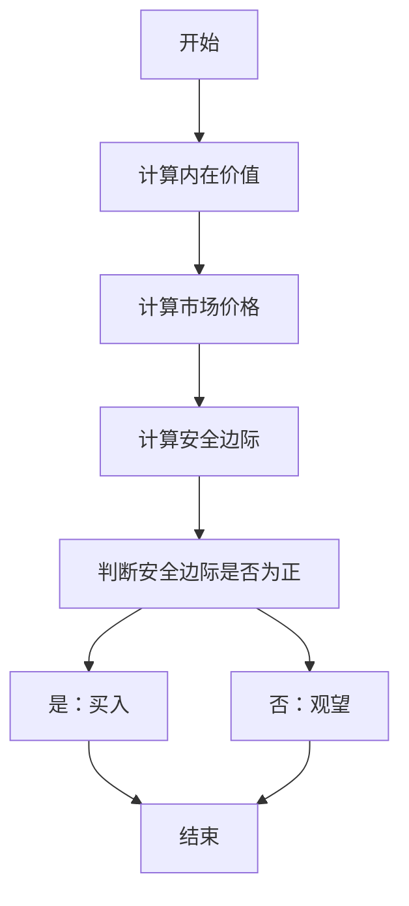
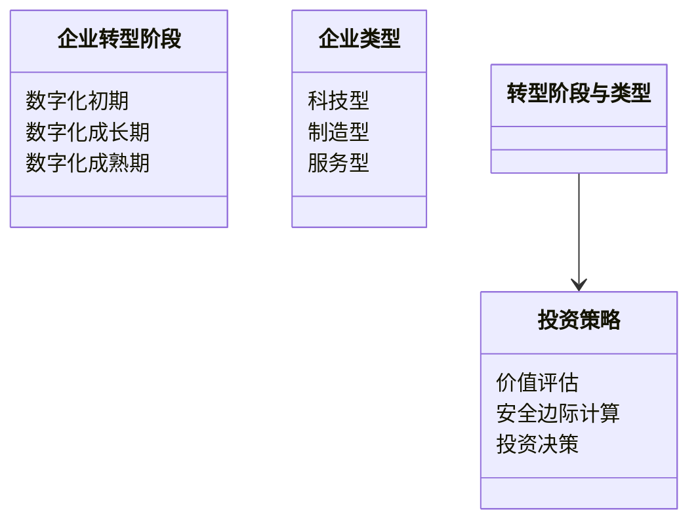

                 

# 格雷厄姆特价股票策略在不同数字企业文化转型阶段的适应

> 关键词：格雷厄姆策略，价值投资，数字企业文化转型，企业估值，投资策略

> 摘要：本文探讨了格雷厄姆价值投资策略在不同数字企业文化转型阶段中的适应性。通过分析企业转型的不同阶段，结合企业的财务指标和市场表现，提出了如何在不同阶段应用格雷厄姆策略的具体方法。文章还详细介绍了算法的数学模型和系统架构设计，并通过实际案例分析，验证了策略的有效性。

---

# 第一部分: 格雷厄姆特价股票策略与数字企业文化转型概述

## 第1章: 引言

### 1.1 价值投资与格雷厄姆策略概述

#### 1.1.1 价值投资的核心理念
价值投资是一种长期投资策略，强调以低于内在价值的价格买入优质资产。格雷厄姆的价值投资理论是这一策略的核心，强调安全边际和内在价值的计算。

#### 1.1.2 格雷厄姆特价股票策略的基本概念
格雷厄姆策略的核心是寻找那些市场价格低于其内在价值的股票。这种策略特别适用于那些处于转型期的企业，因为转型期的企业往往存在市场低估的机会。

#### 1.1.3 数字企业文化转型的背景与意义
数字时代的企业转型是指企业通过数字化技术改造其业务模式、运营流程和组织结构。这种转型不仅改变了企业的运作方式，也影响了企业的价值评估方式。

---

## 第2章: 格雷厄姆策略的核心概念

### 2.1 格雷厄姆策略的基本原理

#### 2.1.1 安全边际的定义与计算
安全边际是指市场价格与内在价值之间的差距。格雷厄姆认为，只有当市场价格低于内在价值时，投资才具有安全边际。

$$
\text{安全边际} = \text{内在价值} - \text{市场价格}
$$

#### 2.1.2 内在价值的评估方法
内在价值是基于企业未来现金流的现值计算得出的。格雷厄姆的内在价值公式如下：

$$
\text{内在价值} = \frac{\text{未来现金流的现值}}{\text{折现率}}
$$

#### 2.1.3 市场波动与价值回归理论
市场波动会导致股票价格偏离其内在价值，但长期来看，价格会回归其内在价值。这一理论为价值投资者提供了长期持有的信心。

---

## 第3章: 格雷厄姆策略在不同企业转型阶段的适应性分析

### 3.1 企业转型阶段的划分

#### 3.1.1 数字化转型的初期阶段
在初期阶段，企业刚刚开始数字化转型，通常表现为技术投入增加，但市场对其转型效果的不确定性较高。此时，格雷厄姆策略可以帮助投资者发现那些尚未被市场充分认识到的转型潜力企业。

#### 3.1.2 数字化转型的成长阶段
在成长阶段，企业已经建立了初步的数字化能力，并开始看到转型的成果。此时，企业的财务表现开始改善，市场对其估值逐渐上升。格雷厄姆策略可以关注那些财务表现稳定且估值仍低于内在价值的企业。

#### 3.1.3 数字化转型的成熟阶段
在成熟阶段，企业的数字化转型已经完成，财务表现稳定，市场对其估值较高。此时，格雷厄姆策略需要关注那些具有持续增长能力且估值仍低于内在价值的企业。

---

## 第4章: 格雷厄姆策略在不同类型企业中的应用

### 4.1 不同类型企业的特点分析

#### 4.1.1 科技型企业的特点与投资策略
科技型企业通常具有较高的研发投入和创新能力。在数字化转型中，科技型企业更可能通过技术创新实现增长。因此，投资者需要关注企业的研发投入、技术壁垒和市场竞争力。

#### 4.1.2 制造型企业的特点与投资策略
制造型企业通常依赖于生产效率和成本控制。在数字化转型中，制造型企业可以通过智能化生产提高效率，降低成本。因此，投资者需要关注企业的生产效率和成本控制能力。

#### 4.1.3 服务型企业的特点与投资策略
服务型企业通常依赖于服务质量和服务能力。在数字化转型中，服务型企业可以通过数字化服务提升客户体验。因此，投资者需要关注企业的服务质量和服务能力。

---

## 第5章: 格雷厄姆策略的算法原理

### 5.1 算法的数学模型

#### 5.1.1 内在价值计算公式
$$
\text{内在价值} = \frac{\text{未来现金流的现值}}{\text{折现率}}
$$

#### 5.1.2 市场价格计算公式
$$
\text{市场价格} = \text{内在价值} \times \text{市场情绪系数}
$$

#### 5.1.3 安全边际计算公式
$$
\text{安全边际} = \text{内在价值} - \text{市场价格}
$$

### 5.2 算法流程图

---

## 第6章: 系统架构设计

### 6.1 系统功能设计

#### 6.1.1 领域模型

---

## 第7章: 项目实战

### 7.1 案例分析

#### 7.1.1 案例选择
选择一家处于数字化转型初期的制造型企业进行分析。

#### 7.1.2 数据分析
计算该企业的内在价值、市场价格和安全边际。

#### 7.1.3 投资决策
根据计算结果，判断该企业是否具有投资价值。

---

## 第8章: 结论

### 8.1 研究总结
格雷厄姆价值投资策略在不同数字企业文化转型阶段具有较强的适应性。通过分析企业转型阶段和类型，投资者可以更好地应用格雷厄姆策略，实现长期投资收益。

### 8.2 未来研究方向
未来的研究可以进一步探讨格雷厄姆策略在不同行业和不同市场环境下的适应性，以及如何结合人工智能技术提升策略的计算效率和准确性。

---

作者：AI天才研究院/AI Genius Institute & 禅与计算机程序设计艺术 /Zen And The Art of Computer Programming

