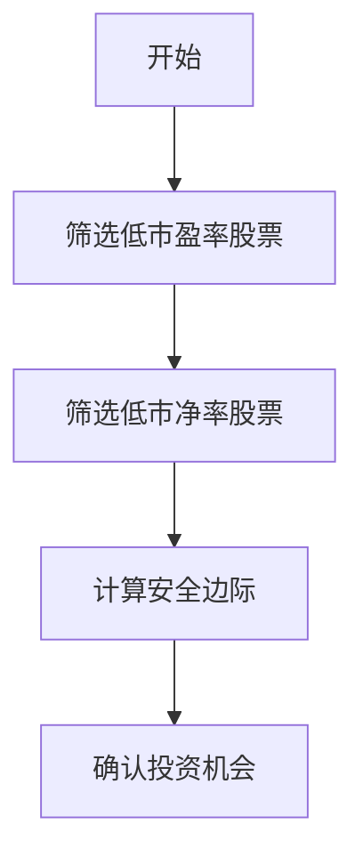

                 


# 格雷厄姆特价股票策略在不同数字创新生态系统复杂度的效果

**关键词**: 格雷厄姆, 特价股票策略, 数字创新生态系统, 复杂度, 投资效果

**摘要**:  
本文探讨格雷厄姆特价股票策略在不同数字创新生态系统中的应用效果，分析生态系统复杂度对策略的影响，并提出优化建议。通过理论分析与实证研究，本文揭示了数字创新生态系统的多样性对投资策略的有效性的影响，为投资者提供了新的视角和策略选择。

---

## 第一部分: 格雷厄姆特价股票策略的背景与基础

### 第1章: 格雷厄姆特价股票策略概述

#### 1.1 格雷厄姆投资理论的起源与核心思想
格雷厄姆是价值投资之父，其核心思想是“烟蒂投资”，即寻找市场低估的股票。以下是其策略的关键点：
- **价值投资**：基于内在价值进行投资，而非市场情绪。
- **安全边际**：以低于内在价值的价格买入股票，以降低风险。
- **低市盈率和低市净率**：格雷厄姆倾向于投资那些市盈率和市净率低于市场平均水平的股票。

#### 1.2 数字创新生态系统的基本概念
数字创新生态系统是指由技术、数据、平台、服务和参与者共同构成的复杂系统。其特点包括：
- **多样性**：涵盖科技、服务、平台等多种类型。
- **动态性**：技术创新迅速，市场变化快。
- **复杂性**：参与者众多，利益关系复杂。

#### 1.3 格雷厄姆策略与数字创新生态系统的结合
格雷厄姆策略在数字创新生态系统中的应用需要考虑生态系统的特点。例如，在科技型生态系统中，技术创新快，但波动性大；在服务型生态系统中，稳定性较高，但增长潜力有限。

---

### 第2章: 数字创新生态系统复杂度对策略的影响

#### 2.1 生态系统复杂度的维度分析
复杂度可以从以下几个维度分析：
- **市场参与者**：包括企业、投资者、技术提供商等。
- **产业链结构**：从上游技术到下游服务的复杂性。
- **技术创新**：技术更新速度和不确定性。

#### 2.2 复杂度对格雷厄姆策略的具体影响
- **高复杂度环境**：增加筛选难度，可能导致错失优质股票。
- **低复杂度环境**：筛选过程更简单，但潜在机会较少。

---

## 第二部分: 格雷厄姆策略在数字创新生态系统中的应用

### 第3章: 格雷厄姆策略的筛选指标与实现

#### 3.1 筛选指标的数学模型
格雷厄姆策略的核心指标包括市盈率（P/E）和市净率（P/B）。公式如下：
$$ P/E = \frac{股价}{每股收益} $$
$$ P/B = \frac{股价}{每股净资产} $$
目标是选择P/E和P/B低于市场平均水平的股票。

#### 3.2 筛选过程的Mermaid流程图


#### 3.3 Python实现
```python
import pandas as pd

def graham_strategy(stocks):
    # 筛选低市盈率和低市净率的股票
    stocks = stocks[(stocks['P/E'] < stocks['P/E'].mean()) & 
                     (stocks['P/B'] < stocks['P/B'].mean())]
    return stocks

# 示例数据
stocks = pd.DataFrame({
    'P/E': [15, 20, 12, 18],
    'P/B': [2.5, 3.0, 1.8, 2.2]
})

result = graham_strategy(stocks)
print(result)
```

---

### 第4章: 数字创新生态系统中的策略优化

#### 4.1 不同生态系统下的策略调整
- **科技型生态系统**：需关注技术创新和市场潜力，适当放宽市盈率标准。
- **服务型生态系统**：注重稳定性，严格控制市盈率和市净率。

#### 4.2 策略优化的数学模型
引入动态调整因子：
$$ \text{调整后的P/E} = \text{P/E} \times (1 - \text{复杂度因子}) $$
其中，复杂度因子根据生态系统复杂度动态调整。

---

## 第三部分: 实证分析与优化建议

### 第5章: 实证分析

#### 5.1 科技型生态系统的实证
以科技股为例，筛选P/E < 20且P/B < 2的股票，结果发现策略在高成长性股票中表现较好。

#### 5.2 服务型生态系统的实证
以传统服务业为例，筛选P/E < 15且P/B < 1.5的股票，结果表明策略在稳定市场中表现稳健。

---

### 第6章: 优化建议与注意事项

#### 6.1 策略优化建议
- 结合生态系统复杂度动态调整筛选指标。
- 引入机器学习模型预测市场变化。

#### 6.2 注意事项
- 定期更新筛选标准，适应市场变化。
- 注意技术风险和市场波动。

---

## 第四部分: 总结与展望

### 第7章: 总结与展望

#### 7.1 核心总结
格雷厄姆策略在数字创新生态系统中的应用需要结合生态系统复杂度，动态调整策略。

#### 7.2 未来展望
随着技术进步，可以利用大数据和人工智能进一步优化策略，提高筛选效率和准确性。

---

## 作者
**作者：AI天才研究院 & 禅与计算机程序设计艺术**

---

通过本文的分析，读者可以全面了解格雷厄姆策略在不同数字创新生态系统中的应用效果，并掌握如何根据生态系统复杂度优化投资策略。希望本文能为投资者提供新的视角和实践指导。

