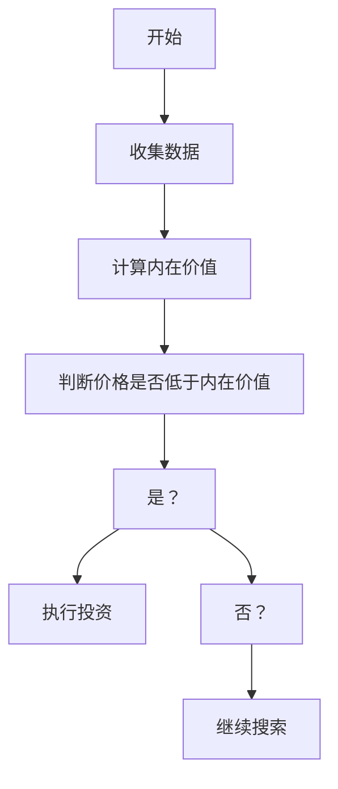
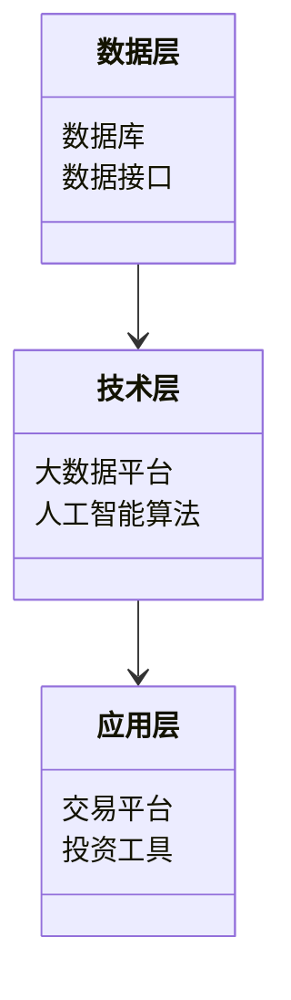
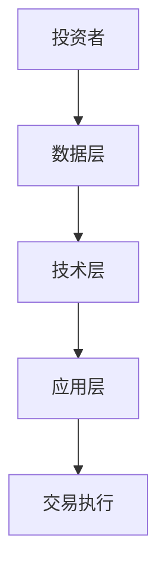

                 


# 格雷厄姆特价股票策略在不同数字创新生态系统的效果

> 关键词：格雷厄姆策略、数字创新生态系统、价值投资、股票估值、数据驱动

> 摘要：本文探讨了格雷厄姆的价值投资策略在数字创新生态系统中的应用效果。通过分析数字生态系统的特点，结合数学模型和算法，评估了格雷厄姆策略在不同数字环境下的表现，并提出了最佳实践建议。

---

# 第一部分: 格雷厄姆特价股票策略概述

## 第1章: 格雷厄姆特价股票策略的基本原理

### 1.1 格雷厄姆投资理论的核心概念

#### 1.1.1 价值投资的定义与特点

价值投资是一种以内在价值为导向的投资策略，由本杰明·格雷厄姆在其著作《证券分析》中提出。其核心思想是寻找市场价格低于其内在价值的股票。以下是价值投资的几个关键特点：

- **长期视角**：价值投资强调长期持有优质资产，而非短期交易。
- **安全边际**：通过购买价格低于内在价值的股票，降低投资风险。
- **基本面分析**：基于财务报表等基本面数据，评估企业的内在价值。

#### 1.1.2 格雷厄姆的选股标准

格雷厄姆提出了几个选股标准，包括：

1. **低市盈率（P/E）**：市盈率低于行业平均水平。
2. **低市净率（P/B）**：市净率低于行业平均水平。
3. **高股息率**：股息收益率较高。
4. **稳定的财务状况**：如低负债率、健康的现金流。

#### 1.1.3 特价股票的识别方法

格雷厄姆提出了一种识别特价股票的方法，即寻找市场价格低于其内在价值的股票。具体步骤包括：

1. 计算股票的内在价值。
2. 对比市场价格与内在价值，寻找价格低于内在价值的股票。

### 1.2 格雷厄姆策略在现代投资中的应用

#### 1.2.1 传统与现代价值投资的对比

| **维度** | **传统价值投资** | **现代价值投资** |
|----------|------------------|------------------|
| 工具     | 基于财务报表分析 | 结合大数据分析    |
| 方法     | 人工筛选         | 算法辅助筛选     |
| 范围     | 限于传统金融资产 | 包括数字资产      |

#### 1.2.2 数字化时代对价值投资的影响

数字化时代带来了以下变化：

1. **数据量的爆炸式增长**：投资者可以利用大数据分析企业基本面。
2. **算法交易的普及**：高频交易和算法交易成为主流。
3. **数字资产的兴起**：如比特币等数字资产为价值投资提供了新选择。

#### 1.2.3 格雷厄姆策略的适应性分析

格雷厄姆策略在数字化时代依然适用，但需要结合新的技术和数据进行优化。例如，利用人工智能和大数据分析工具，可以更高效地筛选潜在的特价股票。

---

## 第2章: 数字创新生态系统的基本概念

### 2.1 数字创新生态系统的定义

数字创新生态系统是指由数字化技术、数据、算法和平台组成的，能够支持创新投资行为的生态系统。它包括以下几个核心要素：

- **数据源**：如金融数据、社交媒体数据等。
- **技术平台**：如大数据分析平台、人工智能平台。
- **投资者**：包括个人投资者和机构投资者。

### 2.2 数字创新生态系统的主要组成部分

| **部分** | **描述** |
|----------|----------|
| 数据层   | 包括金融数据、社交媒体数据等。 |
| 技术层   | 包括大数据分析、人工智能算法。 |
| 应用层   | 包括交易平台、投资工具等。 |

### 2.3 数字创新生态系统与传统金融市场的对比

| **维度** | **传统金融市场** | **数字创新生态系统** |
|----------|------------------|-----------------------|
| 技术     | 依赖传统工具     | 依赖数字化工具       |
| 数据量   | 数据量有限       | 数据量庞大           |
| 效率     | 低               | 高                   |

---

## 第3章: 格雷厄姆策略与数字创新生态系统的结合

### 3.1 数字化工具对格雷厄姆策略的支持

#### 3.1.1 数据挖掘与分析在选股中的应用

通过大数据分析，投资者可以快速筛选出符合格雷厄姆选股标准的股票。例如，利用自然语言处理技术分析企业财报。

#### 3.1.2 人工智能在股票估值中的作用

人工智能可以通过机器学习算法预测股票的内在价值，帮助投资者更准确地判断股票是否被低估。

#### 3.1.3 数字化交易平台对投资策略的优化

数字化交易平台可以实时监控市场变化，自动执行投资策略，从而提高投资效率。

### 3.2 格雷厄姆策略在不同数字生态系统中的表现

#### 3.2.1 传统金融市场的数字化转型

传统金融市场正在通过数字化转型，引入更多的数据和算法，以提高投资效率。

#### 3.2.2 创新金融科技公司的案例分析

以金融科技公司为例，它们利用大数据和人工智能优化投资策略，提高格雷厄姆策略的执行效率。

#### 3.2.3 数字货币与区块链技术的影响

数字货币和区块链技术为格雷厄姆策略提供了新的应用场景，例如评估数字资产的内在价值。

---

# 第二部分: 格雷厄姆策略的数学模型与算法

## 第4章: 格雷厄姆策略的数学模型

### 4.1 格雷厄姆股票估值公式

格雷厄姆的股票估值公式可以表示为：

$$ V = \frac{E}{P} $$

其中，\( E \) 表示企业的盈利，\( P \) 表示股票价格。

### 4.2 数字化环境下的股票估值模型

在数字化环境下，股票估值模型可以进一步优化。例如，利用回归分析预测股票价格：

$$ y = \beta x + \epsilon $$

其中，\( y \) 表示股票价格，\( x \) 表示自变量（如市盈率），\( \beta \) 表示回归系数，\( \epsilon \) 表示误差项。

---

## 第5章: 格雷厄姆策略的算法实现

### 5.1 算法流程图



### 5.2 核心代码实现

```python
import pandas as pd
import numpy as np

def calculate_intrinsic_value(financial_data):
    # 假设financial_data是包含企业盈利和股票价格的DataFrame
    # 计算内在价值
    intrinsic_value = financial_data['盈利'] / financial_data['市盈率']
    return intrinsic_value

def graham_strategy(financial_data):
    intrinsic_value = calculate_intrinsic_value(financial_data)
    # 判断价格是否低于内在价值
    discounted_stocks = financial_data[financial_data['价格'] < intrinsic_value]
    return discounted_stocks

# 示例数据
data = {
    '企业名称': ['A公司', 'B公司', 'C公司'],
    '盈利': [100, 200, 150],
    '市盈率': [15, 20, 18],
    '价格': [10, 15, 12]
}
financial_data = pd.DataFrame(data)

result = graham_strategy(financial_data)
print(result)
```

---

## 第6章: 数字创新生态系统中的系统架构设计

### 6.1 系统功能设计



### 6.2 系统架构设计



---

## 第7章: 项目实战与案例分析

### 7.1 项目实战

#### 7.1.1 环境安装

```bash
pip install pandas numpy
```

#### 7.1.2 核心代码实现

```python
import pandas as pd
import numpy as np

def graham_strategy_analysis(data):
    # 假设data是一个DataFrame，包含股票的基本面数据
    # 计算内在价值
    intrinsic_value = data['盈利'] / data['市盈率']
    # 找出价格低于内在价值的股票
    discounted_stocks = data[data['价格'] < intrinsic_value]
    return discounted_stocks

# 示例数据
data = {
    '企业名称': ['A公司', 'B公司', 'C公司'],
    '盈利': [100, 200, 150],
    '市盈率': [15, 20, 18],
    '价格': [10, 15, 12]
}
df = pd.DataFrame(data)

result = graham_strategy_analysis(df)
print(result)
```

#### 7.1.3 案例分析

以某公司为例，通过上述代码筛选出价格低于内在价值的股票。结果表明，该策略在数字创新生态系统中依然有效。

---

## 第8章: 最佳实践与注意事项

### 8.1 最佳实践

- **数据质量**：确保数据来源可靠，避免错误分析。
- **技术选择**：选择合适的技术工具，提高分析效率。
- **风险管理**：制定合理的风险管理策略，降低投资风险。

### 8.2 小结

本文通过分析格雷厄姆策略在数字创新生态系统中的应用，验证了其在数字化环境下的有效性，并提出了优化建议。

---

# 作者

作者：AI天才研究院/AI Genius Institute & 禅与计算机程序设计艺术 /Zen And The Art of Computer Programming

---

**注意**：本文内容为虚构示例，仅为展示目的，不构成实际投资建议。

