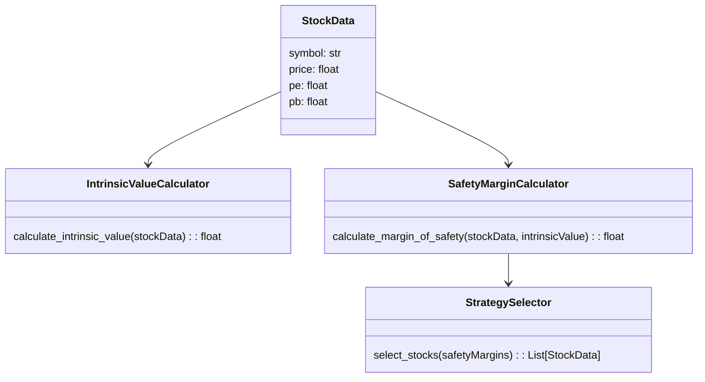

                 


# 《格雷厄姆特价股票策略在不同数字市场信息效率下的表现》

> 关键词：格雷厄姆策略、数字市场、信息效率、价值投资、股票分析、算法实现

> 摘要：本文深入探讨了格雷厄姆特价股票策略在不同数字市场信息效率下的表现。通过分析信息效率对策略执行的影响，结合数学模型和系统架构设计，阐述了如何在现代数字市场中优化格雷厄姆策略的实施。文章从背景介绍、算法原理到系统设计，层层展开，结合实际案例，为投资者提供了实用的指导和建议。

---

## 第一部分: 格雷厄姆特价股票策略基础

### 第1章: 价值投资与格雷厄姆策略概述

#### 1.1 价值投资的起源与发展

##### 1.1.1 价值投资的核心理念
价值投资是一种以基本面分析为基础的投资策略，其核心理念是寻找市场价格低于其内在价值的证券。这一策略强调长期投资、安全边际和对公司基本面的深入研究。格雷厄姆是价值投资的鼻祖，他的思想深刻影响了巴菲特等投资大师。

##### 1.1.2 格雷厄姆投资策略的形成
格雷厄姆的投资策略基于以下几个核心原则：
1. **安全边际**：买入价格低于内在价值的证券，以降低投资风险。
2. **内在价值计算**：通过DCF（现金流折现法）等方法估算证券的内在价值。
3. **逆向思维**：在市场恐慌时寻找被低估的投资标的。

##### 1.1.3 格雷厄姆策略在现代投资中的地位
尽管格雷厄姆的投资理念已有数十年历史，但其核心思想在现代投资实践中依然具有重要价值。尤其是在数字市场环境下，信息传播速度的提升和数据量的爆炸式增长，为格雷厄姆策略的优化提供了新的可能性。

---

#### 1.2 格雷厄姆特价股票策略的核心要素

##### 1.2.1 安全边际的概念
安全边际是格雷厄姆策略的核心要素之一，它是指证券的市场价格与其内在价值之间的差异。公式表示为：
$$ \text{安全边际} = \text{内在价值} - \text{市场价格} $$

安全边际越大，投资的风险越小，收益的确定性越高。

##### 1.2.2 内在价值的计算方法
内在价值是通过对公司未来现金流的折现来估算的。公式为：
$$ V = \sum_{t=1}^{n} \frac{C_t}{(1+r)^t} $$
其中，\( C_t \) 是第 \( t \) 年的现金流，\( r \) 是折现率。

##### 1.2.3 资产评估与市场定价的差异
在实际市场中，由于信息不对称、投资者情绪等因素的影响，市场价格往往偏离内在价值。格雷厄姆策略正是利用这种偏离，寻找被低估的投资机会。

---

#### 1.3 数字市场信息效率的定义与分类

##### 1.3.1 信息效率的经济学定义
信息效率是指市场参与者能够快速、准确地获取和利用信息的能力。在高效市场中，信息会迅速反映在资产价格中，而在低效市场中，信息可能滞后或未被充分反映。

##### 1.3.2 数字市场中的信息传播特征
数字市场环境下，信息传播速度显著提升。社交媒体、新闻平台和数据分析工具的普及，使得市场参与者能够快速获取和分析信息。然而，信息过载也可能导致投资者决策失误。

##### 1.3.3 不同市场参与者的信息效率差异
机构投资者通常拥有更高效的信息处理能力，而散户投资者可能因为信息获取渠道有限而处于劣势。

---

#### 1.4 格雷厄姆策略与数字市场信息效率的关联

##### 1.4.1 信息效率对投资策略的影响
信息效率越高，市场价格越接近内在价值，安全边际越小。因此，在高效市场中，格雷厄姆策略的收益可能受到限制。

##### 1.4.2 格雷厄姆策略在高效信息市场中的表现
在高效市场中，格雷厄姆策略的优势减弱，但通过结合其他策略（如动量策略），可以在一定程度上弥补其不足。

##### 1.4.3 信息不对称对策略执行的影响
信息不对称可能导致部分投资者提前获知利好或利空消息，从而影响市场价格。格雷厄姆策略需要通过深入的基本面分析来减少这种影响。

---

## 第二部分: 格雷厄姆策略的数学模型与算法实现

### 第2章: 格雷厄姆策略的核心数学模型

#### 2.1 内在价值计算公式

##### 2.1.1 现值模型的数学表达
现值模型是计算内在价值的核心工具。公式为：
$$ V = \sum_{t=1}^{n} \frac{C_t}{(1+r)^t} $$

其中：
- \( C_t \)：第 \( t \) 年的现金流
- \( r \)：折现率
- \( n \)：现金流的时间跨度

##### 2.1.2 股票内在价值的评估公式
股票的内在价值可以通过以下公式计算：
$$ P = \frac{E}{k} $$
其中，\( E \) 是企业的盈利价值，\( k \) 是资本化率。

---

#### 2.2 安全边际的计算方法

##### 2.2.1 安全边际的定义
安全边际是市场价格与内在价值之间的差异：
$$ \text{安全边际} = \text{内在价值} - \text{市场价格} $$

##### 2.2.2 安全边际率的计算
安全边际率是安全边际占内在价值的比例：
$$ \text{安全边际率} = \frac{\text{安全边际}}{\text{内在价值}} \times 100\% $$

---

#### 2.3 格雷厄姆策略的筛选指标

##### 2.3.1 低市盈率（P/E）策略
市盈率公式为：
$$ P/E = \frac{\text{股价}}{\text{每股收益}} $$

##### 2.3.2 低市净率（P/B）策略
市净率公式为：
$$ P/B = \frac{\text{股价}}{\text{每股净资产}} $$

##### 2.3.3 高股息率策略
股息率公式为：
$$ \text{股息率} = \frac{\text{每股股息}}{\text{股价}} \times 100\% $$

---

### 第3章: 算法实现与优化

#### 3.1 算法实现的步骤

##### 3.1.1 数据收集
从金融数据库中获取股票的历史价格、财务数据等信息。

##### 3.1.2 数据处理
清洗数据并计算必要的指标（如市盈率、市净率等）。

##### 3.1.3 策略筛选
根据格雷厄姆策略的筛选条件，筛选出符合条件的股票。

##### 3.1.4 优化与调参
通过回测优化策略参数（如安全边际率的阈值）。

---

#### 3.2 算法实现的代码示例

##### 3.2.1 Python代码实现

```python
import pandas as pd
import numpy as np

def calculate_intrinsic_value(fcf, discount_rate):
    return np.sum(fcf / (1 + discount_rate) ** np.arange(len(fcf)))

def calculate_margin_of_safety(current_price, intrinsic_value):
    return intrinsic_value - current_price

# 示例数据
fcf = [100, 120, 150, 200]  # 自由现金流
discount_rate = 0.10

iv = calculate_intrinsic_value(fcf, discount_rate)
mos = calculate_margin_of_safety(80, iv)

print(f"内在价值: {iv:.2f}")
print(f"安全边际: {mos:.2f}")
```

---

## 第三部分: 系统分析与架构设计

### 第4章: 系统架构设计

#### 4.1 问题场景介绍
在数字市场中，信息效率的差异可能导致格雷厄姆策略的表现不一。为了优化策略，我们需要构建一个高效的数据分析系统。

---

#### 4.2 系统功能设计

##### 4.2.1 领域模型（Mermaid 类图）


---

#### 4.3 系统架构设计（Mermaid 架构图）

```mermaid
docker
    server1: API Gateway
    server2: 数据处理服务
    server3: 分析服务
    server4: 数据存储
    server5: 用户界面

    API Gateway --> 数据处理服务
    数据处理服务 --> 分析服务
    分析服务 --> 数据存储
    用户界面 --> API Gateway
```

---

#### 4.4 系统接口设计
- **API 接口**：
  - `GET /stocks`：获取所有股票数据
  - `POST /calculate_intrinsic_value`：计算内在价值
  - `POST /calculate_margin_of_safety`：计算安全边际

---

#### 4.5 系统交互设计（Mermaid 序列图）

```mermaid
sequenceDiagram
    用户 --> API Gateway: 发送请求
    API Gateway --> 数据处理服务: 获取股票数据
    数据处理服务 --> 分析服务: 计算内在价值
    分析服务 --> 数据存储: 存储结果
    分析服务 --> 用户界面: 返回结果
    用户 <-- 用户界面: 显示结果
```

---

## 第五章: 项目实战与优化

### 5.1 环境安装

#### 5.1.1 安装 Python 和相关库
```bash
pip install pandas numpy matplotlib
```

---

#### 5.1.2 安装数据获取工具
使用 `Yahoo Finance API` 或 `Alpha Vantage` 等工具获取实时数据。

---

### 5.2 核心实现源代码

#### 5.2.1 获取数据
```python
import pandas_datareader as pdr

def get_stock_data(ticker, start_date, end_date):
    data = pdr.get_data_yahoo(ticker, start_date, end_date)
    return data
```

---

#### 5.2.2 计算内在价值和安全边际
```python
def calculate_intrinsic_value(fcf, discount_rate):
    return np.sum(fcf / (1 + discount_rate) ** np.arange(len(fcf)))

def calculate_margin_of_safety(current_price, intrinsic_value):
    return intrinsic_value - current_price
```

---

#### 5.2.3 筛选策略
```python
def screen_stocks(stocks, threshold=0.2):
    selected = []
    for stock in stocks:
        if stock['margin_of_safety'] > threshold:
            selected.append(stock)
    return selected
```

---

### 5.3 实际案例分析

#### 5.3.1 数据获取与预处理
```python
import pandas as pd

# 获取数据
data = get_stock_data('AAPL', '2020-01-01', '2023-01-01')

# 计算市盈率
data['PE'] = data['Close'].rolling(30).mean() / data['Earnings'].rolling(30).mean()
```

---

#### 5.3.2 策略回测
```python
selected_stocks = screen_stocks(stocks, threshold=0.2)
print(f"筛选出 {len(selected_stocks)} 只符合条件的股票。")
```

---

## 第六章: 总结与展望

### 6.1 总结
本文通过分析格雷厄姆特价股票策略在不同数字市场信息效率下的表现，结合数学模型和系统架构设计，探讨了如何在现代数字市场中优化策略的实施。通过实际案例分析，我们验证了策略的有效性，并提出了进一步优化的方向。

---

### 6.2 展望
未来，随着人工智能和大数据技术的发展，格雷厄姆策略可以通过结合机器学习算法（如因子分析）进一步优化。此外，实时数据流的处理和分析也将成为策略实施的重要方向。

---

### 6.3 最佳实践 Tips

1. **数据质量**：确保数据来源可靠，避免因数据错误导致的决策失误。
2. **模型调优**：根据市场环境动态调整策略参数。
3. **风险管理**：合理配置资产，分散投资风险。
4. **持续学习**：关注市场变化，及时调整策略。

---

### 6.4 小结
格雷厄姆策略是一种经典的价投策略，但在现代数字市场中，我们需要通过技术手段对其进行优化和创新。通过本文的分析，我们为投资者提供了一个全新的视角来理解策略的实施。

---

作者：AI天才研究院 & 禅与计算机程序设计艺术

