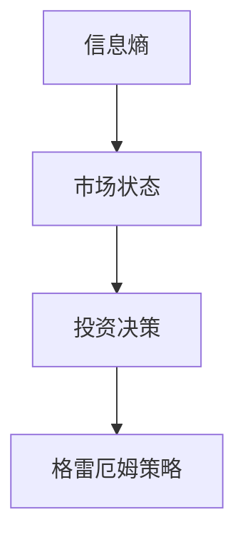
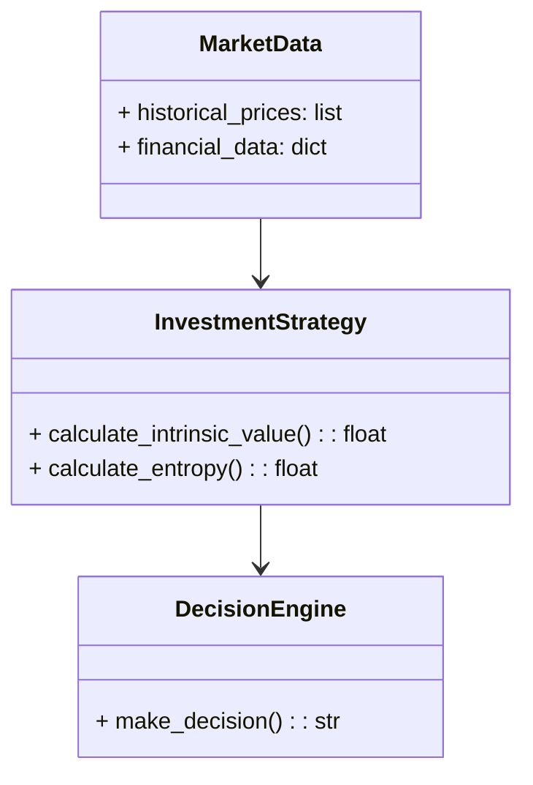
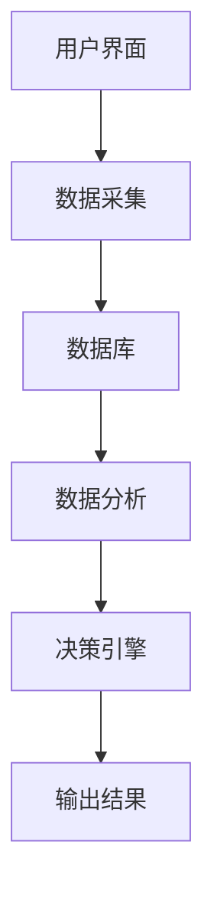
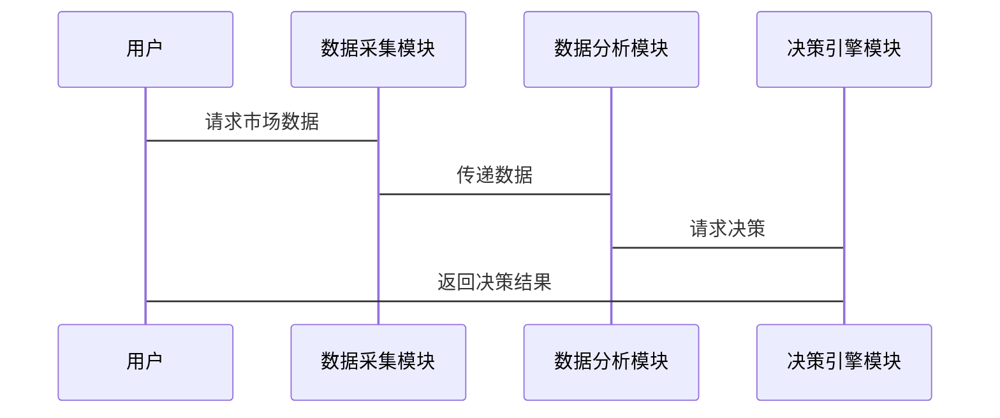

                 


# 格雷厄姆特价股票策略在不同数字市场信息熵水平下的表现

> 关键词：格雷厄姆策略，信息熵，数字市场，投资决策，价值投资

> 摘要：本文探讨了格雷厄姆特价股票策略在不同数字市场信息熵水平下的表现。通过分析信息熵在数字市场中的应用，结合格雷厄姆价值投资理论，提出了一种基于信息熵优化的投资策略。文章详细阐述了信息熵的计算方法，分析了其在投资决策中的作用，并通过实际案例验证了该策略的有效性。

---

## 第一部分：格雷厄姆特价股票策略与信息熵的背景介绍

### 第1章：格雷厄姆特价股票策略概述

#### 1.1 格雷厄姆投资理论的核心思想

##### 1.1.1 价值投资的基本原则
格雷厄姆的价值投资理论强调以低于内在价值的价格购买优质股票，长期持有，等待市场重新评估其价值。这种策略的核心在于寻找被市场低估的投资标的。

##### 1.1.2 格雷厄姆策略的适用场景
格雷厄姆策略适用于市场波动较大、投资者情绪化较强的市场环境。在这些情况下，市场往往会出现非理性定价，为价值投资者提供了套利机会。

##### 1.1.3 格雷厄姆策略的核心要素
格雷厄姆策略的核心要素包括：
1. **安全边际**：买入价格低于内在价值的部分，以降低风险。
2. **低市盈率**：选择市盈率低于市场平均水平的股票。
3. **企业基本面**：关注企业的盈利能力、财务状况和行业地位。

#### 1.2 信息熵在数字市场中的应用

##### 1.2.1 数字市场的不确定性分析
数字市场具有高度的不确定性和波动性，信息熵可以量化这种不确定性。通过分析市场数据的熵值，投资者可以更好地理解市场的复杂性。

##### 1.2.2 信息熵的度量方法
信息熵的计算公式为：
$$H = -\sum_{i=1}^{n} p_i \log p_i$$
其中，\( p_i \) 是事件 \( i \) 的概率。

##### 1.2.3 信息熵与市场预测
信息熵可以用于评估市场的可预测性。熵值越低，市场越可预测；熵值越高，市场越不确定。

---

### 第2章：信息熵与数字市场的基本概念

#### 2.1 信息熵的定义与数学公式

##### 2.1.1 信息熵的定义
信息熵是信息论中的一个基本概念，用于度量随机变量的不确定性。在数字市场中，信息熵可以用来衡量市场的复杂性和不确定性。

##### 2.1.2 信息熵的数学公式
$$H(X) = -\sum_{i=1}^{n} P(x_i) \log P(x_i)$$
其中，\( X \) 是随机变量，\( P(x_i) \) 是事件 \( x_i \) 的概率。

##### 2.1.3 信息熵的性质与特点
- 信息熵是概率分布的函数。
- 信息熵越大，不确定性越高。
- 信息熵可以用于量化数据的混乱程度。

#### 2.2 信息熵在数字市场中的应用

##### 2.2.1 数字市场的不确定性分析
数字市场的信息熵可以通过分析历史价格数据来计算。熵值高的市场通常波动较大，不确定性更强。

##### 2.2.2 信息熵与投资决策
信息熵可以帮助投资者评估市场的风险和不确定性。在信息熵较高的市场中，传统的技术分析和基本面分析可能效果不佳，而价值投资策略可能更具优势。

##### 2.2.3 信息熵与市场周期
信息熵可以用于分析市场周期。在市场顶部或底部，熵值通常较高，而在市场稳定期，熵值较低。

---

## 第二部分：格雷厄姆策略与信息熵的核心概念与联系

### 第3章：格雷厄姆策略与信息熵的关系

#### 3.1 格雷厄姆策略的核心原理

##### 3.1.1 价值投资的数学模型
格雷厄姆的价值投资模型基于对企业内在价值的评估。内在价值可以通过对企业未来现金流的折现来计算：
$$V = \sum_{t=1}^{n} \frac{CF_t}{(1+r)^t}$$
其中，\( CF_t \) 是第 \( t \) 年的现金流，\( r \) 是折现率。

##### 3.1.2 格雷厄姆策略的决策逻辑
格雷厄姆策略的核心逻辑是寻找市场价格低于内在价值的股票。这种策略依赖于对企业基本面的深入分析。

##### 3.1.3 格雷厄姆策略的优化方向
信息熵可以用于优化格雷厄姆策略。通过分析市场的不确定性，投资者可以更好地选择买入和卖出的时机。

#### 3.2 信息熵在投资决策中的作用

##### 3.2.1 信息熵在市场预测中的应用
信息熵可以用于预测市场的未来走势。通过分析当前市场的熵值，投资者可以预测市场的波动性和不确定性。

##### 3.2.2 信息熵与投资风险
信息熵越高，市场的不确定性越大，投资风险越高。因此，投资者可以通过控制信息熵来降低投资风险。

##### 3.2.3 信息熵在投资组合优化中的作用
信息熵可以用于优化投资组合。通过分析不同资产之间的信息熵，投资者可以构建风险更低、收益更高的投资组合。

### 第4章：核心概念的对比与联系

#### 4.1 核心概念的属性特征对比

| 核心概念 | 格雷厄姆策略 | 信息熵 |
|----------|--------------|--------|
| 定义     | 价值投资策略 | 信息论概念 |
| 应用场景 | 股票投资     | 数字市场 |
| 目标     | 寻找低估股票 | 度量不确定性 |

#### 4.2 ER实体关系图


---

## 第三部分：格雷厄姆策略与信息熵的算法原理

### 第5章：信息熵的计算与应用

#### 5.1 信息熵的计算方法

##### 5.1.1 基于概率分布的熵计算
假设我们有 \( n \) 个可能的事件，每个事件的概率为 \( p_i \)，则熵为：
$$H = -\sum_{i=1}^{n} p_i \log p_i$$

##### 5.1.2 基于数据样本的熵估计
通过历史数据估计概率分布，进而计算熵值。例如，使用频率作为概率估计：
$$\hat{p}_i = \frac{\text{事件 } i \text{ 的发生次数}}{\text{总样本数}}$$

##### 5.1.3 基于信息论的熵应用
信息熵可以用于数据压缩、模式识别等领域。在投资中，信息熵可以用于量化市场的复杂性。

#### 5.2 格雷厄姆策略的算法实现

##### 5.2.1 算法实现步骤
1. 数据收集：收集股票的历史价格、财务数据等。
2. 内在价值计算：使用格雷厄姆模型计算股票的内在价值。
3. 信息熵计算：分析市场数据，计算信息熵值。
4. 投资决策：根据信息熵值和内在价值，决定是否买入或卖出股票。

##### 5.2.2 核心代码实现
```python
import numpy as np
import pandas as pd

def calculate_entropy(data):
    # 计算概率分布
    probabilities = pd.value_counts(data) / len(data)
    # 计算熵
    entropy = -np.sum(probabilities * np.log2(probabilities))
    return entropy

# 示例数据
data = [1, 2, 2, 3, 3, 3, 4, 4, 4, 4]
entropy = calculate_entropy(data)
print(f"信息熵值为：{entropy}")
```

##### 5.2.3 算法原理的数学模型
格雷厄姆策略的数学模型可以表示为：
$$\text{买入价格} \leq \text{内在价值}$$
$$\text{内在价值} = \sum_{t=1}^{n} \frac{CF_t}{(1+r)^t}$$

---

## 第四部分：系统分析与架构设计方案

### 第6章：系统架构设计

#### 6.1 问题场景介绍
本文提出了一种基于信息熵优化的格雷厄姆策略，旨在提高投资决策的准确性和效率。

#### 6.2 系统功能设计

##### 6.2.1 领域模型类图


#### 6.3 系统架构设计

##### 6.3.1 系统架构图


#### 6.4 接口设计
- 数据采集接口：用于获取市场数据。
- 数据分析接口：用于计算信息熵和内在价值。
- 决策引擎接口：用于生成投资决策。

#### 6.5 系统交互流程图


---

## 第五部分：项目实战

### 第7章：项目实战与案例分析

#### 7.1 环境安装

##### 7.1.1 安装Python
```bash
python --version
pip install numpy pandas
```

##### 7.1.2 安装其他依赖
```bash
pip install matplotlib seaborn
```

#### 7.2 核心代码实现

##### 7.2.1 信息熵计算
```python
import numpy as np
import pandas as pd

def calculate_entropy(data):
    probabilities = pd.value_counts(data) / len(data)
    entropy = -np.sum(probabilities * np.log2(probabilities))
    return entropy

# 示例数据
data = [1, 2, 2, 3, 3, 3, 4, 4, 4, 4]
entropy = calculate_entropy(data)
print(f"信息熵值为：{entropy}")
```

##### 7.2.2 格雷厄姆策略实现
```python
import pandas as pd
import numpy as np

def calculate_intrinsic_value(stock_data, discount_rate):
    # 假设 stock_data 是包含现金流的 DataFrame
    # 计算内在价值
    intrinsic_value = 0
    for t in range(len(stock_data)):
        cf = stock_data.iloc[t]
        intrinsic_value += cf / (1 + discount_rate) ** t
    return intrinsic_value

# 示例数据
cf_data = pd.DataFrame({'CF_t': [100, 100, 100, 100, 100]}, index=[1,2,3,4,5])
discount_rate = 0.1
iv = calculate_intrinsic_value(cf_data, discount_rate)
print(f"内在价值为：{iv}")
```

#### 7.3 案例分析

##### 7.3.1 数据收集
假设我们收集了某只股票过去5年的现金流数据和市场数据。

##### 7.3.2 信息熵计算
计算市场的信息熵值，判断市场的不确定性。

##### 7.3.3 格雷厄姆策略评估
根据内在价值和市场价格，判断是否买入或卖出股票。

##### 7.3.4 结果分析
通过对比信息熵值和策略表现，验证格雷厄姆策略的有效性。

---

## 第六部分：最佳实践与小结

### 第8章：最佳实践与注意事项

#### 8.1 最佳实践
- 定期更新市场数据，确保模型的准确性。
- 根据市场环境调整策略参数。
- 组合使用多种投资策略，降低风险。

#### 8.2 注意事项
- 信息熵仅能度量市场的不确定性，不能完全预测市场走势。
- 格雷厄姆策略适用于长期投资，短期波动可能影响策略效果。
- 数据质量和模型假设对结果影响较大，需谨慎处理。

#### 8.3 拓展阅读
建议阅读以下书籍和论文：
- 格雷厄姆的《证券分析》
- 信息论经典教材《Elements of Information Theory》

---

## 作者：AI天才研究院/AI Genius Institute & 禅与计算机程序设计艺术 /Zen And The Art of Computer Programming

