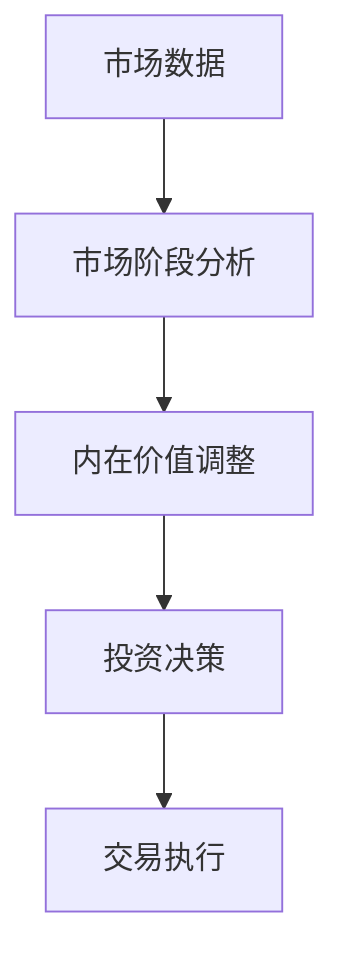
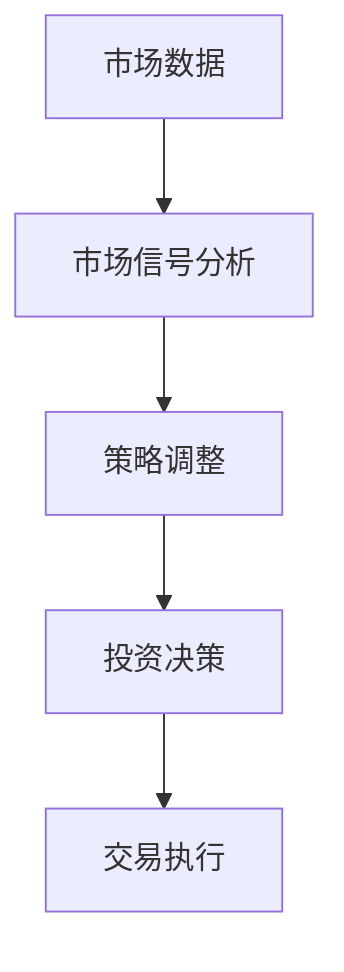

                 


# 第3章：策略在数字市场的适用性

## 3.1 格雷厄姆策略的适应性分析

### 背景介绍

格雷厄姆的价值投资策略最初是在传统金融市场中发展起来的，强调购买被低估的股票并长期持有。然而，数字市场的兴起带来了显著的变化，包括高频交易、算法交易和电子交易平台的普及。这些变化使得传统的投资策略在数字市场中面临新的挑战和机遇。

### 核心概念与联系

格雷厄姆策略的核心在于寻找市场价格与内在价值的偏离，通过分析公司的基本面来识别低估的股票。然而，在数字市场中，价格波动更加频繁，信息传播速度更快，市场的参与者也更加多样化。这些变化使得格雷厄姆策略需要进行调整以适应新的环境。

#### 数学模型

格雷厄姆的策略可以表示为寻找市场价格（P）低于其内在价值（V）的股票，即：

$$
P < V
$$

在数字市场中，内在价值的计算可能需要考虑更多的动态因素，如市场情绪和交易量的变化。因此，内在价值的计算公式可能需要调整：

$$
V' = V + \beta \times (\text{市场情绪} + \text{交易量变化})
$$

其中，$\beta$ 是一个调整系数，用于量化市场情绪和交易量变化对内在价值的影响。

### 实际案例分析

假设在传统市场中，一只股票的内在价值为50美元，市场价格为45美元，根据格雷厄姆策略，这是一只被低估的股票。然而，在数字市场中，同样的股票可能因为市场情绪的波动，内在价值需要动态调整。例如，当市场情绪指数上升10%，交易量增加20%，内在价值的调整系数 $\beta$ 为0.15，则新的内在价值为：

$$
V' = 50 + 0.15 \times (10 + 20) = 50 + 0.15 \times 30 = 50 + 4.5 = 54.5
$$

此时，市场价格为48美元，虽然仍然低于新的内在价值，但接近度有所下降，可能需要重新评估该股票的投资价值。

## 3.2 动态调整的必要性

### 背景介绍

数字市场的波动性和变化性要求投资者不断调整其投资策略。市场周期的变化、竞争环境的加剧以及技术的进步都可能影响策略的有效性。

### 核心概念与联系

#### 数学模型

格雷厄姆策略的动态调整可以基于市场周期的变化进行。假设市场周期分为上升、稳定和下降三个阶段，内在价值的计算需要根据市场阶段进行调整。例如：

$$
V' = V + \alpha \times (\text{市场阶段} - 1)
$$

其中，$\alpha$ 是一个调整系数，取值范围在0到1之间。

在上升市场阶段，$\alpha = 0.2$，则：

$$
V' = V + 0.2 \times (3 - 1) = V + 0.4
$$

在稳定市场阶段，$\alpha = 0.1$，则：

$$
V' = V + 0.1 \times (2 - 1) = V + 0.1
$$

在下降市场阶段，$\alpha = 0.05$，则：

$$
V' = V + 0.05 \times (1 - 1) = V
$$

这种调整方法使得内在价值的计算更加动态，适应市场周期的变化。

### 系统分析与架构设计方案

为了实现策略的动态调整，需要构建一个实时监控和调整系统。系统将收集市场数据，分析市场阶段，并调整内在价值的计算公式。

系统架构图：



系统功能模块：

1. **市场数据收集**：实时收集股票价格、交易量、市场情绪等数据。
2. **市场阶段分析**：通过算法分析当前市场所处的阶段（上升、稳定、下降）。
3. **内在价值调整**：根据市场阶段调整内在价值的计算公式。
4. **投资决策**：基于调整后的内在价值，决定是否买入、持有或卖出股票。
5. **交易执行**：根据决策执行交易，并监控交易结果。

### 项目实战

#### 环境安装

需要安装Python和相关的库，如Pandas、NumPy、Scikit-learn等。

#### 核心实现代码

```python
import pandas as pd
import numpy as np

def calculate_intrinsic_value(value, market_phase):
    alpha = 0.2 if market_phase == '上升' else (0.1 if market_phase == '稳定' else 0.05)
    return value + alpha * (market_phase_order - 1)

market_phase_order = {'上升': 3, '稳定': 2, '下降': 1}

# 示例数据
value = 50
market_phase = '上升'

adjusted_value = calculate_intrinsic_value(value, market_phase)
print(f"调整后的内在价值：{adjusted_value}")
```

#### 代码解读

1. **calculate_intrinsic_value函数**：根据市场阶段调整内在价值的计算。
2. **market_phase_order字典**：定义市场阶段的顺序。
3. **示例数据**：假设市场处于上升阶段，计算调整后的内在价值。

#### 案例分析

假设一只股票的内在价值为50美元，市场处于上升阶段：

$$
V' = 50 + 0.2 \times (3 - 1) = 50 + 0.4 = 50.4
$$

如果市场价格为48美元，根据调整后的内在价值，该股票仍然被低估，可以考虑买入。

## 3.3 动态调整的具体方法

### 背景介绍

为了使格雷厄姆策略在数字市场中有效，需要采用动态调整的方法。这包括定期评估策略的有效性，根据市场信号调整投资组合，并结合技术分析进行综合判断。

### 核心概念与联系

#### 数学模型

动态调整的方法可以表示为：

$$
P_{\text{调整}} = P_{\text{当前}} + \gamma \times (P_{\text{目标}} - P_{\text{当前}})
$$

其中，$\gamma$ 是调整系数，介于0和1之间。

### 系统分析与架构设计方案

系统需要具备数据收集、信号分析和策略执行的功能。系统架构图：



系统功能模块：

1. **市场数据收集**：实时收集市场数据。
2. **市场信号分析**：分析市场信号，如价格波动、成交量变化等。
3. **策略调整**：根据市场信号调整投资策略。
4. **投资决策**：基于调整后的策略做出投资决策。
5. **交易执行**：根据决策执行交易。

### 项目实战

#### 环境安装

安装必要的Python库，如Pandas、Matplotlib等。

#### 核心实现代码

```python
def adjust_strategy(current_price, target_price, gamma=0.1):
    adjusted_price = current_price + gamma * (target_price - current_price)
    return adjusted_price

current_price = 48
target_price = 50
gamma = 0.15

adjusted_price = adjust_strategy(current_price, target_price, gamma)
print(f"调整后的价格：{adjusted_price}")
```

#### 代码解读

1. **adjust_strategy函数**：根据当前价格和目标价格，使用调整系数 $\gamma$ 进行策略调整。
2. **示例数据**：当前价格48美元，目标价格50美元，调整系数0.15。
3. **结果**：调整后的价格为48 + 0.15*(50-48) = 48 + 0.15*2 = 48.30美元。

#### 案例分析

假设目标价格为50美元，当前价格为48美元，调整系数为0.15：

$$
P_{\text{调整}} = 48 + 0.15 \times (50 - 48) = 48 + 0.3 = 48.3
$$

这意味着，经过调整后，目标价格变为48.3美元，策略将根据这一调整后的目标价格进行优化。

## 小结

在数字市场中，格雷厄姆特价股票策略需要进行动态调整以适应市场的变化。通过分析市场周期、市场信号和竞争环境，投资者可以优化内在价值的计算，调整投资策略，并结合技术分析做出更明智的投资决策。动态调整不仅提高了策略的有效性，还增强了投资组合的抗风险能力。

