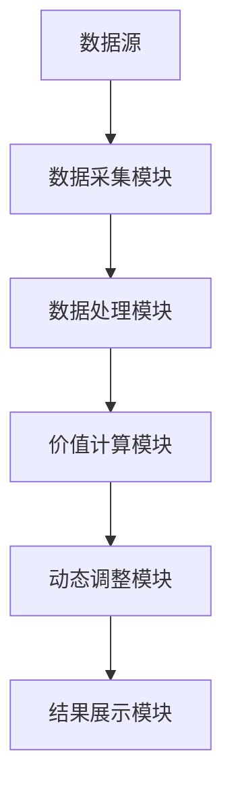
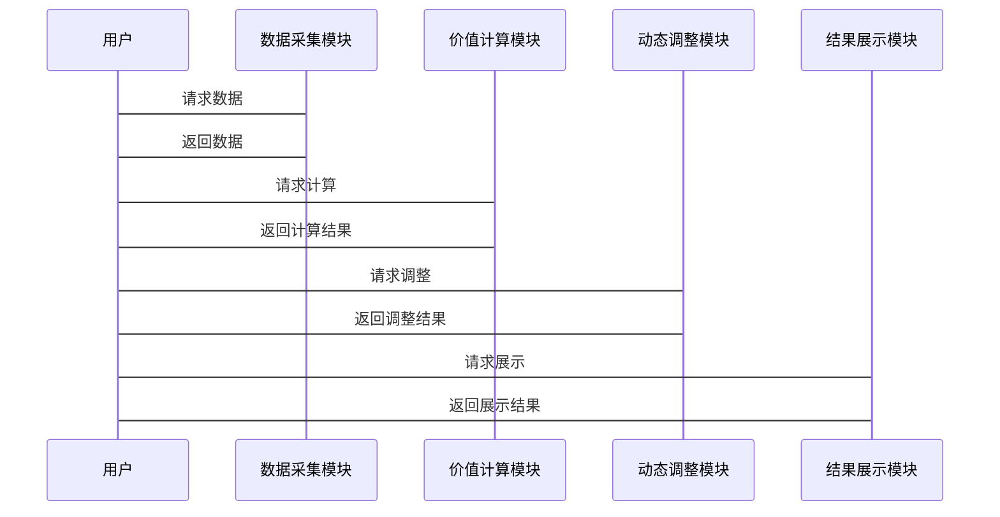

                 


# 格雷厄姆特价股票策略在不同数字市场微观结构演化中的动态调整

> 关键词：格雷厄姆投资策略，数字市场，微观结构，动态调整，价值评估，算法优化

> 摘要：本文系统地探讨了格雷厄姆特价股票策略在数字市场中的应用，结合微观结构的动态演化，提出了一种动态调整策略。通过数学模型和算法实现，本文展示了如何在复杂多变的数字市场中优化投资决策，为投资者提供了理论和实践的双重指导。

---

## 第一部分: 格雷厄姆特价股票策略概述

### 第1章: 格雷厄姆特价股票策略的核心概念

#### 1.1 价值投资的基本原理
##### 1.1.1 价值投资的定义与核心理念
价值投资是一种以低于内在价值的价格买入优质股票的投资策略。其核心理念是寻找市场中被低估的资产，通过长期持有实现收益。格雷厄姆作为价值投资的鼻祖，提出了“安全边际”的概念，即以低于清算价值的价格买入股票，以确保投资的安全性。

##### 1.1.2 格雷厄姆投资策略的演变
格雷厄姆的投资策略经历了从简单筛选到复杂模型的演变。早期策略基于市盈率、市净率等简单估值指标，后期则引入了更为复杂的财务指标和概率模型，以适应市场的变化。

##### 1.1.3 特价股票的定义与特征
特价股票是指市场价格低于其内在价值的股票。其特征包括低市盈率、低市净率、高股息率等。这些特征为投资者提供了识别潜在投资机会的依据。

#### 1.2 数字市场与微观结构
##### 1.2.1 数字市场的基本特征
数字市场是指通过电子交易平台进行股票买卖的市场。其特征包括高频交易、算法交易、信息传播速度快等。数字市场的出现使得交易更加高效，但也带来了新的挑战。

##### 1.2.2 微观结构的定义与分类
微观结构是指市场中的交易机制、参与者行为以及价格形成过程。它可以分为订单簿、流动性、市场深度等几个方面。数字市场的微观结构复杂多样，影响着投资者的决策。

##### 1.2.3 数字市场中的价格发现机制
价格发现机制是指市场中买卖双方通过订单匹配确定资产价格的过程。在数字市场中，高频交易和算法交易使得价格发现更加迅速，但也可能导致价格波动加剧。

---

### 第2章: 格雷厄姆策略在数字市场的应用

#### 2.1 数字市场中的价值评估
##### 2.1.1 格雷厄姆估值模型的数学公式
格雷厄姆的估值模型可以通过以下公式表示：
$$ V = \frac{E + 4.5D}{(1 + r)^n} $$
其中，$E$ 是企业的盈利，$D$ 是债务，$r$ 是折现率，$n$ 是折现年数。

##### 2.1.2 数字市场中的市盈率与市净率分析
市盈率（P/E）和市净率（P/B）是常用的估值指标。在数字市场中，这些指标可以帮助投资者识别被低估的股票。

##### 2.1.3 价值陷阱的识别与避免
价值陷阱是指市场价格看似低估，但实际公司质地不佳的情况。投资者需要通过深入分析公司的财务状况和行业地位来避免价值陷阱。

#### 2.2 微观结构对策略的影响
##### 2.2.1 微观结构对股价波动的影响
微观结构中的订单簿深度和流动性直接影响股价的波动。在数字市场中，高频交易可能导致短期价格大幅波动。

##### 2.2.2 数字市场中的流动性风险
流动性风险是指在市场中难以以合理价格买卖资产的风险。在数字市场中，某些股票可能因为流动性不足而难以估值。

##### 2.2.3 市场参与者行为对策略的挑战
市场参与者的异质性行为（如机构投资者和散户投资者的行为差异）会影响价格发现过程，进而影响格雷厄姆策略的实施效果。

---

### 第3章: 动态调整策略的数学模型

#### 3.1 动态调整的原理
##### 3.1.1 动态调整的核心思想
动态调整是指根据市场环境的变化，实时调整投资策略。其核心思想是通过实时监控市场微观结构的变化，动态调整股票的估值模型和投资组合。

##### 3.1.2 数学模型的构建与优化
动态调整模型可以通过以下公式表示：
$$ V(t) = V(t-1) \times (1 + \alpha \times \Delta S) $$
其中，$\alpha$ 是调整系数，$\Delta S$ 是市场状态的变化。

##### 3.1.3 动态调整的算法流程
动态调整的算法流程如下：
1. 数据采集：实时采集股票价格、订单簿数据等。
2. 模型计算：根据当前数据计算股票的内在价值。
3. 战略调整：根据价值与市场价格的差异调整投资组合。
4. 反馈机制：根据市场反馈优化模型参数。

#### 3.2 数学模型的详细推导
##### 3.2.1 格雷厄姆策略的数学表达
格雷厄姆策略的数学表达如下：
$$ V = \frac{E}{P/E} $$
其中，$E$ 是企业盈利，$P/E$ 是市盈率。

##### 3.2.2 动态调整的公式推导
动态调整的公式推导如下：
$$ V(t) = V(t-1) \times (1 + \alpha \times \Delta S) $$
其中，$\Delta S$ 是市场状态的变化，$\alpha$ 是调整系数。

##### 3.2.3 案例分析与公式应用
假设某股票的市盈率为15，企业盈利为100万元，其内在价值为：
$$ V = \frac{100}{15} = 6.67 \text{元} $$

---

### 第4章: 算法实现与代码分析

#### 4.1 算法实现的步骤
##### 4.1.1 数据采集与预处理
数据采集包括股票价格、订单簿数据等。预处理步骤包括数据清洗和特征提取。

##### 4.1.2 算法核心代码实现
以下是Python实现的代码：
```python
import pandas as pd
import numpy as np

# 数据采集
data = pd.read_csv('stock_data.csv')

# 模型计算
def calculate_value(data):
    E = data['profit']
    P_E = data['pe']
    V = E / P_E
    return V

# 动态调整
def dynamic_adjustment(V, alpha, delta_S):
    V_new = V * (1 + alpha * delta_S)
    return V_new

# 算法实现
V = calculate_value(data)
V_adjusted = dynamic_adjustment(V, 0.1, 0.05)
```

##### 4.1.3 代码的功能解读
上述代码实现了数据采集、价值计算和动态调整的功能。`calculate_value`函数计算股票的内在价值，`dynamic_adjustment`函数根据市场状态调整价值。

#### 4.2 算法优化与性能分析
##### 4.2.1 算法优化的策略
可以通过引入更多的特征（如市净率、股息率）来优化算法。

##### 4.2.2 性能分析与改进
通过增加特征和优化模型参数，可以提高算法的准确性。

##### 4.2.3 算法的适用场景与限制
算法适用于数字市场中的高频交易，但需要实时数据和高效的计算能力。

---

### 第5章: 系统架构与设计

#### 5.1 系统架构设计
##### 5.1.1 系统功能模块划分
系统功能模块包括数据采集、价值计算、动态调整和结果展示。

##### 5.1.2 系统架构的Mermaid图


##### 5.1.3 系统接口设计
系统接口包括数据接口、计算接口和展示接口。

#### 5.2 系统交互流程
##### 5.2.1 用户需求分析
用户需要实时监控股票价格和调整投资策略。

##### 5.2.2 系统交互的Mermaid序列图


##### 5.2.3 系统功能的实现流程
系统功能实现流程包括数据采集、计算、调整和展示。

---

### 第6章: 项目实战与案例分析

#### 6.1 项目实战环境搭建
##### 6.1.1 开发环境的安装与配置
需要安装Python、Pandas、NumPy等工具。

##### 6.1.2 数据源的选择与获取
可以从Yahoo Finance获取股票数据。

##### 6.1.3 工具链的安装与

---

### 第7章: 最佳实践与总结

#### 7.1 投资策略的优化
##### 7.1.1 选择合适的标的
在数字市场中，选择标的时需要考虑流动性、市场深度等因素。

##### 7.1.2 动态调整的频率
动态调整的频率可以根据市场波动性调整，高频交易需要更频繁的调整。

##### 7.1.3 风险管理
投资者需要通过分散投资和止损策略来管理风险。

#### 7.2 小结与展望
本文系统地探讨了格雷厄姆策略在数字市场中的应用，提出了动态调整策略。未来的研究可以进一步优化算法和扩展应用场景。

#### 7.3 注意事项
投资者在实际操作中需要注意市场风险和模型的局限性。

#### 7.4 拓展阅读
推荐阅读格雷厄姆的《聪明的投资者》和相关数字市场研究文献。

---

作者：AI天才研究院/AI Genius Institute & 禅与计算机程序设计艺术 /Zen And The Art of Computer Programming

