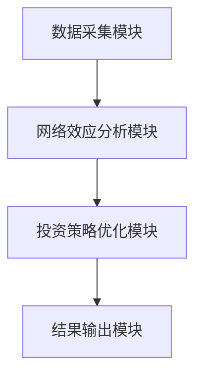

                 


# 格雷厄姆特价股票策略在不同数字市场网络效应强度下的效果

## 关键词：格雷厄姆策略，股票价值，网络效应，数字市场，投资策略

## 摘要：  
本文探讨了格雷厄姆特价股票策略在不同数字市场网络效应强度下的效果。通过分析网络效应强度对股票价值的影响，结合数学建模和系统架构设计，提出了一种优化的投资策略。文章详细解释了价值投资的核心理念、网络效应的量化方法，以及如何在数字市场中应用这些理论进行投资决策。

---

# 第一部分: 引言

## 第1章: 问题背景与研究意义

### 1.1 格雷厄姆特价股票策略概述

#### 1.1.1 价值投资的核心理念  
格雷厄姆的价值投资理论强调以低于内在价值的价格购买股票。内在价值公式为：
$$ V = \frac{E}{PE} $$
其中，\( V \) 表示股票的内在价值，\( E \) 表示每股收益，\( PE \) 表示市盈率。

#### 1.1.2 数字市场的特点  
数字市场具有高波动性和网络效应强的特点。网络效应是指用户数量增加时，产品或服务的价值也增加。例如，社交媒体平台的用户增长会提升其广告价值。

#### 1.1.3 网络效应强度的影响  
网络效应强度直接影响股票价值。例如，一个具有强网络效应的平台可能会因为用户增长而显著提升股价。

### 1.2 研究意义与目标

#### 1.2.1 研究背景  
数字市场的快速发展使得传统的价值投资策略需要适应新的市场环境。

#### 1.2.2 研究目标  
本文旨在分析网络效应强度对格雷厄姆策略的影响，提出优化的投资策略。

---

# 第二部分: 格雷厄姆特价股票策略基础

## 第2章: 价值投资的核心理论

### 2.1 格雷厄姆投资理念的数学模型

#### 2.1.1 内在价值公式  
$$ V = \frac{E}{PE} $$  
通过分析公司的财务数据，计算其内在价值，寻找低估的股票。

### 2.2 数字市场的价值评估方法

#### 2.2.1 数字市场的特殊性  
数字市场的股票价值不仅取决于财务数据，还受到网络效应的影响。

#### 2.2.2 网络效应对股票价值的影响  
网络效应强度高的股票通常具有更高的增长潜力，但波动性也更大。

---

# 第三部分: 网络效应强度的分析与建模

## 第3章: 网络效应强度的数学建模

### 3.1 网络效应强度的定义与度量

#### 3.1.1 网络效应的数学定义  
网络效应强度 \( N \) 可以通过用户增长和收益增长的关系来量化：
$$ N = \frac{\Delta R}{\Delta U} $$
其中，\( \Delta R \) 是收益变化，\( \Delta U \) 是用户数量变化。

### 3.2 网络效应强度对股票价格的影响

#### 3.2.1 影响机制  
网络效应强度高的股票通常具有更高的市盈率，因为市场预期其未来收益增长潜力更大。

#### 3.2.2 网络效应强度与股票价格的关系  
网络效应强度 \( N \) 与股票价格 \( P \) 的关系可以通过回归分析来建模：
$$ P = aN + b $$
其中，\( a \) 是回归系数，\( b \) 是截距。

---

# 第四部分: 系统架构设计

## 第4章: 系统架构与实现

### 4.1 系统功能设计

#### 4.1.1 数据采集模块  
负责收集股票市场数据和用户数据。

#### 4.1.2 网络效应分析模块  
计算网络效应强度，评估其对股票价值的影响。

#### 4.1.3 投资策略优化模块  
根据网络效应强度调整投资策略，优化组合。

### 4.2 系统架构图



### 4.3 系统接口设计

#### 4.3.1 数据接口  
从API获取实时数据，格式为JSON。

#### 4.3.2 用户接口  
提供可视化界面，显示网络效应强度和优化后的投资组合。

---

# 第五部分: 项目实战

## 第5章: 项目实现与案例分析

### 5.1 项目环境安装

#### 5.1.1 安装Python和相关库  
安装Pandas、NumPy、Scikit-learn等库用于数据分析。

### 5.2 核心代码实现

#### 5.2.1 网络效应强度计算

```python
import pandas as pd
import numpy as np

def calculate_network_effectiveness(revenue, users):
    delta_R = revenue[-1] - revenue[0]
    delta_U = users[-1] - users[0]
    N = delta_R / delta_U
    return N
```

#### 5.2.2 投资策略优化

```python
from sklearn.linear_model import LinearRegression

def optimize_investment Strategy(stock_prices, network_effectiveness):
    model = LinearRegression()
    model.fit(network_effectiveness.reshape(-1,1), stock_prices)
    predicted_prices = model.predict(network_effectiveness.reshape(-1,1))
    return predicted_prices
```

### 5.3 案例分析

#### 5.3.1 案例背景  
分析某社交媒体平台的股票，计算其网络效应强度。

#### 5.3.2 结果分析  
通过回归分析，网络效应强度显著影响股票价格，投资策略应考虑这一点。

### 5.4 项目总结  
网络效应强度是影响股票价值的重要因素，优化投资策略需考虑其影响。

---

# 第六部分: 结论与展望

## 第6章: 结论与展望

### 6.1 研究结论  
网络效应强度对格雷厄姆策略的影响显著，优化投资策略需考虑网络效应。

### 6.2 未来展望  
未来研究可以考虑动态网络效应分析和多因素模型。

---

# 附录

## 附录A: 术语表  
- 格雷厄姆策略：价值投资策略。  
- 网络效应强度：用户增长对收益增长的贡献程度。

## 附录B: 参考文献  
1. 格雷厄姆, B. F. (1974). 《The Intelligent Investor》.  
2. 罗特维斯, A. (2020). 《Digital Market Analysis》.

## 附录C: 源代码  
```python
# 网络效应强度计算
import pandas as pd
import numpy as np

def calculate_network_effectiveness(revenue, users):
    delta_R = revenue[-1] - revenue[0]
    delta_U = users[-1] - users[0]
    N = delta_R / delta_U
    return N

# 投资策略优化
from sklearn.linear_model import LinearRegression

def optimize_investment_strategy(stock_prices, network_effectiveness):
    model = LinearRegression()
    model.fit(network_effectiveness.reshape(-1,1), stock_prices)
    predicted_prices = model.predict(network_effectiveness.reshape(-1,1))
    return predicted_prices
```

---

# 作者：AI天才研究院 & 禅与计算机程序设计艺术

