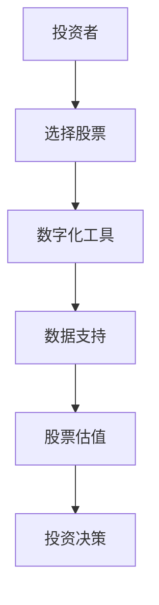

                 


# 格雷厄姆特价股票策略在不同数字监管科技生态中的表现

## 关键词：格雷厄姆策略，数字监管科技，股票估值，价值投资，监管科技

## 摘要

本文深入探讨了格雷厄姆特价股票策略在不同数字监管科技生态中的表现。通过分析监管科技与金融市场的结合，探讨了数字监管工具如何影响格雷厄姆策略的实施。文章详细阐述了监管科技的核心概念、算法原理、系统架构，并通过实际案例分析了策略在不同数字监管环境中的应用效果，为投资者和科技从业者提供了有价值的参考。

---

# 目录大纲

## 第一部分：格雷厄姆特价股票策略概述

### 第1章：格雷厄姆投资理论的背景与核心思想

#### 1.1 价值投资的起源与发展
- 1.1.1 价值投资的定义与历史
- 1.1.2 格雷厄姆投资策略的核心原则
- 1.1.3 特价股票的定义与特征

#### 1.2 数字监管科技生态的基本框架
- 1.2.1 监管科技的定义与分类
- 1.2.2 数字化监管生态的构成要素
- 1.2.3 数字监管科技与金融市场的互动关系

#### 1.3 格雷厄姆策略与数字监管科技的结合
- 1.3.1 特价股票策略在数字监管生态中的适用性
- 1.3.2 数字监管科技对股票估值的影响
- 1.3.3 数字化工具在策略实施中的作用

## 第二部分：格雷厄姆策略与数字监管科技的核心概念对比

### 第2章：核心概念的属性特征对比

#### 2.1 价值投资与技术分析的对比
- 2.1.1 价值投资与技术分析的核心区别
- 2.1.2 两种策略在市场中的表现对比

#### 2.2 监管科技与传统监管方式的对比
- 2.2.1 监管科技的优势与劣势
- 2.2.2 传统监管方式的局限性

#### 2.3 数字化工具与传统分析工具的对比
- 2.3.1 工具的功能差异
- 2.3.2 工具在策略实施中的作用

## 第三部分：格雷厄姆策略在数字监管科技中的数学模型与算法原理

### 第3章：价值评估模型的数学公式

#### 3.1 市盈率（P/E）计算公式
$$ P/E = \frac{股票价格}{每股收益} $$

#### 3.2 市净率（P/B）计算公式
$$ P/B = \frac{股票价格}{每股净资产} $$

#### 3.3 内在价值计算公式
$$ 内在价值 = \sum_{t=1}^{n} \frac{CF_t}{(1 + r)^t} $$

### 第4章：基于数字监管科技的算法流程图



## 第四部分：系统分析与架构设计方案

### 第5章：系统功能设计

#### 5.1 领域模型类图
```mermaid
classDiagram
class 投资者 {
    id
    资产规模
    投资策略偏好
}
class 股票 {
    股票代码
    公司名称
    行业
    市盈率
    市净率
}
class 监管机构 {
    id
    监管范围
    监管政策
}
class 数字化工具 {
    工具名称
    功能描述
    开发者
}
investor -[1]-> stock
regulator -[1]-> stock
tool -[1]-> investor
```

## 第五部分：项目实战与案例分析

### 第6章：环境安装与系统实现

#### 6.1 环境配置
- 安装Python与相关库
- 数据源获取与清洗

#### 6.2 核心代码实现
```python
import pandas as pd
import numpy as np

# 示例数据
data = {
    '股票代码': ['AAPL', 'GOOGL', 'MSFT'],
    '市盈率': [15.0, 20.0, 12.0],
    '市净率': [3.0, 4.0, 2.5]
}

df = pd.DataFrame(data)
print(df)
```

## 第六部分：总结与展望

### 第7章：总结与最佳实践

#### 7.1 核心发现与总结
- 数字监管科技对格雷厄姆策略的促进作用
- 技术工具在策略实施中的重要性

#### 7.2 最佳实践与注意事项
- 技术工具的选择与使用
- 监管环境变化的应对策略

## 第七部分：附录与拓展阅读

### 附录A：术语解释

#### 1. 价值投资
- 定义与原则

#### 2. 监管科技
- 定义与应用领域

## 作者信息

作者：AI天才研究院 & 禅与计算机程序设计艺术

---

通过以上大纲，文章将系统性地分析格雷厄姆特价股票策略在数字监管科技生态中的表现，为读者提供全面的理论与实践指导。

