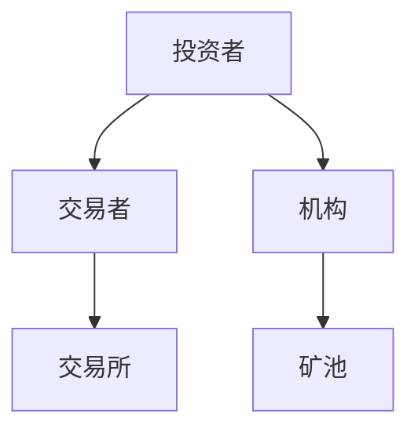
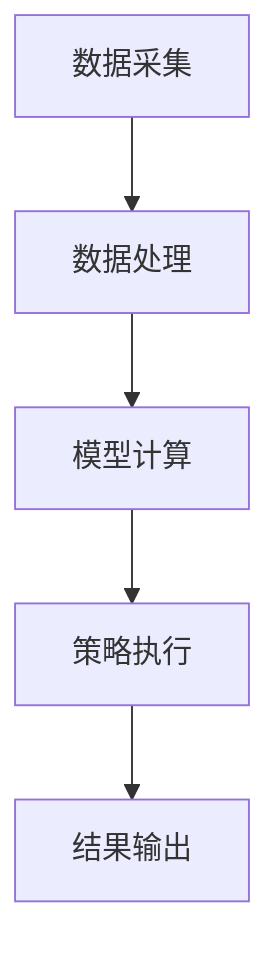

                 


# 格雷厄姆特价股票策略在不同数字货币竞争环境下的调整

> 关键词：格雷厄姆投资理论、数字货币市场、价值投资、安全边际、内在价值、投资策略调整

> 摘要：本文探讨了格雷厄姆的特价股票策略在数字货币市场中的应用，分析了不同竞争环境下的策略调整方法，通过系统设计和实际案例展示了如何优化投资策略，以适应数字货币市场的动态变化。

---

# 第1章: 格雷厄姆投资理论与数字货币市场背景

## 1.1 格雷厄姆投资理论的核心概念

### 1.1.1 安全边际的定义与计算
安全边际是格雷厄姆策略中的核心概念，用于衡量市场价格与内在价值之间的差异。计算公式为：
$$
\text{安全边际} = \text{内在价值} - \text{市场价格}
$$
当安全边际为正时，投资具有较高的安全性和潜在收益。

### 1.1.2 内在价值的评估方法
内在价值是基于基本面分析得出的公司价值。对于传统股票，常用以下公式计算：
$$
\text{内在价值} = \sum_{t=1}^{\infty} \frac{\text{现金流}_t}{(1 + r)^t}
$$
其中，\( r \) 是折现率。

### 1.1.3 价值投资的基本原则
格雷厄姆的价值投资原则强调买入被低估的资产，长期持有，并分散投资以降低风险。

## 1.2 数字货币市场的特点

### 1.2.1 数字货币市场的波动性
数字货币市场的波动性远高于传统股票市场，价格受市场情绪和技术发展的影响较大。

### 1.2.2 市场参与者的多样性
参与者包括机构投资者、个人投资者和矿工，市场结构较为复杂。

### 1.2.3 市场信息的不对称性
信息传播速度快，但真伪难辨，增加了投资决策的难度。

## 1.3 格雷厄姆策略在传统股票与数字货币市场的对比

### 1.3.1 传统股票市场的稳定性
传统股票市场相对稳定，波动性较低，适合长期投资。

### 1.3.2 数字货币市场的高风险性
数字货币市场波动剧烈，风险更高，需要更谨慎的投资策略。

### 1.3.3 投资策略的适用性分析
尽管环境不同，格雷厄姆的策略核心在于寻找低估资产，但在数字货币市场中需要进行调整。

---

# 第2章: 格雷厄姆策略在数字货币市场的适用性

## 2.1 核心要素的调整

### 2.1.1 安全边际的重新定义
在数字货币市场中，安全边际需要考虑市场的高波动性和信息不对称性，可能需要更大的安全空间。

### 2.1.2 内在价值的评估方法
评估数字货币的内在价值需要考虑技术、市场支配力和团队等因素，公式如下：
$$
\text{内在价值} = \text{技术评分} \times \text{市场支配力} \times \text{团队能力}
$$

## 2.2 投资策略的调整

### 2.2.1 增加短期波动分析
由于数字货币市场的高波动性，策略中需加入短期波动分析，以捕捉市场机会。

### 2.2.2 强化风险管理
通过设定止损点和动态调整投资组合来降低风险，公式为：
$$
\text{止损点} = \text{当前价格} \times (1 - \text{风险承受比例})
$$

---

# 第3章: 数字货币市场的竞争环境分析

## 3.1 市场结构与竞争强度

### 3.1.1 市场参与者分析
使用Mermaid图展示市场参与者的角色和行为：


## 3.2 市场周期与投资策略

### 3.2.1 市场周期的定义与特征
数字货币市场通常经历牛熊周期，周期长度和波动性较大。

### 3.2.2 不同周期下的策略调整
在牛市中，可适当增加杠杆；在熊市中，注重安全边际。

---

# 第4章: 系统分析与架构设计

## 4.1 数据收集与处理

### 4.1.1 数据源选择
包括价格数据、交易量数据、社交媒体情绪数据等。

## 4.2 系统架构设计

### 4.2.1 系统功能模块
使用Mermaid图展示系统架构：


---

# 第5章: 项目实战

## 5.1 实战环境配置

### 5.1.1 工具安装
安装必要的数据处理工具和编程环境，如Python和Pandas。

## 5.2 核心算法实现

### 5.2.1 安全边际计算
编写Python代码计算安全边际：
```python
def calculate_margin(value, price):
    return value - price
```

---

# 第6章: 投资策略调整与优化

## 6.1 调整后的策略效果

### 6.1.1 实证分析
通过实证分析验证调整后策略的有效性，展示收益与风险的对比。

---

# 第7章: 总结与展望

## 7.1 投资建议

### 7.1.1 风险管理的重要性
强调风险管理在数字货币投资中的关键作用。

## 7.2 未来展望

### 7.2.1 技术进步与策略优化
随着技术进步，投资策略将更加智能化和动态化。

---

作者：AI天才研究院/AI Genius Institute & 禅与计算机程序设计艺术 /Zen And The Art of Computer Programming

