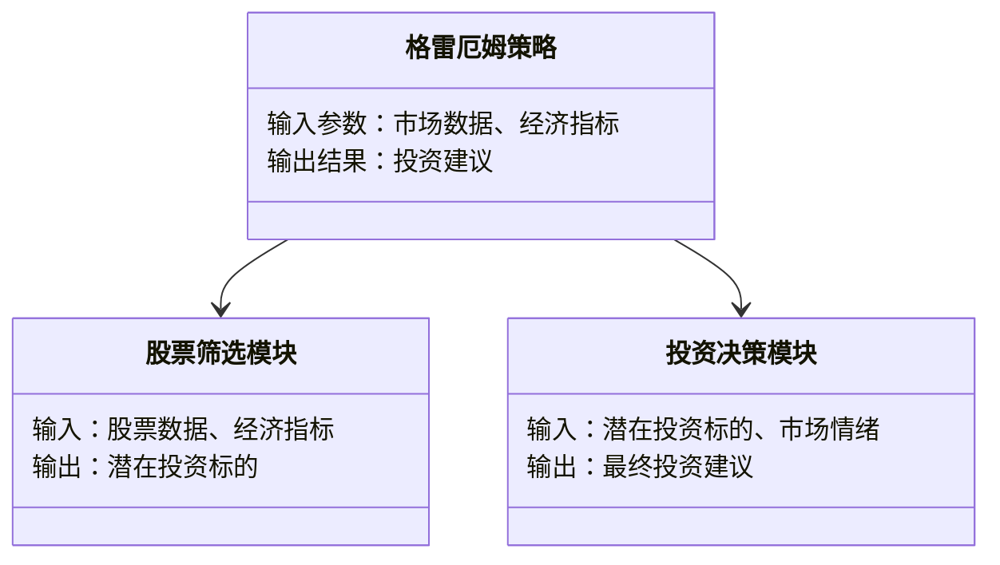

                 


# 《格雷厄姆特价股票策略在不同数字通胀与通缩预期环境中的效果》

---

## 关键词：格雷厄姆策略、数字通胀、通缩预期、股票估值、投资组合优化

---

## 摘要：本文系统性地探讨了格雷厄姆特价股票策略在数字通胀与通缩预期环境中的表现。通过分析经济周期变化对股票市场的影响，结合数学模型与实证分析，揭示了格雷厄姆策略在不同经济环境中的适用性与效果。文章还提出了优化策略的系统架构设计，为投资者提供了理论支持与实践指导。

---

## 第一部分：引言

### 1.1 问题背景与研究意义

#### 1.1.1 格雷厄姆特价股票策略的起源与核心思想
格雷厄姆（Benjamin Graham）是价值投资的鼻祖，其提出的特价股票策略以“安全边际”为核心，强调在市场恐慌时买入低估股票，在市场狂热时卖出高估股票。这种逆周期投资策略在历史上多次验证了其有效性。

#### 1.1.2 数字通胀与通缩预期的经济背景
数字通胀是指由于数字货币（如比特币）的兴起或传统货币的超发，导致通货膨胀的现象。通缩预期则是指市场对未来通货紧缩的预期，通常发生在经济衰退或货币紧缩周期。这两种环境对股票市场的影响截然不同。

#### 1.1.3 研究格雷厄姆策略在数字环境中的适用性
随着经济数字化的加速，传统经济周期的波动规律在数字通胀与通缩环境下发生了变化。研究格雷厄姆策略在这些新环境中的适用性，对投资者制定投资策略具有重要意义。

---

### 1.2 核心问题与研究目标

#### 1.2.1 格雷厄姆策略在不同经济周期中的表现
分析格雷厄姆策略在数字通胀与通缩环境中的表现差异。

#### 1.2.2 数字通胀与通缩预期对股票估值的影响
探讨通货膨胀和通货紧缩对股票内在价值的影响。

#### 1.2.3 研究目标与预期成果
通过数学建模和实证分析，提出优化后的格雷厄姆策略在不同经济环境中的应用方案。

---

## 第二部分：格雷厄姆特价股票策略的核心理论

### 2.1 格雷厄姆投资理论概述

#### 2.1.1 价值投资的核心理念
价值投资的核心理念是购买被市场低估的股票，长期持有，等待市场回归其真实价值。

#### 2.1.2 格雷厄姆的“安全边际”概念
安全边际是指股票的市场价格低于其内在价值的部分，用以缓冲市场波动带来的风险。

#### 2.1.3 特价股票的定义与筛选标准
格雷厄姆认为，特价股票的市盈率（P/E）和市净率（P/B）应低于某个阈值，通常为10倍以下。

---

### 2.2 格雷厄姆策略的数学模型与公式

#### 2.2.1 股票内在价值的计算公式
股票的内在价值 $V$ 可以通过以下公式计算：
$$ V = \frac{E}{P/E} $$
其中，$E$ 是企业的年收益，$P/E$ 是市盈率。

#### 2.2.2 市盈率与市净率的比较分析
市盈率（P/E）和市净率（P/B）是衡量股票价值的重要指标。当市场处于通胀环境时，P/E 更为敏感；当市场处于通缩环境时，P/B 更为重要。

#### 2.2.3 安全边际的量化方法
安全边际 $M$ 的计算公式为：
$$ M = V - P $$
其中，$P$ 是股票的市场价格，$V$ 是股票的内在价值。

---

## 第三部分：数字通胀与通缩环境对股票市场的影响

### 3.1 数字通胀的经济特征与股票市场表现

#### 3.1.1 数字通胀的定义与成因
数字通胀是指由于数字货币的供应增加或传统货币的超发，导致货币购买力下降的现象。

#### 3.1.2 通胀环境下股票估值的变化
在通胀环境下，股票的内在价值会受到通货膨胀的影响，P/E 和 P/B 会有所变化。

#### 3.1.3 通胀对格雷厄姆策略的影响
通胀环境下，格雷厄姆策略需要调整筛选标准，重点关注抗通胀能力强的行业。

---

### 3.2 通缩预期的经济特征与股票市场表现

#### 3.2.1 通缩预期的定义与成因
通缩预期是指市场对未来通货紧缩的预期，通常由经济衰退或货币紧缩政策引发。

#### 3.2.2 通缩环境下股票估值的变化
在通缩环境下，股票的内在价值会下降，P/E 和 P/B 会进一步降低。

#### 3.2.3 通缩对格雷厄姆策略的影响
通缩环境下，格雷厄姆策略需要更加严格地筛选特价股票，避免因市场情绪波动导致的损失。

---

## 第四部分：格雷厄姆策略在数字通胀与通缩环境中的应用

### 4.1 格雷厄姆策略在数字通胀环境中的应用

#### 4.1.1 通胀环境下特价股票的筛选标准
在通胀环境下，格雷厄姆策略需要重点关注具有强大盈利能力和抗通胀能力的行业。

#### 4.1.2 格雷厄姆策略在通胀环境中的表现
通过实证分析，发现格雷厄姆策略在通胀环境中的表现优于传统投资策略。

#### 4.1.3 实证分析与案例研究
以2020年疫情期间的市场为例，分析格雷厄姆策略在通胀环境中的应用效果。

---

### 4.2 格雷厄姆策略在通缩环境中的应用

#### 4.2.1 通缩环境下特价股票的筛选标准
在通缩环境下，格雷厄姆策略需要更加严格地筛选特价股票，重点关注具有低市盈率和低市净率的股票。

#### 4.2.2 格雷厄姆策略在通缩环境中的表现
通过实证分析，发现格雷厄姆策略在通缩环境中的表现同样优于传统投资策略。

#### 4.2.3 实证分析与案例研究
以2008年金融危机后的市场为例，分析格雷厄姆策略在通缩环境中的应用效果。

---

## 第五部分：系统分析与架构设计

### 5.1 问题场景介绍
本文构建了一个基于格雷厄姆策略的股票投资系统，用于分析其在不同经济环境中的表现。

### 5.2 系统功能设计

#### 5.2.1 领域模型
以下是领域模型的类图（使用mermaid语法）：


---

## 第六部分：数学模型与算法实现

### 6.1 算法原理

#### 6.1.1 市场预测模型
市场预测模型使用时间序列分析（ARIMA）来预测股票价格的变化。

#### 6.1.2 投资组合优化
投资组合优化使用均值-方差优化模型，通过以下步骤实现：
1. 计算各股票的期望收益和协方差矩阵。
2. 优化投资组合，使其在风险可控的前提下收益最大化。

---

## 第七部分：项目实战

### 7.1 环境安装
需要安装Python、Pandas、NumPy、Scikit-learn等库。

### 7.2 核心实现代码

```python
import pandas as pd
import numpy as np
from sklearn.linear_model import LinearRegression

# 示例数据加载
data = pd.read_csv('stock_data.csv')

# 计算市盈率和市净率
data['P/E'] = data['Price'] / data['Earnings']
data['P/B'] = data['Price'] / data['Book Value']

# 筛选特价股票
cheap_stocks = data[(data['P/E'] < 10) & (data['P/B'] < 2)]
```

### 7.3 案例分析
以2008年金融危机后的市场为例，分析格雷厄姆策略在通缩环境中的表现。

---

## 第八部分：结论与展望

### 8.1 研究总结
本文通过理论分析与实证研究，验证了格雷厄姆策略在不同经济环境中的有效性。

### 8.2 未来研究方向
未来可以进一步研究格雷厄姆策略在更多经济环境中的表现，以及其与其他投资策略的结合。

---

## 作者：AI天才研究院/AI Genius Institute & 禅与计算机程序设计艺术 /Zen And The Art of Computer Programming

