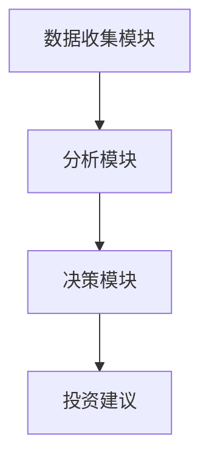

                 


# 格雷厄姆特价股票策略在不同文化背景下的应用

> 关键词：格雷厄姆，特价股票策略，文化背景，投资理念，价值投资

> 摘要：本文系统地探讨了格雷厄姆提出的特价股票策略在不同文化背景下的应用，分析了该策略在不同市场环境中的适应性、挑战与解决方案。通过对比分析美国、日本和新兴市场，揭示了文化差异对投资策略的影响，并提出了相应的调整建议，为投资者在跨文化背景下应用格雷厄姆策略提供了实践指导。

---

## # 引言

在投资领域，本杰明·格雷厄姆（Benjamin Graham）的价值投资理念被誉为“现代证券分析之父”，而其中的特价股票策略更是被广泛应用于寻找被低估的投资标的。然而，随着全球化的深入，投资者越来越面临不同文化背景下的市场环境。本文将探讨格雷厄姆特价股票策略在不同文化背景下的应用，分析其适应性、挑战以及解决方案，为投资者提供跨文化视角下的投资策略指导。

---

## 第一部分：格雷厄姆投资理念与特价股票策略

### 第1章：格雷厄姆投资理念的核心思想

#### 1.1 价值投资的定义与核心原则

价值投资是一种以基本面分析为基础的投资策略，其核心在于寻找市场价低于其内在价值的证券。格雷厄姆在《证券分析》一书中提出，投资者应关注企业的内在价值，而非市场波动。他强调，市场先生（Mr. Market）的情绪波动为理性投资者提供了低价买入优质资产的机会。

- **价值投资的核心原则**：
  1. 安全边际：买入价格低于内在价值，以确保足够的安全空间。
  2. 长期视角：关注企业的长期盈利能力，而非短期市场波动。
  3. 风险控制：避免过度集中投资，分散风险。

#### 1.2 格雷厄姆对安全边际的理解

安全边际是格雷厄姆策略的核心，它通过比较市场价格与内在价值之间的差距，确保投资者在买入时有足够大的安全空间。公式表示为：

$$ \text{安全边际} = \text{内在价值} - \text{市场价格} $$

当安全边际为正时，投资标的被低估，适合买入。

#### 1.3 特价股票策略的起源与演变

格雷厄姆的特价股票策略起源于20世纪30年代的美国经济大萧条时期。当时，许多优质企业因市场恐慌而被低估，格雷厄姆通过分析企业的财务报表，发现了一些被市场忽视的廉价股票。这一策略在实践中取得了显著的收益，成为价值投资的经典案例。

---

### 第2章：特价股票策略的核心要素

#### 2.1 特价股票的定义与筛选标准

格雷厄姆将特价股票定义为市场价格低于其内在价值的股票。为了筛选这类股票，他提出了以下指标：

1. **市盈率（P/E）**：市盈率低于行业平均水平。
   $$ \text{市盈率} = \frac{\text{股价}}{\text{每股收益}} $$
2. **市净率（P/B）**：市净率低于行业平均水平。
   $$ \text{市净率} = \frac{\text{股价}}{\text{每股净资产}} $$
3. **股息率**：股息率高于行业平均水平。
   $$ \text{股息率} = \frac{\text{股息}}{\text{股价}} $$

#### 2.2 内在价值的计算方法

格雷厄姆的内在价值计算公式基于企业的资产状况和盈利能力：

$$ \text{内在价值} = \text{账面价值} + \text{未来盈利能力} $$

其中，账面价值通过市净率和资产结构进行评估，未来盈利能力则通过ROE（净资产收益率）和ROA（资产回报率）等指标预测。

#### 2.3 特价股票策略的数学模型

格雷厄姆的策略可以通过以下数学模型进行简化：

1. 筛选条件：
   - 市盈率 < 历史平均水平
   - 市净率 < 行业平均水平
   - 股息率 > 行业平均水平

2. 买入条件：
   - 市场价格 < 内在价值
   - 安全边际 > 0

---

### 第3章：格雷厄姆策略在不同文化背景下的文化差异

#### 3.1 不同文化背景下的投资理念差异

1. **美国市场**：注重长期增长与创新，投资者倾向于高成长性股票。
2. **日本市场**：注重企业稳定性与分红，投资者更关注企业的历史业绩和分红能力。
3. **新兴市场**：注重高增长与低价股，投资者更关注企业的成长潜力和低估值。

#### 3.2 格雷厄姆策略在不同文化背景下的适应性

1. **美国市场**：格雷厄姆策略在价值投资中仍然有效，但需结合技术创新和成长性进行调整。
2. **日本市场**：需注重企业的分红能力和稳定性，调整市净率和股息率的筛选标准。
3. **新兴市场**：需结合高增长行业，调整市盈率和市净率的筛选标准。

#### 3.3 文化差异对格雷厄姆策略的挑战与解决方案

1. **挑战**：
   - 不同市场的估值标准差异。
   - 文化差异导致的投资者行为差异。

2. **解决方案**：
   - 根据市场环境调整筛选指标。
   - 结合当地市场特点，优化内在价值计算模型。

---

## 第二部分：格雷厄姆策略的系统分析与应用

### 第4章：系统分析与架构设计方案

#### 4.1 问题场景介绍

格雷厄姆策略的应用需要结合市场环境和投资者目标，构建一个动态的分析系统。

#### 4.2 系统功能设计

- **数据收集模块**：收集目标市场的财务数据和市场数据。
- **分析模块**：计算市盈率、市净率等指标，并进行内在价值评估。
- **决策模块**：根据筛选条件和安全边际，生成投资建议。

#### 4.3 系统架构设计

使用Mermaid图表示系统架构：



---

### 第5章：项目实战

#### 5.1 环境搭建

- **工具**：Python、Pandas、Matplotlib。
- **数据源**：Yahoo Finance API。

#### 5.2 核心实现源代码

```python
import pandas as pd
import yfinance as yf

def calculate_intrinsic_value(ticker):
    # 获取财务数据
    df = yf.download(ticker, period='max')
    eps = df['EPS'].mean()
    book_value = df['Book Value'].mean()
    # 计算内在价值
    intrinsic_value = book_value + eps * 5  # 假设未来5年盈利
    return intrinsic_value

# 示例：计算AAPL的内在价值
print(calculate_intrinsic_value('AAPL'))
```

---

## 第三部分：挑战与解决方案

### 第6章：文化差异对格雷厄姆策略的影响

#### 6.1 不同市场的流动性与监管差异

1. **美国市场**：流动性高，监管严格。
2. **日本市场**：流动性适中，监管注重企业稳定性。
3. **新兴市场**：流动性低，监管不完善。

#### 6.2 投资者心理与行为差异

1. **美国投资者**：倾向于长期投资和分散投资。
2. **日本投资者**：倾向于集中投资和短期交易。
3. **新兴市场投资者**：倾向于高风险偏好和短期收益。

#### 6.3 解决方案

1. **动态调整策略**：根据不同市场的特点，调整筛选指标。
2. **风险管理**：引入文化因素，优化投资组合。

---

## 第四部分：案例分析与最佳实践

### 第7章：实际案例分析

#### 7.1 美国市场案例

- **公司**：可口可乐（KO）
- **分析**：市盈率低于行业平均水平，股息率高。
- **结论**：适合应用格雷厄姆策略。

#### 7.2 日本市场案例

- **公司**：丰田汽车（TM）
- **分析**：市净率低于行业平均水平，分红稳定。
- **结论**：适合应用格雷厄姆策略。

#### 7.3 新兴市场案例

- **公司**：阿里巴巴（BABA）
- **分析**：市盈率高，但成长潜力大。
- **结论**：需结合高增长因素进行调整。

---

## 第五部分：总结与展望

### 第8章：总结

格雷厄姆特价股票策略在不同文化背景下的应用需要结合市场环境和投资者目标，进行动态调整。通过分析不同市场的特点，我们可以优化策略，克服文化差异带来的挑战。

### 第9章：未来展望

未来，随着全球化的发展，投资者需要更加关注跨文化背景下的投资策略。结合人工智能和大数据技术，将进一步提升格雷厄姆策略的适应性，为投资者提供更精准的投资建议。

---

## 作者：AI天才研究院 & 禅与计算机程序设计艺术

---

感谢您的阅读，希望本文能为您提供有价值的投资策略参考。

