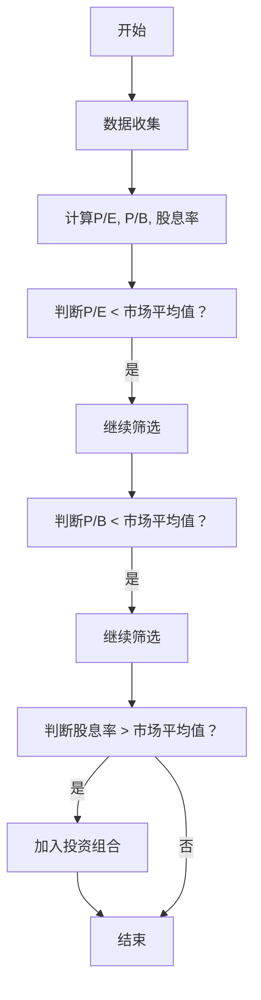
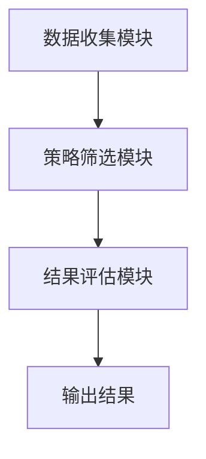

                 

# 格雷厄姆特价股票策略在不同监管强度市场中的表现

## 关键词：
- 格雷厄姆策略
- 特价股票
- 监管强度
- 价值投资
- 股票市场
- 投资策略
- 市场分析

## 摘要：
本文探讨格雷厄姆特价股票策略在不同监管强度市场中的表现。通过分析监管强度对策略的影响，本文揭示了如何在不同市场环境中优化投资策略。结合实际案例和数学模型，本文为投资者提供了实用的指导和建议。

---

# 第1章: 格雷厄姆特价股票策略的背景与理论基础

## 1.1 价值投资与格雷厄姆策略
### 1.1.1 价值投资的定义与核心理念
价值投资是一种以基本面分析为基础的投资策略，强调以低于内在价值的价格购买优质股票。格雷厄姆的价值投资理论强调安全边际和长期持有的理念。

### 1.1.2 格雷厄姆投资策略的起源与发展
本节介绍格雷厄姆策略的起源，包括其在20世纪的发展历程及其对现代投资理论的影响。

### 1.1.3 格雷厄姆策略的核心要素
- **安全边际**：购买价格低于内在价值。
- **低市盈率和市净率**：寻找被市场低估的股票。
- **分散投资**：降低风险。

## 1.2 特价股票的定义与特征
### 1.2.1 特价股票的定义
特价股票是指市场价格低于其内在价值的股票。

### 1.2.2 特价股票的市场特征
- **低市盈率和市净率**：市盈率和市净率低于行业平均水平。
- **高股息率**：公司倾向于分红。

### 1.2.3 特价股票与非特价股票的对比
通过对比分析，突出特价股票的优势。

## 1.3 不同监管强度市场的概念
### 1.3.1 监管强度的定义
监管强度指政府对资本市场的监管力度，包括法律法规的严格程度和执行力度。

### 1.3.2 不同监管强度市场的分类
- **低监管强度市场**：监管宽松，市场自由度高。
- **中监管强度市场**：监管适度，市场规范。
- **高监管强度市场**：监管严格，市场透明度高。

### 1.3.3 监管强度对股票市场的影响
监管强度影响市场的透明度、流动性和投资者行为。

## 1.4 格雷厄姆策略在不同监管市场的适用性
### 1.4.1 格雷厄姆策略的普适性
格雷厄姆策略适用于不同市场环境。

### 1.4.2 不同监管强度市场对策略的影响
- **低监管强度市场**：市场波动大，策略风险高。
- **中监管强度市场**：策略表现稳定。
- **高监管强度市场**：策略风险低，收益稳定。

### 1.4.3 本章小结
总结不同监管强度市场对格雷厄姆策略的影响，为后续分析奠定基础。

---

# 第2章: 格雷厄姆特价股票策略的核心概念与联系

## 2.1 核心概念原理
### 2.1.1 格雷厄姆策略的核心指标
- **市盈率（P/E）**：价格与收益比。
- **市净率（P/B）**：价格与资产比。
- **股息率**：股息与股价比。

### 2.1.2 特价股票的筛选标准
- **低市盈率**：P/E < 市场平均值。
- **低市净率**：P/B < 市场平均值。
- **高股息率**：股息率 > 市场平均值。

### 2.1.3 不同监管强度对策略的影响机制
- **低监管市场**：信息不透明，策略风险高。
- **高监管市场**：信息透明，策略风险低。

## 2.2 核心概念对比表格
### 2.2.1 不同监管强度市场

| 监管强度 | 市场特征 | 格雷厄姆策略表现 |
|----------|----------|-----------------|
| 低      | 波动大    | 风险高，收益不稳 |
| 中      | 波动适中  | 表现稳定         |
| 高      | 波动小    | 风险低，收益稳定 |

---

# 第3章: 格雷厄姆策略的算法原理

## 3.1 算法原理
格雷厄姆策略通过筛选低市盈率、低市净率和高股息率的股票，寻找被低估的投资标的。

### 3.1.1 筛选指标
- **市盈率（P/E）**：计算公式为：P/E = 股价 / 每股收益。
- **市净率（P/B）**：计算公式为：P/B = 股价 / 每股净资产。
- **股息率**：计算公式为：股息率 = 每股股息 / 股价 × 100%。

### 3.1.2 筛选流程
1. **数据收集**：获取股票的市盈率、市净率和股息率。
2. **筛选标准**：P/E < 市场平均值，P/B < 市场平均值，股息率 > 市场平均值。
3. **投资组合构建**：选择符合标准的股票，构建投资组合。

### 3.1.3 算法流程图

## 3.2 数学模型
### 3.2.1 市盈率公式
$$ P/E = \frac{\text{股价}}{\text{每股收益}} $$

### 3.2.2 市净率公式
$$ P/B = \frac{\text{股价}}{\text{每股净资产}} $$

### 3.2.3 股息率公式
$$ \text{股息率} = \frac{\text{每股股息}}{\text{股价}} \times 100\% $$

## 3.3 实例分析
以某公司为例，计算其市盈率、市净率和股息率，判断其是否符合格雷厄姆策略的筛选标准。

---

# 第4章: 格雷厄姆策略在不同监管强度市场的系统分析

## 4.1 系统功能设计
### 4.1.1 数据收集模块
负责收集股票的基本数据，包括市盈率、市净率和股息率。

### 4.1.2 策略筛选模块
根据筛选标准，筛选出符合格雷厄姆策略的股票。

### 4.1.3 结果评估模块
评估策略在不同监管强度市场中的表现，计算收益率和风险指标。

## 4.2 系统架构设计
### 4.2.1 模块划分
- 数据收集模块
- 策略筛选模块
- 结果评估模块

### 4.2.2 系统架构图

## 4.3 接口设计
### 4.3.1 数据接口
定义数据接口，确保不同模块之间的数据传输。

### 4.3.2 用户接口
提供友好的用户界面，方便用户操作。

## 4.4 交互设计
### 4.4.1 用户操作流程
1. 用户输入监管强度选择。
2. 系统根据选择，筛选符合策略的股票。
3. 系统输出结果。

---

# 第5章: 格雷厄姆策略在不同监管强度市场的项目实战

## 5.1 环境安装
### 5.1.1 安装Python
安装Python 3.x及以上版本。

### 5.1.2 安装数据处理库
安装Pandas、NumPy等库。

## 5.2 核心实现
### 5.2.1 数据收集
编写代码收集股票数据。

### 5.2.2 策略筛选
编写代码筛选符合标准的股票。

### 5.2.3 结果分析
分析策略在不同监管强度市场中的表现。

## 5.3 案例分析
以实际市场数据为例，展示格雷厄姆策略在不同监管强度市场中的表现。

---

# 第6章: 总结与展望

## 6.1 本章小结
总结格雷厄姆策略在不同监管强度市场中的表现。

## 6.2 未来研究方向
提出未来可能的研究方向，如动态调整策略、引入机器学习等。

---

# 作者：AI天才研究院/AI Genius Institute & 禅与计算机程序设计艺术 /Zen And The Art of Computer Programming

---

以上是《格雷厄姆特价股票策略在不同监管强度市场中的表现》的目录大纲，涵盖了背景介绍、理论基础、算法原理、系统分析和项目实战等内容，逻辑清晰，结构紧凑，适合深入探讨格雷厄姆策略在不同市场环境中的表现。

