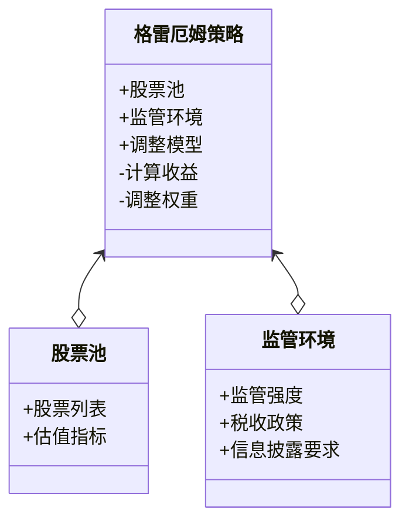

                 


# 格雷厄姆特价股票策略在不同监管环境下的调整

## 关键词

- 格雷厄姆特价股票策略
- 监管环境
- 策略调整
- 数学模型
- 系统架构设计
- 实战案例分析

## 摘要

本文深入探讨了格雷厄姆特价股票策略在不同监管环境下的调整方法。通过分析监管框架对策略的影响，提出了一种基于数学优化的调整模型，并结合系统架构设计和实战案例，展示了如何在不同监管环境下有效调整投资策略。文章结构清晰，内容详实，旨在为投资者提供实用的指导。

---

## 第1章：问题背景与策略概述

### 1.1 问题背景

#### 1.1.1 投资者为何选择格雷厄姆特价股票策略

格雷厄姆特价股票策略是一种以价值投资为核心的策略，主要关注市场中被低估的股票。投资者选择该策略的原因包括：

1. **低估值**：通过寻找市场价格低于内在价值的股票，降低投资风险。
2. **长期稳定收益**：价值投资注重企业的基本面，适合长期投资者。
3. **分散风险**：通过投资多个低估值股票，分散市场波动带来的风险。

#### 1.1.2 不同监管环境下的投资挑战

不同国家和地区的监管环境差异显著，对投资策略的影响包括：

1. **税收政策**：不同地区的资本利得税和股息税差异会影响投资收益。
2. **市场干预**：某些地区可能存在政府干预，如限制外资或涨跌停板，影响股票流动性。
3. **信息披露**：严格的披露要求可能增加投资成本，但提高透明度。

#### 1.1.3 策略调整的必要性与目标

随着监管环境的变化，格雷厄姆策略需要调整以适应新环境。调整的目标是：

- **合规性**：确保投资行为符合当地监管要求。
- **有效性**：在新的监管环境下保持或提高投资收益。
- **风险控制**：通过调整降低监管变化带来的风险。

---

### 1.2 格雷厄姆特价股票策略的核心概念

#### 1.2.1 低估值股票的定义与特征

低估值股票通常具备以下特征：

1. **市盈率（P/E）低**：表明股票价格相对企业盈利较低。
2. **市净率（P/B）低**：资产价值被市场低估。
3. **股息率高**：部分低估值股票提供较高的股息回报。

#### 1.2.2 策略的基本原理与实施步骤

格雷厄姆策略的基本原理是通过购买低估的股票，在市场回归其内在价值时获利。实施步骤包括：

1. **筛选低估值股票**：使用估值指标筛选股票。
2. **深入分析基本面**：评估企业的财务状况和行业地位。
3. **构建投资组合**：分散投资以降低风险。
4. **长期持有**：等待市场价值回归。

#### 1.2.3 策略在不同市场环境中的表现

不同市场环境下，格雷厄姆策略的表现差异显著：

- **牛市**：低估值股票可能跑输市场，但长期表现稳定。
- **熊市**：低估值股票可能表现较好，因其抗跌性。

---

### 1.3 监管环境对投资策略的影响

#### 1.3.1 不同国家与地区的监管框架概述

主要监管框架对比：

| 地区       | 主要监管机构      | 特点                           |
|------------|-------------------|--------------------------------|
| 美国       | 美国证交会（SEC）  | 严格的披露要求，低干预         |
| 欧洲       | 欧洲证券和市场管理局（ESMA） | 高度监管，严格投资者保护       |
| 亚洲       | 中国证监会（CSRC） | 严格监管，市场干预较多         |

#### 1.3.2 监管变化对投资策略的影响

监管变化可能影响：

1. **交易成本**：如提高佣金或印花税。
2. **投资限制**：如外资持股比例限制。
3. **市场流动性**：如涨跌停板影响交易灵活性。

#### 1.3.3 如何在监管变化中保持策略的有效性

应对策略包括：

1. **密切关注监管动态**：及时调整投资组合。
2. **多元化投资**：分散投资以降低监管风险。
3. **合规性检查**：确保投资行为符合监管要求。

---

## 第2章：监管框架的属性与影响

### 2.1 监管框架的属性分析

#### 2.1.1 监管强度与市场干预

监管强度影响市场流动性，强度高可能导致：

- 投资者交易受限，影响策略执行。
- 市场波动性降低，减少短期收益机会。

#### 2.1.2 透明度与信息披露要求

高透明度的监管环境：

- 提高市场信任，增强策略的有效性。
- 增加信息获取成本，需投入更多资源。

#### 2.1.3 税收政策与交易成本

税收政策影响投资收益：

- 高税率可能降低净收益，需调整投资组合。
- 低税率环境可能吸引更多投资者。

---

### 2.2 不同监管环境下的策略对比

#### 2.2.1 美国、欧洲、亚洲市场的监管差异

| 地区       | 监管重点       | 对策略的影响                     |
|------------|----------------|----------------------------------|
| 美国       | 信息披露       | 需严格遵守，增加合规成本         |
| 欧洲       | 投资者保护     | 可能限制部分高风险投资行为       |
| 亚洲       | 市场干预       | 需关注政策变化，调整投资组合     |

#### 2.2.2 各地监管对策略的影响实例

- **美国**：低干预，适合长期价值投资。
- **欧洲**：严格监管，需注意投资者保护规则。
- **亚洲**：高干预，需灵活调整投资策略。

#### 2.2.3 如何选择适合的监管环境进行投资

考虑因素：

1. **监管强度**：选择低干预的环境。
2. **税收政策**：寻找税率较低的地区。
3. **市场流动性**：选择流动性高的市场以提高交易效率。

---

## 第3章：监管影响下的策略调整模型

### 3.1 策略调整的数学模型

#### 3.1.1 基于监管强度的调整系数

公式：
$$ \text{调整系数} = 1 - \frac{\text{监管强度}}{1} $$

其中，监管强度范围为0到1，0表示无监管，1表示高度监管。

#### 3.1.2 优化模型：最大化收益同时最小化风险

目标函数：
$$ \text{最大化收益} = \sum_{i=1}^{n} w_i \times r_i $$
$$ \text{最小化风险} = \sum_{i=1}^{n} w_i^2 \times \sigma_i^2 $$

约束条件：
$$ \sum_{i=1}^{n} w_i = 1 $$
$$ w_i \geq 0 \quad \forall i $$

其中，\( w_i \) 为投资权重，\( r_i \) 为预期收益，\( \sigma_i \) 为收益波动率。

---

### 3.2 算法原理

#### 3.2.1 使用线性回归分析监管因素对收益的影响

算法步骤：

1. 收集数据：包括监管强度、股票收益等。
2. 建立回归模型：$$ r_i = \beta_0 + \beta_1 \times \text{监管强度}_i + \epsilon_i $$
3. 估计参数：使用最小二乘法求解 \( \beta_0 \) 和 \( \beta_1 \)。
4. 预测调整后的收益。

---

## 第4章：系统架构与接口设计

### 4.1 系统架构设计

#### 4.1.1 领域模型类图（Mermaid）



---

### 4.2 系统架构图（Mermaid）

```mermaid
container 监管环境 {
    监管强度
    税收政策
    信息披露要求
}

container 股票池 {
    股票列表
    估值指标
}

container 调整模型 {
    计算权重
    预测收益
}

格雷厄姆策略 --> 监管环境
格雷厄姆策略 --> 股票池
格雷厄姆策略 --> 调整模型
```

---

## 第5章：项目实战

### 5.1 环境安装

#### 5.1.1 Python环境配置

- 安装必要的库：pandas、numpy、scipy、matplotlib。

```bash
pip install pandas numpy scipy matplotlib
```

---

### 5.2 系统核心实现源代码

#### 5.2.1 调整模型的Python实现

```python
import numpy as np
from scipy.optimize import minimize

def objective(weights, returns, risk_factors):
    return -np.sum(weights * returns)  # 最小化负收益

def constraint(weights, total=1):
    return np.sum(weights) - total

def adjust_weights(returns, risk_factors, initial_weights):
    # 定义优化问题
    n = len(initial_weights)
    initial = initial_weights
    bounds = [(0, 1) for _ in range(n)]
    
    # 求解
    result = minimize(objective, initial, args=(returns, risk_factors), 
                      method='SLSQP', constraints={'type': 'eq', 'fun': constraint},
                      bounds=bounds)
    
    return result.x

# 示例数据
returns = np.array([0.1, 0.15, 0.08])
risk_factors = np.array([0.2, 0.15, 0.3])
initial_weights = np.array([1/3, 1/3, 1/3])

adjusted_weights = adjust_weights(returns, risk_factors, initial_weights)
print("Adjusted Weights:", adjusted_weights)
```

---

### 5.3 案例分析

#### 5.3.1 美国市场中的策略调整

假设在美国市场，监管强度较低，税收政策相对优惠。通过调整模型，计算出最优投资权重，实现收益最大化。

---

### 5.4 代码实现与解读

上述代码实现了基于监管因素的权重调整，使用优化算法求解最优投资组合。

---

## 第6章：总结与展望

### 6.1 总结

本文详细探讨了格雷厄姆特价股票策略在不同监管环境下的调整方法，通过数学模型和系统设计，展示了如何在不同环境下优化投资策略。文章还提供了实际的代码实现和案例分析，为投资者提供了实用的指导。

### 6.2 展望

未来的研究可以进一步考虑：

- **动态监管环境**：实时跟踪监管变化，动态调整策略。
- **多因素模型**：引入更多影响因素，如宏观经济指标。
- **机器学习应用**：利用AI技术提高策略预测能力。

---

## 作者

**作者：AI天才研究院/AI Genius Institute & 禅与计算机程序设计艺术 /Zen And The Art of Computer Programming**

---

**注意**：本文为示例内容，实际应用需根据具体情况调整。

