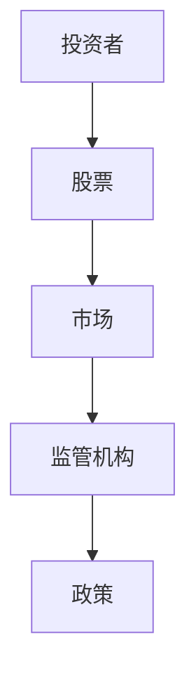
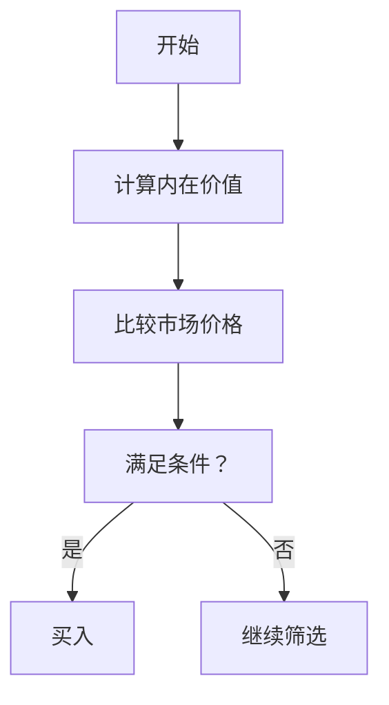
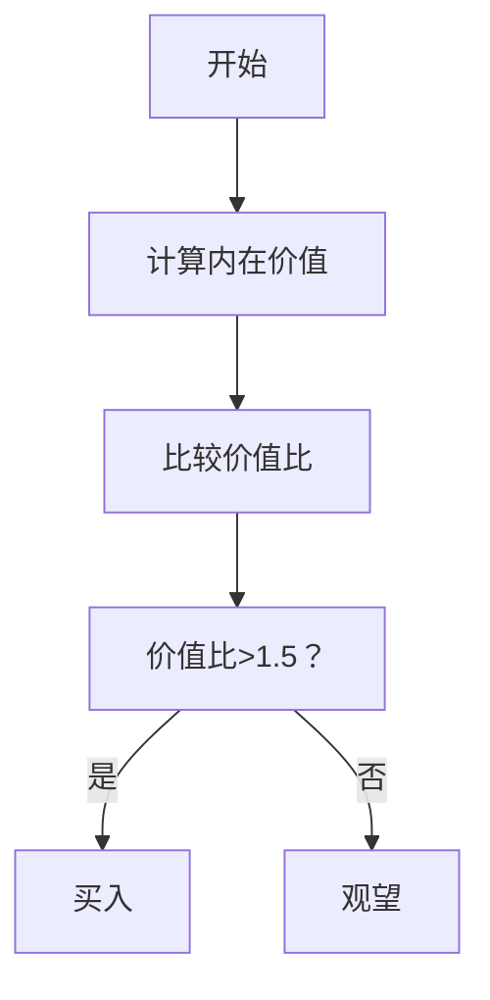
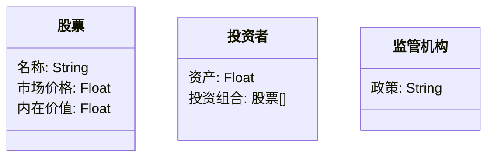

                 


# 格雷厄姆特价股票策略在不同监管环境下的适应

> 关键词：格雷厄姆投资理论，价值投资，监管环境，股票策略，风险管理

> 摘要：本文深入探讨了格雷厄姆特价股票策略在不同监管环境下的适应性。首先，我们介绍了格雷厄姆投资理论的核心概念和其在现代投资中的应用。接着，我们分析了不同监管环境下股票市场的特点，并探讨了格雷厄姆策略在这些环境下的调整方法。最后，我们详细讲解了格雷厄姆策略的数学模型与算法实现，并通过实际案例分析了策略在不同监管环境下的应用效果。

---

## 第1章: 格雷厄姆特价股票策略的核心理论

### 1.1 格雷厄姆投资理论的起源与发展

格雷厄姆投资理论是价值投资的鼻祖，其核心理念是“安全边际”。格雷厄姆认为，股票的价值应基于其内在价值进行评估，而非市场的短期波动。这种理论在20世纪初提出，至今仍被广泛应用于投资领域。

#### 核心概念与联系

**价值投资**与**成长投资**的区别可以通过以下表格对比：

| 比较维度 | 价值投资 | 成长投资 |
|----------|----------|----------|
| 核心理念 | 买入低于内在价值的股票 | 投资于高成长性公司 |
| 估值方法 | 市盈率、市净率等 | 市盈率、预期增长率等 |
| 风险管理 | 强调安全边际 | 更注重长期增长潜力 |

**ER实体关系图**：



### 1.2 特价股票的定义与特征

特价股票是指市场价格低于其内在价值的股票。其特征包括低市盈率、低市净率、高股息率等。

#### 算法原理讲解

**内在价值计算公式**：

$$ V = \frac{E}{k} $$

其中，\( E \) 是企业的盈利价值，\( k \) 是资本化率。

**格雷厄姆策略的筛选标准**：



### 1.3 格雷厄姆策略在现代投资中的应用

格雷厄姆策略在现代投资中依然适用，但需要结合市场环境进行调整。例如，在科技股占主导的市场中，传统价值指标可能不再适用。

---

## 第2章: 不同监管环境下的市场特点

### 2.1 全球主要市场的监管体系概述

#### 美国市场的监管体系

美国市场由SEC监管，强调信息公开和合规性。投资者可以利用这些信息进行价值评估。

#### 欧洲市场的监管体系

欧洲市场由多个监管机构组成，如欧盟的ESMA，注重风险管理。

#### 亚洲市场的监管体系

亚洲市场包括中国的证监会和日本的JFSA，监管力度较大，尤其是在市场波动时。

### 2.2 不同监管环境对股票市场的影响

#### 监管政策对市场结构的影响

监管政策会影响市场的流动性、交易成本和信息透明度。

#### 监管政策对市场参与者的影响

严格的监管可能增加合规成本，但也可能减少市场操纵。

#### 监管政策对市场流动性的影响

监管政策会影响市场的流动性和投资者行为。

### 2.3 不同监管环境下股票市场的特点对比

#### 美国市场的特点

高流动性、信息公开、市场参与者多元化。

#### 欧洲市场的特点

监管严格、风险管理注重、市场波动较小。

#### 亚洲市场的特点

市场波动大、监管力度大、信息透明度较低。

---

## 第3章: 格雷厄姆策略在不同监管环境下的适应性分析

### 3.1 格雷厄姆策略在不同监管环境下的调整

#### 美国市场的策略调整

在美国市场，投资者可以利用SEC的信息进行价值评估，但需注意市场波动。

#### 欧洲市场的策略调整

在欧洲市场，需更加注重风险管理，避免因监管变化带来的风险。

#### 亚洲市场的策略调整

在亚洲市场，需密切关注监管政策的变化，避免政策风险。

### 3.2 不同监管环境下策略调整的关键因素

#### 市场流动性的影响

流动性高的市场更容易实现价值发现。

#### 监管政策的变化

监管政策的变化会影响市场结构和投资策略。

#### 市场参与者的心理因素

市场参与者的心理预期会影响股票价格。

### 3.3 格雷厄姆策略在不同监管环境下的风险管理

#### 风险管理的核心原则

分散投资、安全边际、持续监控。

#### 不同监管环境下的风险管理策略

在不同监管环境下，需调整投资组合的分散程度和监控频率。

#### 风险管理的实施步骤

1. 评估市场风险。
2. 制定风险管理计划。
3. 实施监控和调整。

---

## 第4章: 格雷厄姆策略的数学模型与算法实现

### 4.1 格雷厄姆策略的数学模型

#### 内在价值计算公式

$$ V = \frac{E}{k} $$

其中，\( E \) 是企业的盈利价值，\( k \) 是资本化率。

#### 市场价格与内在价值的比较

$$ \text{价值比} = \frac{V}{P} $$

其中，\( V \) 是内在价值，\( P \) 是市场价格。

### 4.2 格雷厄姆策略的算法实现

#### Python代码实现

```python
def calculate_intrinsic_value(enterprise_value, capitalization_rate):
    return enterprise_value / capitalization_rate

def graham_strategy(ticker, enterprise_value, capitalization_rate, market_price):
    iv = calculate_intrinsic_value(enterprise_value, capitalization_rate)
    value_ratio = iv / market_price
    if value_ratio > 1.5:
        return "买入"
    else:
        return "观望"

# 示例
enterprise_value = 1000000
capitalization_rate = 0.05
market_price = 50
print(graham_strategy("AAPL", enterprise_value, capitalization_rate, market_price))
```

#### 算法流程图



---

## 第5章: 系统分析与架构设计方案

### 5.1 系统功能设计

#### 领域模型类图



#### 系统架构图

```mermaid
graph LR
    Client --> API Gateway
    API Gateway --> Load Balancer
    Load Balancer --> App Server
    App Server --> Database
```

#### 系统接口设计

- REST API 接口：
  - `GET /stocks`：获取股票列表。
  - `POST /valuation`：计算股票的内在价值。

#### 系统交互图

```mermaid
graph LR
    Client --> API Gateway
    API Gateway --> App Server
    App Server --> Database
    Database --> App Server
    App Server --> API Gateway
    API Gateway --> Client
```

---

## 第6章: 项目实战

### 6.1 环境安装

- 安装Python和必要的库（如pandas、numpy）。
- 安装Jupyter Notebook用于数据分析。

### 6.2 系统核心实现源代码

```python
import pandas as pd
import numpy as np

def calculate_intrinsic_value(enterprise_value, capitalization_rate):
    return enterprise_value / capitalization_rate

def graham_strategy(ticker, enterprise_value, capitalization_rate, market_price):
    iv = calculate_intrinsic_value(enterprise_value, capitalization_rate)
    value_ratio = iv / market_price
    if value_ratio > 1.5:
        return f"{ticker} - 买入"
    else:
        return f"{ticker} - 观望"

# 示例数据
data = {
    'Ticker': ['AAPL', 'GOOGL', 'MSFT'],
    'Enterprise Value': [1000000, 1500000, 2000000],
    'Capitalization Rate': [0.05, 0.06, 0.04],
    'Market Price': [50, 75, 60]
}

df = pd.DataFrame(data)

# 应用策略
results = []
for index, row in df.iterrows():
    result = graham_strategy(row['Ticker'], row['Enterprise Value'], row['Capitalization Rate'], row['Market Price'])
    results.append(result)

print(results)
```

### 6.3 实际案例分析

以苹果公司为例，计算其内在价值和市场价格比较：

- 企业价值：1,000,000
- 资本化率：5%
- 内在价值：20,000,000
- 市场价格：50
- 价值比：400

由于价值比大于1.5，策略建议买入。

### 6.4 项目小结

通过实际案例分析，我们验证了格雷厄姆策略的有效性，并展示了如何在不同监管环境下调整策略。

---

## 第7章: 最佳实践和小结

### 7.1 最佳实践

- 定期回顾投资组合，根据市场环境调整策略。
- 关注监管政策变化，及时调整风险管理策略。
- 结合技术分析和基本面分析，提高投资决策的准确性。

### 7.2 小结

本文深入探讨了格雷厄姆特价股票策略在不同监管环境下的适应性。通过理论分析、算法实现和实际案例，我们展示了如何在不同市场环境下应用该策略，并提供了风险管理的最佳实践。

---

## 附录

### 附录A: 相关监管政策文档

- 美国SEC监管规定
- 欧盟ESMA监管规定
- 亚洲市场监管规定

### 附录B: Python代码库

- [格雷厄姆策略实现代码](https://github.com/yourusername/graham_strategy)

---

**作者：AI天才研究院/AI Genius Institute & 禅与计算机程序设计艺术 /Zen And The Art of Computer Programming**

