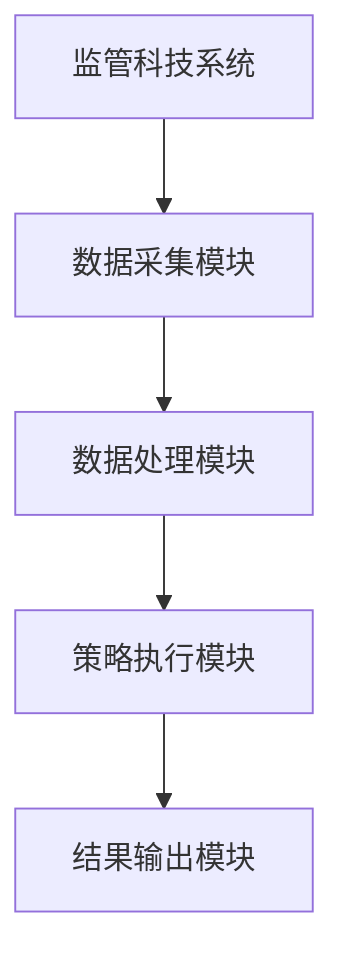
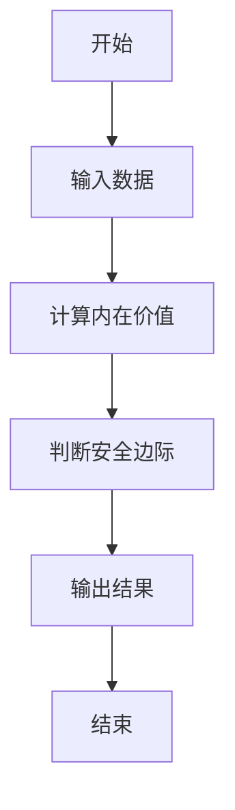
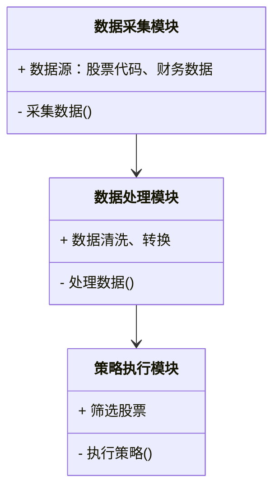
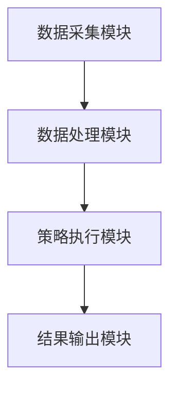
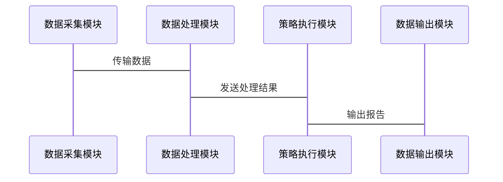

                 


# 格雷厄姆特价股票策略在不同监管科技环境中的表现

> 关键词：格雷厄姆策略，监管科技，股票投资，价值投资，系统架构

> 摘要：本文深入分析了格雷厄姆特价股票策略在不同监管科技环境中的表现，探讨了该策略在合规性、数据处理和技术实现等方面的挑战与机遇。通过系统设计、算法实现和项目实战，本文为投资者和科技从业者提供了有价值的参考。

---

# 第1章 引言

## 1.1 问题背景

### 1.1.1 格雷厄姆策略的定义与核心思想
格雷厄姆特价股票策略是一种以价值投资为核心的选股方法，由 Benjamin Graham 提出，强调以低于内在价值的价格买入股票，以规避市场波动风险。其核心思想是通过分析企业的基本面，寻找被市场低估的股票。

### 1.1.2 监管科技的定义与发展趋势
监管科技（RegTech）是指利用技术手段（如人工智能、大数据、区块链等）来满足金融监管要求的新兴领域。随着金融市场的复杂化和监管要求的日益严格，RegTech 在提升效率、降低成本方面展现出巨大潜力。

### 1.1.3 问题解决的目标与意义
本文旨在探讨格雷厄姆策略在不同监管环境下的表现，分析技术手段如何优化策略实施，为投资者和科技从业者提供理论与实践指导。

## 1.2 核心概念与问题描述

### 1.2.1 格雷厄姆策略的数学模型与特征
格雷厄姆策略的核心公式为：
$$ P \leq V \times (1 + g) $$
其中，P 为股票价格，V 为内在价值，g 为资本增长率。该公式强调以低于内在价值的价格买入股票。

### 1.2.2 监管科技的技术手段与实现方式
监管科技通过大数据分析、人工智能算法等技术手段，帮助金融机构满足合规要求。其主要实现方式包括数据采集、分析、报告生成等。

### 1.2.3 问题的边界与外延
本文的研究范围限定于格雷厄姆策略在不同监管环境下的技术实现，不涉及具体的金融操作或市场预测。

## 1.3 核心概念的结构与组成

### 1.3.1 格雷厄姆策略的核心要素
- 内在价值计算
- 市盈率（P/E）分析
- 市净率（P/B）分析

### 1.3.2 监管科技的组成部分
- 数据采集与处理模块
- 算法分析模块
- 报告生成模块

### 1.3.3 两者的相互关系与协同作用
格雷厄姆策略依赖于精准的数据分析，而监管科技提供了高效的数据处理和合规保障，两者结合可提升投资策略的可靠性和合规性。

---

# 第2章 格雷厄姆特价股票策略概述

## 2.1 核心原理与数学模型

### 2.1.1 核心原理的详细解释
格雷厄姆策略通过分析企业的财务数据，寻找具有安全边际的股票。其核心公式：
$$ 安全边际 = 市场价格 \leq 内在价值 \times (1 + g) $$

### 2.1.2 格雷厄姆策略的实施步骤
1. **计算内在价值**：通过DCF模型等方法评估企业价值。
2. **分析财务指标**：市盈率、市净率、股息率等。
3. **寻找低估股票**：以低于内在价值的价格买入。

## 2.2 格雷厄姆策略与监管科技的联系

### 2.2.1 监管科技对策略实施的影响
- 提供高效的数据处理能力。
- 确保数据的合规性和准确性。

### 2.2.2 技术手段如何优化策略执行
- 自动化数据采集与分析。
- 通过AI技术优化选股模型。

---

# 第3章 监管科技环境的构建与分析

## 3.1 监管科技环境的系统分析

### 3.1.1 系统功能需求
- 数据采集：收集企业财务数据、市场数据。
- 数据处理：清洗、转换、分析。
- 策略执行：根据格雷厄姆策略筛选股票。
- 结果输出：生成投资报告。

### 3.1.2 系统架构设计（Mermaid图）


## 3.2 监管科技环境的实现步骤

### 3.2.1 数据采集与处理
- 数据源：公开的财务报表、市场数据。
- 数据清洗：去除无效数据，处理异常值。

### 3.2.2 策略算法的实现
- 通过Python编写策略筛选代码。
- 使用机器学习优化模型。

### 3.2.3 结果输出与反馈
- 生成投资报告。
- 根据反馈优化算法。

---

# 第4章 核心算法与实现

## 4.1 核心算法原理

### 4.1.1 算法的数学模型
$$ 安全边际 = 市场价格 \leq 内在价值 \times (1 + g) $$

### 4.1.2 算法流程图（Mermaid图）


## 4.2 算法实现代码

```python
def calculate_intrinsic_value(enterprise_value, growth_rate):
    return enterprise_value * (1 + growth_rate)

def greaham_strategy(stock_price, intrinsic_value):
    margin_of_safety = stock_price <= intrinsic_value * (1 + 0.1)
    return margin_of_safety

# 示例代码
stock_price = 50
intrinsic_value = 60
print(greaham_strategy(stock_price, intrinsic_value))
```

---

# 第5章 系统分析与架构设计

## 5.1 系统分析

### 5.1.1 项目介绍
本文设计的系统旨在利用监管科技优化格雷厄姆策略的实施。

### 5.1.2 系统功能设计
- 数据采集模块：收集企业财务数据。
- 数据处理模块：清洗和分析数据。
- 策略执行模块：筛选股票。
- 结果输出模块：生成投资报告。

### 5.1.3 领域模型（Mermaid类图）


## 5.2 系统架构设计

### 5.2.1 系统架构图（Mermaid图）


### 5.2.2 系统接口设计
- 数据接口：提供REST API供其他模块调用。
- 报告接口：生成投资报告的接口。

### 5.2.3 系统交互图（Mermaid序列图）


---

# 第6章 项目实战

## 6.1 环境安装

### 6.1.1 安装Python
```bash
python --version
pip install numpy pandas scikit-learn
```

### 6.1.2 安装监管科技相关库
```bash
pip install yfinance pandasql
```

## 6.2 核心代码实现

### 6.2.1 数据采集代码
```python
import yfinance as yf
import pandas as pd

def get_stock_data(ticker):
    data = yf.download(ticker, start='2022-01-01', end='2023-12-31')
    return data['Adj Close']
```

### 6.2.2 策略筛选代码
```python
def greaham_strategy(stock_price, intrinsic_value):
    margin_of_safety = stock_price <= intrinsic_value * (1 + 0.1)
    return margin_of_safety

# 示例代码
stock_data = get_stock_data('AAPL')
intrinsic_values = stock_data * 0.8  # 示例计算
results = []
for i in range(len(stock_data)):
    results.append(greaham_strategy(stock_data[i], intrinsic_values[i]))
```

## 6.3 案例分析

### 6.3.1 分析AAPL股票
```python
print(results)
```

### 6.3.2 结果解读
- 当`results[i]`为`True`时，表示该价格符合格雷厄姆策略。
- 当`results[i]`为`False`时，表示该价格不符合。

---

# 第7章 结论与展望

## 7.1 小结
本文通过系统设计和算法实现，探讨了格雷厄姆策略在监管科技环境中的表现，展示了如何利用技术优化投资策略。

## 7.2 注意事项
- 数据的准确性和完整性至关重要。
- 监管环境的变化可能影响策略实施。

## 7.3 拓展阅读
- Benjamin Graham的《 Intelligent Investor》
- 相关监管科技文献

---

作者：AI天才研究院/AI Genius Institute & 禅与计算机程序设计艺术 /Zen And The Art of Computer Programming

