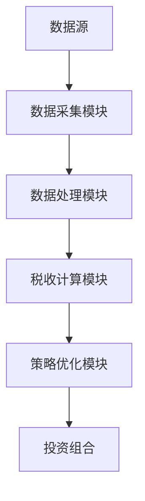

                 

# 格雷厄姆特价股票策略在不同税收环境下的调整

> 关键词：格雷厄姆投资理论，特价股票，税收影响，投资策略，数学模型

> 摘要：本文详细探讨了格雷厄姆特价股票策略在不同税收环境下的调整方法。首先介绍了格雷厄姆投资理论的核心思想，然后分析了税收对投资策略的影响，最后通过数学模型和具体案例展示了如何在不同税收环境下优化投资策略。

---

## 第1章: 格雷厄姆特价股票策略概述

### 1.1 格雷厄姆特价股票策略的基本概念

#### 1.1.1 格雷厄姆投资理论的核心思想
格雷厄姆的投资理论以“价值投资”为核心，强调购买那些市场价格低于其内在价值的股票。他认为市场短期是投票机，长期是称重机，因此投资者应该关注企业的内在价值，而不是短期市场波动。

#### 1.1.2 特价股票的定义与特征
特价股票是指市场价格远低于其内在价值的股票。这类股票通常具有以下特征：
- 低市盈率（P/E比率）
- 低市净率（P/B比率）
- 高股息率
- 高安全边际

#### 1.1.3 格雷厄姆策略在现代投资中的地位
尽管格雷厄姆的投资理论诞生于20世纪，但其核心思想在今天仍然具有重要的指导意义。许多投资者，尤其是机构投资者和长期投资者，仍然采用或参考格雷厄姆的策略进行投资。

---

## 第2章: 不同税收环境下的投资策略调整

### 2.1 税收对投资策略的影响

#### 2.1.1 税收在投资中的作用
税收是影响投资收益的重要因素。不同的税收政策会直接影响投资者的净收益，从而影响其投资决策。例如，资本利得税和股息税会直接影响股票投资的净收益。

#### 2.1.2 不同税收环境下的投资策略差异
不同国家和地区的税收政策差异会导致投资者在选择股票和调整投资策略时需要考虑税收因素。例如，在税率较高的国家，投资者可能会倾向于选择税后收益更高的股票，或者通过长期持有来享受较低的税率。

#### 2.1.3 税收对股票收益的具体影响
税收对股票收益的影响主要体现在以下几个方面：
- **资本利得税**：卖出股票时的资本收益需要缴纳资本利得税，税率因持有时间长短而异。
- **股息税**：股票分红收入需要缴纳股息税，税率因国家而异。
- **其他税费**：如交易税费、过户费等。

---

## 第3章: 格雷厄姆策略的核心概念与数学模型

### 3.1 格雷厄姆策略的核心概念

#### 3.1.1 内在价值的计算方法
内在价值是格雷厄姆策略的核心概念之一，计算公式为：
$$ V = \frac{E}{P} $$
其中，$V$ 表示内在价值，$E$ 表示每股收益，$P$ 表示每股价格。

#### 3.1.2 市场价值与内在价值的关系
市场价值是指股票的市场价格，而内在价值是基于公司基本面计算出的理论价值。当市场价值低于内在价值时，股票具有投资价值。

#### 3.1.3 安全边际的定义与作用
安全边际是市场价格与内在价值之间的差额，计算公式为：
$$ M = P - V $$
其中，$M$ 表示安全边际，$P$ 表示市场价格，$V$ 表示内在价值。安全边际越大，投资风险越小。

### 3.2 格雷厄姆策略的数学模型

#### 3.2.1 内在价值计算公式
$$ V = \frac{E}{P} $$
例如，某股票的每股收益为 $1.00，市场价格为 $20.00，则其内在价值为：
$$ V = \frac{1.00}{20.00} = 0.05 $$

#### 3.2.2 安全边际计算公式
$$ M = P - V $$
例如，某股票的市场价格为 $20.00，内在价值为 $0.05，则其安全边际为：
$$ M = 20.00 - 0.05 = 19.95 $$

---

## 第4章: 格雷厄姆策略在不同税收环境下的调整

### 4.1 税收对股票投资收益的影响

#### 4.1.1 美国税收环境下的策略调整
在美国，资本利得税的税率根据持有时间长短而变化：
- 短期资本利得税（持有时间不超过1年）：税率较高，通常为普通收入税率。
- 长期资本利得税（持有时间超过1年）：税率较低，通常为 15% 或 20%。

因此，在美国，投资者可以通过长期持有股票来享受较低的资本利得税。

#### 4.1.2 中国税收环境下的策略调整
在中国，资本利得税的税率通常为 20%，但不同地区和政策可能会有所变化。此外，股息税的税率较高，通常为 20%。因此，在中国，投资者需要更加关注股息税的影响，尽量选择股息税较低的股票。

#### 4.1.3 英国税收环境下的策略调整
在英国，资本利得税的税率通常为 10%（应纳税所得额不超过 43,000 英镑）或 20%（超过 43,000 英镑）。此外，股息税的税率较高，通常为 30%。因此，在英国，投资者需要更加关注资本利得税和股息税的双重影响。

---

## 第5章: 系统分析与架构设计

### 5.1 系统功能设计

#### 5.1.1 数据采集模块
数据采集模块负责收集股票的基本信息，包括市场价格、每股收益、股息率等。

#### 5.1.2 税收计算模块
税收计算模块根据不同的税收政策，计算股票投资的税后收益。

#### 5.1.3 策略优化模块
策略优化模块根据税后收益，优化投资组合，选择最优的股票组合。

### 5.2 系统架构图

---

## 第6章: 项目实战

### 6.1 美国市场案例分析

#### 6.1.1 环境分析
在美国市场，资本利得税的税率较低，适合长期持有股票。

#### 6.1.2 策略调整步骤
1. 选择市场价格低于内在价值的股票。
2. 计算税后收益，考虑资本利得税的影响。
3. 优化投资组合，选择最优的股票组合。

#### 6.1.3 案例结果
通过长期持有股票，投资者可以享受较低的资本利得税，从而获得更高的税后收益。

### 6.2 中国市场案例分析

#### 6.2.1 环境分析
在中国市场，股息税较高，投资者需要更加关注股息税的影响。

#### 6.2.2 策略调整步骤
1. 选择股息率低的股票。
2. 计算税后收益，考虑资本利得税和股息税的影响。
3. 优化投资组合，选择最优的股票组合。

#### 6.2.3 案例结果
通过选择股息率低的股票，投资者可以减少股息税的负担，从而提高税后收益。

### 6.3 英国市场案例分析

#### 6.3.1 环境分析
在英国市场，资本利得税和股息税的税率较高，投资者需要综合考虑两者的影响。

#### 6.3.2 策略调整步骤
1. 选择市场价格低于内在价值的股票。
2. 计算税后收益，考虑资本利得税和股息税的影响。
3. 优化投资组合，选择最优的股票组合。

#### 6.3.3 案例结果
通过优化投资组合，投资者可以在英国市场中获得较高的税后收益。

---

## 第7章: 总结与展望

### 7.1 总结
本文详细探讨了格雷厄姆特价股票策略在不同税收环境下的调整方法。通过分析不同国家和地区的税收政策，提出了优化投资组合的具体步骤，并通过具体案例展示了如何在不同税收环境下调整策略。

### 7.2 展望
未来，随着全球化的深入，税收政策可能会更加复杂，投资者需要更加关注税收对投资策略的影响。同时，随着技术的进步，投资者可以通过大数据和人工智能等技术手段，进一步优化投资策略，提高投资收益。

---

## 作者：AI天才研究院/AI Genius Institute & 禅与计算机程序设计艺术 /Zen And The Art of Computer Programming

