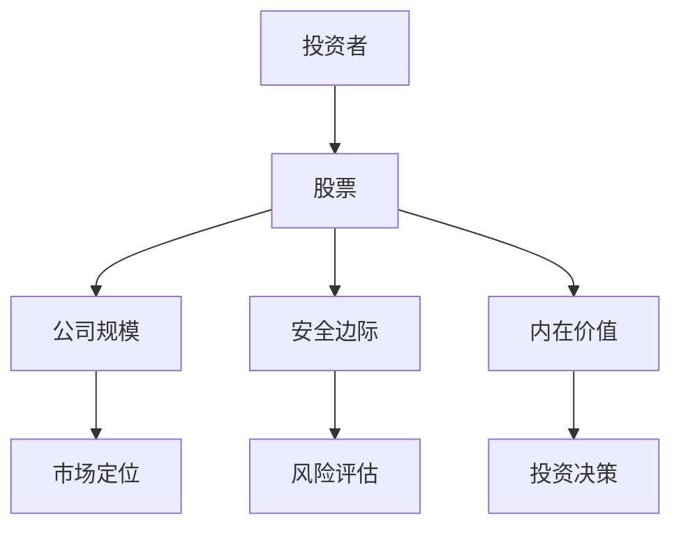
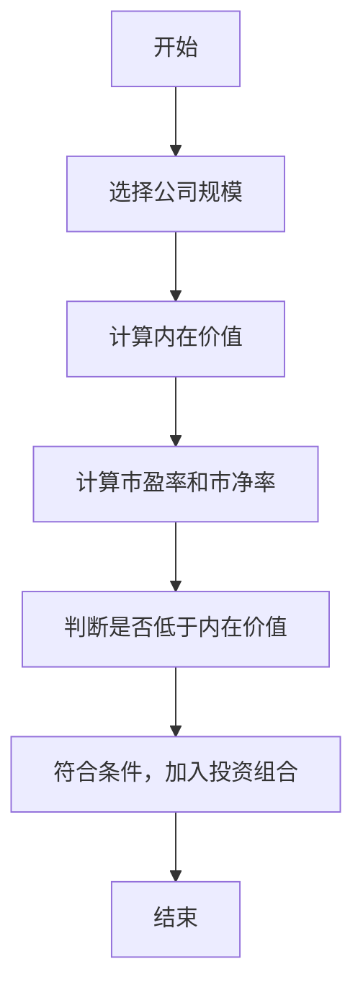
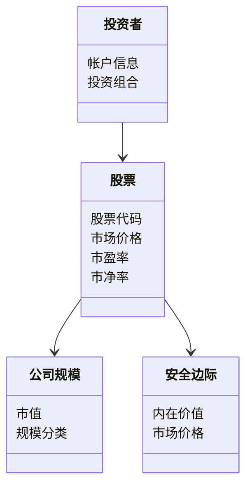
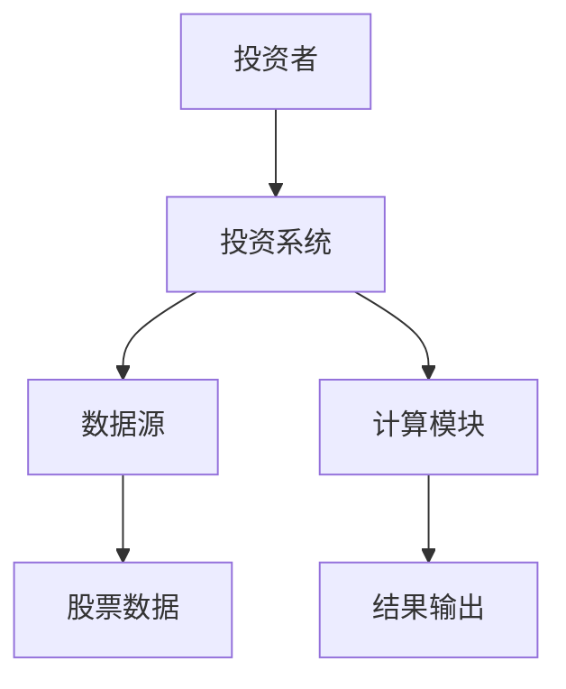
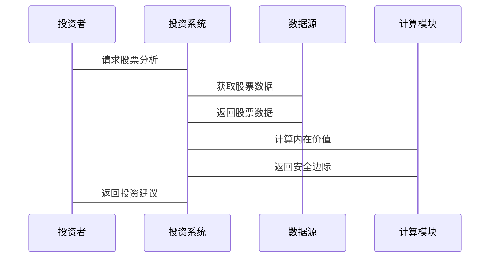

                 


# 格雷厄姆特价股票策略在不同规模公司中的应用

## 关键词：格雷厄姆投资理论，特价股票策略，安全边际，公司规模，股票分析，价值投资

## 摘要：本文深入探讨了格雷厄姆的特价股票策略在不同规模公司中的应用。通过分析格雷厄姆的投资理论、安全边际的概念、数学模型和实际案例，本文详细解释了如何在小型、中型和大型公司中应用特价股票策略。文章结合理论与实践，提供了详细的算法原理、系统设计和项目实战，帮助读者全面理解并掌握格雷厄姆策略在不同规模公司中的应用。

---

## 第一部分：背景介绍

### 第1章：特价股票策略的背景与核心概念

#### 1.1 格雷厄姆投资理论概述

- **问题背景**：格雷厄姆的价值投资理论是基于“安全边际”概念，强调以低于内在价值的价格购买优质股票。这种策略在市场波动中表现尤为突出。
- **问题描述**：在不同规模的公司中，格雷厄姆策略的应用存在差异，尤其是在公司规模、财务指标和市场定位方面。
- **问题解决方法**：通过分析公司规模与策略适应性，优化投资组合，最大化收益并降低风险。
- **边界与外延**：格雷厄姆策略适用于稳定成长的公司，但不适用于高波动性和周期性行业。

#### 1.2 特价股票策略的定义与特点

- **定义**：特价股票是指价格低于其内在价值的股票，通常具有较高的安全边际。
- **特点**：
  - 低市盈率和低市净率。
  - 公司具有稳定的盈利能力。
  - 市场对公司的负面情绪导致低估。

#### 1.3 特价股票策略的应用背景

- **经济周期与市场波动**：在熊市或市场低谷时，特价股票策略更为有效。
- **不同市场环境下的策略适用性**：在牛市中，策略需要调整，关注安全边际较高的股票。
- **策略的边界与外延**：适用于成长型公司，但需避免周期性行业和高风险公司。

---

## 第二部分：核心概念与联系

### 第2章：格雷厄姆投资理论的核心要素

#### 2.1 安全边际的计算与应用

- **安全边际的计算公式**：
  $$ \text{安全边际} = \text{内在价值} - \text{市场价格} $$
- **安全边际与股票价值的关系**：安全边际越大，投资风险越小。

#### 2.2 特价股票与公司规模的关系

- **公司规模的分类**：
  - 小型公司：市值低于10亿美元。
  - 中型公司：市值在10亿至50亿美元之间。
  - 大型公司：市值超过50亿美元。
- **不同规模公司的策略差异**：
  - 小型公司：更容易出现低估，但风险也更大。
  - 中型公司：兼具成长性和稳定性。
  - 大型公司：安全边际较小，但更稳定。

#### 2.3 核心概念的对比分析

| 公司规模 | 特点 | 投资策略 |
|----------|------|----------|
| 小型     | 高增长，高风险 | 重点关注低市盈率，注重安全边际 |
| 中型     | 稳定增长，风险适中 | 综合评估市盈率和市净率 |
| 大型     | 稳定，高市值 | 侧重于行业龙头，关注分红率 |

#### 2.4 实体关系图（ER图）



---

## 第三部分：算法原理讲解

### 第3章：特价股票策略的数学模型

#### 3.1 格雷厄姆内在价值计算公式

- **内在价值公式**：
  $$ \text{内在价值} = \frac{\text{每股收益} \times (8.5 + 市盈率)}{市盈率} $$
- **市盈率计算公式**：
  $$ \text{市盈率} = \frac{\text{股价}}{\text{每股收益}} $$

#### 3.2 市净率计算公式

- **市净率公式**：
  $$ \text{市净率} = \frac{\text{股价}}{\text{每股净资产}} $$

#### 3.3 算法流程图（Mermaid）



#### 3.4 Python代码实现

```python
def calculate_intrinsic_value(eps, pe_ratio):
    return (eps * (8.5 + pe_ratio)) / pe_ratio

def calculate_market_price(intrinsic_value, margin_of_safety):
    return intrinsic_value * (1 - margin_of_safety)

# 示例计算
eps = 5
pe_ratio = 10
margin_of_safety = 0.3

intrinsic_value = calculate_intrinsic_value(eps, pe_ratio)
market_price = calculate_market_price(intrinsic_value, margin_of_safety)

print(f"内在价值: ${intrinsic_value:.2f}")
print(f"市场价格: ${market_price:.2f}")
```

---

## 第四部分：系统分析与架构设计方案

### 第4章：系统功能设计与架构

#### 4.1 问题场景介绍

- **目标**：构建一个基于格雷厄姆策略的投资系统，适用于不同规模的公司。
- **用户需求**：投资者需要快速评估公司是否符合特价股票策略。

#### 4.2 系统功能设计（领域模型）



#### 4.3 系统架构设计（Mermaid）



#### 4.4 系统接口设计

- **输入接口**：股票代码、公司规模。
- **输出接口**：内在价值、市场价格、安全边际。

#### 4.5 系统交互设计（Mermaid）



---

## 第五部分：项目实战

### 第5章：格雷厄姆策略的项目实现

#### 5.1 环境安装

```bash
pip install pandas numpy matplotlib
```

#### 5.2 核心代码实现

```python
import pandas as pd

def calculate_pe_ratio(df):
    df['PE Ratio'] = df['股价'] / df['每股收益']
    return df

def calculate_pricing_suggestion(df):
    df['投资建议'] = df.apply(lambda x: '买入' if x['市场价格'] < x['内在价值'] else '观望', axis=1)
    return df

# 示例数据
data = {
    '股票代码': ['AAPL', 'MSFT', 'TSLA'],
    '股价': [300, 300, 600],
    '每股收益': [10, 15, 20]
}

df = pd.DataFrame(data)
df = calculate_pe_ratio(df)
df = calculate_pricing_suggestion(df)
print(df)
```

#### 5.3 实际案例分析

- **案例公司**：苹果（AAPL）
  - 市价：300美元
  - 每股收益：10美元
  - 内在价值：250美元
  - 投资建议：买入

- **案例公司**：特斯拉（TSLA）
  - 市价：600美元
  - 每股收益：20美元
  - 内在价值：500美元
  - 投资建议：观望

#### 5.4 项目小结

通过代码实现和案例分析，验证了格雷厄姆策略在不同规模公司中的应用。投资者可以根据市场价格与内在价值的对比，制定有效的投资策略。

---

## 第六部分：最佳实践

### 第6章：格雷厄姆策略的最佳实践

#### 6.1 小结

- 格雷厄姆策略强调安全边际和内在价值。
- 不同规模的公司需要不同的策略应用。
- 投资者应结合市场环境和公司基本面进行决策。

#### 6.2 注意事项

- 避免短期市场波动影响判断。
- 定期评估投资组合。
- 避免过度集中投资。

#### 6.3 拓展阅读

- 《The Intelligent Investor》——本杰明·格雷厄姆
- 《价值投资实战策略》——李录

---

## 作者：AI天才研究院/AI Genius Institute & 禅与计算机程序设计艺术 /Zen And The Art of Computer Programming

