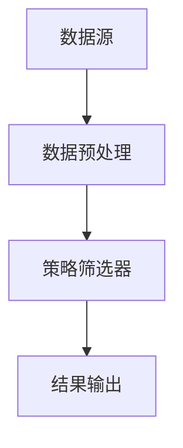

                 


```markdown
# 格雷厄姆特价股票策略在不同货币政策周期下的调整

> 关键词：格雷厄姆策略、货币政策周期、股市投资、股票筛选、价值投资

> 摘要：本文详细探讨了格雷厄姆特价股票策略在不同货币政策周期下的调整方法。通过分析货币政策周期对股市的影响，提出在扩张和紧缩周期下如何优化格雷厄姆策略，利用数学模型和Python代码实现策略调整，并通过案例分析验证其有效性。文章还介绍了系统架构设计和项目实战，帮助读者更好地理解和应用这些策略。

---

## 第一部分: 格雷厄姆特价股票策略概述

### 第1章: 格雷厄姆投资理论的核心概念

#### 1.1 价值投资的基本原理
格雷厄姆的价值投资理论强调购买被市场低估的股票，核心在于识别“烟屁股”股票，即那些市场价格远低于其内在价值的股票。这种策略在市场低迷或经济紧缩时期表现尤为突出，因为此时许多优质股票可能被低估。

#### 1.2 特价股票的定义与特点
- **定义**：特价股票是指市场价格低于其内在价值的股票，通常通过市盈率（P/E）、市净率（P/B）等指标来衡量。
- **特点**：低估值、高分红率、行业龙头、抗跌性强。

#### 1.3 格雷厄姆策略的历史发展
格雷厄姆在20世纪初提出价值投资理念，强调安全边际和内在价值。随着市场环境的变化，投资者不断调整策略，使其适应不同的经济周期。

---

### 第2章: 货币政策周期的基本概念

#### 2.1 货币政策周期的定义
货币政策周期指中央银行根据经济状况调整货币供应量和利率的过程，包括扩张性货币政策和紧缩性货币政策。

#### 2.2 扩张性货币政策与紧缩性货币政策的特征
- **扩张性货币政策**：降低利率、增加货币供应，刺激经济增长。
- **紧缩性货币政策**：提高利率、减少货币供应，抑制通货膨胀。

#### 2.3 货币政策对股市的影响机制
- **扩张周期**：低利率和高流动性推高股价，市场活跃。
- **紧缩周期**：高利率和低流动性导致股价下跌，市场波动性增加。

---

## 第二部分: 格雷厄姆策略在不同货币政策周期下的调整

### 第3章: 货币政策周期对股市的影响

#### 3.1 扩张性货币政策下的股市表现
- **市场表现**：股市上涨，投资者风险偏好增加。
- **策略调整**：增加对高成长性股票的关注，适当放宽市盈率标准。

#### 3.2 紧缩性货币政策下的股市表现
- **市场表现**：股市下跌，投资者风险偏好降低。
- **策略调整**：注重低市盈率和低市净率的股票，增加防御性股票的配置。

---

### 第4章: 格雷厄姆策略的数学模型与调整

#### 4.1 市盈率（P/E）的计算与调整
- **公式**：$$市盈率 = \frac{股价}{每股收益}$$
- **调整策略**：在扩张周期，目标市盈率上限可适当提高；在紧缩周期，目标市盈率下限应降低。

#### 4.2 市净率（P/B）的计算与调整
- **公式**：$$市净率 = \frac{股价}{每股净资产}$$
- **调整策略**：在紧缩周期，市净率低于2倍的股票更具吸引力。

#### 4.3 综合筛选模型
- **公式**：$$综合得分 = (1 - \frac{市盈率}{目标市盈率}) \times 50\% + (1 - \frac{市净率}{目标市净率}) \times 50\%$$
- **调整策略**：根据当前货币政策周期调整目标市盈率和市净率。

---

### 第5章: 系统架构与实现

#### 5.1 系统功能设计
- 数据采集：收集股票数据，包括市盈率、市净率等。
- 策略筛选：根据货币政策周期调整筛选条件。
- 结果输出：生成符合策略的股票列表。

#### 5.2 系统架构设计


#### 5.3 接口设计
- 数据接口：从金融数据库获取股票数据。
- 策略接口：根据货币政策周期动态调整筛选条件。

---

### 第6章: 项目实战

#### 6.1 环境安装
- 安装Python、Pandas、NumPy等库。

#### 6.2 核心代码实现
```python
import pandas as pd
import numpy as np

def graham_strategy(data, period='expansion'):
    # 根据周期调整筛选条件
    if period == 'expansion':
        low_pe = 8
        low_pb = 1.5
    else:
        low_pe = 10
        low_pb = 2

    # 筛选低市盈率和低市净率的股票
    selected = data[(data['PE'] < low_pe) & (data['PB'] < low_pb)]
    return selected

# 示例数据
data = {
    'PE': [12, 8, 15, 7],
    'PB': [2, 1.5, 3, 1]
}
df = pd.DataFrame(data)
result = graham_strategy(df, 'expansion')
print(result)
```

---

### 第7章: 结论与展望

#### 7.1 结论
格雷厄姆策略在不同货币政策周期下需要灵活调整，特别是在紧缩周期，应更加注重低估值指标。

#### 7.2 展望
未来研究可结合机器学习算法，进一步优化股票筛选模型，提高策略的有效性。

---

作者：AI天才研究院/AI Genius Institute & 禅与计算机程序设计艺术 /Zen And The Art of Computer Programming
```

