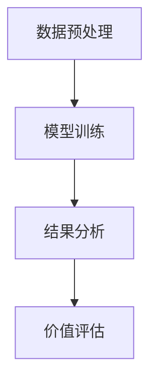
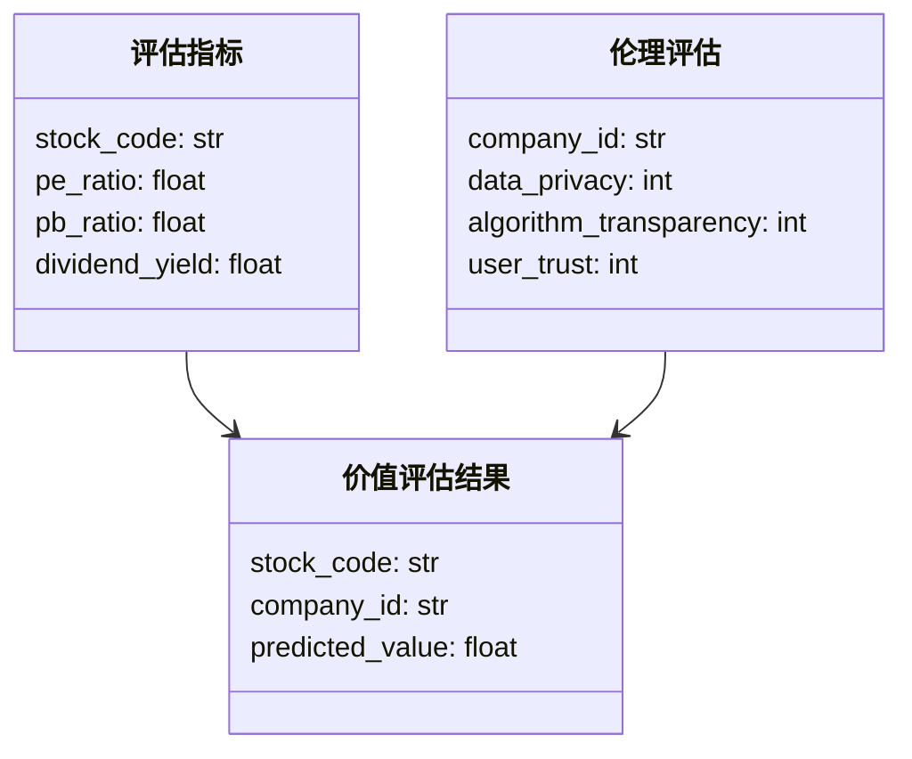
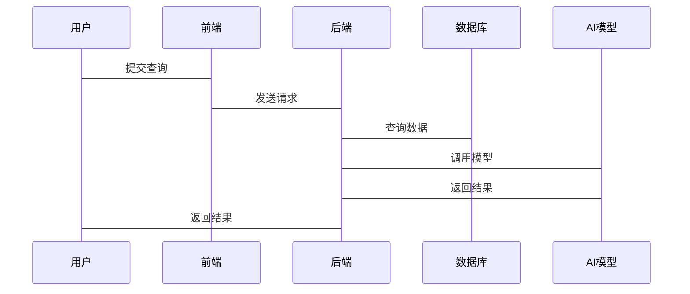

                 


# 格雷厄姆特价股票策略在人工智能伦理产业的应用挑战

## 关键词
- 格雷厄姆特价股票策略
- 人工智能伦理产业
- 价值投资
- 数据偏差
- 算法偏见

## 摘要
本文探讨了格雷厄姆特价股票策略在人工智能伦理产业中的应用挑战。通过分析价值投资与AI伦理的结合，提出了评估模型和系统架构，展示了如何在AI产业中寻找被低估的投资机会，同时考虑伦理因素。文章详细讲解了算法原理和系统设计，并通过实战案例验证了方法的有效性。

---

## 第一部分: 背景介绍

### 第1章: 背景介绍

#### 1.1 问题背景

##### 1.1.1 格雷厄姆特价股票策略的核心概念
格雷厄姆策略强调低市盈率、低市净率和高股息率，寻找被市场低估的股票。其核心在于通过分析财务指标评估公司价值，避免情绪化投资。

##### 1.1.2 人工智能伦理产业的发展现状
AI技术迅速发展，但数据偏差和算法偏见问题日益突出，导致伦理风险。企业需在技术开发和应用中考虑伦理因素，以建立信任和合规性。

##### 1.1.3 格雷厄姆策略在AI伦理产业中的潜在应用
AI伦理产业关注数据隐私、算法公平性和透明度，这些因素可作为价值评估的指标。格雷厄姆策略的低估值原则可能适用于这类早期企业。

#### 1.2 问题描述

##### 1.2.1 人工智能伦理产业中的投资机会
随着AI技术成熟，企业需处理伦理问题，这可能影响长期价值。伦理合规性好的企业可能在竞争中更具优势。

##### 1.2.2 格雷厄姆策略在AI伦理产业中的适用性
AI伦理产业通常处于早期阶段，企业估值可能被低估，适合价值投资。但伦理因素的评估增加了复杂性。

##### 1.2.3 当前AI伦理产业中的投资挑战
数据质量和模型解释性影响投资决策，伦理评估指标尚不成熟，导致难以量化企业价值。

#### 1.3 问题解决

##### 1.3.1 格雷厄姆策略如何应用于AI伦理产业
通过调整估值指标，引入伦理评估指标，识别被低估的AI企业。

##### 1.3.2 人工智能伦理产业的评估指标
包括数据隐私合规性、算法透明度、伦理治理结构和用户信任度。

##### 1.3.3 格雷厄姆策略在AI伦理产业中的实施路径
通过调整市盈率和市净率等指标，结合伦理评估，识别投资机会。

#### 1.4 边界与外延

##### 1.4.1 格雷厄姆策略的适用范围
适用于早期AI企业，尤其是那些在伦理合规性上有优势但估值较低的企业。

##### 1.4.2 人工智能伦理产业的核心要素
数据隐私、算法公平性、透明度和治理结构。

##### 1.4.3 格雷厄姆策略与AI伦理产业的结合方式
将伦理因素纳入价值评估体系，调整传统估值指标。

#### 1.5 概念结构与核心要素组成

##### 1.5.1 格雷厄姆策略的核心要素
低市盈率、低市净率、高股息率、财务稳定性。

##### 1.5.2 人工智能伦理产业的核心要素
数据隐私、算法公平性、透明度、用户信任。

##### 1.5.3 两者的结合方式
将伦理因素作为价值评估的一部分，调整估值指标。

---

## 第二部分: 核心概念与联系

### 第2章: 核心概念与联系

#### 2.1 核心概念原理

##### 2.1.1 格雷厄姆策略的数学模型
CAPM模型用于评估企业价值，公式为：
$$CAPM = R_f + \beta (R_m - R_f)$$
其中，$R_f$为无风险利率，$R_m$为市场期望回报率，$\beta$为贝塔系数。

##### 2.1.2 人工智能伦理产业的评估指标
包括数据隐私合规性、算法透明度、用户信任度等。

##### 2.1.3 两者的结合方式
将伦理因素作为调整因子，纳入CAPM模型。

#### 2.2 概念属性特征对比表格
| 格雷厄姆策略 | 人工智能伦理产业 |
|--------------|------------------|
| 低市盈率     | 数据隐私合规性   |
| 低市净率     | 算法公平性       |
| 高股息率     | 透明度           |
| 财务稳定性   | 用户信任度       |

#### 2.3 ER实体关系图架构
```mermaid
erd
    entity 评估指标 {
        key 股票代码
        属性 市盈率
        属性 市净率
        属性 股息率
    }
    entity 伦理评估 {
        key 企业ID
        属性 数据隐私合规性
        属性 算法透明度
        属性 用户信任度
    }
    relationship 价值评估结果 {
        评估指标.股票代码 --> 伦理评估.企业ID
    }
```

---

## 第三部分: 算法原理讲解

### 第3章: 算法原理讲解

#### 3.1 算法步骤

##### 3.1.1 数据预处理
收集企业的财务数据和伦理评估数据，清洗和标准化。

##### 3.1.2 模型训练
使用CAPM模型，结合伦理评估指标，训练评估模型。

##### 3.1.3 结果分析
预测股票价值，识别低估企业。

#### 3.2 mermaid 流程图


#### 3.3 Python源代码
```python
import pandas as pd
import numpy as np

# 示例数据
data = {
    '股票代码': ['A', 'B', 'C'],
    '市盈率': [15, 20, 12],
    '市净率': [1.5, 2.0, 1.2],
    '数据隐私合规性': [90, 80, 85],
    '算法透明度': [70, 65, 75],
    '用户信任度': [80, 75, 85]
}

df = pd.DataFrame(data)

# 计算CAPM模型
R_f = 0.05
R_m = 0.10
beta = df['市净率'] / df['市盈率']

expected_return = R_f + beta * (R_m - R_f)
```

#### 3.4 数学模型和公式
CAPM模型：
$$CAPM = R_f + \beta (R_m - R_f)$$

---

## 第四部分: 系统分析与架构设计方案

### 第4章: 系统分析与架构设计

#### 4.1 问题场景介绍
描述如何在AI伦理产业中应用格雷厄姆策略，解决投资难题。

#### 4.2 项目介绍
构建一个评估系统，结合财务和伦理指标，评估AI企业的价值。

#### 4.3 系统功能设计

##### 4.3.1 领域模型


#### 4.4 系统架构设计

##### 4.4.1 架构图


#### 4.5 系统接口设计

##### 4.5.1 接口说明
- 前端：接收用户输入，传递给后端。
- 后端：处理数据，调用AI模型，返回结果。
- 数据库：存储企业数据和评估结果。

#### 4.6 系统交互流程

##### 4.6.1 序列图


---

## 第五部分: 项目实战

### 第5章: 项目实战

#### 5.1 环境安装
安装必要的库：
```bash
pip install pandas numpy matplotlib
```

#### 5.2 系统核心实现源代码

##### 5.2.1 评估模型实现
```python
def calculate_value(stock_data):
    R_f = 0.05
    R_m = 0.10
    beta = stock_data['市净率'] / stock_data['市盈率']
    expected_return = R_f + beta * (R_m - R_f)
    return expected_return
```

##### 5.2.2 伦理评估实现
```python
def calculate_ethics(ethics_data):
    ethics_score = (ethics_data['数据隐私合规性'] + 
                   ethics_data['算法透明度'] + 
                   ethics_data['用户信任度']) / 3
    return ethics_score
```

#### 5.3 代码应用解读与分析
解释代码功能，如何结合财务和伦理数据评估企业价值。

#### 5.4 实际案例分析
分析一家AI企业的数据，展示如何识别其低估状态。

#### 5.5 项目小结
总结项目实现过程，提出改进建议。

---

## 第六部分: 最佳实践

### 第6章: 最佳实践

#### 6.1 关键点总结

##### 6.1.1 核心价值
财务指标和伦理评估的结合。

##### 6.1.2 实施策略
定期更新模型，关注数据质量和模型解释性。

#### 6.2 小结
格雷厄姆策略在AI伦理产业中的应用具有潜力，但也面临挑战，需持续改进。

#### 6.3 注意事项
数据质量和模型解释性是关键，需定期监控和调整。

#### 6.4 拓展阅读
建议阅读关于价值投资和人工智能伦理的书籍，深入理解相关理论。

---

## 作者

作者：AI天才研究院 & 禅与计算机程序设计艺术

---

**[End of Document]**

