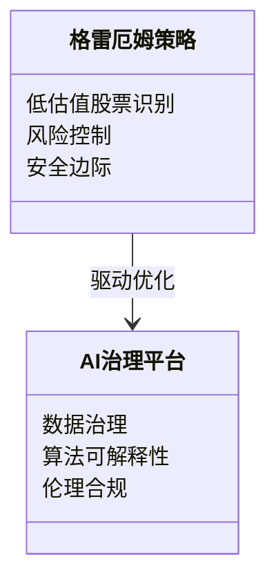
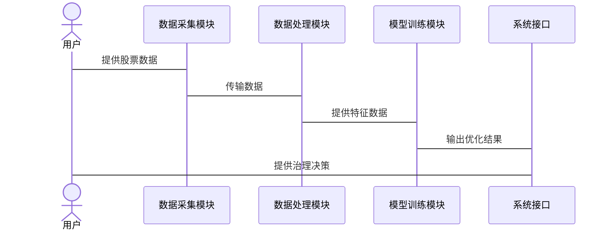

                 


# 格雷厄姆特价股票策略在人工智能治理产业的应用挑战

## 关键词：格雷厄姆策略，人工智能治理，投资决策，数据驱动，风险控制

## 摘要：  
本文探讨了格雷厄姆特价股票策略在人工智能治理产业中的应用挑战。通过对格雷厄姆策略的核心原理、人工智能治理的核心问题，以及两者结合的创新应用进行深入分析，揭示了数据驱动决策在投资与治理中的潜在价值。文章从背景介绍、核心概念、算法原理、系统架构、项目实战等多维度展开，为读者提供了全面的技术解读和实践指导。

---

## 第一部分：背景介绍

### 第1章：问题背景与问题描述

#### 1.1 格雷厄姆特价股票策略的核心概念

##### 1.1.1 什么是格雷厄姆特价股票策略  
格雷厄姆特价股票策略是由本杰明·格雷厄姆提出的一种投资策略，专注于寻找被市场低估的股票，通过基本面分析和安全边际原则进行投资。其核心在于“买入低于内在价值的股票”，并在市场波动中长期持有，等待价值回归。

##### 1.1.2 格雷厄姆策略的核心要素  
- **安全边际**：买入价格低于内在价值，确保投资的安全性。  
- **低估值股票**：选择市盈率、市净率等指标低于行业平均水平的股票。  
- **长期投资**：避免短期市场波动，关注企业的长期价值。  

##### 1.1.3 格雷厄姆策略在投资中的应用场景  
- **价值投资**：寻找被市场忽视的优质企业。  
- **风险管理**：通过分散投资和安全边际降低风险。  
- **长期财富积累**：通过长期持有优质资产实现财富增长。  

#### 1.2 人工智能治理产业的背景

##### 1.2.1 人工智能技术的发展现状  
人工智能技术近年来快速发展，广泛应用于金融、医疗、交通等领域。然而，技术的快速发展也带来了数据隐私、算法偏见、伦理道德等治理问题。

##### 1.2.2 人工智能治理的核心问题  
- **数据隐私**：数据收集、存储和使用中的隐私保护问题。  
- **算法透明性**：算法决策的可解释性和公平性问题。  
- **伦理合规**：AI技术在应用中的道德规范和法律合规问题。  

##### 1.2.3 人工智能治理的行业应用  
- **金融行业**：AI算法用于股票交易和风险管理。  
- **医疗行业**：AI辅助诊断和治疗决策。  
- **交通行业**：自动驾驶技术的伦理与安全问题。  

#### 1.3 格雷厄姆策略与人工智能治理的结合

##### 1.3.1 格雷厄姆策略在AI治理中的潜在价值  
- **数据驱动决策**：通过数据挖掘和分析优化治理策略。  
- **风险控制**：利用格雷厄姆策略的风险控制方法降低治理成本。  
- **长期投资视角**：从长期角度优化AI治理的资源配置。  

##### 1.3.2 人工智能治理中的数据驱动决策  
- 数据是AI治理的核心资源，通过数据驱动的方法优化治理决策。  
- 格雷厄姆策略的低估值股票理念与数据驱动的治理优化具有相似性。  

##### 1.3.3 格雷厄姆策略在AI治理中的创新应用  
- 将格雷厄姆策略的低估值理念应用于AI治理的资源优化配置。  
- 结合AI技术实现数据驱动的治理决策优化。  

### 第2章：问题解决思路与边界分析

#### 2.1 格雷厄姆策略在AI治理中的问题解决思路

##### 2.1.1 数据驱动的决策优化  
- 利用AI技术分析市场数据，识别低估值的治理资源。  
- 通过数据挖掘发现治理中的潜在风险和优化机会。  

##### 2.1.2 风险控制与投资组合管理  
- 格雷厄姆策略的风险控制方法应用于AI治理的资源分配。  
- 通过分散投资降低治理中的单一风险点。  

##### 2.1.3 人工智能技术的可解释性  
- 确保AI算法的可解释性，避免治理决策中的黑箱问题。  
- 结合格雷厄姆策略的安全边际理念，优化AI算法的决策过程。  

#### 2.2 人工智能治理中的边界与外延

##### 2.2.1 AI治理的边界问题  
- AI治理的范围和边界需要明确，避免过度干预或遗漏关键问题。  
- 格雷厄姆策略的应用需要考虑治理的边界限制。  

##### 2.2.2 格雷厄姆策略在AI治理中的适用范围  
- 适用于数据驱动的治理优化场景。  
- 适用于风险可控的治理资源配置。  

##### 2.2.3 格雷厄姆策略与AI治理的结合边界  
- 格雷厄姆策略的低估值理念与AI治理的优化目标具有一定的相似性。  
- 需要结合具体场景确定策略的应用范围和边界。  

#### 2.3 核心概念与结构分析

##### 2.3.1 核心概念对比表格  
| 核心概念 | 格雷厄姆策略 | 人工智能治理 |
|----------|--------------|--------------|
| 目标     | 低估值投资   | 数据驱动治理 |
| 方法     | 基本面分析   | AI技术应用   |
| 风险     | 安全边际     | 可解释性      |

##### 2.3.2 ER实体关系图  
```mermaid
erDiagram
    customer[客户] {
        id : integer
        name : string
    }
    transaction[交易] {
        id : integer
        time : datetime
        amount : decimal
    }
    account[账户] {
        id : integer
        balance : decimal
    }
    customer -> transaction : 进行
    customer -> account : 拥有
    transaction -> account : 影响
```

---

## 第二部分：格雷厄姆策略与人工智能治理的核心概念与联系

### 第3章：核心概念原理与联系

#### 3.1 格雷厄姆策略的核心原理

##### 3.1.1 低估值股票的识别方法  
- 通过市盈率、市净率等指标筛选低估值股票。  
- 结合企业基本面分析，识别具有长期增长潜力的企业。  

##### 3.1.2 风险控制与安全边际  
- 买入价格低于内在价值，确保投资的安全性。  
- 通过分散投资降低市场波动带来的风险。  

##### 3.1.3 长期投资与价值回归理论  
- 长期持有优质资产，等待市场价值回归。  
- 避免短期市场波动，关注企业的长期价值。  

#### 3.2 人工智能治理的核心原理

##### 3.2.1 数据治理与隐私保护  
- 数据是AI治理的核心资源，需要确保数据的隐私性和安全性。  
- 通过数据脱敏、加密等技术保护数据隐私。  

##### 3.2.2 AI算法的可解释性与透明性  
- 确保AI算法的决策过程透明可解释。  
- 避免算法偏见，确保治理决策的公平性。  

##### 3.2.3 AI系统的伦理与合规性  
- 确保AI技术的伦理合规性，避免滥用技术。  
- 通过法律法规和行业规范约束AI技术的应用。  

#### 3.3 格雷厄姆策略与AI治理的联系

##### 3.3.1 数据驱动的投资决策  
- 通过数据分析识别低估值的投资机会。  
- 在AI治理中，通过数据驱动的方法优化治理决策。  

##### 3.3.2 AI技术在风险控制中的应用  
- 利用AI技术预测市场风险，优化投资组合。  
- 在AI治理中，通过AI技术识别潜在风险点，优化资源配置。  

##### 3.3.3 格雷厄姆策略在AI治理中的创新应用  
- 将格雷厄姆策略的低估值理念应用于AI治理的资源优化配置。  
- 结合AI技术实现数据驱动的治理优化。  

---

## 第四部分：系统分析与架构设计方案

### 第4章：系统架构设计

#### 4.1 问题场景介绍

##### 4.1.1 问题场景描述  
- 在金融行业中，AI技术被广泛应用于股票交易和风险管理。  
- 然而，AI算法的不可解释性和数据隐私问题带来了治理挑战。  

##### 4.1.2 项目介绍  
- 开发一个基于格雷厄姆策略的AI治理平台，优化金融行业的治理决策。  
- 通过数据驱动的方法，实现低估值股票的识别和风险控制。  

#### 4.2 系统功能设计

##### 4.2.1 领域模型设计  


##### 4.2.2 系统架构设计  


#### 4.3 系统接口设计

##### 4.3.1 系统接口描述  
- 数据输入接口：接收股票数据和市场数据。  
- 模型调用接口：调用格雷厄姆策略模型和AI治理模型。  
- 结果输出接口：输出优化后的治理决策。  

#### 4.4 系统交互设计

##### 4.4.1 系统交互流程  


---

## 第五部分：项目实战

### 第5章：项目实战

#### 5.1 环境配置

##### 5.1.1 系统环境  
- 操作系统：Linux/Windows/MacOS  
- 开发工具：Python、Jupyter Notebook  
- 依赖库：Pandas、NumPy、Scikit-learn  

##### 5.1.2 数据来源  
- 数据集：股票市场数据（如历史价格、财务指标等）。  
- 数据格式：CSV文件，包含股票代码、价格、交易量等信息。  

#### 5.2 系统核心实现

##### 5.2.1 数据预处理  
```python
import pandas as pd
import numpy as np

# 读取数据
df = pd.read_csv('stock_data.csv')

# 数据清洗
df.dropna(inplace=True)
df['date'] = pd.to_datetime(df['date'])
df.set_index('date', inplace=True)

# 特征提取
df['moving_avg'] = df['price'].rolling(5).mean()
df['std_dev'] = df['price'].rolling(5).std()
```

##### 5.2.2 模型训练  
```python
from sklearn.linear_model import LinearRegression

# 训练格雷厄姆策略模型
model = LinearRegression()
model.fit(df[['moving_avg', 'std_dev']], df['price'])

# 预测股票价格
predicted_prices = model.predict(df[['moving_avg', 'std_dev']])
```

##### 5.2.3 模型评估  
```python
from sklearn.metrics import r2_score

r2 = r2_score(df['price'], predicted_prices)
print(f"模型R²值为：{r2}")
```

#### 5.3 实际案例分析

##### 5.3.1 案例背景  
假设我们有一个股票数据集，包含过去5年的每日收盘价和交易量。我们的目标是利用格雷厄姆策略模型预测未来的股票价格，并优化投资组合。  

##### 5.3.2 数据分析  
```python
import matplotlib.pyplot as plt

plt.figure(figsize=(10, 6))
plt.plot(df['price'], label='实际价格')
plt.plot(predicted_prices, label='预测价格')
plt.xlabel('时间')
plt.ylabel('价格')
plt.legend()
plt.show()
```

##### 5.3.3 模型优化  
```python
from sklearn.ensemble import RandomForestRegressor

# 训练随机森林模型
rf_model = RandomForestRegressor(n_estimators=100)
rf_model.fit(df[['moving_avg', 'std_dev']], df['price'])

# 预测股票价格
rf_predicted_prices = rf_model.predict(df[['moving_avg', 'std_dev']])
```

---

## 第六部分：总结与展望

### 第6章：总结与展望

#### 6.1 核心内容总结  
- 格雷厄姆策略的核心理念是低估值投资，通过安全边际和长期持有实现财富增长。  
- 人工智能治理的核心问题是数据隐私、算法透明性和伦理合规性。  
- 格雷厄姆策略与人工智能治理的结合可以通过数据驱动的方法优化治理决策，降低风险。  

#### 6.2 未来研究方向  
- 探讨更多格雷厄姆策略在AI治理中的创新应用。  
- 结合深度学习技术优化治理模型的可解释性和预测能力。  
- 研究AI技术在不同行业的治理优化中的具体应用。  

#### 6.3 最佳实践 Tips  
- 在实际应用中，建议结合具体场景选择合适的策略和模型。  
- 定期监控和优化模型，确保治理决策的科学性和有效性。  
- 注意数据隐私和算法透明性，确保治理过程的合规性。  

---

## 作者：AI天才研究院/AI Genius Institute & 禅与计算机程序设计艺术/Zen And The Art of Computer Programming

