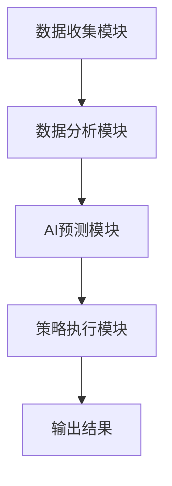

                 


# 格雷厄姆特价股票策略在人工智能驱动的市场中的适应性

> **关键词**：格雷厄姆投资理论、价值投资、人工智能、股票筛选、机器学习  
> **摘要**：本文探讨了格雷厄姆的价值投资策略在人工智能驱动的金融市场的适应性。通过分析传统策略与现代技术的结合，本文提出了基于AI的股票筛选算法，详细讲解了算法实现、系统架构设计及项目实战。

---

## 第一部分: 格雷厄姆特价股票策略的背景与核心概念

### 第1章: 格雷厄姆投资理论概述

#### 1.1 价值投资的基本概念
价值投资是一种以低于内在价值的价格买入优质股票的投资策略，核心在于寻找市场低估的公司。格雷厄姆的安全边际理论强调，投资者应以低于内在价值的价格买入股票，以降低市场波动带来的风险。

#### 1.2 格雷厄姆的安全边际理论
安全边际是股票的内在价值与市场价格之间的差额，确保投资者在市场波动中依然能够获利。公式如下：
$$ \text{安全边际} = \text{内在价值} - \text{市场价格} $$

#### 1.3 特价股票的特征
格雷厄姆定义的特价股票通常具有以下特征：
- 低市盈率（P/E比率）；
- 低市净率（P/B比率）；
- 高股息率；
- 企业盈利稳定。

### 第2章: 人工智能在金融市场中的应用

#### 2.1 数据驱动决策的优势
人工智能通过分析海量数据，能够发现传统方法难以察觉的市场模式和趋势。例如，利用自然语言处理（NLP）分析新闻和社交媒体情绪，预测市场走势。

#### 2.2 机器学习在股票筛选中的应用
机器学习算法（如支持向量机、随机森林）可以用于股票分类和预测。例如，使用回归分析预测股票价格：
$$ \hat{y} = \beta_0 + \beta_1x_1 + \beta_2x_2 + \ldots + \beta_nx_n $$

#### 2.3 AI驱动市场的特点
- 数据量大：每天产生海量交易数据和市场信息；
- 速度更快：算法交易可以在毫秒级别完成；
- 复杂性增加：市场波动受多种因素影响，如社交媒体、新闻事件。

---

## 第二部分: 格雷厄姆策略与人工智能的结合

### 第3章: 格雷厄姆策略的核心要素

#### 3.1 内在价值计算
内在价值是基于公司基本面（收入、利润、资产）计算的未来现金流的现值。公式如下：
$$ V = \sum_{t=1}^{n} \frac{CF_t}{(1 + r)^t} $$
其中，\( V \) 是内在价值，\( CF_t \) 是第 \( t \) 年的现金流，\( r \) 是折现率。

#### 3.2 安全边际的量化
通过比较市场价格与内在价值，计算安全边际：
$$ \text{安全边际} = V - P $$

### 第4章: 人工智能优化格雷厄姆策略

#### 4.1 数据预处理与特征提取
- 数据清洗：去除缺失值和异常值；
- 特征选择：筛选对公司价值影响较大的指标，如ROE（净资产收益率）、EPS（每股收益）。

#### 4.2 基于AI的股票筛选算法
设计一个机器学习模型，结合格雷厄姆的筛选标准和AI的预测能力。例如，使用随机森林进行分类：
1. 收集数据：包括股价、财务指标、市场情绪等；
2. 特征工程：构建特征集合；
3. 模型训练：训练随机森林分类器；
4. 预测与筛选：根据模型预测结果筛选特价股票。

---

## 第三部分: 系统架构与项目实战

### 第5章: 系统架构设计

#### 5.1 系统功能模块
- 数据收集模块：爬取股票数据、新闻、社交媒体信息；
- 数据分析模块：计算内在价值、安全边际；
- AI预测模块：训练模型并预测股票价格；
- 策略执行模块：根据预测结果筛选股票。

#### 5.2 系统架构图


### 第6章: 项目实战

#### 6.1 环境搭建
- 安装Python和相关库（如Pandas、Scikit-learn、TensorFlow）；
- 数据来源：使用Yahoo Finance API获取股票数据。

#### 6.2 核心代码实现
以下是基于格雷厄姆策略的股票筛选算法示例代码：
```python
import pandas as pd
from sklearn.ensemble import RandomForestClassifier
from sklearn.model_selection import train_test_split
from sklearn.metrics import accuracy_score

# 数据预处理
data = pd.read_csv('stock_data.csv')
features = data[['PE', 'PB', 'ROE', 'EPS']]
target = data['Target']  # 1表示是特价股票，0表示否

# 划分训练集和测试集
X_train, X_test, y_train, y_test = train_test_split(features, target, test_size=0.2)

# 训练随机森林模型
model = RandomForestClassifier()
model.fit(X_train, y_train)

# 预测与评估
y_pred = model.predict(X_test)
print("准确率:", accuracy_score(y_test, y_pred))
```

#### 6.3 案例分析
以某科技公司为例，计算其内在价值和安全边际，结合AI模型预测其是否为特价股票。

---

## 第四部分: 最佳实践与总结

### 第7章: 最佳实践

#### 7.1 数据源选择
优先选择高质量的数据源，如Yahoo Finance和Google Finance。

#### 7.2 模型优化
通过超参数调优（如调整树的深度、特征数量）提高模型性能。

#### 7.3 风险管理
结合止损策略和头寸分配，降低投资风险。

### 第8章: 总结与展望

#### 8.1 总结
人工智能为格雷厄姆策略注入了新的活力，通过数据驱动和自动化决策，提升了策略的效率和准确性。

#### 8.2 展望
未来，随着AI技术的进步，格雷厄姆策略在复杂市场中的适应性将得到进一步增强。

---

**作者：AI天才研究院 & 禅与计算机程序设计艺术**

---

通过本文的分析，读者可以清晰地理解格雷厄姆策略在AI驱动市场中的适应性，并掌握如何利用人工智能技术优化投资决策。

