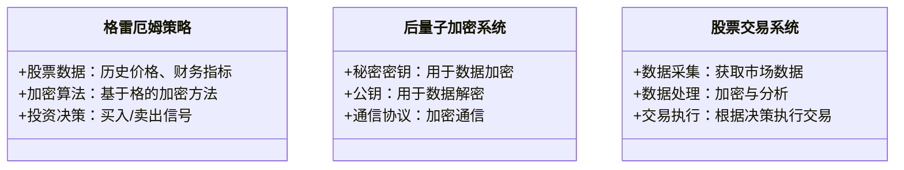

                 


# 格雷厄姆特价股票策略在后量子加密金融时代的应用

> 关键词：格雷厄姆策略，后量子加密，股票投资，金融安全，加密算法

> 摘要：本文探讨了格雷厄姆特价股票策略在后量子加密金融环境下的应用，分析了后量子加密技术的核心原理及其对金融交易安全的影响，结合实际案例，提出了在后量子加密环境下优化格雷厄姆策略的具体方法，旨在为投资者和金融机构提供新的思路和解决方案。

---

# 第一部分: 格雷厄姆特价股票策略与后量子加密金融时代的背景

## 第1章: 格雷厄姆投资理论的核心概念

### 1.1 价值投资的定义与原则
价值投资是一种以基本面分析为基础的投资策略，旨在通过寻找市场价格低于其内在价值的股票，实现长期稳定的收益。其核心原则包括：

1. **安全边际**：买入价格低于内在价值，以确保投资的安全性。
2. **长期视角**：关注企业的长期盈利能力，而非短期市场波动。
3. **分散投资**：通过投资于多个优质企业降低风险。

### 1.2 后量子加密时代的金融环境
后量子加密是指在量子计算机威胁下，使用抗量子密码算法（如基于格、编码理论、多变量方程组等）来保护数据安全的技术。在金融领域，后量子加密技术的应用将重塑传统的数据保护方式，影响股票交易、投资决策等多个环节。

### 1.3 格雷厄姆策略在后量子加密环境下的适应性
后量子加密技术将为金融交易提供更高的安全性，但这也会带来新的挑战。投资者需要重新思考如何在加密环境下，利用格雷厄姆策略寻找被低估的股票。本文将从技术角度分析这一问题，并提出解决方案。

---

# 第二部分: 后量子加密技术的核心原理

## 第2章: 后量子加密技术的数学基础

### 2.1 格的数学模型
格（Lattice）是一种数学结构，由一组基向量张成的空间中的所有点组成。后量子加密算法（如NIST推荐的CRYSTALS-Kyber）基于格的最短向量问题（SVP）和相关问题构建安全性。

#### 格的基本属性
- **基向量**：格的基由线性无关的向量组成。
- **格点**：格中的任意点都可以表示为基向量的线性组合。

#### 格的最短向量问题（SVP）
寻找格中长度最小的非零向量，是格密码学的核心问题之一。SVP的难度为后量子加密提供了安全性保证。

### 2.2 后量子签名算法的原理
基于格的签名算法（如NIST-LightSaber）通过将签名生成和验证过程与格的数学性质结合，实现抗量子攻击的签名功能。

#### 签名生成过程
1. 随机选择秘密参数。
2. 使用秘密参数生成签名。
3. 签名通过哈希函数与消息关联。

#### 签名验证过程
1. 验证签名是否符合数学约束。
2. 检查签名是否匹配消息的哈希值。

### 2.3 后量子加密算法的实现流程
以CRYSTALS-Kyber为例，其加密过程如下：

1. 生成密钥：包括秘密密钥和公钥。
2. 加密过程：将明文嵌入到随机的格点中。
3. 解密过程：通过秘密密钥将密文映射回明文空间。

---

# 第三部分: 格雷厄姆策略与后量子加密的结合应用

## 第3章: 格雷厄姆策略在后量子加密环境下的实现

### 3.1 格雷厄姆策略的数字化转型
为了适应后量子加密环境，格雷厄姆策略需要从传统投资分析向数字化、智能化方向转型。

#### 数字化投资决策的算法实现
1. 数据收集：获取股票的历史价格、财务数据等。
2. 数据分析：使用统计模型评估股票的价值。
3. 投资决策：根据分析结果生成买入或卖出信号。

### 3.2 后量子加密在股票交易中的应用
在后量子加密环境下，股票交易的安全性和数据保护将面临新的挑战。

#### 股票数据的加密存储
- 使用基于格的加密算法对股票数据进行加密存储。
- 数据加密过程需确保高效性和可扩展性。

#### 股票交易的加密通信
- 通过后量子加密算法实现投资者与交易系统之间的安全通信。
- 确保通信过程中的数据完整性与机密性。

### 3.3 格雷厄姆策略与后量子加密的系统集成
为实现格雷厄姆策略在后量子加密环境下的高效应用，需要设计一套完整的系统架构。

#### 系统功能模块划分
1. 数据采集模块：收集股票市场数据。
2. 加密处理模块：对数据进行加密处理。
3. 投资决策模块：基于加密数据生成投资策略。
4. 通信模块：实现加密通信。

#### 系统架构设计
- **领域模型**：股票数据、加密算法、投资决策规则。
- **系统架构**：模块化的分层架构，确保各功能模块独立且高效。

---

## 第4章: 系统分析与架构设计方案

### 4.1 问题场景介绍
在后量子加密环境下，传统的股票交易数据保护方式面临崩溃，投资者需要新的解决方案来确保数据安全。

#### 项目介绍
本项目旨在设计一套基于后量子加密技术的股票投资系统，实现格雷厄姆策略在数字金融环境下的高效应用。

### 4.2 系统功能设计
#### 领域模型设计（Mermaid 类图）


#### 系统架构设计（Mermaid 架构图）


### 4.3 本章小结

---

## 第五部分: 项目实战与代码实现

## 第5章: 后量子加密环境下的股票投资系统实现

### 5.1 环境安装与配置
安装必要的开发工具和加密库，例如Python的Lattice-based Cryptography库。

### 5.2 核心代码实现
以下是基于格的加密算法实现股票数据加密的Python代码示例：

```python
import numpy as np

class LatticeBasedEncryption:
    def __init__(self, basis_vectors):
        self.basis_vectors = basis_vectors

    def encrypt(self, plaintext):
        # 随机选择一个格点
        random_point = np.random.randint(0, 10, len(self.basis_vectors))
        # 计算加密后的密文
        ciphertext = plaintext + random_point
        return ciphertext

    def decrypt(self, ciphertext):
        # 使用秘密密钥解密
        decrypted = ciphertext - self.basis_vectors
        return decrypted
```

### 5.3 代码解读与分析
- **LatticeBasedEncryption类**：实现了基于格的加密和解密功能。
- **encrypt方法**：将明文嵌入到随机的格点中。
- **decrypt方法**：通过减去基向量还原明文。

### 5.4 实际案例分析
通过具体案例分析如何在后量子加密环境下应用格雷厄姆策略，例如：

1. 收集目标股票的历史数据。
2. 使用加密算法对数据进行加密存储。
3. 基于加密数据生成投资决策信号。
4. 执行加密通信下的交易指令。

### 5.5 本章小结

---

## 第六部分: 总结与展望

### 第6章: 总结与最佳实践

#### 总结
本文详细探讨了格雷厄姆特价股票策略在后量子加密金融环境下的应用，分析了后量子加密技术的核心原理及其对金融交易安全的影响。通过系统设计和项目实战，提出了在后量子加密环境下优化格雷厄姆策略的具体方法。

#### 最佳实践 tips
- 在后量子加密环境下，投资者需要重新审视传统的数据保护方法。
- 结合后量子加密技术，优化格雷厄姆策略的投资决策过程。
- 关注NIST推荐的后量子加密算法，确保数据安全。

#### 未来展望
随着量子计算技术的发展，后量子加密技术将在金融领域发挥越来越重要的作用。投资者和金融机构需要提前布局，掌握后量子加密技术的核心原理和应用方法，以应对未来的挑战。

---

# 结语

在后量子加密金融时代，格雷厄姆策略的应用将面临新的机遇与挑战。通过结合后量子加密技术，投资者可以更好地保护数据安全，优化投资决策。本文为投资者和金融机构提供了新的思路和解决方案，希望对读者有所帮助。

---

**作者：AI天才研究院 & 禅与计算机程序设计艺术**

