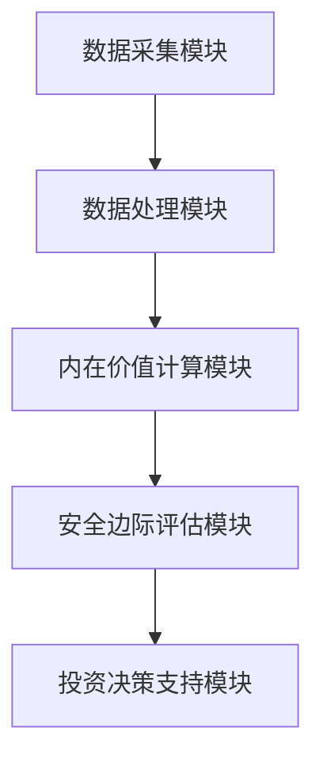

                 


# 格雷厄姆特价股票策略在新兴产业中的适应性

## 关键词：格雷厄姆策略，价值投资，新兴产业，特价股票，内在价值，安全边际

## 摘要：格雷厄姆特价股票策略是价值投资的核心方法之一，但其在新兴产业中的适应性是一个值得探讨的问题。本文通过分析格雷厄姆策略的核心要素，探讨其在新兴产业中的适用性，并通过案例分析和系统设计，提出优化建议，为投资者提供理论支持。

---

# 第一部分: 格雷厄姆特价股票策略概述

## 第1章: 价值投资与格雷厄姆策略基础

### 1.1 价值投资的起源与发展

#### 1.1.1 价值投资的定义与核心理念
价值投资是一种投资策略，强调以低于内在价值的价格购买优质资产。其核心理念是市场先生的短期波动性，以及投资者对安全边际的关注。价值投资的最终目标是通过长期持有优质资产，实现财富的稳定增长。

$$
\text{价值投资的核心公式：}
$$
$$
\text{投资价值} = \text{内在价值} \times \text{安全边际}
$$

#### 1.1.2 格雷厄姆的投资理论体系

格雷厄姆是价值投资的鼻祖，他提出了“安全边际”和“内在价值”两大核心概念。他认为，市场的短期波动为投资者提供了以折扣价买入优质资产的机会。格雷厄姆策略的核心在于通过计算企业的内在价值，寻找市场价格低于内在价值的企业进行投资。

$$
\text{内在价值计算公式：}
$$
$$
\text{内在价值} = \frac{\text{股东权益} + \text{长期债务} - \text{短期债务}}{\text{折现率}}
$$

#### 1.1.3 格雷厄姆策略在传统投资中的应用

在传统投资中，格雷厄姆策略主要应用于那些具有稳定财务状况、较低波动性和明确内在价值的企业。例如，公用事业、制造业等行业的企业，由于其财务数据相对稳定，适合使用格雷厄姆策略进行分析。

### 1.2 格雷厄姆特价股票策略的核心要素

#### 1.2.1 特价股票的定义与特征

特价股票是指市场价格显著低于其内在价值的股票。其主要特征包括低市盈率、低市净率、高股息率等。这类股票通常被视为被市场低估的资产，具有较大的上涨潜力。

#### 1.2.2 格雷厄姆的内在价值计算方法

格雷厄姆的内在价值计算方法基于企业的财务数据，通过折现率对企业的未来现金流进行评估。他强调使用保守的折现率，并考虑企业的长期盈利能力。

$$
\text{内在价值计算公式：}
$$
$$
V = \frac{E + L - S}{r}
$$

其中：
- \( V \)：内在价值
- \( E \)：股东权益
- \( L \)：长期债务
- \( S \)：短期债务
- \( r \)：折现率

#### 1.2.3 安全边际的概念与重要性

安全边际是指市场价格与内在价值之间的差距。格雷厄姆认为，购买价格低于内在价值的股票，可以为投资者提供一定的安全空间，降低市场波动带来的风险。

$$
\text{安全边际计算公式：}
$$
$$
\text{安全边际} = \text{内在价值} - \text{市场价格}
$$

### 1.3 新兴产业的特点与投资机会

#### 1.3.1 新兴产业的定义与分类

新兴产业是指那些基于新技术、新商业模式或新市场需求而迅速发展的行业。例如，人工智能、区块链、电动汽车等领域的企业，都属于新兴产业的范畴。

#### 1.3.2 新兴产业的高增长与高风险特性

新兴产业通常具有高增长的潜力，但也伴随着高风险。这些行业的特点是市场波动大、竞争激烈、技术更新快。因此，投资者在新兴行业中面临更多的不确定性，但也有可能获得更高的回报。

#### 1.3.3 新兴产业的投资机会与挑战

新兴产业发展迅速，市场需求旺盛，为企业提供了广阔的增长空间。然而，这些行业的竞争压力大，技术风险高，投资者需要具备更强的分析能力和风险控制能力。

---

## 第二部分: 格雷厄姆策略在新兴产业中的适应性分析

## 第2章: 格雷厄姆策略在新兴产业中的核心概念

### 2.1 特价股票策略在新兴产业中的适用性

#### 2.1.1 新兴产业中的特价股票识别

在新兴产业中，识别特价股票的关键在于分析企业的未来增长潜力。由于新兴产业的高增长特性，投资者需要关注企业的技术创新能力、市场占有率和管理团队等因素。

#### 2.1.2 新兴产业中的安全边际评估

新兴产业的高波动性使得安全边际的评估更具挑战性。投资者需要更加保守地评估企业的内在价值，并确保购买价格具有足够的安全空间。

#### 2.1.3 新兴产业中的内在价值计算

新兴产业的企业通常具有较高的成长性，其内在价值的计算需要考虑未来的高增长潜力。因此，投资者需要使用更灵活的折现率和更保守的财务假设。

---

## 第三部分: 格雷厄姆策略在新兴产业中的优化与实践

## 第3章: 格雷厄姆策略的优化与新兴产业的应用

### 3.1 格雷厄姆策略在新兴产业中的优化

#### 3.1.1 策略调整的必要性

由于新兴产业的高增长和高波动性，传统的格雷厄姆策略需要进行调整。例如，投资者需要更加关注企业的成长性，而不仅仅是其财务数据。

#### 3.1.2 策略优化的具体措施

- 增加对新兴行业技术趋势的分析
- 更加注重企业的管理团队和创新能力
- 调整折现率的计算方法，以反映新兴产业的高增长特性

### 3.2 新兴产业中的策略实践

#### 3.2.1 新兴产业中的投资案例分析

以电动汽车行业为例，分析格雷厄姆策略在新兴产业中的应用。投资者需要评估企业的技术创新能力、市场前景和管理团队等因素，以确定其内在价值和安全边际。

#### 3.2.2 策略实施的关键步骤

1. 确定新兴产业的市场前景
2. 评估企业的内在价值
3. 计算安全边际
4. 制定投资策略

---

## 第四部分: 系统分析与架构设计方案

## 第4章: 系统分析与架构设计

### 4.1 问题场景介绍

新兴产业发展迅速，市场需求旺盛，为企业提供了广阔的增长空间。然而，这些行业的竞争压力大，技术风险高，投资者需要具备更强的分析能力和风险控制能力。

### 4.2 系统功能设计

#### 4.2.1 系统功能模块

- 数据采集与处理模块
- 内在价值计算模块
- 安全边际评估模块
- 投资决策支持模块

#### 4.2.2 功能实现流程

1. 数据采集：收集企业的财务数据和市场数据。
2. 数据处理：清洗和转换数据，准备计算。
3. 内在价值计算：使用格雷厄姆公式计算企业的内在价值。
4. 安全边际评估：计算市场价格与内在价值的差距。
5. 投资决策：根据评估结果制定投资策略。

### 4.3 系统架构设计

#### 4.3.1 系统架构图



#### 4.3.2 模块交互流程

1. 数据采集模块从数据库中获取企业的财务数据和市场数据。
2. 数据处理模块对数据进行清洗和转换，准备计算。
3. 内在价值计算模块使用格雷厄姆公式计算企业的内在价值。
4. 安全边际评估模块计算市场价格与内在价值的差距。
5. 投资决策支持模块根据评估结果制定投资策略。

---

## 第五部分: 项目实战与案例分析

## 第5章: 项目实战与案例分析

### 5.1 项目环境安装

#### 5.1.1 系统需求

- 操作系统：Windows 10 或更高版本
- Python：3.8 或更高版本
- 数据库：MySQL 或其他关系型数据库
- 开发工具：PyCharm 或其他Python开发工具

#### 5.1.2 环境配置

安装Python和相关库（如pandas、numpy、scipy等），并配置数据库连接。

### 5.2 核心代码实现

#### 5.2.1 数据处理代码

```python
import pandas as pd
import numpy as np

# 数据加载
df = pd.read_csv('enterprise_data.csv')

# 数据清洗
df = df.dropna()
df = df.drop_duplicates()

# 数据转换
df['市盈率'] = df['市盈率'].astype(float)
df['市净率'] = df['市净率'].astype(float)
```

#### 5.2.2 内在价值计算代码

```python
def calculate_intrinsic_value(enterprise):
    equity = enterprise['股东权益']
    long_debt = enterprise['长期债务']
    short_debt = enterprise['短期债务']
    discount_rate = 0.1

    intrinsic_value = (equity + long_debt - short_debt) / discount_rate
    return intrinsic_value
```

#### 5.2.3 安全边际评估代码

```python
def calculate_margin_of_safety(enterprise):
    intrinsic_value = calculate_intrinsic_value(enterprise)
    market_price = enterprise['市场价格']
    margin_of_safety = intrinsic_value - market_price
    return margin_of_safety
```

### 5.3 案例分析与解读

#### 5.3.1 案例分析

以某新兴产业中的电动汽车企业为例，分析格雷厄姆策略的应用。

1. 数据收集：收集该企业的财务数据和市场数据。
2. 数据处理：清洗和转换数据。
3. 内在价值计算：使用格雷厄姆公式计算企业的内在价值。
4. 安全边际评估：计算市场价格与内在价值的差距。
5. 投资决策：根据评估结果制定投资策略。

#### 5.3.2 代码应用解读

通过代码实现内在价值和安全边际的计算，帮助投资者更好地理解格雷厄姆策略在新兴产业中的应用。

---

## 第六部分: 总结与展望

## 第6章: 总结与展望

### 6.1 总结

格雷厄姆特价股票策略在新兴产业中的适应性是一个复杂的问题。新兴产业的高增长和高波动性使得传统的格雷厄姆策略需要进行调整和优化。通过系统分析和实践案例，我们可以更好地理解格雷厄姆策略在新兴领域的应用，并为投资者提供理论支持。

### 6.2 展望

未来，随着新兴行业的不断发展，格雷厄姆策略在新兴产业中的应用将更加广泛。投资者需要不断优化策略，适应市场的变化，抓住新兴行业的投资机会。

---

## 作者：AI天才研究院/AI Genius Institute & 禅与计算机程序设计艺术 /Zen And The Art of Computer Programming

---

### 最佳实践 Tips:

- 投资者需要结合新兴产业的特点，灵活调整格雷厄姆策略。
- 在实际操作中，建议投资者使用系统化的方法，结合数据分析和市场分析，制定科学的投资策略。
- 风险提示：新兴产业的投资具有较高的风险，投资者需要具备较强的风险控制能力。

