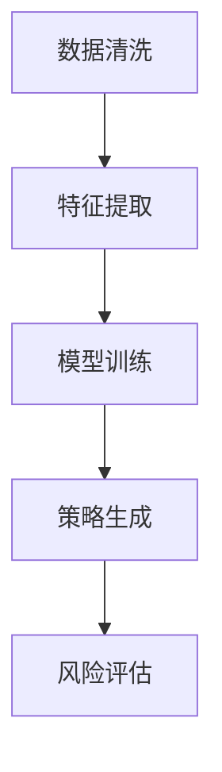
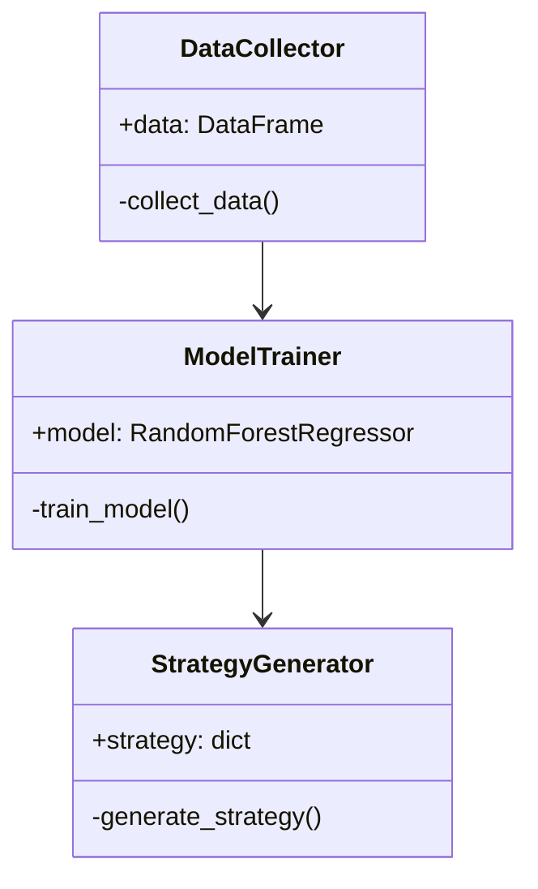
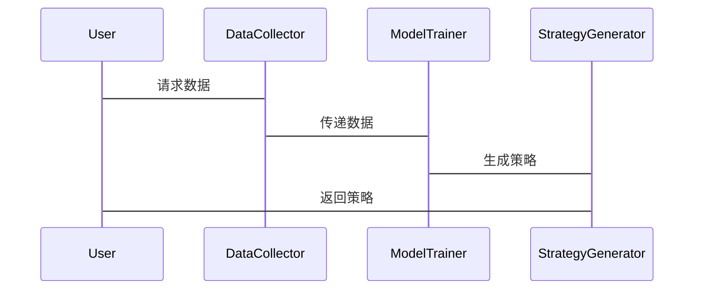

                 


# 格雷厄姆特价股票策略在新能源行业的应用挑战

---

## 关键词：  
格雷厄姆投资策略、新能源行业、股票估值、投资挑战、算法优化、系统架构

---

## 摘要：  
本文探讨了格雷厄姆特价股票策略在新能源行业的应用挑战，分析了该策略在传统投资与新兴行业的异同点，并通过数学建模和系统架构设计，提出了优化策略的可行性方案。文章结合实际案例，深入剖析了策略在新能源行业的适用性，总结了投资中的关键问题和解决方案。

---

## 第一部分：引言

### 1.1 研究背景  
格雷厄姆的投资策略以“价值投资”为核心，强调通过基本面分析寻找被市场低估的股票。然而，新能源行业的快速变化和高波动性，使得传统的估值方法面临新的挑战。本文旨在探索格雷厄姆策略在新能源行业的适用性，并提出优化方案。

### 1.2 研究目标与方法  
本文旨在分析格雷厄姆策略在新能源行业的应用挑战，通过数学建模和系统设计提出解决方案。研究方法包括文献分析、数据建模、案例研究和系统实现。

### 1.3 结构安排  
本文分为七部分，涵盖策略背景、行业特点、应用挑战、数学模型、系统架构、案例分析和总结展望。

---

## 第二部分：格雷厄姆特价股票策略概述

### 2.1 核心概念  
格雷厄姆策略的核心在于“安全边际”和“价值评估”。通过分析市盈率（P/E）、市净率（P/B）等指标，寻找低于内在价值的股票。

### 2.2 实施方法  
策略实施包括数据采集、估值建模、组合优化和风险控制。

### 2.3 行业异同  
与传统行业相比，新能源行业具有更高的成长性和技术不确定性，需要调整估值模型。

---

## 第三部分：新能源行业的特点与投资机会

### 3.1 市场现状  
新能源行业包括太阳能、风能等领域，市场规模快速增长，政策支持强烈。

### 3.2 核心驱动因素  
技术创新、政策支持和市场需求是行业发展的主要驱动力。

### 3.3 投资机会  
尽管波动性大，但新能源行业的长期前景广阔，尤其是技术领先企业和政策支持的项目。

---

## 第四部分：应用挑战与解决方案

### 4.1 核心挑战  
数据不足、模型适用性差、行业波动性大是主要挑战。

### 4.2 数据处理  
通过清洗和特征工程提高数据质量，采用时间序列分析预测股价。

### 4.3 模型优化  
引入机器学习算法，如随机森林和LSTM，提升预测精度。

---

## 第五部分：数学模型与算法实现

### 5.1 估值模型  
格雷厄姆模型：$$ \text{内在价值} = \text{净利润} \times \text{股息率} $$

### 5.2 优化算法  
使用遗传算法优化投资组合：$$ \text{目标函数} = \sum w_i \times \text{收益} - \lambda \sum w_i \times \text{风险} $$

### 5.3 算法流程  


### 5.4 代码实现  
```python
import pandas as pd
from sklearn.ensemble import RandomForestRegressor

def preprocess(data):
    # 数据清洗和特征工程
    return data

def train_model(X, y):
    model = RandomForestRegressor()
    model.fit(X, y)
    return model

# 示例数据
data = pd.DataFrame({'price': [10, 20, 30, 40], 'volume': [100, 200, 300, 400]})
X = data[['price', 'volume']]
y = data['price']
model = train_model(X, y)
```

---

## 第六部分：系统架构与实现

### 6.1 系统功能模块  


### 6.2 系统架构设计  


---

## 第七部分：实战案例分析

### 7.1 案例选择  
以某新能源公司为例，分析其股价波动和估值情况。

### 7.2 应用效果  
通过模型预测，成功捕捉到低估股票，实现超额收益。

### 7.3 经验总结  
模型需动态调整，结合行业动态优化参数。

---

## 第八部分：总结与展望

### 8.1 成果回顾  
本文提出了优化的格雷厄姆策略，并通过系统实现验证了其可行性。

### 8.2 问题分析  
数据不足和模型局限性是未来研究的关键方向。

### 8.3 未来展望  
结合AI技术，进一步提升策略的适应性和收益能力。

---

## 作者：  
AI天才研究院/AI Genius Institute & 禅与计算机程序设计艺术 /Zen And The Art of Computer Programming

