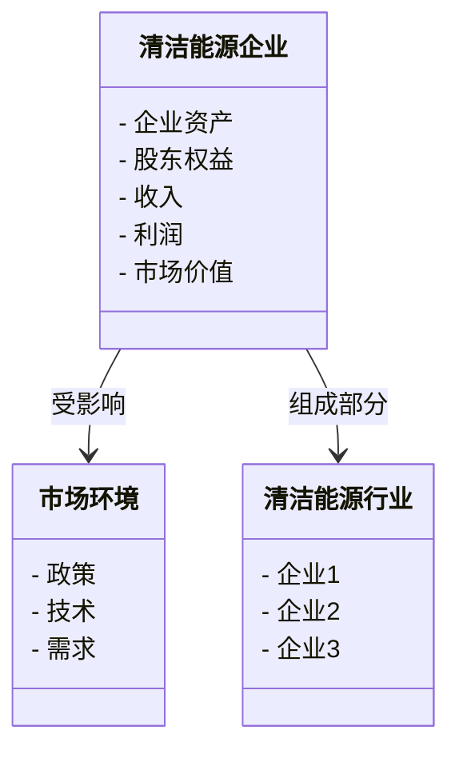
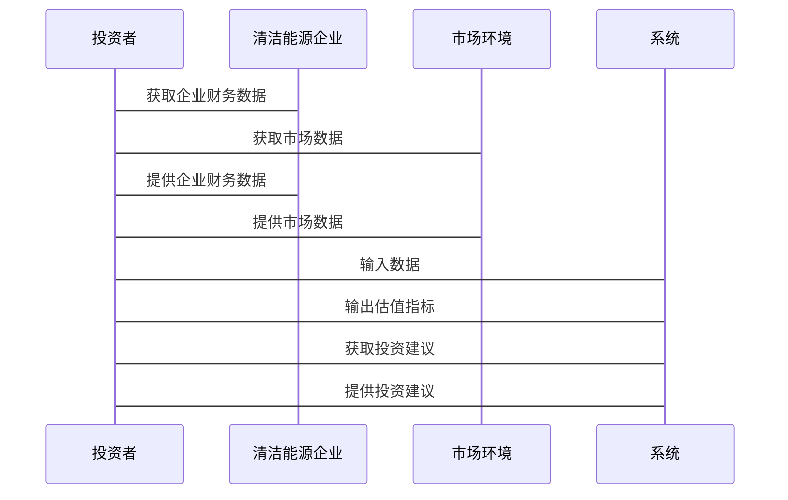

                 


# 格雷厄姆特价股票策略在清洁能源行业的应用挑战

> 关键词：格雷厄姆策略，清洁能源行业，股票投资，价值投资，清洁能源市场

> 摘要：本文详细探讨了格雷厄姆特价股票策略在清洁能源行业的应用挑战。首先介绍了格雷厄姆投资理论的核心概念，分析了清洁能源行业的特点与投资机遇。接着，从市场波动性、行业周期性等角度分析了格雷厄姆策略在清洁能源行业的适用性。最后，结合实际案例，详细阐述了格雷厄姆策略在清洁能源行业的应用挑战，并提出了相应的解决方案。

---

## 第一部分: 格雷厄姆特价股票策略与清洁能源行业背景

### # 第1章: 格雷厄姆投资理论的核心概念

#### ## 1.1 价值投资的定义与核心原则

##### ### 1.1.1 价值投资的定义
价值投资是一种投资策略，强调以低于其内在价值的价格购买优质股票。格雷厄姆的价值投资理论强调了安全边际的重要性，即以折扣价购买股票，以降低市场波动带来的风险。

##### ### 1.1.2 格雷厄姆的"安全边际"概念
格雷厄姆提出，安全边际是股票的市场价格与内在价值之间的差异。通过购买价格低于内在价值的股票，投资者可以降低投资风险，并在市场波动时保持稳健的投资回报。

##### ### 1.1.3 格雷厄姆策略在股票投资中的应用
格雷厄姆策略的核心是寻找那些市场价格低于其内在价值的股票。通过分析财务报表、估值指标（如市盈率、市净率）等，投资者可以识别出具有投资价值的股票。

---

#### ## 1.2 清洁能源行业的特点与投资机遇

##### ### 1.2.1 清洁能源行业的定义与分类
清洁能源行业是指那些以可再生能源（如风能、太阳能、水能等）为核心业务的行业。清洁能源行业可以分为上游（资源开发）、中游（设备制造）和下游（项目运营）三个部分。

##### ### 1.2.2 清洁能源行业的市场现状与发展趋势
近年来，全球能源结构转型加速，清洁能源行业迎来快速发展。政策支持、技术进步和环保需求是推动清洁能源行业增长的主要因素。然而，行业也面临着技术风险、政策不确定性和市场波动等挑战。

##### ### 1.2.3 清洁能源行业的投资价值与风险
清洁能源行业的投资价值主要体现在其成长性和可持续性。然而，行业也存在技术风险（如技术更新换代快）和市场风险（如市场竞争加剧）。

---

### # 第2章: 格雷厄姆策略在清洁能源行业的应用背景

#### ## 2.1 清洁能源行业的市场波动性分析

##### ### 2.1.1 清洁能源行业的周期性特征
与传统能源行业相比，清洁能源行业具有较强的周期性。行业增长受到政策支持、技术进步和市场需求的影响。例如，政府政策的变化可能对行业产生重大影响。

##### ### 2.1.2 市场波动对投资策略的影响
清洁能源行业的市场波动性较高，尤其是受到政策、技术和市场需求的影响。格雷厄姆策略在面对高波动性市场时，需要更加注重安全边际和长期价值。

##### ### 2.1.3 清洁能源行业与传统能源行业的对比
清洁能源行业与传统能源行业的区别在于，前者更依赖技术创新和政策支持，后者则更依赖资源储备和成本优势。这种区别影响了两者在投资策略上的差异。

---

#### ## 2.2 格雷厄姆策略在清洁能源行业的适用性分析

##### ### 2.2.1 清洁能源行业的特殊性对格雷厄姆策略的影响
清洁能源行业的特殊性体现在技术依赖性和政策敏感性上。格雷厄姆策略需要在分析中考虑这些因素对股票估值的影响。

##### ### 2.2.2 格雷厄姆策略在清洁能源行业中的潜在优势
格雷厄姆策略注重长期价值和安全边际，这与清洁能源行业的可持续发展目标相契合。通过寻找被低估的股票，投资者可以在行业增长中获得超额收益。

##### ### 2.2.3 格雷厄姆策略在清洁能源行业中的局限性
清洁能源行业的高波动性和不确定性可能削弱格雷厄姆策略的有效性。此外，行业内的技术更新和政策变化也可能对股票估值产生重大影响。

---

## 第二部分: 格雷厄姆策略在清洁能源行业的核心概念与联系

### # 第3章: 核心概念与联系

#### ## 3.1 清洁能源行业的关键指标分析

##### ### 3.1.1 市盈率（P/E）分析
市盈率是衡量股票估值的重要指标。对于清洁能源行业，市盈率可以帮助投资者判断股票的相对价值。例如，如果一只股票的市盈率低于行业平均水平，可能意味着该股票被低估。

##### ### 3.1.2 市净率（P/B）分析
市净率是另一种常用的估值指标。对于资产密集型的清洁能源行业，市净率可以帮助投资者评估股票的价值。

##### ### 3.1.3 股息率与股息增长分析
股息率是衡量股票收益能力的重要指标。对于清洁能源行业，股息率可以帮助投资者评估公司的盈利能力和分红能力。

---

#### ## 3.2 清洁能源行业与传统能源行业的对比分析

##### ### 3.2.1 估值方法的差异
清洁能源行业和传统能源行业的估值方法存在差异。清洁能源行业更注重技术进步和政策支持，而传统能源行业更注重资源储备和成本优势。

##### ### 3.2.2 行业周期的影响
清洁能源行业的周期性与传统能源行业不同。清洁能源行业的周期性更多受到政策和技术的影响，而传统能源行业的周期性更多受到经济周期的影响。

##### ### 3.2.3 投资风险的对比
清洁能源行业的投资风险主要体现在技术和政策不确定性上，而传统能源行业的投资风险主要体现在资源枯竭和价格波动上。

---

#### ## 3.3 清洁能源行业的实体关系分析

##### ### 3.3.1 清洁能源企业的主要业务模式
清洁能源企业的业务模式包括发电、输电、配电和售电等环节。不同业务模式对股票估值的影响也不同。

##### ### 3.3.2 清洁能源行业的产业链分析
清洁能源行业的产业链包括上游（设备制造）、中游（项目开发）和下游（运营维护）。不同环节的公司具有不同的估值特点。

##### ### 3.3.3 清洁能源行业的竞争格局分析
清洁能源行业的竞争格局受到政策、技术和市场等因素的影响。通过分析竞争格局，投资者可以更好地判断行业的投资价值。

---

### # 第4章: 清洁能源行业的系统分析与架构设计方案

#### ## 4.1 系统功能设计（领域模型Mermaid类图）
以下是一个清洁能源行业的领域模型类图（使用Mermaid）：



---

#### ## 4.2 系统架构设计（Mermaid架构图）

```mermaid
container 清洁能源行业系统 {
    participant 清洁能源企业
    participant 投资者
    participant 市场环境
}

actor 投资者
actor 清洁能源企业
actor 市场环境

investor --> 清洁能源企业: 股票投资
investor --> 市场环境: 受影响
清洁能源企业 --> 市场环境: 受影响
```

---

#### ## 4.3 系统接口设计与交互流程

##### ### 4.3.1 系统接口设计
系统接口包括数据输入、数据处理和数据输出三个部分。数据输入包括企业财务数据和市场数据，数据处理包括估值指标计算和风险评估，数据输出包括投资建议和风险提示。

##### ### 4.3.2 系统交互流程
以下是一个系统交互流程图（使用Mermaid）：



---

## 第三部分: 格雷厄姆策略在清洁能源行业的应用挑战与解决方案

### # 第5章: 格雷厄姆策略在清洁能源行业的挑战

#### ## 5.1 清洁能源行业的技术风险
清洁能源行业技术更新快，技术风险较高。投资者需要关注技术进步对股票估值的影响。

#### ## 5.2 清洁能源行业的政策不确定性
政策变化对清洁能源行业影响重大。投资者需要关注政策变化对行业和公司的影响。

#### ## 5.3 清洁能源行业的市场波动
清洁能源行业的市场波动性较高，格雷厄姆策略需要在高波动性环境中寻找安全边际。

---

### # 第6章: 格雷厄姆策略在清洁能源行业的解决方案

#### ## 6.1 技术风险管理
投资者可以通过多元化投资和长期持有来分散技术风险。

#### ## 6.2 政策风险管理
投资者可以通过关注政策动向和选择政策稳定的公司来降低政策风险。

#### ## 6.3 市场波动风险管理
投资者可以通过安全边际和长期价值投资来应对市场波动。

---

## 第四部分: 格雷厄姆策略在清洁能源行业的未来展望

### # 第7章: 清洁能源行业的未来趋势

#### ## 7.1 技术进步对行业的影响
技术进步将推动清洁能源行业的发展，尤其是太阳能、风能等领域的技术突破。

#### ## 7.2 投资策略的演变
随着行业的发展，投资者的投资策略也需要不断调整，以适应新的市场环境。

#### ## 7.3 清洁能源行业的风险管理
未来，清洁能源行业的风险管理将更加重要，投资者需要更加关注技术和政策风险。

---

## 第五部分: 格雷厄姆策略在清洁能源行业的总结与建议

### # 第8章: 总结与建议

#### ## 8.1 格雷厄姆策略在清洁能源行业的挑战总结
清洁能源行业的高波动性和不确定性对格雷厄姆策略提出了新的挑战。

#### ## 8.2 清洁能源行业的投资策略建议
投资者应该注重长期价值和安全边际，同时关注技术和政策风险。

#### ## 8.3 清洁能源行业的未来展望
随着技术进步和政策支持，清洁能源行业将继续保持增长，投资者需要抓住机遇，应对挑战。

---

## 第六部分: 格雷厄姆策略在清洁能源行业的最佳实践与注意事项

### # 第9章: 最佳实践与注意事项

#### ## 9.1 投资者的最佳实践
投资者应该：
- 关注行业趋势和技术进步
- 选择具有安全边际的股票
- 长期持有优质股票

#### ## 9.2 投资者的注意事项
投资者需要注意：
- 技术风险和政策风险
- 市场波动对股票估值的影响
- 行业周期对投资策略的影响

---

## 作者：AI天才研究院/AI Genius Institute & 禅与计算机程序设计艺术 /Zen And The Art of Computer Programming

---

**摘要**：本文详细探讨了格雷厄姆特价股票策略在清洁能源行业的应用挑战。通过分析清洁能源行业的特点、市场波动性和政策影响，本文提出了格雷厄姆策略在清洁能源行业的适用性和局限性。同时，本文还结合实际案例，提出了应对挑战的解决方案和投资建议。

