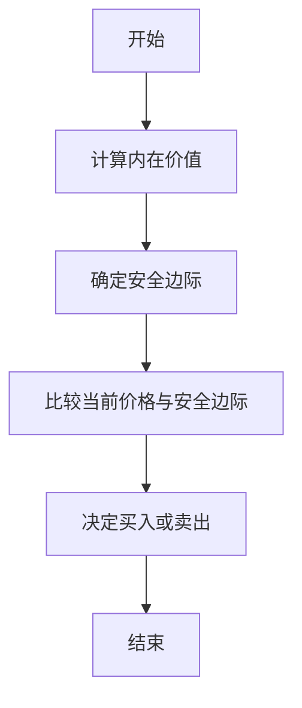
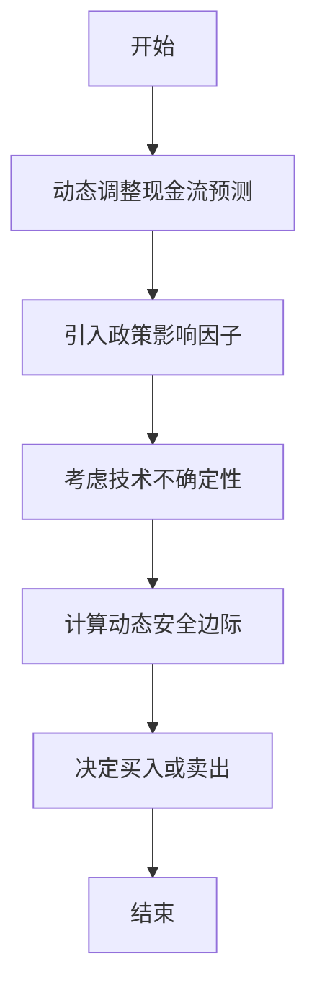
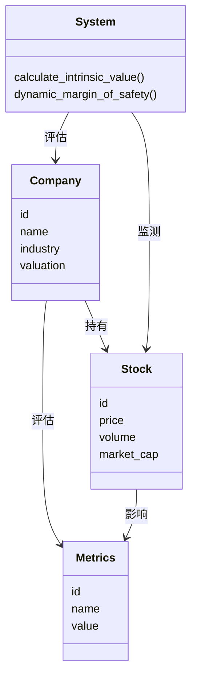
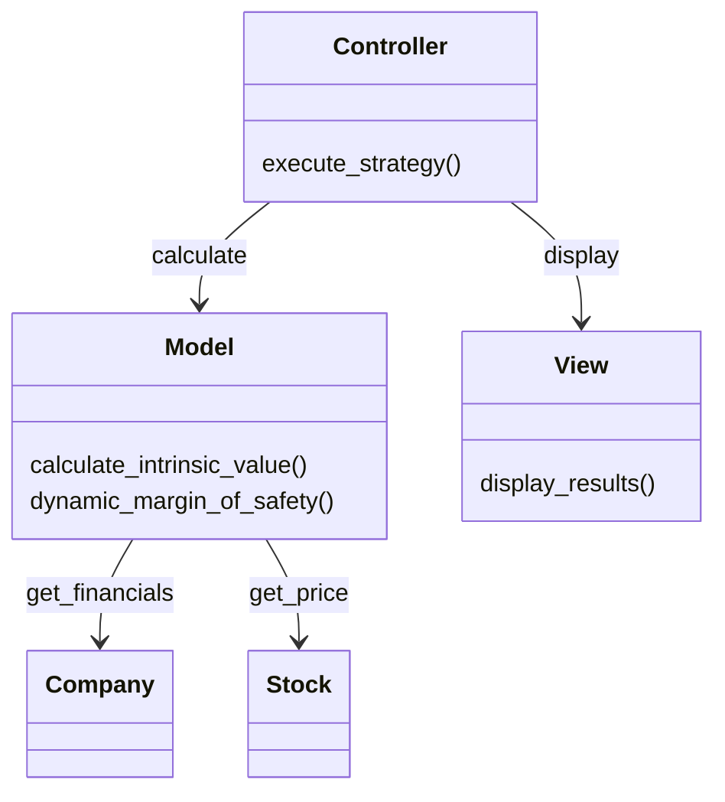
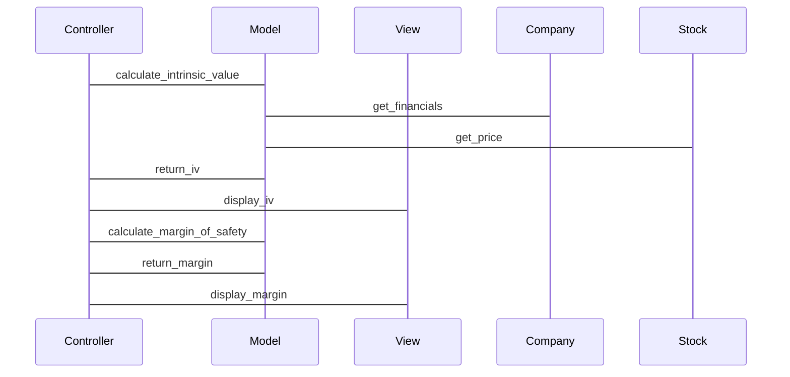

                 


```markdown
# 格雷厄姆特价股票策略在生物科技行业的应用挑战

## 关键词
格雷厄姆投资理论, 生物科技行业, 价值投资策略, 安全边际, 内在价值, 股票估值, 金融建模

## 摘要
本文深入探讨格雷厄姆价值投资策略在生物科技行业的应用挑战。通过分析生物科技行业的特殊性，揭示格雷厄姆策略在该领域的局限性，并提出创新性的解决方案。文章结合理论与实践，提供详细的算法原理和系统设计，帮助投资者更好地应对生物科技行业的估值难题。

---

## 第1章 格雷厄姆特价股票策略概述

### 1.1 格雷厄姆投资理论的核心概念
格雷厄姆是价值投资的鼻祖，其策略强调以低于内在价值的价格购买优质股票。核心概念包括：
- **安全边际**：买入价格与内在价值的差距，确保投资的安全性。
- **内在价值**：公司未来现金流的现值，反映其真实价值。
- **价值投资**：通过深入分析企业基本面，寻找被市场低估的投资标的。

### 1.2 生物科技行业的特点
生物科技行业具有以下特点：
- **高研发投入**：产品研发周期长、成本高。
- **政策依赖性**：受政府监管和政策影响大。
- **技术不确定性**：技术创新具有高度不确定性。

### 1.3 格雷厄姆策略在传统金融中的应用
格雷厄姆策略在传统金融中表现出色，但在生物科技行业面临挑战。本文将分析其在生物科技行业的适用性。

---

## 第2章 格雷厄姆策略在生物科技行业的应用挑战

### 2.1 生物科技行业的特殊性对格雷厄姆策略的影响
- **研发投入与周期性**：生物科技公司的研发投入巨大，周期长，传统格雷厄姆模型难以准确评估。
- **政策依赖性**：政策变化对生物科技公司的影响深远，增加了估值的不确定性。
- **技术不确定性**：技术创新的不可预测性使得内在价值难以准确计算。

### 2.2 格雷厄姆策略在生物科技行业的适用性分析
- **核心假设与行业矛盾**：格雷厄姆假设企业价值稳定，但生物科技行业充满变数。
- **估值难题**：生物科技公司的现金流不稳定，传统DCF模型难以适用。
- **潜在改进方向**：动态调整安全边际，引入新技术指标。

### 2.3 格雷厄姆策略在生物科技行业的成功案例
- **国外案例**：以某生物科技公司为例，分析格雷厄姆策略的应用。
- **国内案例**：结合中国生物科技企业的实际情况，探讨策略的可行性。
- **未来展望**：随着生物科技行业的成熟，格雷厄姆策略的应用潜力。

---

## 第3章 格雷厄姆策略在生物科技行业的核心概念与联系

### 3.1 核心概念的原理分析
- **内在价值的重新定义**：考虑生物科技行业的特殊性，动态调整现金流预测。
- **安全边际的动态调整**：根据行业波动性，动态调整安全边际。
- **估值模型的创新应用**：结合行业特点，改进传统DCF模型。

### 3.2 核心概念的属性特征对比
以下是传统金融与生物科技行业的对比分析：

| 属性       | 传统金融            | 生物科技行业          |
|------------|---------------------|----------------------|
| 投资周期   | 较短               | 较长，甚至数年        |
| 政策影响   | 较小               | 较大，受政策驱动      |
| 技术风险   | 较低               | 较高，不确定性大      |

### 3.3 ER实体关系图架构
```mermaid
erDiagram
    company {
        id
        name
        industry
        valuation
    }
    stock {
        id
        price
        volume
        market_cap
    }
    metrics {
        id
        name
        value
    }
    company --> stock : 持有
    company --> metrics : 评估
    stock --> metrics : 影响
```

---

## 第4章 格雷厄姆策略在生物科技行业的算法原理

### 4.1 格雷厄姆策略的基本算法
以下是格雷厄姆策略的基本算法流程：



### 4.2 格雷厄姆策略在生物科技行业的改进算法
为了适应生物科技行业，我们对格雷厄姆策略进行了改进：



### 4.3 算法实现代码
以下是Python代码实现改进后的格雷厄姆策略：

```python
import numpy as np
import pandas as pd

def calculate_intrinsic_value(financials, discount_rate):
    # 计算未来现金流
    cash_flows = financials['cash_flows'].values
    # 计算现值
    present_value = np.npv(discount_rate, cash_flows)
    return present_value

def dynamic_margin_of_safety(intrinsic_value, current_price, volatility):
    # 动态调整安全边际
    margin = (intrinsic_value - current_price) / intrinsic_value
    adjusted_margin = margin * (1 + volatility)
    return adjusted_margin

# 示例数据
financials = pd.DataFrame({
    'cash_flows': [100, 200, 300, 400],
    'discount_rate': 0.1
})

current_price = 50
volatility = 0.2

# 计算内在价值
iv = calculate_intrinsic_value(financials, 0.1)
# 计算动态安全边际
margin = dynamic_margin_of_safety(iv, current_price, volatility)
print(f"内在价值: {iv:.2f}")
print(f"动态安全边际: {margin:.2f}")
```

---

## 第5章 格雷厄姆策略在生物科技行业的系统分析

### 5.1 系统功能设计
以下是系统功能设计的类图：



### 5.2 系统架构设计
以下是系统架构设计的类图：



### 5.3 系统接口设计
以下是系统接口设计的序列图：



---

## 第6章 格雷厄姆策略在生物科技行业的项目实战

### 6.1 环境安装
需要安装以下Python库：
```bash
pip install numpy pandas mermaid4jupyter
```

### 6.2 系统核心实现
以下是系统核心实现的代码：

```python
import numpy as np
import pandas as pd
from mermaid import Diagram

def calculate_intrinsic_value(financials, discount_rate):
    cash_flows = financials['cash_flows'].values
    present_value = np.npv(discount_rate, cash_flows)
    return present_value

def dynamic_margin_of_safety(intrinsic_value, current_price, volatility):
    margin = (intrinsic_value - current_price) / intrinsic_value
    adjusted_margin = margin * (1 + volatility)
    return adjusted_margin

# 示例数据
financials = pd.DataFrame({
    'cash_flows': [100, 200, 300, 400],
    'discount_rate': 0.1
})

current_price = 50
volatility = 0.2

# 计算内在价值
iv = calculate_intrinsic_value(financials, 0.1)
# 计算动态安全边际
margin = dynamic_margin_of_safety(iv, current_price, volatility)
print(f"内在价值: {iv:.2f}")
print(f"动态安全边际: {margin:.2f}")
```

### 6.3 案例分析
以某生物科技公司为例，分析其内在价值和安全边际。

---

## 第7章 格雷厄姆策略在生物科技行业的最佳实践

### 7.1 小结
格雷厄姆策略在生物科技行业的应用需要结合行业特点，动态调整安全边际和内在价值的计算方法。

### 7.2 注意事项
- 保持对政策变化的敏感性
- 定期更新现金流预测
- 考虑技术不确定性的影响

### 7.3 拓展阅读
建议进一步阅读以下文献：
- 格雷厄姆的《 Intelligent Investor 》
- 生物科技行业的估值方法研究

---

## 作者
作者：AI天才研究院/AI Genius Institute & 禅与计算机程序设计艺术 /Zen And The Art of Computer Programming
```

