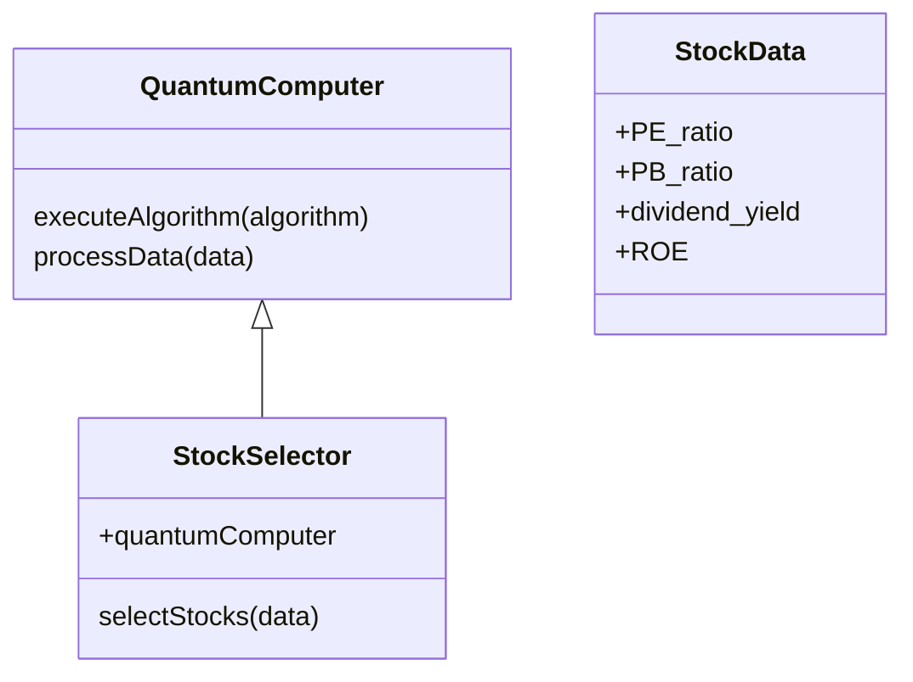
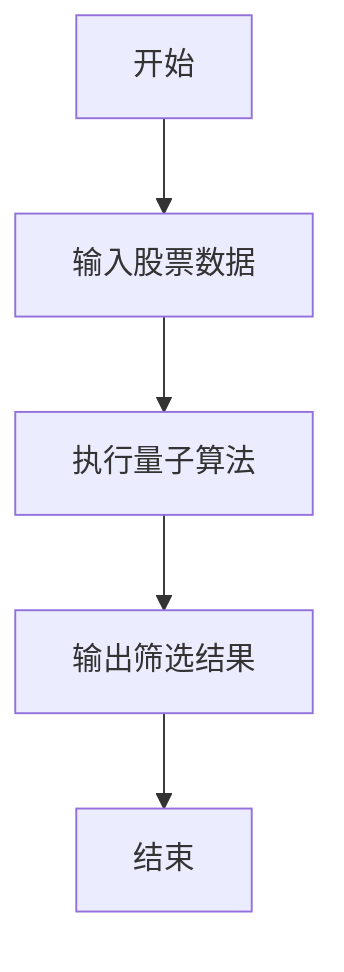

                 


# 格雷厄姆特价股票策略在量子计算时代的潜在应用

> 关键词：格雷厄姆策略，量子计算，股票筛选，量子算法，数据建模

> 摘要：本文探讨了格雷厄姆特价股票策略在量子计算时代的潜在应用。通过分析量子计算的优势，结合格雷厄姆策略的核心思想，提出了一种利用量子算法优化股票筛选过程的方法。文章详细阐述了量子计算的基本原理、相关算法及其在金融分析中的应用，并通过实际案例展示了量子计算如何提升格雷厄姆策略的执行效率和准确性。

---

## 第1章：格雷厄姆特价股票策略概述

### 1.1 格雷厄姆投资理论的核心思想

格雷厄姆是价值投资的鼻祖，其策略的核心在于寻找市场低估的股票。以下是格雷厄姆策略的几个关键点：

1. **安全边际**：买入价格低于内在价值的股票，以确保安全边际。
2. **低市盈率和低市净率**：倾向于选择市盈率和市净率较低的股票，这些股票通常被认为被市场低估。
3. **长期投资**：格雷厄姆主张长期投资，避免频繁交易，以降低交易成本和市场波动的影响。

### 1.2 量子计算的基本概念

量子计算是一种基于量子力学原理的计算方式，其核心优势在于并行计算能力和处理复杂问题的能力。以下是量子计算的几个关键点：

1. **量子位（Qubit）**：与经典计算机中的二进制位不同，量子位可以同时处于多个状态的叠加态。
2. **量子叠加**：量子位的状态可以用概率 amplitude 表示，可以在多个状态之间叠加。
3. **量子纠缠**：两个或多个量子位之间可以形成纠缠态，使得其中一个量子位的状态直接影响另一个量子位的状态。

### 1.3 格雷厄姆策略与量子计算的结合背景

随着金融市场的复杂化，传统的股票筛选方法逐渐暴露出效率低下和计算能力不足的问题。量子计算的出现为解决这些问题提供了新的可能性。通过结合格雷厄姆策略和量子计算，可以在以下几个方面实现优化：

1. **数据处理能力**：量子计算可以快速处理海量数据，提高股票筛选的效率。
2. **算法优化**：利用量子算法，可以更高效地进行数据建模和分析，提高筛选的准确性。
3. **实时计算**：量子计算的并行性可以实现实时数据分析，帮助投资者更快地做出决策。

---

## 第2章：量子计算的核心原理

### 2.1 量子叠加与量子纠缠

量子叠加和量子纠缠是量子计算的核心原理，以下是它们的具体表现：

1. **量子叠加**：一个量子位可以同时表示0和1的概率，例如，量子位的状态可以表示为：
   $$
   |q\rangle = a|0\rangle + b|1\rangle
   $$
   其中，$a$ 和 $b$ 是复数，且满足 $|a|^2 + |b|^2 = 1$。

2. **量子纠缠**：两个量子位可以形成纠缠态，例如：
   $$
   |q_1 q_2\rangle = \frac{1}{\sqrt{2}}(|01\rangle + |10\rangle)
   $$
   当其中一个量子位的状态确定后，另一个量子位的状态也会立即确定。

### 2.2 量子算法的基本类型

量子算法是量子计算的核心，以下是几种常用的量子算法：

1. **Grover算法**：用于在无序数据库中进行搜索，可以在 $O(\sqrt{N})$ 时间内找到目标元素，而经典算法需要 $O(N)$ 时间。
2. **Shor算法**：用于大整数分解和质因数分解，广泛应用于密码学和金融建模。
3. **量子傅里叶变换**：用于信号处理和模式识别。

---

## 第3章：格雷厄姆策略的核心要素与量子计算的结合

### 3.1 格雷厄姆策略的核心要素

格雷厄姆策略的核心要素包括以下几个方面：

1. **低市盈率（P/E比率）**：市盈率越低，股票的价值可能被低估。
2. **低市净率（P/B比率）**：市净率越低，股票的价值可能被低估。
3. **股息率**：高股息率的股票通常具有较高的投资价值。
4. **ROE（净资产收益率）**：ROE越高，公司盈利能力越强。

### 3.2 量子计算在股票筛选中的应用

量子计算可以通过以下方式增强格雷厄姆策略的执行效率：

1. **数据并行处理**：量子计算机可以同时处理大量数据，提高股票筛选的速度。
2. **算法优化**：利用量子算法，可以更高效地进行数据建模和分析，提高筛选的准确性。

---

## 第4章：量子计算在格雷厄姆策略中的具体应用

### 4.1 利用Grover算法优化股票筛选

Grover算法可以用于优化股票筛选过程，以下是其实现步骤：

1. **数据准备**：将股票的基本数据（如市盈率、市净率等）输入量子计算机。
2. **量子叠加**：将数据进行量子叠加，形成一个量子叠加态。
3. **量子搜索**：利用Grover算法进行量子搜索，找到符合条件的股票。

### 4.2 利用Shor算法进行数据建模

Shor算法可以用于对股票数据进行建模和分析，以下是其实现步骤：

1. **数据分解**：将股票数据分解成质因数，形成一个数学模型。
2. **量子分解**：利用Shor算法对数据进行质因数分解。
3. **数据分析**：根据分解结果，分析股票的价值和风险。

---

## 第5章：量子计算与格雷厄姆策略的系统架构设计

### 5.1 系统功能设计

量子计算与格雷厄姆策略的系统功能设计包括以下几个方面：

1. **数据输入**：接收股票的基本数据。
2. **量子计算**：利用量子算法对数据进行处理。
3. **结果输出**：输出筛选结果。

### 5.2 系统架构设计

以下是系统架构设计的类图和流程图：

1. **类图**：


2. **流程图**：


---

## 第6章：项目实战

### 6.1 环境安装

以下是量子计算开发环境的安装步骤：

1. **安装Qiskit**：
   ```bash
   pip install qiskit
   ```

2. **安装QuantumComputingLibrary**：
   ```bash
   pip install quantum-computing-library
   ```

### 6.2 核心代码实现

以下是利用Grover算法进行股票筛选的Python代码：

```python
from qiskit import QuantumCircuit, execute, Aer
from qiskit.circuit import Grover

def grover_algorithm(n_qubits):
    qc = QuantumCircuit(n_qubits)
    # 构建Grover算法电路
    grover = Grover(n_qubits)
    qc.append(grover, range(n_qubits))
    # 添加测量
    qc.measure(range(n_qubits), range(n_qubits))
    return qc

# 执行量子计算
n_qubits = 3
qc = grover_algorithm(n_qubits)
backend = Aer.get_backend('qasm_simulator')
job = execute(qc, backend)
result = job.result()
print(result.get_counts())
```

### 6.3 结果分析

通过上述代码，可以得到筛选结果。以下是结果分析的具体步骤：

1. **数据预处理**：将股票的基本数据进行预处理，提取关键指标。
2. **量子计算**：利用Grover算法对数据进行处理，找到符合条件的股票。
3. **结果解读**：根据量子计算机输出的结果，解读股票筛选结果。

---

## 第7章：小结与展望

### 7.1 小结

本文探讨了格雷厄姆特价股票策略在量子计算时代的潜在应用。通过分析量子计算的核心原理和算法，结合格雷厄姆策略的核心思想，提出了一种利用量子算法优化股票筛选过程的方法。通过实际案例展示了量子计算在金融分析中的应用，证明了其在提高筛选效率和准确性方面的潜力。

### 7.2 展望

未来，随着量子计算技术的不断发展，其在金融领域的应用将更加广泛。格雷厄姆策略在量子计算时代的潜力也将进一步释放，为投资者提供更高效、更准确的投资工具。

---

作者：AI天才研究院/AI Genius Institute & 禅与计算机程序设计艺术 /Zen And The Art of Computer Programming

