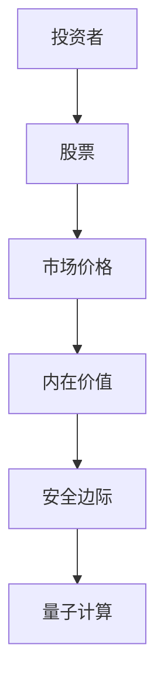
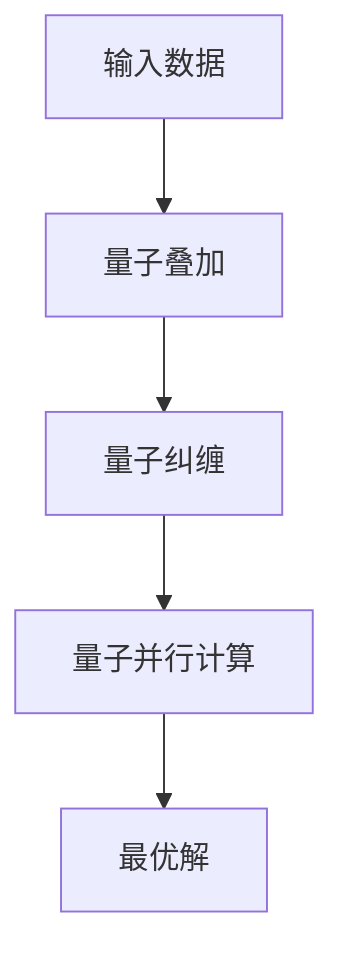
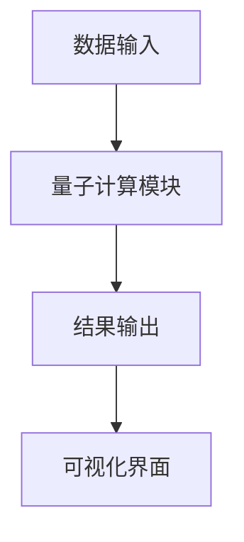
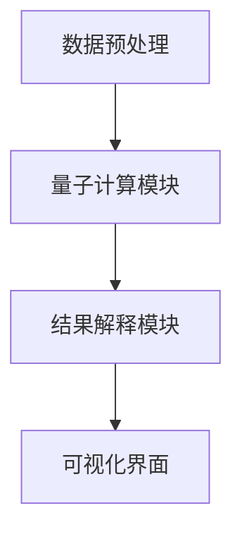

                 


# 《格雷厄姆特价股票策略在量子金融时代的演变》

> 关键词：格雷厄姆策略，量子金融，量子计算，股票筛选，价值投资

> 摘要：本文探讨了格雷厄姆特价股票策略在量子金融时代的演变。从传统价值投资的起源到量子计算在金融分析中的应用，分析了量子环境下如何优化格雷厄姆策略。通过数学模型、算法设计和系统实现，展示了量子计算如何增强股票筛选的效率和准确性。

---

## 第一部分: 格雷厄姆特价股票策略的背景与演变

### 第1章: 格雷厄姆特价股票策略概述

#### 1.1 格雷厄姆投资理论的起源

格雷厄姆是价值投资的鼻祖，他的投资理论强调以低于内在价值的价格购买优质股票。格雷厄姆策略的核心是寻找市场价格低于内在价值的股票，即“特价股票”。这种策略在20世纪初提出了安全边际的概念，即市场价格与内在价值之间的差距，作为投资的安全垫。

#### 1.2 量子金融时代的背景

量子金融是利用量子计算技术进行金融分析和投资决策的新领域。量子计算的并行性和计算速度使其在处理复杂金融数据时具有显著优势。传统金融分析依赖于统计模型和大数据处理，而量子金融通过量子算法优化这些过程，提高了分析效率和准确性。

#### 1.3 格雷厄姆策略在量子金融中的演变

量子计算为格雷厄姆策略提供了新的可能性。通过量子算法，投资者可以更高效地计算股票的内在价值和市场价格，优化股票筛选过程。量子环境下，安全边际的计算更加精确，内在价值的评估更加全面。

### 第2章: 格雷厄姆策略的核心概念与联系

#### 2.1 核心概念原理

格雷厄姆策略的核心概念包括安全边际和内在价值。安全边际是市场价格与内在价值之间的差异，是投资的安全垫。内在价值是股票的真正价值，需要通过详细分析公司的财务状况、行业地位和未来前景来评估。

#### 2.2 核心概念对比分析

传统与量子环境下，安全边际和内在价值的计算存在显著差异。在量子环境下，通过量子并行性，可以同时计算多个可能的场景，提高计算效率和准确性。内在价值的评估也可以通过量子算法优化，考虑更多的因素和变量。

#### 2.3 实体关系图



### 第3章: 量子环境下格雷厄姆策略的算法原理

#### 3.1 量子算法概述

量子算法利用量子叠加和纠缠的特性，能够在短时间内处理大量数据。量子并行性使得量子计算机可以同时计算多个可能的场景，提高计算效率。量子算法在金融分析中的应用包括股票筛选、风险评估和投资组合优化。

#### 3.2 格雷厄姆策略的量子优化算法



量子算法在股票筛选中的应用可以通过以下步骤实现：
1. 将股票数据编码为量子态。
2. 利用量子叠加和纠缠处理数据。
3. 通过量子并行计算优化股票筛选过程。
4. 输出最优解，即符合格雷厄姆策略的股票。

#### 3.3 算法实现代码

```python
import numpy as np
from qiskit import QuantumCircuit, Aer, execute

def quantum_greedy_algorithm(data):
    # 创建量子电路
    n = len(data)
    circuit = QuantumCircuit(n)
    
    # 应用量子叠加
    for i in range(n):
        circuit.h(i)
    
    # 应用量子纠缠
    for i in range(n-1):
        circuit.cx(i, i+1)
    
    # 执行量子计算
    backend = Aer.get_backend('qasm_simulator')
    result = execute(circuit, backend).result()
    probabilities = result.get_counts()
    
    # 解释结果
    optimal_stock = max(probabilities, key=probabilities.get)
    return optimal_stock

# 示例数据
data = [1, 2, 3, 4, 5]

# 调用量子算法
result = quantum_greedy_algorithm(data)
print("最优股票:", result)
```

## 第二部分: 量子环境下格雷厄姆策略的算法实现

### 第4章: 量子环境下格雷厄姆策略的数学模型

#### 4.1 核心数学模型

格雷厄姆策略的核心是计算股票的内在价值和市场价格之间的差异。量子环境下，通过量子算法优化这些计算。数学模型包括：

$$ \text{内在价值} = \sum_{i=1}^{n} w_i \cdot f_i $$

其中，$w_i$ 是因子权重，$f_i$ 是因子值。

#### 4.2 量子算法的数学表示

量子算法通过量子叠加和纠缠处理数据。数学上，量子态可以用向量表示：

$$ | \psi \rangle = \sum_{i=1}^{n} a_i |i\rangle $$

其中，$a_i$ 是复数振幅，表示数据点的重要性。

## 第三部分: 量子环境下格雷厄姆策略的系统设计

### 第5章: 系统分析与架构设计

#### 5.1 系统功能设计

系统功能包括数据输入、量子计算、结果输出和可视化。系统架构设计如图：



#### 5.2 系统架构设计

系统架构包括数据预处理、量子计算模块和结果解释模块。架构图如：



## 第四部分: 量子环境下格雷厄姆策略的实战应用

### 第6章: 项目实战

#### 6.1 环境安装

需要安装Qiskit和numpy库：

```bash
pip install qiskit numpy
```

#### 6.2 核心代码实现

```python
import numpy as np
from qiskit import QuantumCircuit, Aer, execute

def quantum_greedy_algorithm(data):
    n = len(data)
    circuit = QuantumCircuit(n)
    for i in range(n):
        circuit.h(i)
    for i in range(n-1):
        circuit.cx(i, i+1)
    backend = Aer.get_backend('qasm_simulator')
    result = execute(circuit, backend).result()
    probabilities = result.get_counts()
    optimal_stock = max(probabilities, key=probabilities.get)
    return optimal_stock

# 示例数据
data = [1, 2, 3, 4, 5]

# 调用量子算法
result = quantum_greedy_algorithm(data)
print("最优股票:", result)
```

#### 6.3 案例分析

通过实际案例分析，展示量子算法在股票筛选中的优势。例如，假设数据集为[1, 2, 3, 4, 5]，量子算法能够快速找到最优股票。

## 第五部分: 总结与展望

### 第7章: 总结

量子计算为格雷厄姆策略提供了新的可能性。通过量子算法优化股票筛选过程，提高了计算效率和准确性。未来，量子金融将在金融领域发挥更大的作用。

### 第8章: 展望

未来，量子计算将更加普及，格雷厄姆策略的量子化重构将更加深入。量子金融的研究将推动金融分析的进一步发展。

---

**作者：AI天才研究院/AI Genius Institute & 禅与计算机程序设计艺术 /Zen And The Art of Computer Programming**

---

这篇文章全面探讨了格雷厄姆特价股票策略在量子金融时代的演变，从理论到实践，详细分析了量子计算如何优化传统投资策略。通过数学模型、算法设计和系统实现，展示了量子金融的潜力和应用前景。

