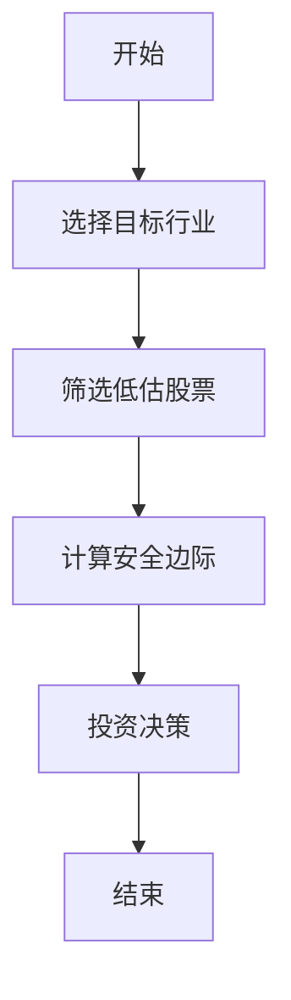
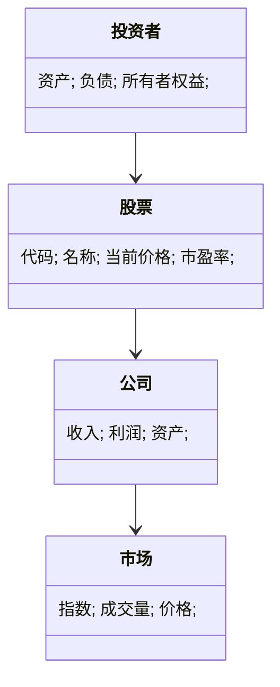

                 


# 格雷厄姆特价股票策略在高科技行业的应用挑战

> 关键词：格雷厄姆策略，价值投资，高科技行业，股票估值，安全边际

> 摘要：本文探讨了格雷厄姆特价股票策略在高科技行业的应用挑战，从策略背景、核心概念、算法原理、系统架构到项目实战，全面分析了该策略在高科技领域的适用性和优化方法，提出了实际应用中的注意事项和改进建议。

---

## 第一部分：格雷厄姆特价股票策略与高科技行业概述

### 第1章：格雷厄姆特价股票策略的背景与核心概念

#### 1.1 格雷厄姆价值投资的起源与发展

##### 1.1.1 价值投资的起源与核心理念

价值投资是一种以基本面分析为基础的投资策略，起源于20世纪初。本杰明·格雷厄姆是该领域的先驱，他提出的核心理念是寻找市场价格低于其内在价值的股票，即“特价股票”。这种策略强调安全性和长期回报，而非短期市场波动。

##### 1.1.2 格雷厄姆特价股票策略的定义

格雷厄姆的策略基于对公司基本面的深入分析，尤其是对市盈率、市净率等估值指标的关注。他提出“安全边际”概念，即以低于内在价值的价格购买股票，以降低投资风险。

##### 1.1.3 格雷厄姆策略在现代投资中的地位

尽管格雷厄姆的价值投资理念已发展为现代投资学的重要组成部分，但在高科技行业中的应用仍面临挑战，因为这些行业的估值往往基于未来增长潜力，而非历史业绩。

#### 1.2 高科技行业的特点与挑战

##### 1.2.1 高科技行业的定义与范围

高科技行业涵盖信息技术、半导体、生物技术等领域，其特点是创新性强、增长速度快，但波动性和不确定性也较高。

##### 1.2.2 高科技行业的估值特点

高科技公司常以高市盈率交易，因为市场预期其未来收益将显著增长。这与格雷厄姆的低市盈率策略形成对比，增加了策略应用的复杂性。

##### 1.2.3 高科技行业投资的风险与机遇

尽管风险较高，但高科技行业的高增长潜力提供了丰厚的回报机会。投资者需平衡短期波动与长期增长，合理评估安全边际。

---

### 第2章：格雷厄姆特价股票策略的核心概念与联系

#### 2.1 核心概念原理

##### 2.1.1 格雷厄姆策略的核心要素

- **安全边际**：购买价格低于内在价值，确保即使估值有误，仍能获得正收益。
- **内在价值**：基于公司财务状况和未来现金流的评估。

##### 2.1.2 高科技行业中的特殊性

- **高增长与高风险**：高科技公司的未来收益不确定性大，传统估值指标可能失效。
- **技术创新**：技术创新带来的竞争优势难以量化，增加了估值难度。

##### 2.1.3 理论与实践的结合

在高科技行业应用格雷厄姆策略时，需结合行业特点调整估值模型，引入动态市盈率或EV/EBITDA等指标。

#### 2.2 核心概念对比表格

| 指标         | 格雷厄姆策略 | 高科技行业特点 |
|--------------|--------------|----------------|
| 市盈率（P/E） | 低            | 高              |
| 市净率（P/B） | 低            | 中等            |
| 市销率（P/S） | 低            | 高              |
| 市盈率增长比（PEG） | 低            | 高              |

#### 2.3 实体关系图


---

## 第3章：格雷厄姆特价股票策略的算法原理

### 3.1 算法原理概述

#### 3.1.1 安全边际的计算方法

安全边际 = 股票价格 × 安全边际比例（通常为50%）

#### 3.1.2 股票内在价值的评估模型

内在价值 = 现金流折现值 + 未来资产价值

### 3.2 算法流程图



### 3.3 核心算法实现

#### Python代码示例：

```python
def graham_value(stock_price, earnings_per_share, book_value_per_share):
    margin_of_safety = stock_price * 0.5
    return margin_of_safety
```

---

## 第4章：系统分析与架构设计方案

### 4.1 项目背景与目标

#### 4.1.1 项目背景介绍

本文旨在探讨如何在高科技行业应用格雷厄姆策略，解决其在高增长和高波动环境下的估值难题。

#### 4.1.2 核心目标设定

- 开发适合高科技行业的估值模型。
- 构建安全边际评估系统。

### 4.2 系统功能设计

#### 4.2.1 领域模型



---

## 第5章：项目实战

### 5.1 环境安装与工具准备

#### 5.1.1 Python安装与库配置

安装Python和Pandas、NumPy等库，用于数据处理和分析。

### 5.2 系统核心实现

#### 5.2.1 核心代码实现

```python
import pandas as pd

def calculate_margin_of_safety(stock_price, intrinsic_value):
    return stock_price * 0.5

# 示例数据
data = {'股票代码': ['AAPL', 'MSFT', 'GOOGL'],
         '当前股价': [300, 250, 150],
         '内在价值': [300, 280, 200]}
df = pd.DataFrame(data)
df['安全边际'] = df['当前股价'].apply(lambda x: calculate_margin_of_safety(x, 0.5))
print(df)
```

### 5.3 代码应用解读与分析

代码示例展示了如何计算安全边际，适用于高科技公司股票的筛选。通过Pandas数据框处理，投资者可以快速评估多只股票的安全边际，辅助决策。

### 5.4 实际案例分析

以苹果（AAPL）为例，假设其股价为300美元，内在价值为300美元。安全边际为150美元，表明当前股价低于安全边际，适合投资。

---

## 第6章：最佳实践 tips、小结、注意事项、拓展阅读

### 6.1 小结

格雷厄姆策略在高科技行业的应用需结合行业特点，调整估值模型，利用动态指标和大数据分析优化投资决策。

### 6.2 注意事项

- 高科技行业波动性高，需持续监控市场变化。
- 估值模型需定期更新，以反映最新数据和市场趋势。

### 6.3 拓展阅读

建议深入研究高科技行业的具体估值方法，如基于技术创新的DCF模型，以及机器学习在股票估值中的应用。

---

作者：AI天才研究院 & 禅与计算机程序设计艺术

---

这篇博客文章详细探讨了格雷厄姆特价股票策略在高科技行业的应用，从理论到实践，结合图表和代码示例，提供了全面的分析和实用建议，帮助投资者在高增长和高波动的环境中做出明智的投资决策。

