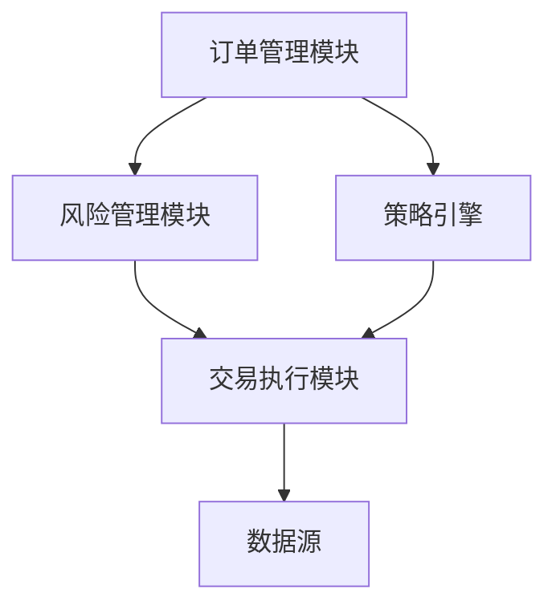

                 


# 《格雷厄姆特价股票策略在高频交易环境下的适应性研究》

## 关键词：格雷厄姆策略，价值投资，高频交易，算法优化，市场定价

## 摘要：本文探讨格雷厄姆特价股票策略在高频交易环境下的适应性，分析其在现代金融市场中的优缺点，并提出优化方向。通过系统架构设计和实战案例，展示如何在高频交易中应用格雷厄姆策略，并总结经验与展望未来。

---

# 第一部分: 格雷厄姆特价股票策略的背景与基础

## 第1章: 格雷厄姆特价股票策略概述

### 1.1 价值投资的基本概念

#### 1.1.1 价值投资的定义与核心理念
价值投资是一种投资策略，强调以低于内在价值的价格购买优质股票。核心理念包括安全边际、内在价值和市场先生的概念。

#### 1.1.2 格雷厄姆投资策略的起源与发展
本杰明·格雷厄姆是价值投资的鼻祖，他的策略在20世纪30年代提出，强调寻找被市场低估的股票。

#### 1.1.3 格雷厄姆策略在现代金融中的地位
尽管时代变迁，格雷厄姆策略仍被广泛应用于投资领域，但需适应新的市场环境。

### 1.2 高频交易的基本特点

#### 1.2.1 高频交易的定义与核心特征
高频交易是通过算法在极短时间内进行大量交易，依赖高速网络和高性能计算机。

#### 1.2.2 高频交易的技术实现与挑战
包括算法开发、数据处理、低延迟通信等技术挑战，以及市场微观结构的影响。

#### 1.2.3 高频交易与传统投资策略的对比
高频交易强调速度和算法，而传统策略注重基本面分析和长期持有。

### 1.3 格雷厄姆策略与高频交易的结合必要性

#### 1.3.1 价值投资在高频交易环境下的适应性问题
高频交易要求快速决策，与传统价值投资的长期视角存在冲突。

#### 1.3.2 高频交易对传统投资策略的挑战
市场波动加剧，传统策略在高频交易环境下可能失效。

#### 1.3.3 格雷厄姆策略在高频交易中的潜在优势
通过量化分析，优化筛选机制，适应高频交易的需求。

---

## 第2章: 格雷厄姆策略的核心原理

### 2.1 格雷厄姆策略的核心概念

#### 2.1.1 安全边际的定义与计算
安全边际=内在价值-市场价格，确保以合理价格买入股票。

#### 2.1.2 内在价值的评估方法
通过DCF模型计算公司未来现金流的现值，得出内在价值。

#### 2.1.3 市场心理与股票定价的关系
市场情绪波动影响股票价格，需通过分析发现定价偏差。

### 2.2 格雷厄姆策略的数学模型

#### 2.2.1 市盈率与市净率的计算公式
市盈率=股价/每股收益，市净率=股价/每股净资产。

#### 2.2.2 内在价值的公式推导
$$ \text{内在价值} = \sum_{t=1}^{\infty} \frac{CF_t}{(1+r)^t} $$
其中，CF_t为第t年的现金流，r为折现率。

#### 2.2.3 安全边际的量化方法
$$ \text{安全边际} = \text{内在价值} - \text{市场价格} $$

### 2.3 格雷厄姆策略的优缺点分析

#### 2.3.1 格雷厄姆策略的优点
- 强调安全边际，降低投资风险。
- 适合长期投资者，注重基本面分析。

#### 2.3.2 格雷厄姆策略的局限性
- 对市场短期波动反应不足。
- 无法适应高频交易的快速决策需求。

---

## 第3章: 高频交易环境下的策略适应性分析

### 3.1 高频交易环境的特点

#### 3.1.1 高频交易的交易频率与速度
每秒数千次交易，依赖高性能算法和基础设施。

#### 3.1.2 数据处理与算法优化的要求
需要实时处理大量数据，优化算法以减少延迟。

#### 3.1.3 市场微观结构的影响
包括订单簿分析、闪崩风险等复杂因素。

### 3.2 格雷厄姆策略在高频交易中的适用性

#### 3.2.1 优势
- 提供量化筛选标准，适合算法优化。
- 通过安全边际筛选，降低投资风险。

#### 3.2.2 挑战
- 内在价值评估周期长，与高频交易快速决策冲突。
- 市场情绪波动快，影响定价偏差分析。

#### 3.2.3 优化方向
- 结合机器学习，动态调整筛选标准。
- 开发实时内在价值评估模型。

### 3.3 策略筛选与优化

#### 3.3.1 策略筛选的标准与流程
1. 筛选低市盈率、低市净率股票。
2. 评估公司基本面，确保财务健康。
3. 计算安全边际，选择具有较高安全边际的股票。

#### 3.3.2 优化的数学模型与方法
$$ \text{优化目标} = \max \left( \text{安全边际} \times \text{交易频率} \right) $$
通过算法优化，平衡安全边际与交易频率。

#### 3.3.3 优化案例
通过优化筛选标准，提升策略在高频交易中的表现。

---

## 第4章: 格雷厄姆策略在高频交易中的系统架构与实现

### 4.1 系统设计与架构

#### 4.1.1 系统设计原则
模块化设计，确保各部分独立且易于扩展。

#### 4.1.2 高可用性要求
采用冗余设计，确保系统在高频交易环境下的稳定性。

#### 4.1.3 系统架构图


### 4.2 算法优化与实现

#### 4.2.1 并行计算
通过并行处理提升数据处理速度，减少延迟。

#### 4.2.2 分布式架构
采用分布式系统，提高处理能力和稳定性。

#### 4.2.3 优化代码示例
```python
import numpy as np

def calculate_margin(price, value):
    return value - price

# 示例数据
prices = np.array([100, 200, 300])
values = np.array([150, 250, 350])

margins = calculate_margin(prices, values)
print(margins)
```

### 4.3 数据处理与分析

#### 4.3.1 数据清洗
处理缺失值和异常值，确保数据准确性。

#### 4.3.2 特征提取
提取市盈率、市净率等关键特征，用于策略筛选。

#### 4.3.3 实时分析
开发实时分析模块，提供动态反馈。

---

## 第5章: 实战案例分析

### 5.1 案例介绍

#### 5.1.1 科技股案例
选择某科技公司，分析其市盈率和市净率，计算安全边际。

#### 5.1.2 周期性行业案例
选择某周期性行业公司，评估其内在价值。

### 5.2 实战分析

#### 5.2.1 成功案例
策略筛选成功，实现盈利。

#### 5.2.2 失败案例
策略筛选失败，分析原因并总结教训。

### 5.3 经验总结

#### 5.3.1 成功经验
策略优化的重要性。

#### 5.3.2 失败教训
市场情绪波动对策略的影响。

---

## 第6章: 优化与展望

### 6.1 当前策略的不足

#### 6.1.1 反应速度不足
内在价值评估周期长，无法满足高频交易需求。

#### 6.1.2 安全边际计算的局限性
未能充分考虑市场微观结构的影响。

### 6.2 优化方向

#### 6.2.1 结合机器学习
利用机器学习模型动态调整筛选标准。

#### 6.2.2 大数据分析
通过大数据分析优化内在价值评估模型。

#### 6.2.3 更高效的算法优化
开发更高效的算法，减少交易延迟。

### 6.3 未来研究方向

#### 6.3.1 动态调整模型
开发动态调整的策略模型，适应市场变化。

#### 6.3.2 实时反馈机制
建立实时反馈机制，优化策略执行。

---

## 结论与展望

格雷厄姆策略在高频交易环境下的适应性研究是一个复杂但具有挑战性的课题。通过本文的分析，我们看到格雷厄姆策略在高频交易中具有一定的潜力，但也面临诸多挑战。未来的研究应注重算法优化、数据处理和系统架构设计，以充分发挥格雷厄姆策略的优势。

---

作者：AI天才研究院/AI Genius Institute & 禅与计算机程序设计艺术 /Zen And The Art of Computer Programming

