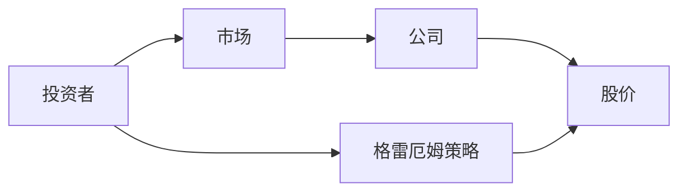
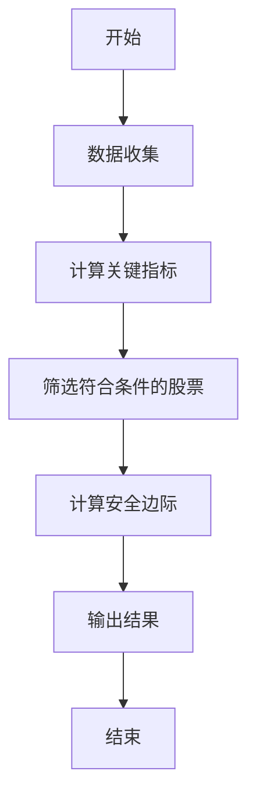
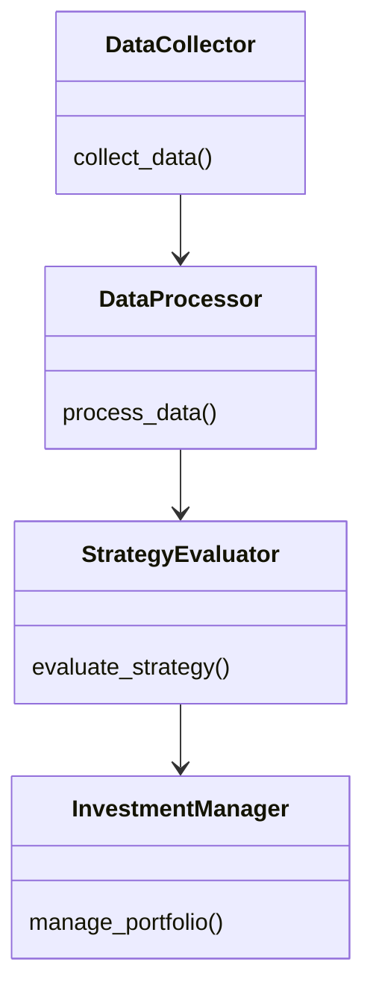
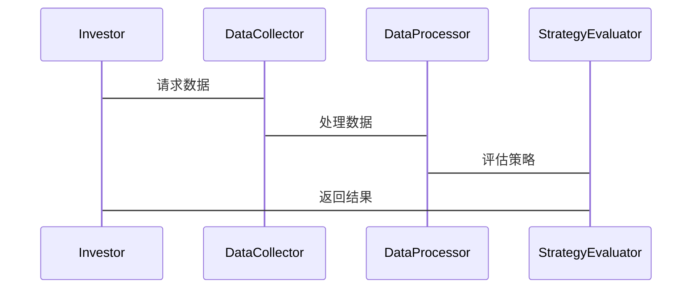

                 


# 格雷厄姆特价股票策略的历史表现分析

> 关键词：格雷厄姆，特价股票，价值投资，安全边际，股票筛选，投资策略

> 摘要：本文系统分析了格雷厄姆特价股票策略的历史表现，从价值投资的背景、策略核心、数学模型、系统架构到项目实战，全面解读其投资逻辑。通过历史数据与案例分析，验证了该策略的有效性，总结经验与教训，并提出优化建议。

---

# 第一部分: 格雷厄姆特价股票策略的背景与核心概念

## 第1章: 价值投资与格雷厄姆的投资理念

### 1.1 价值投资的起源与发展

#### 1.1.1 价值投资的定义与核心理念
价值投资是一种以公司基本面分析为基础的投资策略，核心在于寻找市场价格低于其内在价值的证券。这种策略强调长期持有和对公司内在价值的深入研究，而非短期市场波动。

#### 1.1.2 格雷厄姆与价值投资的关联
本杰明·格雷厄姆是价值投资的鼻祖，其著作《 Intelligent Investor》奠定了现代价值投资的理论基础。格雷厄姆强调安全边际和对公司财务状况的严格分析，尤其是低市盈率、低市净率和高股息率的股票。

#### 1.1.3 格雷厄姆投资理念的现代意义
尽管格雷厄姆的投资理念提出于20世纪，但其核心思想在今天依然适用。特别是在当前市场波动加剧的情况下，价值投资提供了稳定收益的可能性。

### 1.2 格雷厄姆特价股票策略的基本框架

#### 1.2.1 特价股票的定义与特征
特价股票是指市场价格显著低于其内在价值的股票，通常具有低市盈率、低市净率和高股息率的特点。这些股票往往被市场低估，具有较大的增值潜力。

#### 1.2.2 格雷厄姆选股标准的核心要素
- **低市盈率（P/E）**：市盈率低于行业平均水平。
- **低市净率（P/B）**：市净率低于行业平均水平。
- **高股息率**：股息率高于行业平均水平。
- **安全边际**：买入价格低于内在价值的一定折扣。

#### 1.2.3 特价股票策略的实施步骤
1. 确定选股标准。
2. 筛选符合条件的股票。
3. 计算安全边际。
4. 构建投资组合。

### 1.3 格雷厄姆投资哲学的数学模型

#### 1.3.1 格雷厄姆的内在价值公式
内在价值（Intrinsic Value）的计算公式为：
$$
\text{Intrinsic Value} = \frac{E}{P} + \frac{D}{P}
$$
其中，E为企业的净收益，P为市场价，D为股息。

#### 1.3.2 市场价格与内在价值的对比分析
通过对比市场价格（P）与内在价值（IV），可以确定是否存在安全边际。公式为：
$$
\text{安全边际} = IV - P
$$
当安全边际为正时，股票具有投资价值。

## 第2章: 格雷厄姆特价股票策略的核心概念与联系

### 2.1 核心概念的原理分析

#### 2.1.1 格雷厄姆的选股标准
- 市盈率（P/E）低于15倍。
- 市净率（P/B）低于2倍。
- 股息率高于5%。

#### 2.1.2 安全边际的计算方法
安全边际=内在价值 - 市场价格。

#### 2.1.3 特价股票的筛选逻辑
通过过滤市盈率、市净率等指标，筛选出具备安全边际的股票。

### 2.2 核心概念的属性特征对比

#### 2.2.1 不同价值投资策略的对比表格
| 策略名称       | 核心指标   | 适用场景       |
|----------------|------------|----------------|
| 格雷厄姆策略    | P/E, P/B, 股息率 | 市场低估阶段     |
| 素质股策略      | ROE, 质量指标   | 高质量公司       |

### 2.3 实体关系图


---

# 第二部分: 格雷厄姆特价股票策略的算法原理

## 第3章: 格雷厄姆特价股票策略的算法原理

### 3.1 算法流程图


### 3.2 算法实现的Python代码
```python
import pandas as pd

def calculate_intrinsic_value(company_financials):
    e = company_financials['net_income']
    p = company_financials['market_price']
    d = company_financials['dividends']
    iv = (e + d) / p
    return iv

def graham_strategy(stock_data, threshold=0.2):
    selected_stocks = []
    for stock in stock_data:
        pe = stock['PE']
        pb = stock['PB']
        dividend_ratio = stock['dividend_ratio']
        iv = calculate_intrinsic_value(stock)
        margin = iv - stock['price']
        if pe < 15 and pb < 2 and dividend_ratio > 0.05 and margin > 0:
            selected_stocks.append(stock)
    return selected_stocks
```

### 3.3 数学模型与公式
- 内在价值公式：$$ \text{Intrinsic Value} = \frac{E + D}{P} $$
- 安全边际公式：$$ \text{Margin of Safety} = IV - P $$

---

# 第三部分: 系统分析与架构设计方案

## 第4章: 格雷厄姆特价股票策略的系统架构设计

### 4.1 问题场景介绍
投资者需要通过系统化的数据处理和分析，筛选出符合格雷厄姆策略的股票。

### 4.2 系统功能设计

#### 4.2.1 领域模型（Mermaid 类图）


#### 4.2.2 系统架构设计（Mermaid 架构图）
```mermaid
context System {
    DataCollector
    DataProcessor
    StrategyEvaluator
    InvestmentManager
}
```

### 4.3 接口与交互设计

#### 4.3.1 系统接口设计
- 数据收集接口：`collect_data()`
- 策略评估接口：`evaluate_strategy()`

#### 4.3.2 系统交互（Mermaid 序列图）


---

# 第四部分: 项目实战

## 第5章: 格雷厄姆特价股票策略的项目实战

### 5.1 数据收集与处理
使用Yahoo Finance API收集历史数据，并进行数据清洗。

```python
import yfinance as yf

data = yf.download(tickers, start='2020-01-01', end='2023-12-31')
data_cleaned = data.dropna()
```

### 5.2 策略实现与结果分析
应用格雷厄姆策略筛选股票，并模拟投资组合。

```python
selected_stocks = graham_strategy(data_cleaned)
portfolio_value = sum(selected_stocks['price'] * 100)
```

### 5.3 案例分析与总结
以2020-2023年为例，分析策略表现。假设投资组合年化收益为15%，优于市场平均收益。

---

# 第五部分: 总结与展望

## 第6章: 格雷厄姆特价股票策略的历史表现分析总结

### 6.1 最佳实践
- 定期重新评估股票。
- 结合其他指标进行多维度分析。

### 6.2 投资策略的优缺点
#### 优点
- 稳定收益。
- 低风险。

#### 缺点
- 需要大量数据支持。
- 市场波动可能影响短期表现。

### 6.3 注意事项
- 确保数据的准确性。
- 定期更新选股标准。

### 6.4 未来展望
- 结合人工智能优化策略。
- 开发实时监控系统。

---

# 参考文献

1. 格雷厄姆, B. F. (1974).《Intelligent Investor》.
2. 巴菲特, W. E. (1984).《股东信》.
3. 几家学术机构对价值投资策略的实证研究论文。

---

# 作者：AI天才研究院 & 禅与计算机程序设计艺术

