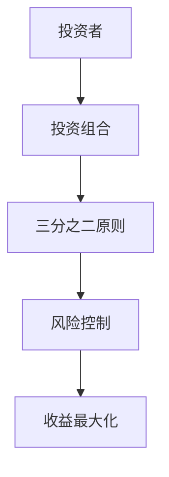
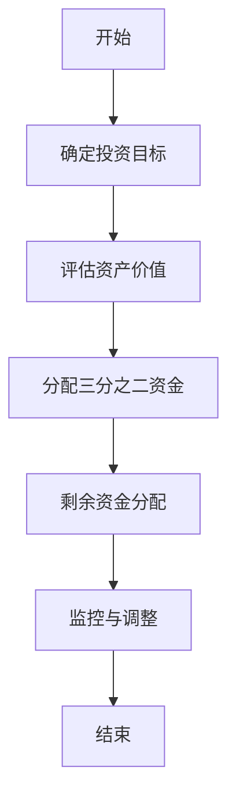
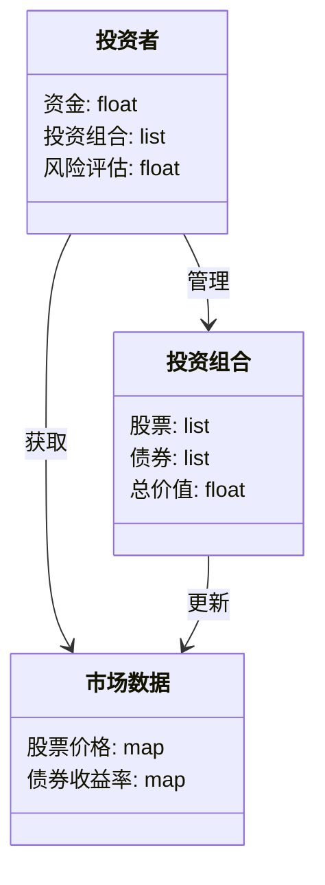
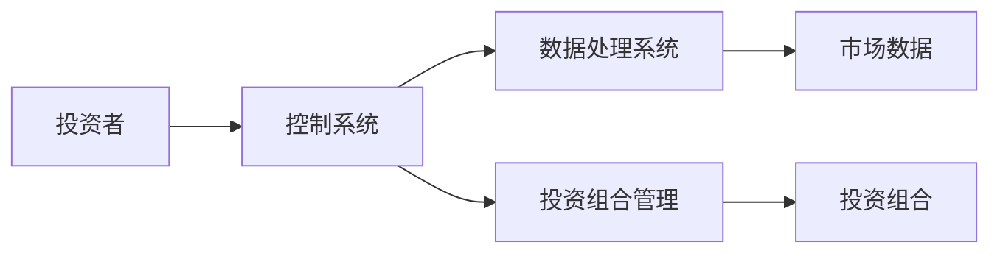

                 


# 格雷厄姆的“三分之二原则”：控制投资风险的方法

> 关键词：投资风险管理，价值投资，三分之二原则，投资组合，安全边际

> 摘要：本文深入探讨了格雷厄姆的三分之二原则，分析其在投资风险管理中的应用，通过理论分析和实际案例，结合技术方法，展示了如何在现代投资策略中应用该原则。

---

## 第一部分: 格雷厄姆的三分之二原则概述

### 第1章: 投资风险与风险管理基础

#### 1.1 投资风险的基本概念

- **1.1.1 投资风险的定义**
  投资风险是指在投资过程中，由于市场波动、经济变化等因素，导致投资收益低于预期甚至出现损失的可能性。
  
- **1.1.2 投资风险的分类**
  - 系统性风险：影响整个市场的风险，如经济衰退、通货膨胀等。
  - 非系统性风险：特定于某个资产或行业，如公司破产、诉讼等。

- **1.1.3 投资风险的影响因素**
  包括市场波动、公司基本面变化、投资者情绪等。

#### 1.2 格雷厄姆的三分之二原则的背景

- **1.2.1 格雷厄姆与价值投资概述**
  本杰明·格雷厄姆是价值投资的鼻祖，强调以低于内在价值的价格购买优质股票。

- **1.2.2 三分之二原则的起源**
  格雷厄姆建议将三分之二的资金用于购买低于市场价的股票，剩余资金用于投资债券或其他固定收益证券，以分散风险。

- **1.2.3 三分之二原则的核心思想**
  通过将大部分资金投资于安全资产，确保在市场下跌时有足够缓冲，同时保留部分资金用于抓住投资机会。

### 第2章: 三分之二原则的核心概念与联系

#### 2.1 核心概念原理

- **2.1.1 三分之二原则的基本原理**
  将三分之二的资金用于购买价格低于内在价值的股票，剩余资金用于低风险投资，以平衡风险和收益。

- **2.1.2 投资组合的构成要素**
  - 股票：占三分之二，选择低估的股票。
  - 债券：占三分之一，用于风险分散和稳定性。

- **2.1.3 价值评估与安全边际**
  安全边际是指购买价格低于内在价值的部分，确保在市场波动中仍能获得收益。

#### 2.2 核心概念属性对比表格

| 属性       | 三分之二原则 | 其他投资策略 |
|------------|--------------|--------------|
| 资金分配   | 三分之二用于安全投资 | 随市场波动调整 |
| 风险控制   | 强调风险控制 | 侧重收益最大化 |

#### 2.3 实体关系图（Mermaid流程图）



### 第3章: 三分之二原则的算法原理

#### 3.1 算法原理概述

- **3.1.1 投资组合分配算法**
  将三分之二的资金分配到低估股票，剩余部分用于债券或其他固定收益工具。

- **3.1.2 价值评估算法**
  使用市盈率、市净率等指标评估股票的内在价值，确保购买价格低于价值。

- **3.1.3 风险控制算法**
  定期审查投资组合，调整权重，确保安全边际的存在。

#### 3.2 算法流程图（Mermaid流程图）



#### 3.3 数学模型与公式

- **3.3.1 投资组合分配公式**
  $$ \text{安全投资} = \frac{2}{3} \times \text{总资金} $$

- **3.3.2 价值评估公式**
  $$ \text{内在价值} = \frac{\text{预期收益}}{\text{折现率}} $$

- **3.3.3 风险控制公式**
  $$ \text{风险敞口} = \text{总资金} - \text{安全投资} $$

### 第4章: 系统分析与架构设计方案

#### 4.1 投资管理系统概述

- **4.1.1 系统目标**
  设计一个投资管理系统，帮助投资者应用三分之二原则，实现风险控制和收益最大化。

- **4.1.2 系统功能设计（领域模型Mermaid类图）**



- **4.1.3 系统架构设计（Mermaid架构图）**



### 第5章: 项目实战

#### 5.1 环境安装

- 安装Python和必要的库（pandas, numpy, matplotlib）。
- 安装Jupyter Notebook用于数据分析和可视化。

#### 5.2 系统核心实现源代码

```python
import pandas as pd
import numpy as np

def calculate_intrinsic_value(expected_returns, discount_rate):
    return expected_returns / discount_rate

def allocate_assets(total_fund):
    stock_allocation = (2/3) * total_fund
    bond_allocation = (1/3) * total_fund
    return stock_allocation, bond_allocation

# 示例计算
total_fund = 1000000
expected_returns = 100000
discount_rate = 0.08

intrinsic_value = calculate_intrinsic_value(expected_returns, discount_rate)
stock_alloc, bond_alloc = allocate_assets(total_fund)

print(f"内在价值: ${intrinsic_value:.2f}")
print(f"股票配置: ${stock_alloc:.2f}")
print(f"债券配置: ${bond_alloc:.2f}")
```

#### 5.3 代码实现与应用解读

- 计算内在价值：使用预期收益和折现率，确保购买价格低于内在价值。
- 资产分配：将三分之二的资金用于股票，三分之一用于债券，确保风险控制。

#### 5.4 实际案例分析

假设投资者有100万美元，预期收益为10万美元，折现率为8%。

- 内在价值计算：100000 / 0.08 = 1,250,000美元。
- 股票配置：2/3 * 1,000,000 = 666,666.67美元。
- 债券配置：1/3 * 1,000,000 = 333,333.33美元。

投资者用666,666.67美元购买内在价值为1,250,000美元的股票，确保安全边际。剩余资金用于债券，提供稳定的收益。

### 第6章: 最佳实践

#### 6.1 小结

- 三分之二原则通过将大部分资金投资于低估股票，控制风险，同时保留部分资金用于灵活投资。

#### 6.2 注意事项

- 定期审查投资组合，确保安全边际存在。
- 根据市场变化调整资产配置，避免过度集中。

#### 6.3 拓展阅读

- 格雷厄姆的《 Intelligent Investor》。
- 其他投资策略，如现代投资组合理论。

---

## 作者：AI天才研究院 & 禅与计算机程序设计艺术

---

通过本文，读者可以深入理解格雷厄姆的三分之二原则，并将其应用于实际投资中，控制风险，实现长期稳健的收益。

