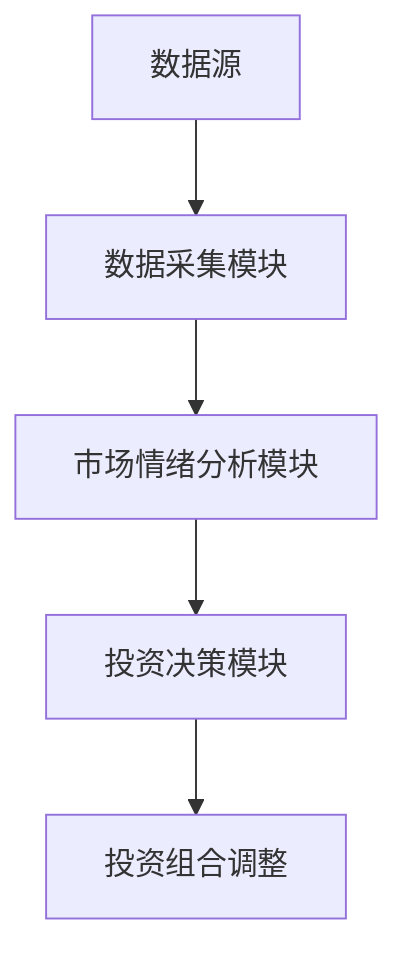

                 


# 格雷厄姆的Mr. Market理论

> 关键词：格雷厄姆, Mr. Market, 投资理论, 市场情绪, 价值投资, 市场波动, 投资策略

> 摘要：本文将深入探讨格雷厄姆提出的Mr. Market理论，分析其核心概念、理论框架、在投资中的实际应用，以及与其他投资理论的联系。通过系统的分析和实际案例，本文将揭示Mr. Market理论在投资决策中的重要性，并提供基于该理论的投资策略和风险管理方法。

---

# 第一部分: 格雷厄姆的Mr. Market理论背景与核心概念

## 第1章: Mr. Market的起源与背景

### 1.1 投资理论的演进历程

#### 1.1.1 传统投资理论的局限性
传统投资理论在20世纪初兴起，主要基于市场的有效性和理性的假设。然而，这些理论往往忽视了市场情绪和投资者心理的复杂性，导致在实际应用中存在诸多问题。例如，市场周期性波动和投资者情绪的不可预测性使得传统理论难以全面解释市场行为。

#### 1.1.2 格雷厄姆的价值投资理念
本杰明·格雷厄姆是价值投资的鼻祖，他提出了一种基于内在价值的投资方法。他认为，投资者应该关注企业的实际价值，而不是市场的短期波动。这种理念强调长期投资和安全边际的重要性，为Mr. Market理论奠定了基础。

#### 1.1.3 Mr. Market概念的提出背景
在《聪明的投资者》一书中，格雷厄姆引入了“Mr. Market”的概念，用来比喻市场的波动性和情绪化。这一概念的核心在于提醒投资者，市场并非总是理性的，而是受情绪驱动的。Mr. Market代表了市场的极端情绪，而投资者的任务是通过理性分析来应对这些情绪。

---

## 第2章: Mr. Market的核心概念与理论框架

### 2.1 Mr. Market的定义与特征

#### 2.1.1 Mr. Market的定义
Mr. Market是格雷厄姆用来描述市场情绪的一个比喻。它代表了市场参与者的情绪波动，尤其是贪婪和恐惧。当市场情绪高涨时，Mr. Market会给出过高的估值；当市场情绪低落时，他会给出过低的估值。

#### 2.1.2 Mr. Market的核心特征
- **情绪化**：Mr. Market的行为受到情绪的驱动，而非理性分析。
- **周期性**：市场情绪会经历周期性波动，从乐观到悲观，再从悲观到乐观。
- **不可预测性**：尽管市场情绪有周期性，但其具体表现和时机是不可预测的。

#### 2.1.3 Mr. Market与市场周期的关系
Mr. Market的理论与市场周期密切相关。市场周期通常分为四个阶段：复苏、繁荣、衰退和萧条。在繁荣阶段，Mr. Market会表现出过度乐观；在萧条阶段，他会表现出过度悲观。

---

### 2.2 Mr. Market与市场波动

#### 2.2.1 市场波动的周期性
市场波动是Mr. Market理论的核心。格雷厄姆认为，市场波动是由于投资者情绪的变化引起的，而这种情绪变化是周期性的。

#### 2.2.2 Mr. Market在市场波动中的角色
Mr. Market代表了市场的极端情绪，投资者需要通过分析市场波动来识别市场的过度乐观或过度悲观，从而做出理性的投资决策。

#### 2.2.3 市场情绪的量化与分析
市场情绪可以通过多种指标进行量化，例如恐慌指数（VIX指数）和投资者情绪指数。这些指标可以帮助投资者更好地理解市场情绪的变化。

---

## 第3章: Mr. Market与价值投资的联系

### 3.1 价值投资的基本原理

#### 3.1.1 价值投资的定义
价值投资是一种投资策略，强调以低于内在价值的价格购买优质资产。这种方法的核心在于寻找被市场低估的投资标的。

#### 3.1.2 格雷厄姆的价值投资理念
格雷厄姆的价值投资理念强调安全边际和长期投资。他认为，投资者应该关注企业的基本面，而不是市场的短期波动。

#### 3.1.3 价值投资与Mr. Market的关系
Mr. Market理论为价值投资提供了心理上的支持。当市场情绪低落时，Mr. Market可能会导致市场的低估，为价值投资者提供了买入优质资产的机会。

---

## 第4章: Mr. Market理论在投资中的实际应用

### 4.1 投资策略的制定

#### 4.1.1 投资目标的设定
投资者需要明确自己的投资目标，包括投资期限、风险承受能力和收益预期。

#### 4.1.2 投资策略的多样化
为了应对市场的不确定性，投资者应该采取多样化的投资策略，包括股票、债券、基金等多种资产。

#### 4.1.3 Mr. Market理论在策略中的应用
投资者可以通过分析市场情绪来调整投资策略。例如，在市场恐慌时，投资者可以考虑买入低估资产；在市场狂热时，投资者可以考虑卖出高估资产。

---

### 4.2 投资组合的构建

#### 4.2.1 投资组合的基本原理
投资组合是将资金分配到不同资产或资产类别中，以实现风险分散和收益最大化。

#### 4.2.2 Mr. Market理论对投资组合的影响
市场情绪会影响投资组合的表现。在市场情绪低落时，投资组合可能会面临更大的波动性，但这也可能是买入优质资产的机会。

#### 4.2.3 投资组合的动态调整
投资者需要根据市场情绪的变化动态调整投资组合。例如，当市场情绪过于乐观时，可以适当减少高风险资产的配置。

---

### 4.3 投资决策的案例分析

#### 4.3.1 典型案例一：市场恐慌时期的应对策略
2008年金融危机期间，市场情绪极度恐慌，Mr. Market理论提醒投资者，这种恐慌可能是买入优质资产的机会。

#### 4.3.2 典型案例二：市场狂热时期的应对策略
2015年中国的股灾期间，市场情绪过于乐观，投资者可以考虑减少高估资产的配置。

#### 4.3.3 典型案例三：市场稳定时期的应对策略
在市场稳定时期，投资者可以专注于寻找被低估的资产，逐步建立长期投资组合。

---

# 第二部分: 核心概念与联系

## 第5章: Mr. Market理论的核心原理

### 5.1 Mr. Market理论的核心原理

#### 5.1.1 市场情绪的双重性
市场情绪可以是贪婪或恐惧，这两种情绪都会导致市场的过度波动。

#### 5.1.2 市场情绪与资产价格的关系
资产价格通常会偏离其内在价值，这种偏离正是由市场情绪引起的。

#### 5.1.3 市场情绪的周期性
市场情绪的周期性波动为投资者提供了套利机会，尤其是在市场低估或高估时。

---

## 第6章: 核心概念与联系

### 6.1 Mr. Market理论与其他投资理论的对比

#### 6.1.1 基本分析与技术分析的对比
Mr. Market理论更倾向于基本分析，强调内在价值和长期投资。而技术分析则关注市场趋势和价格波动。

#### 6.1.2 价值投资与成长投资的对比
价值投资强调低估资产，而成长投资则关注高增长企业。Mr. Market理论为价值投资提供了心理支持，但并不直接适用于成长投资。

---

## 第7章: 算法原理

### 7.1 Mr. Market理论的数学模型

#### 7.1.1 市场情绪的量化
市场情绪可以通过多种指标量化，例如VIX指数和投资者情绪指数。这些指标可以用数学模型表示，例如：

$$
\text{市场情绪} = \frac{\text{VIX指数} + \text{投资者情绪指数}}{2}
$$

#### 7.1.2 均值回归模型
均值回归模型假设市场会回归其长期均值。因此，投资者可以利用市场情绪的波动性进行套利。

$$
\text{均值回归} = \text{当前价格} - \text{长期均值}
$$

---

## 第8章: 系统分析与架构设计方案

### 8.1 系统功能设计

#### 8.1.1 系统功能模块
- 数据采集模块：收集市场数据和情绪指标。
- 分析模块：量化市场情绪并生成投资建议。
- 决策模块：根据市场情绪调整投资组合。

#### 8.1.2 系统架构图


---

## 第9章: 项目实战

### 9.1 环境安装

#### 9.1.1 Python环境配置
安装Python和必要的库，例如Pandas和Matplotlib。

### 9.2 核心实现源代码

#### 9.2.1 市场情绪量化代码
```python
import pandas as pd
import matplotlib.pyplot as plt

# 示例数据：假设我们有一个包含市场情绪指数的数据集
data = pd.DataFrame({
    '日期': ['2023-01-01', '2023-01-02', '2023-01-03', '2023-01-04', '2023-01-05'],
    '市场情绪指数': [70, 65, 80, 75, 90]
})

# 绘制市场情绪指数图
plt.plot(data['日期'], data['市场情绪指数'])
plt.title('市场情绪指数图')
plt.xlabel('日期')
plt.ylabel('市场情绪指数')
plt.show()
```

#### 9.2.2 投资组合调整代码
```python
import numpy as np

# 示例投资组合调整代码
def adjust_portfolio(current_prices, target_prices):
    return np.dot(current_prices, target_prices)

current_prices = [100, 150, 200]
target_prices = [120, 160, 210]

adjusted_portfolio = adjust_portfolio(current_prices, target_prices)
print("调整后的投资组合价值:", adjusted_portfolio)
```

---

## 第10章: 最佳实践与小结

### 10.1 最佳实践

#### 10.1.1 长期投资的重要性
投资者应该坚持长期投资，避免被短期市场波动影响。

#### 10.1.2 市场情绪的监控
定期监控市场情绪，及时调整投资策略。

#### 10.1.3 风险管理
设置止损点和止盈点，控制投资风险。

---

## 第11章: 注意事项与未来展望

### 11.1 注意事项

#### 11.1.1 市场情绪的不可预测性
尽管市场情绪可以量化，但其具体表现和时机是不可预测的。

#### 11.1.2 投资者的心理偏差
投资者需要注意心理偏差，避免被市场情绪左右。

---

## 第12章: 拓展阅读

### 12.1 相关书籍与资源

#### 12.1.1 《聪明的投资者》
作者：本杰明·格雷厄姆  
简介：本书是价值投资的圣经，详细介绍了价值投资的理念和方法。

#### 12.1.2 《投资学原理》
作者：理查德·A·艾德勒  
简介：本书系统介绍了投资学的基本原理和理论。

---

# 结语

格雷厄姆的Mr. Market理论为我们提供了一种理解市场波动和投资者心理的独特视角。通过分析市场情绪和长期投资，投资者可以在复杂多变的市场中找到稳定的收益。希望本文能够为投资者提供有价值的参考和启示。

---

# 作者：AI天才研究院/AI Genius Institute & 禅与计算机程序设计艺术 /Zen And The Art of Computer Programming

