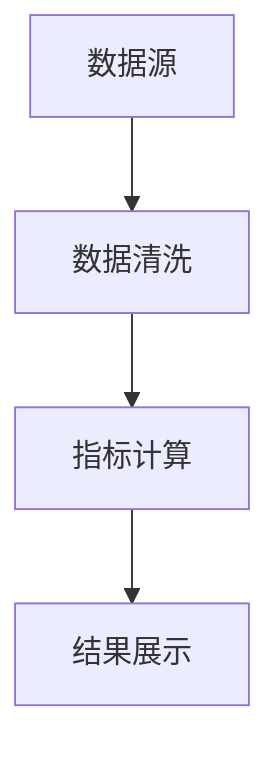

                 

# 格雷厄姆的NCAV策略：寻找极度低估的股票

## 关键词：
- 价值投资
- NCAV策略
- 股票估值
- 格雷厄姆
- 极度低估

## 摘要：
《格雷厄姆的NCAV策略：寻找极度低估的股票》系统地介绍了本杰明·格雷厄姆提出的NCAV（净现值）策略，这一策略旨在通过分析公司的流动资产与流动负债的关系，发现市场中被低估的股票。文章详细阐述了NCAV策略的理论基础、计算方法、实际应用以及在现代投资环境中的意义。通过案例分析和系统设计，文章展示了如何利用NCAV策略在投资决策中做出更明智的选择，帮助投资者识别潜在的高价值股票。

---

## 目录

### 第1章: 引言

1.1 投资的基本概念  
1.2 价值投资的定义与核心原则  
1.3 格雷厄姆与NCAV策略的起源  
1.4 为什么NCAV策略是成功的投资工具

### 第2章: NCAV策略的核心概念

2.1 流动资产与流动负债的定义  
2.2 净现值（NCAV）的计算公式  
2.3 NCAV与股价的关系  
2.4 NCAV策略与其他价值投资策略的对比

### 第3章: NCAV策略的数学模型与公式

3.1 净现值（NCAV）的公式推导  
$$NCAV = \frac{流动资产 - 流动负债}{公司总股本}$$  
3.2 如何通过NCAV公式筛选低估股票  
3.3 NCAV策略的数学模型与应用案例

### 第4章: 系统分析与架构设计

4.1 NCAV策略的系统功能设计  
4.2 数据获取与预处理流程  
4.3 核心算法实现与代码解读  
4.4 系统架构图（Mermaid）  

### 第5章: 实战分析与案例研究

5.1 环境安装与数据准备  
5.2 核心算法实现与代码解读  
5.3 案例分析：如何利用NCAV策略筛选低估股票  
5.4 投资组合构建与风险管理

### 第6章: 投资心理与行为分析

6.1 投资者的心理偏差对NCAV策略的影响  
6.2 如何克服恐惧与贪婪  
6.3 理性决策的重要性

### 第7章: 风险管理与策略优化

7.1 如何管理投资风险  
7.2 NCAV策略的优化与改进  
7.3 不同市场环境下的策略调整

### 第8章: 总结与展望

8.1 NCAV策略的核心要点回顾  
8.2 未来投资策略的发展趋势  
8.3 作者对投资者的建议

---

## 附录

A. 常用术语表  
B. 进一步阅读的资源  
C. 代码与数据下载链接  

---

## 作者：AI天才研究院 & 禅与计算机程序设计艺术

