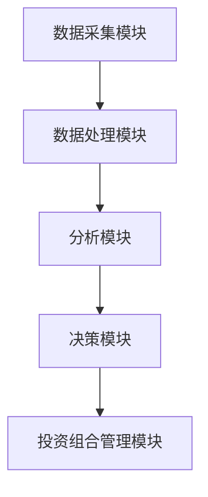

                 


```markdown
# 格雷厄姆的价值投资传承

> 关键词：价值投资，格雷厄姆，安全边际，内在价值，投资系统，风险管理

> 摘要：本文系统地介绍了格雷厄姆的价值投资理论，分析了其核心概念和数学模型，并通过实际案例展示了如何将价值投资理念应用于现代投资实践。文章详细讲解了价值投资的传承过程，探讨了其在不同市场环境下的应用，最后总结了价值投资的最佳实践和未来发展趋势。

---

## 第1章: 价值投资的背景与起源

### 1.1 价值投资的定义与核心理念

#### 1.1.1 价值投资的定义
价值投资是一种以基本面分析为基础的投资策略，强调以低于内在价值的价格购买优质资产。其核心理念是通过深入研究企业的财务状况、行业地位和盈利能力，寻找市场上被低估的投资标的。

#### 1.1.2 价值投资的核心理念
- **安全边际**：买入价格与内在价值之间的差距，确保投资的安全性。
- **内在价值**：资产在合理市场条件下的公平价值，与市场价格无关。
- **长期视角**：关注企业的长期盈利能力，而非短期市场波动。

#### 1.1.3 价值投资与其它投资理念的区别
| 投资理念 | 核心思想 | 时间框架 | 风险承受 |
|----------|----------|----------|----------|
| 价值投资 | 寻找低估资产 | 长期 | 较低 |
| 技术分析 | 通过价格和成交量预测 | 短期 | 较高 |
| 股票筛选 | 基于特定指标筛选 | 中短期 | 中等 |

### 1.2 格雷厄姆的生平与贡献

#### 1.2.1 格雷厄姆的生平简介
本杰明·格雷厄姆（Benjamin Graham）是20世纪著名的投资学家，被誉为“价值投资之父”。他在1920年代开始研究股票市场，提出了许多至今仍被广泛采用的投资理论。

#### 1.2.2 格雷厄姆对投资学的贡献
格雷厄姆的贡献主要体现在以下几个方面：
1. **安全边际**：他强调买入价格低于内在价值，以降低投资风险。
2. **内在价值计算**：他提出通过现金流折现法计算企业的内在价值。
3. **投资组合管理**：他主张分散投资以降低风险。

#### 1.2.3 格雷厄姆的价值投资理论的形成与发展
格雷厄姆的价值投资理论主要形成于1929年股市崩盘之后，他在总结经验教训的基础上提出了“安全边际”和“内在价值”等核心概念。

### 1.3 价值投资的现代传承

#### 1.3.1 现代价值投资的发展现状
价值投资在现代得到了进一步的发展，许多投资者和机构都采用了格雷厄姆的理念，并结合现代金融理论进行了优化。

#### 1.3.2 价值投资在不同市场环境下的应用
- **牛市**：寻找估值合理的资产，避免过度投机。
- **熊市**：利用市场恐慌寻找低估资产。
- **震荡市**：通过分散投资降低风险。

#### 1.3.3 价值投资的未来发展趋势
随着技术的进步，价值投资将更加依赖于数据和技术分析，但其核心理念——寻找低估资产——将始终不变。

---

## 第2章: 价值投资的核心概念与原理

### 2.1 安全边际

#### 2.1.1 安全边际的定义
安全边际是指买入价格与内在价值之间的差额，即：
$$ 安全边际 = 内在价值 - 市场价格 $$

#### 2.1.2 安全边际的计算方法
以一家企业的内在价值为 $100，市场价格为 $80为例：
$$ 安全边际 = 100 - 80 = 20 $$

#### 2.1.3 安全边际在投资决策中的应用
- 确保投资的本金安全。
- 提供抵御市场波动的能力。

### 2.2 内在价值

#### 2.2.1 内在价值的定义
内在价值是企业在合理市场条件下的公平价值，通常通过现金流折现法计算。

#### 2.2.2 内在价值的计算方法
$$ 内在价值 = \sum_{t=1}^{n} \frac{CF_t}{(1 + r)^t} $$
其中，$CF_t$ 是第 $t$ 年的现金流，$r$ 是折现率。

#### 2.2.3 内在价值与市场价值的关系
| 关系类型 | 内在价值与市场价值 | 描述 |
|----------|--------------------|------|
| 被低估   | 内在价值 > 市场价值 | 买入机会 |
| 公平估值 | 内在价值 ≈ 市场价值 | 观望 |
| 被高估   | 内在价值 < 市场价值 | 卖出或避免买入 |

### 2.3 股票分析的三重标准

#### 2.3.1 盈利能力分析
- **指标**：净利润率、ROE（净资产收益率）。
- **方法**：通过对比同行业公司，寻找盈利能力稳定的标的。

#### 2.3.2 财务状况分析
- **指标**：资产负债率、流动比率。
- **方法**：确保企业财务健康，避免过高负债。

#### 2.3.3 市场地位分析
- **指标**：市场份额、品牌影响力。
- **方法**：选择行业龙头或具有竞争优势的企业。

### 2.4 价值投资的风险管理

#### 2.4.1 风险的定义与分类
- **系统性风险**：市场整体波动带来的风险。
- **非系统性风险**：特定企业或行业带来的风险。

#### 2.4.2 价值投资中的风险管理策略
- **分散投资**：通过投资多个行业和企业降低风险。
- **止损策略**：设定止损点，避免亏损过大。

#### 2.4.3 风险与收益的平衡
- **风险厌恶者**：选择安全边际较高的资产。
- **风险偏好者**：选择高风险高收益的资产。

---

## 第3章: 价值投资的数学模型与公式

### 3.1 内在价值计算公式

#### 3.1.1 现金流量折现模型（DCF）
$$ 内在价值 = \sum_{t=1}^{n} \frac{CF_t}{(1 + r)^t} + \frac{TV}{(1 + r)^n} $$
其中，$CF_t$ 是第 $t$ 年的现金流，$r$ 是折现率，$TV$ 是终值。

#### 3.1.2 市盈率与市净率分析
- **市盈率（P/E）**：$$ P/E = \frac{市场价格}{每股收益} $$
- **市净率（P/B）**：$$ P/B = \frac{市场价格}{每股净资产} $$

#### 3.1.3 股息率计算
$$ 股息率 = \frac{每股股息}{市场价格} \times 100\% $$

### 3.2 安全边际计算公式

#### 3.2.1 内在价值与市场价格的差异
$$ 安全边际 = 内在价值 - 市场价格 $$

#### 3.2.2 安全边际率的计算
$$ 安全边际率 = \frac{安全边际}{市场价格} \times 100\% $$

#### 3.2.3 安全边际与投资风险的关系
- **高安全边际**：低风险，高回报潜力。
- **低安全边际**：高风险，低回报潜力。

### 3.3 价值投资中的概率与统计

#### 3.3.1 投资决策中的概率分析
- **概率树分析**：用于评估不同市场条件下投资的可能结果。
- **贝叶斯定理**：用于更新投资决策的概率。

#### 3.3.2 统计学在价值投资中的应用
- **均值回归**：市场波动后会回归均值。
- **标准差**：衡量资产收益的波动性。

#### 3.3.3 投资组合的期望收益与风险
$$ 期望收益 = \sum (P_i \times R_i) $$
$$ 风险 = 标准差 = \sqrt{\sum P_i^2 \times (R_i - 期望收益)^2} $$

---

## 第4章: 价值投资的系统分析与架构设计

### 4.1 投资系统概述

#### 4.1.1 投资系统的定义与目标
- **定义**：一套用于筛选、评估和管理投资组合的自动化系统。
- **目标**：提高投资效率，降低风险。

#### 4.1.2 投资系统的组成模块
- **数据采集模块**：收集企业财务数据、市场数据。
- **分析模块**：计算内在价值、安全边际。
- **决策模块**：制定投资策略。

#### 4.1.3 投资系统的运行流程
1. 数据采集。
2. 数据处理与分析。
3. 生成投资建议。

### 4.2 数据收集与处理

#### 4.2.1 数据来源与采集方法
- **数据来源**：股票市场数据、企业财务报表。
- **采集方法**：API接口、数据库查询。

#### 4.2.2 数据清洗与预处理
- **数据清洗**：去除无效数据，填补缺失值。
- **数据转换**：将数据转换为可分析的格式。

#### 4.2.3 数据存储与管理
- **数据库选择**：MySQL、MongoDB。
- **数据存储结构**：关系型数据库或非关系型数据库。

### 4.3 投资策略的制定与优化

#### 4.3.1 策略制定的步骤与方法
1. 确定投资目标。
2. 分析市场环境。
3. 选择投资标的。

#### 4.3.2 策略优化的数学模型
$$ 最优化目标 = \max \sum (R_i - R_f) \times w_i $$
其中，$R_i$ 是资产的预期收益，$R_f$ 是无风险利率，$w_i$ 是投资权重。

#### 4.3.3 策略实施的监控与调整
- **监控指标**：收益、风险、安全边际。
- **调整策略**：根据市场变化动态调整投资组合。

### 4.4 系统架构设计

#### 4.4.1 系统架构图（Mermaid）


#### 4.4.2 模块之间的交互关系
- 数据采集模块向数据处理模块提供原始数据。
- 数据处理模块将 cleaned 数据传递给分析模块。
- 分析模块计算出内在价值和安全边际，传递给决策模块。
- 决策模块根据分析结果生成投资建议。

#### 4.4.3 系统的可扩展性与可维护性
- **可扩展性**：通过模块化设计，方便新增功能。
- **可维护性**：通过清晰的代码结构，方便维护和升级。

---

## 第5章: 价值投资的项目实战

### 5.1 环境安装

#### 5.1.1 安装Python
```bash
pip install python3
pip install numpy pandas matplotlib
```

#### 5.1.2 安装数据接口
```bash
pip install pandas-datareader
```

### 5.2 核心代码实现

#### 5.2.1 内在价值计算函数
```python
def calculate_intrinsic_value(enterprise_value, free_cash_flow, discount_rate, perpetuity_growth_rate):
    # 计算终值
    tv = free_cash_flow * (1 + perpetuity_growth_rate) / (discount_rate - perpetuity_growth_rate)
    # 计算现值
    intrinsic_value = 0
    for year in range(1, 5):
        cf = free_cash_flow * (1 + perpetuity_growth_rate) ** (year - 1)
        intrinsic_value += cf / (1 + discount_rate) ** year
    intrinsic_value += tv / (1 + discount_rate) ** 5
    return intrinsic_value
```

#### 5.2.2 安全边际计算函数
```python
def calculate_margin_of_safety(intrinsic_value, market_price):
    return intrinsic_value - market_price
```

### 5.3 代码应用解读与分析

#### 5.3.1 内在价值计算
```python
# 示例数据
enterprise_value = 1000000
free_cash_flow = 100000
discount_rate = 0.1
perpetuity_growth_rate = 0.05

iv = calculate_intrinsic_value(enterprise_value, free_cash_flow, discount_rate, perpetuity_growth_rate)
print(f"内在价值: {iv}")
```

#### 5.3.2 安全边际计算
```python
market_price = 800000
mos = calculate_margin_of_safety(iv, market_price)
print(f"安全边际: {mos}")
```

### 5.4 实际案例分析和详细讲解剖析
假设我们分析一家企业：
- 企业价值：$1,000,000
- 自由现金流：$100,000
- 折现率：10%
- 永续增长率：5%

计算内在价值：
$$ iv = 100,000 \times (1 + 0.05) \times \frac{1}{1.1} + 100,000 \times (1 + 0.05)^2 \times \frac{1}{1.1^2} + 100,000 \times (1 + 0.05)^3 \times \frac{1}{1.1^3} + 100,000 \times (1 + 0.05)^4 \times \frac{1}{1.1^4} + \frac{100,000 \times (1 + 0.05)^5}{1.1^5} $$
$$ iv ≈ 90,909 + 82,644 + 75,131 + 68,301 + 62,092 ≈ 319,077 $$

计算安全边际：
$$ mos = 319,077 - 1,000,000 = -680,923 $$

由于安全边际为负，说明企业被高估，不建议投资。

### 5.5 项目小结
通过上述案例，我们发现即使企业具有较高的自由现金流，但如果市场价格过高，仍然可能被高估。因此，在实际投资中，需要结合多种因素进行综合分析。

---

## 第6章: 价值投资的最佳实践

### 6.1 投资过程中的注意事项
1. **避免情绪化决策**：保持理性，避免贪婪和恐惧。
2. **持续学习**：市场环境不断变化，需要不断更新知识。
3. **分散投资**：降低非系统性风险。

### 6.2 小结
价值投资是一种长期有效的投资策略，但需要投资者具备耐心和纪律性。

### 6.3 注意事项
1. **数据质量**：确保数据来源可靠。
2. **模型局限性**：数学模型无法完全反映市场复杂性。
3. **市场变化**：需要根据市场变化调整投资策略。

### 6.4 拓展阅读
- 《聪明的投资者》——本杰明·格雷厄姆
- 《投资最重要的少数事》——彼得·林奇
- 《价值投资实战手册》——李录

---

## 作者：AI天才研究院/AI Genius Institute & 禅与计算机程序设计艺术 /Zen And The Art of Computer Programming
```

