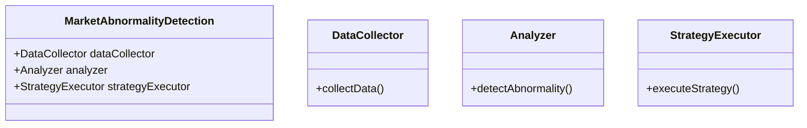
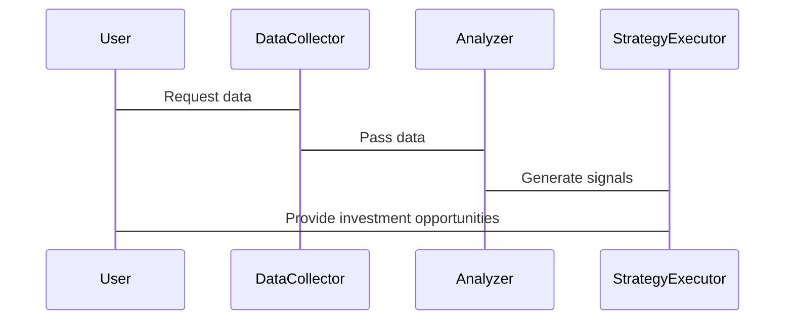

                 


# 格雷厄姆的市场异常理论

## 关键词：
- 市场异常理论
- 价值投资
- 统计套利
- 事件驱动分析
- 市场微观结构分析

## 摘要：
本文深入探讨了格雷厄姆的市场异常理论，分析了市场异常现象的背景、核心概念及其在投资策略中的应用。通过统计套利、事件驱动分析和市场微观结构分析等方法，结合实际案例和系统架构设计，为读者提供了一套基于市场异常理论的投资策略实现方案。

---

## 第一部分：市场异常理论的背景与基础

### 第1章：市场异常理论的起源与核心概念

#### 1.1 格雷厄姆的价值投资理念
##### 1.1.1 价值投资的定义与核心思想
价值投资是一种投资策略，强调以低于内在价值的价格购买优质资产。格雷厄姆是该理论的奠基人，他提出市场价格与内在价值之间存在偏离，这种偏离为投资者提供了获利机会。

##### 1.1.2 市场异常理论的提出背景
20世纪20年代的股市繁荣与随后的崩盘使格雷厄姆意识到市场的非理性。他发现，市场的短期波动性和投资者的非理性行为导致某些股票的价格与其实际价值不符。

##### 1.1.3 格雷厄姆的投资策略与市场异常的关系
格雷厄姆通过分析市场异常现象（如小盘股、低价股和低市盈率股），提出了以低于市场价买入并长期持有的投资策略。

#### 1.2 市场异常现象的定义与分类
##### 1.2.1 什么是市场异常
市场异常指的是证券价格与其内在价值之间的短期偏离，这种偏离通常由市场参与者的非理性行为或信息不对称引起。

##### 1.2.2 市场异常的主要类型
- **小盘股异常**：小盘股的市场流动性较低，价格波动较大，容易出现低估。
- **低价股异常**：低价股的市场关注度较低，容易被市场忽视，价格可能低于其实际价值。
- **低市盈率股异常**：市盈率低的股票可能被市场低估，具有较大的增值潜力。

##### 1.2.3 市场异常的边界与外延
市场异常的边界在于其短期性和可操作性。外延则包括对冲策略、套利机会和长期投资策略的应用。

#### 1.3 格雷厄姆的市场异常理论框架
##### 1.3.1 格雷厄姆的市场异常理论结构
格雷厄姆的理论框架包括市场异常的识别、量化和投资策略的制定。

##### 1.3.2 核心概念与要素的组成
- 市场异常的识别方法
- 价格与价值的偏离程度
- 投资策略的制定与实施

##### 1.3.3 理论与实践的结合
格雷厄姆的理论强调理论与实践的结合，通过实际案例分析验证理论的有效性。

---

### 第2章：市场异常现象的统计特征与行为金融学基础

#### 2.1 市场异常现象的统计特征
##### 2.1.1 市场异常的统计分布
市场异常现象通常呈现非正态分布，具有尾部厚的特点。

##### 2.1.2 异常现象的时间序列分析
通过时间序列分析，可以发现市场异常现象的周期性和波动性。

##### 2.1.3 异常现象的波动性与周期性
市场异常现象通常与市场周期相关，波动性较高的市场更容易出现异常。

#### 2.2 行为金融学基础
##### 2.2.1 行为金融学的核心理论
行为金融学研究投资者心理和行为对市场的影响，强调非理性决策对市场定价的影响。

##### 2.2.2 投资者心理与市场异常的关系
投资者的非理性行为（如恐惧和贪婪）导致市场价格偏离其实际价值，为市场异常提供了发生的基础。

##### 2.2.3 市场情绪对异常现象的影响
市场情绪的变化会影响投资者的决策，进而影响市场价格的波动。

---

### 第3章：市场异常理论的核心算法与数学模型

#### 3.1 市场异常检测的算法原理
##### 3.1.1 统计套利算法
统计套利算法通过寻找市场中的定价偏差，利用这些偏差进行套利交易。

##### 3.1.2 事件驱动分析算法
事件驱动分析算法关注公司特定事件（如并购、重组）对股价的影响，捕捉短期市场异常。

##### 3.1.3 市场微观结构分析算法
市场微观结构分析算法研究市场交易数据，识别异常交易模式。

#### 3.2 市场异常的数学模型
##### 3.2.1 市场异常的统计模型
常用的统计模型包括均值-方差模型和多元回归模型。

##### 3.2.2 异常现象的回归分析模型
回归分析用于识别市场异常现象与公司基本面之间的关系。

##### 3.2.3 异常现象的马尔可夫链模型
马尔可夫链模型用于分析市场异常现象的动态变化。

#### 3.3 市场异常的数学公式与案例分析
##### 3.3.1 异常现象的数学公式
- 均值-方差模型：$$ E(r) = \beta (E(m) - R_f) + \alpha $$
- 多元回归模型：$$ y = \beta_1x_1 + \beta_2x_2 + \epsilon $$

##### 3.3.2 公式推导与解释
通过数学公式推导，解释市场异常现象的内在规律。

##### 3.3.3 实际案例分析与公式应用
通过具体案例分析，展示如何利用数学公式识别市场异常。

---

### 第4章：系统分析与架构设计方案

#### 4.1 问题场景介绍
##### 4.1.1 市场异常检测的典型场景
- 小盘股市场的套利机会
- 低价股的低估识别
- 低市盈率股的投资机会

##### 4.1.2 系统目标与范围
设计一个基于市场异常理论的自动检测系统，识别潜在的投资机会。

##### 4.1.3 系统功能需求
- 数据收集与处理
- 异常检测与信号生成
- 投资策略执行
- 风险控制

#### 4.2 项目介绍
##### 4.2.1 项目目标
开发一个市场异常检测系统，帮助投资者识别潜在的投资机会。

##### 4.2.2 项目范围
- 数据源选择
- 算法实现
- 系统架构设计

#### 4.3 系统功能设计
##### 4.3.1 领域模型（Mermaid 类图）


##### 4.3.2 系统架构设计（Mermaid 架构图）
```mermaid
architecturalDiagram
    participant DataCollector
    participant Analyzer
    participant StrategyExecutor
    participant RiskController
    DataCollector --> Analyzer: Pass data
    Analyzer --> StrategyExecutor: Generate signals
    StrategyExecutor --> RiskController: Execute and monitor
```

##### 4.3.3 系统接口设计
- 数据接口：数据收集模块与数据源的接口
- 分析接口：分析模块与数据模块的接口
- 执行接口：策略执行模块与分析模块的接口

##### 4.3.4 系统交互（Mermaid 序列图）


---

### 第5章：项目实战

#### 5.1 环境安装与配置
##### 5.1.1 环境要求
- Python 3.8+
- 数据分析库（Pandas, NumPy）
- 绘图库（Matplotlib, Seaborn）
- 交易数据源（如Yahoo Finance）

##### 5.1.2 安装步骤
```bash
pip install pandas numpy matplotlib seaborn requests
```

#### 5.2 核心实现源代码
##### 5.2.1 数据收集模块
```python
import pandas as pd
import requests

def collect_data(tickers):
    data = []
    for ticker in tickers:
        url = f'https://api.example.com/stock/{ticker}'
        response = requests.get(url)
        data.append(response.json())
    return pd.DataFrame(data)
```

##### 5.2.2 异常检测模块
```python
def detect_abnormalities(df):
    # 计算市盈率和市净率
    df['PE'] = df['Price'] / df['Earnings per Share']
    df['PB'] = df['Price'] / df['Book Value per Share']
    # 筛选市盈率和市净率低于行业平均水平的股票
    df = df[(df['PE'] < df['PE'].mean()) & (df['PB'] < df['PB'].mean())]
    return df
```

##### 5.2.3 投资策略执行模块
```python
def execute_strategy(df):
    positions = []
    for index, row in df.iterrows():
        # 计算投资金额
        investment = row['Market Cap'] * 0.1
        positions.append({'Ticker': row['Ticker'], 'Amount': investment})
    return positions
```

#### 5.3 代码应用解读与分析
##### 5.3.1 代码功能分析
- 数据收集模块：从数据源获取股票数据。
- 异常检测模块：计算市盈率和市净率，筛选出低于行业平均水平的股票。
- 投资策略执行模块：根据筛选结果，计算投资金额，生成投资组合。

##### 5.3.2 实际案例分析
通过实际数据，展示如何利用上述代码识别市场异常现象，并制定投资策略。

#### 5.4 项目小结
本项目展示了如何利用格雷厄姆的市场异常理论，结合统计套利和事件驱动分析，开发一个市场异常检测系统。

---

### 第6章：最佳实践与注意事项

#### 6.1 最佳实践 tips
- **纪律性**：严格执行投资策略，避免情绪化决策。
- **风险管理**：设定止损点，控制投资风险。
- **长期视角**：关注长期价值，避免短期波动的干扰。

#### 6.2 小结
格雷厄姆的市场异常理论为投资者提供了识别市场机会的工具，结合现代技术手段，可以更有效地捕捉市场异常现象。

#### 6.3 注意事项
- 市场异常现象具有短期性，需及时捕捉机会。
- 投资需谨慎，建议结合多种策略进行综合分析。

#### 6.4 拓展阅读
推荐阅读格雷厄姆的经典著作《 Intelligent Investor》以及相关的行为金融学文献。

---

## 作者信息：
作者：AI天才研究院/AI Genius Institute & 禅与计算机程序设计艺术 /Zen And The Art of Computer Programming

