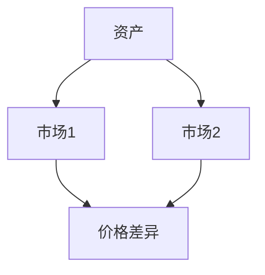
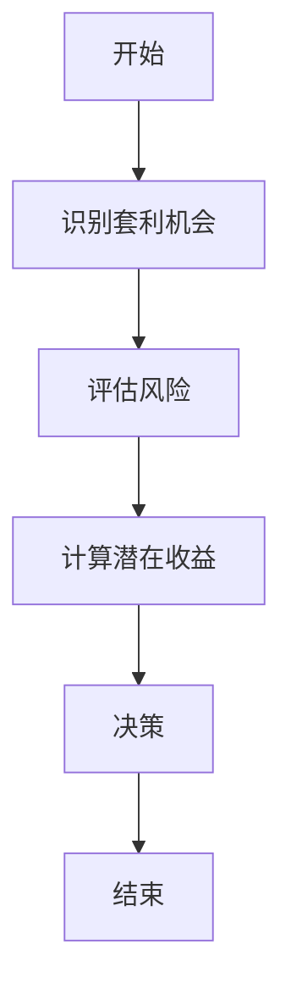
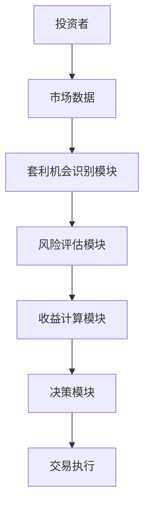
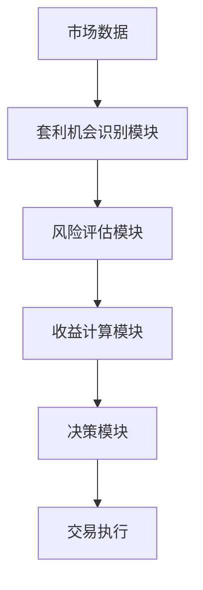

                 


```markdown
# 格雷厄姆的特殊情况投资：寻找套利机会

> 关键词：格雷厄姆投资策略，特殊情况投资，套利机会，价值投资，数学模型

> 摘要：本文深入探讨了格雷厄姆的特殊情况投资理念，分析了套利机会的定义、特征及识别方法，结合数学模型和实际案例，系统介绍了如何利用套利机会进行投资。文章从套利机会的背景与核心概念出发，逐步展开到套利机会的算法原理、系统架构设计、项目实战、风险管理及未来趋势，为读者提供了一套完整的套利机会分析与投资策略。

---

## 第一部分: 格雷厄姆的特殊情况投资概述

### 第1章: 特殊情况投资的背景与核心概念

#### 1.1 特殊情况投资的定义与背景

##### 1.1.1 什么是特殊情况投资
特殊情况投资是指在特定市场环境下，投资者利用价格差异、信息不对称或市场低效等机会，通过套利或其他策略实现超额收益的投资方式。格雷厄姆的投资理念强调长期价值，但在某些特殊情况下，套利机会可以为投资者提供快速实现收益的途径。

##### 1.1.2 格雷厄姆投资理念的核心思想
格雷厄姆是价值投资的鼻祖，他主张以低于内在价值的价格购买优质资产。在特殊情况投资中，套利机会的出现往往与市场短期波动、信息不对称或市场低效有关，这为投资者提供了以合理价格买入资产的机会。

##### 1.1.3 套利机会的定义与分类
套利机会是指在两个或多个市场中，同一资产的价格差异导致的无风险或低风险套利机会。套利机会可以分为跨市场套利、时间套利、空间套利等类型。

#### 1.2 套利机会的特征与边界

##### 1.2.1 套利机会的特征分析
套利机会通常具有以下特征：
- 价格差异：同一资产在不同市场或时间点的价格差异。
- 低风险：套利机会的风险较低，通常基于市场价差的无套利定价。
- 短期性：套利机会往往昙花一现，需要快速反应。

##### 1.2.2 套利机会的边界与外延
套利机会的边界包括市场效率、交易成本、法律法规等。当市场高度有效时，套利机会减少；当交易成本过高时，套利机会可能不再 profitable。

##### 1.2.3 格雷厄姆投资策略的适用范围
格雷厄姆的策略主要适用于长期价值投资，但在某些特殊情况下，套利机会可以作为补充策略，帮助投资者在短期实现收益。

---

### 第2章: 套利机会的核心概念与联系

#### 2.1 核心概念原理

##### 2.1.1 套利机会的数学模型
套利机会可以通过数学模型进行分析。例如，假设资产在两个市场的价格分别为 $P_1$ 和 $P_2$，当 $P_1 < P_2$ 时，投资者可以买入资产在市场1，卖出资产在市场2，从而实现无风险收益。

##### 2.1.2 格雷厄姆投资策略的数学表达式
格雷厄姆的策略强调买入低于内在价值的资产。内在价值可以通过以下公式估算：
$$ V = \frac{E}{P} $$
其中，$E$ 是企业价值，$P$ 是市场价格。

##### 2.1.3 套利机会的实体关系图（ER图）


#### 2.2 核心概念属性特征对比表

##### 2.2.1 不同套利机会的特征对比
| 特征         | 跨市场套利       | 时间套利         | 空间套利         |
|--------------|-----------------|-----------------|-----------------|
| 风险         | 低              | 低              | 中              |
| 收益周期     | 短期            | 中期            | 长期            |
| 市场条件     | 两个市场价格差异 | 同一资产不同时间 | 同一资产不同地点 |

##### 2.2.2 格雷厄姆投资策略与现代投资策略的对比
| 特征         | 格雷厄姆策略     | 现代投资策略     |
|--------------|-----------------|-----------------|
| 投资期限     | 长期            | 短期            |
| 投资目标     | 内在价值        | 市场价格         |
| 风险承受     | 较低            | 较高            |

---

## 第二部分: 套利机会的算法原理

### 第3章: 套利机会的算法原理

#### 3.1 套利机会的算法流程图



#### 3.2 套利机会的数学模型与公式

##### 3.2.1 套利机会的定价公式
套利机会的无风险收益可以通过以下公式计算：
$$ R = P_2 - P_1 - C $$
其中，$C$ 是交易成本。

##### 3.2.2 格雷厄姆策略的套利定价定理
格雷厄姆策略的套利定价定理指出：
$$ V = \min(P_1, P_2) + \text{交易成本} $$

#### 3.3 系统分析与架构设计

##### 3.3.1 系统架构设计



##### 3.3.2 数据流图



---

## 第三部分: 项目实战与风险管理

### 第4章: 项目实战

#### 4.1 项目介绍
以某公司财务困境为例，分析其套利机会。

#### 4.2 核心代码实现

##### 4.2.1 环境安装
```bash
pip install pandas numpy matplotlib
```

##### 4.2.2 核心代码
```python
import pandas as pd
import numpy as np

# 假设市场1和市场2的价格数据
market1_prices = pd.Series([100, 105, 110], index=[1, 2, 3])
market2_prices = pd.Series([102, 107, 112], index=[1, 2, 3])

# 计算价格差异
price_diff = market2_prices - market1_prices
print(price_diff)
```

##### 4.2.3 代码解读
上述代码计算了市场1和市场2的价格差异，帮助识别套利机会。

#### 4.3 实际案例分析
以某公司为例，分析其套利机会的识别与实现。

### 第5章: 风险管理

#### 5.1 风险评估与控制策略
套利机会的风险包括市场波动、交易成本等。常用的风险管理策略包括对冲、分散投资等。

#### 5.2 套利机会的风险调整收益
$$ R_{\text{风险调整}} = R - \text{风险溢价} $$

---

## 第四部分: 高级策略与未来趋势

### 第6章: 高级策略

#### 6.1 利用人工智能的套利机会识别
人工智能技术可以帮助投资者快速识别套利机会。

#### 6.2 大数据驱动的套利机会分析
通过大数据分析，投资者可以发现更多的套利机会。

### 第7章: 未来趋势

#### 7.1 套利机会的自动化交易
自动化交易将更加普及，套利机会的识别将更加高效。

#### 7.2 格雷厄姆策略的现代化应用
格雷厄姆策略将与现代技术结合，实现更高效的投资。

---

## 第五部分: 结论

### 第8章: 结论

#### 8.1 总结
本文深入探讨了格雷厄姆的特殊情况投资理念，分析了套利机会的识别与实现方法。

#### 8.2 展望
未来，套利机会的识别将更加依赖于技术进步，投资者需要不断学习新技术以抓住更多机会。

---

## 附录

### 附录A: 术语表
- 套利机会：利用价格差异实现无风险收益的投资机会。

### 附录B: 参考文献
- 格雷厄姆， Benjamin. 《证券分析》
- 肖恩·L. 考恩. 《套利机会识别与实现》

---

## 作者：AI天才研究院 & 禅与计算机程序设计艺术
```

