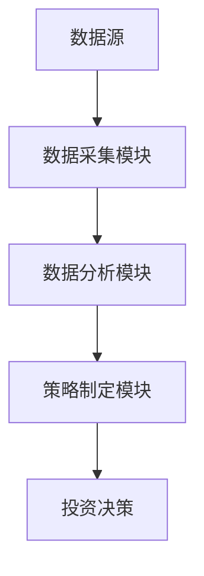

                 


# 格雷厄姆的防御型和进取型投资者：知己知彼

## 关键词：格雷厄姆，防御型投资者，进取型投资者，知己知彼，投资策略，技术分析

## 摘要：本文将探讨格雷厄姆的防御型和进取型投资者策略，结合知己知彼的原则，分析其在现代投资中的应用。通过技术分析和系统设计，展示如何利用计算机技术优化投资决策。

---

# 第一部分：格雷厄姆防御型与进取型投资者概述

## 第1章：投资者的类型与策略

### 1.1 投资者的分类

#### 1.1.1 防御型投资者的定义与特点
防御型投资者注重安全性和稳定性，追求长期稳健的回报，避免高风险投资。

#### 1.1.2 进取型投资者的定义与特点
进取型投资者愿意承担高风险，追求高回报，通常投资于高增长行业。

#### 1.1.3 两种投资者的优劣势对比
| 类别        | 优点                          | 缺点                          |
|-------------|-------------------------------|-------------------------------|
| 防御型      | 稳定性高，风险低               | 收益有限，适合保守投资者      |
| 进取型      | 高回报潜力，适合冒险者       | 风险高，波动性强              |

### 1.2 格雷厄姆的投资理念

#### 1.2.1 格雷厄姆的价值投资理论
格雷厄姆强调购买低于内在价值的股票，注重安全边际。

#### 1.2.2 防御型投资的核心原则
- 避免过度风险
- 选择优质资产
- 长期投资

#### 1.2.3 进取型投资的风险与回报
- 高风险高回报
- 短期波动大
- 适合高风险承受者

---

## 第2章：知己知彼的投资策略

### 2.1 知己知彼的概念

#### 2.1.1 投资者自我认知的重要性
了解自身风险承受能力和投资目标，制定合理策略。

#### 2.1.2 市场认知的必要性
分析市场趋势，抓住投资机会。

#### 2.1.3 知己知彼在投资决策中的应用
通过自我认知和市场分析，优化投资组合。

### 2.2 知己知彼的实践方法

#### 2.2.1 个人投资目标的设定
- 短期目标：资本增值
- 长期目标：财富积累

#### 2.2.2 市场趋势的分析与预测
- 技术分析：K线图、均线
- 基本面分析：财务报表

#### 2.2.3 投资组合的优化与调整
根据市场变化和个人目标，定期调整投资组合。

---

# 第二部分：格雷厄姆防御型投资策略

## 第3章：防御型投资的核心原则

### 3.1 防御型投资的基本理念

#### 3.1.1 避免过度风险的核心思想
分散投资，降低风险。

#### 3.1.2 安全边际的概念与应用
购买价格低于内在价值的股票。

#### 3.1.3 长期投资的稳定性
耐心持有，避免短期波动。

### 3.2 防御型投资的实践技巧

#### 3.2.1 选择优质资产的标准
- 高股息率
- 低市盈率
- 强大的财务状况

#### 3.2.2 分散投资的风险管理
- 股票、债券、现金的合理分配
- 行业分散

#### 3.2.3 定期复盘与调整策略
定期评估投资组合，优化配置。

---

## 第4章：防御型投资的数学模型

### 4.1 防御型投资的数学基础

#### 4.1.1 投资回报的计算公式
$$ \text{总回报} = \sum (\text{收益} - \text{成本}) $$

#### 4.1.2 风险与收益的数学关系
$$ \text{风险} = \sqrt{\text{方差}} $$

#### 4.1.3 安全边际的量化方法
$$ \text{安全边际} = \text{内在价值} - \text{市场价格} $$

### 4.2 防御型投资的算法实现

#### 4.2.1 投资组合优化的数学模型
使用均值-方差模型优化投资组合。

#### 4.2.2 风险评估的统计方法
- 方差分析
- VaR（在险值）计算

#### 4.2.3 安全边际的计算流程
1. 确定股票的内在价值
2. 计算市场价格
3. 计算安全边际

---

# 第三部分：格雷厄姆进取型投资策略

## 第5章：进取型投资的核心理念

### 5.1 进取型投资的基本概念

#### 5.1.1 高风险高回报的投资特征
- 高增长行业：科技、生物技术
- 初创企业投资

#### 5.1.2 市场

### 5.2 进取型投资的风险管理

#### 5.2.1 风险评估与控制
- 设置止损点
- 分散投资标的

#### 5.2.2 风险控制策略
- 严格止损
- 定期评估风险敞口

---

# 第四部分：知己知彼的投资策略优化

## 第6章：技术分析与投资决策

### 6.1 技术分析的原理与方法

#### 6.1.1 K线图分析
- 支撑线与阻力线
- 趋势线与通道

#### 6.1.2 均线策略
- 短期均线：5日、10日
- 长期均线：50日、200日

### 6.2 技术分析的算法实现

#### 6.2.1 均线策略的Python代码示例
```python
import pandas as pd
import numpy as np

# 计算短期均线和长期均线
short_ma = data['close'].rolling(5).mean()
long_ma = data['close'].rolling(20).mean()

# 判断均线交叉
signal = np.where(short_ma > long_ma, '买入', '卖出')
```

#### 6.2.2 技术分析的优缺点
- 优点：及时捕捉趋势
- 缺点：忽视基本面因素

---

## 第7章：系统架构与投资优化

### 7.1 系统架构设计

#### 7.1.1 系统功能模块
- 数据采集模块
- 数据分析模块
- 策略制定模块

#### 7.1.2 系统架构图


### 7.2 系统接口设计

#### 7.2.1 数据接口
- 数据源：股票数据API
- 数据格式：CSV或JSON

#### 7.2.2 策略接口
- 输入：市场数据
- 输出：投资信号

---

## 第8章：项目实战与案例分析

### 8.1 项目实战

#### 8.1.1 环境配置
- 安装Python和相关库（pandas、numpy）

#### 8.1.2 数据处理
```python
import pandas as pd

# 加载数据
data = pd.read_csv('stock.csv')

# 数据清洗
data.dropna(inplace=True)
```

#### 8.1.3 模型训练
```python
from sklearn.linear_model import LinearRegression

# 训练线性回归模型
model = LinearRegression()
model.fit(X, y)
```

#### 8.1.4 结果展示
```python
import matplotlib.pyplot as plt

plt.plot预测值与实际值
plt.show()
```

### 8.2 案例分析

#### 8.2.1 案例背景
- 选择科技股作为标的
- 使用技术分析和基本面分析结合

#### 8.2.2 投资策略
- 买入信号：短期均线高于长期均线
- 卖出信号：短期均线低于长期均线

---

## 第9章：最佳实践与小结

### 9.1 投资策略的关键点

#### 9.1.1 风险管理
- 设置止损点
- 分散投资

#### 9.1.2 长期投资
- 选择优质资产
- 长期持有

### 9.2 投资建议

#### 9.2.1 分散投资
避免过度集中，降低风险。

#### 9.2.2 定期复盘
及时调整策略，优化投资组合。

---

# 作者：AI天才研究院 & 禅与计算机程序设计艺术

---

这篇博客文章详细分析了格雷厄姆的防御型和进取型投资者策略，并结合技术分析和系统设计，展示了如何利用计算机技术优化投资决策。通过知己知彼的原则，帮助投资者制定合理的投资策略，实现长期稳健的回报。

